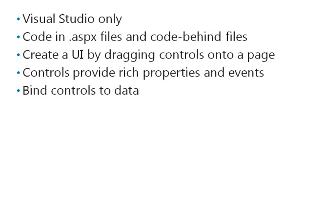
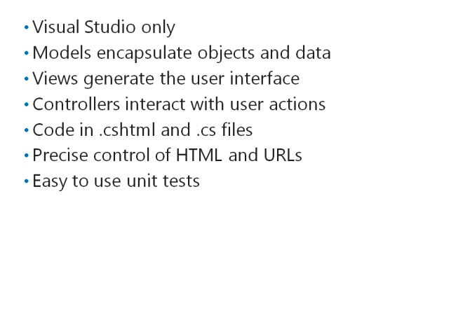

# Module 01 <br> Exploring ASP.NET MVC 5

#### Contents:
[Module Overview](01-0.md)    
[**Lesson 1:** Overview of Microsoft Web Technologies](01-1.md)    
[**Lesson 2:** Overview of ASP.NET 4.5](01-2.md)    
[**Lesson 3:** Introduction to ASP.NET MVC 5](01-3.md)    

## Lesson 2 <br> **Overview of ASP.NET 4.5**

ASP.NET 4.5 helps you create dynamic websites that use client-side and server-side code. In addition, with ASP.NET 4.5, you are not restricted to a single style of programming; instead, you can choose from three different programming models: Web Pages, Web Forms, and MVC. These programming models differ from each other, and they have their own advantages and disadvantages in different scenarios. ASP.NET also provides many features that you can use, regardless of the programming model you choose.

### Lesson Objectives

After completing this lesson, you will be able to:

- Describe the Web Pages programming model.

- Describe the Web Forms programming model.

- Describe the MVC programming model.

- Determine whether to build Web Pages, Web Forms, or MVC web applications, based on customer needs.

- Describe the features that can be used in all ASP.NET applications, regardless of the chosen programming model.

### Web Pages Applications


Web Pages is the simplest programming model you can choose to build a web application in ASP.NET. You can use Web Pages to create a website quickly and with little technical knowledge. There is a single file associated with each webpage that users can request. For each page, you write HTML, client-side code, and server-side code in the same .cshtml file. The @ symbol is used to distinguish server-side code from HTML and JavaScript. When users request the page, the ASP.NET runtime compiles and runs the server-side code to render HTML and returns that HTML to the web browser for display.

**Note:** If you want to write server-side code in Visual Basic, you use .vbhtml files, instead of
.cshtml files.

You can use either Visual Studio 2015 or WebMatrix 2 to create Web Pages applications. ASP.NET 4.5 includes version 2.0 of Web Pages.

The following code example shows HTML and C# code in part of a Web Pages file. The code displays data from the item object, which is an MVC model class.

**A Web Pages Code Example**

```
<h2>Special Offers</h2>
<p>Get the best possible value on Northwind specialty foods by taking advantage of these offers:</p>
@foreach (var item in offers) {
  <div class="offer-card">
    <div class="offer-picture">
      @if (!String.IsNullOrEmpty(item.PhotoUrl)){
        
      }
    </div>
  </div>
}
```

The Web Pages programming model has the following advantages:

- It is simple to learn.

- It provides precise control over the rendered HTML.

- It can be written in WebMatrix 2 or Visual Studio 2015. 
 
Using a Web Pages site has some disadvantages:

- It provides no control over URLs that appear in the Address bar.

- Large websites require a large numbers of pages, each of which must be coded individually.

- There is no separation of business logic, input logic, and the user interface.

**Question:** Why should web developers need to take control of the URLs that appear in the Address bar when a visitor browses a Web Pages site?

### Web Forms Applications



Web Forms is another programming model that you can choose in ASP.NET. WebMatrix 2 does not support Web Forms, so you must use Visual Studio 2015 to develop a Web Forms application. A Web Forms application is characterized by controls, which you can drag from the Visual Studio toolbox onto each webpage. This method of creating a user interface resembles the method used in desktop applications.

#### Web Forms Controls

ASP.NET provides a wide variety of highly- functional controls that you assemble on Web
Forms. After you add a control to a page, you can write code to respond to user events. For example, you can use code in a button click event to process a user’s input in a form. The controls provided include:

- Input controls, such as text boxes, option buttons, and check boxes.

- Display controls, such as image boxes, image maps, and ad rotators.

- Data display controls, such as grid views, form views, and charts.

- Validation controls, which check data entered by the user.

- Navigation controls, such as menus and tree views.

You can also create your own custom controls to encapsulate custom functionality.

#### Web Forms Code Files

In a Web Forms application, HTML and control markup is stored in files with an .aspx extension. Server- side C# code is usually written in an associated .cs file called a code-behind file. For example, a page called Default.aspx usually has a code-behind file called Default.aspx.cs.

Similarly, when you write custom controls, you store HTML and control markup in an .ascx file. A control called CustomControl.ascx has a code-behind file called  CustomControl.ascx.cs.

Web Forms applications can also contain class files that have the .cs extension.

**Note:** If you write server-side code in Visual Basic, code-behind files have a .vb extension, instead of a .cs extension.

#### Binding Controls to Data

In Web Forms applications, you can easily display data by binding controls to data sources. This technique removes the necessity to loop through data rows and build displays line-by-line. For example, to bind a grid view control to a SQL Server database table, you drag a SQL data source control onto the Web Form, and use a dialog to bind the grid view to the data source. When the page is requested, ASP.NET runs the query on the data source and merges the returned rows of data with the Web Forms page.

#### Advantages and Disadvantages of Web Forms

The Web Forms programming model has the following advantages:

- You can design your page visually by using server controls and Design View.

- You can use a broad range of highly functional controls that encapsulate a lot of functionality.

- You can display data without writing many lines of server-side code.

- The user interface in the .aspx file is separated from input and business logic in the code-behind files.

Using a Web Forms site has some disadvantages:

- The ASP.NET Web Forms page life cycle is an abstraction layer over HTTP and can behave in unexpected ways. You must have a complete understanding of this life cycle, to write code in the correct event handlers.

- You do not have precise control over markup generated by server-side controls.

- Controls can add large amounts of markup and state information to the rendered HTML page. This increases the time taken to load pages.

**Question:** Why should web developers be concerned about the markup and state information that ASP.NET Web Forms controls add to a rendered HTML page?

### MVC Applications



MVC is another programming model available in ASP.NET. MVC applications are characterized by a strong separation of business logic, data access code, and the user interface into Models, Controllers, and Views. ASP.NET 4.5 includes MVC version 4.0.

You cannot use WebMatrix to create MVC applications.

#### Models

Each website presents information about different kinds of objects to site visitors. For example, a publisher’s website may present information about books and authors. A book includes properties such as the title, a summary, and the number of pages. An author may have properties such as a first name, a last name, and a short biography. Each book is linked to one or more authors.

When you write an MVC website for a publisher, you would create a model with a class for books and a class for authors. These model classes would include the properties described and may include methods such as “buy this book” or “contact this author”. If books and authors are stored in a database, the model can include data access code that can read and change records.

Models are custom .NET classes and store code in .cs files.

#### Views

Each website must render HTML pages that a browser can display. This rendering is completed by Views. For example, in the publishing site, a View may retrieve data from the Book Model and render it on a webpage so that the user can see the full details. In MVC applications, Views create the user interface.
Views are markup pages that store both HTML and C# code in .cshtml files. This means that they are like Web Pages, but they include only user interface code. Other logic is separated into Models and Controllers.

#### Controllers

Each website must interact with users when they click buttons and links. Controllers respond to user actions, load data from a model, and pass it to a view, so that it will render a webpage. For example, in the publishing site, when the user double-clicks a book, he or she expects to see full details of that book. The Book Controller receives the user request, loads the book model with the right book ID, and passes it to the Book Details View, which renders a webpage that displays the book. Controllers implement input logic and tie Models to the right Views.

Controllers are .NET classes that inherit from the **System.Web.Mvc.Controller** class and store code in .cs files.

#### Advantages and Disadvantages of MVC

The MVC programming model has the following advantages:

- Views enable the developer to take precise control of the HTML that is rendered.

- You can use the Routing Engine to take precise control of URLs.

- Business logic, input logic, and user interface logic are separated into Models, Controllers, and Views.

- Unit testing techniques and Test Driven Development (TDD) are possible.

Using an MVC site has some disadvantages:

- MVC is potentially more complex to understand than Web Pages or Web Forms.

- MVC forces you to separate your concerns (models, views, and controllers). Some programmers may find this challenging.

- You cannot visually create a user interface by dragging controls onto a page.

- You must have a full understanding of HTML, CSS, and JavaScript to develop Views.

**Question:** When a user makes a request for a particular product in your product catalog, which component receives the request first: a model, a controller, or a view?

### Discussion: ASP.NET Application Scenarios


The following scenarios describe some requirements for websites. In each case, discuss which programming model you would choose to implement the required functionality.

#### Database Front-End

Your organization has its own customer relationship management system that stores data in a SQL Server database. Your team of developers wrote the user interface in Visual Studio 2015 as a desktop application. The directors now require that all computers should be able to access the application even when the desktop client
application is not installed. Because all computers have a browser, you have decided to write a web application in ASP.NET to enable this.

#### E-Commerce Site

You are a consultant for a large software organization. You have been asked to architect an e-commerce website that will enable customers to browse the entire catalog of software packages, download the packages, and purchase licenses. The company has a large team of developers who are familiar with .NET object-oriented programming. The company policy is to use Test Driven Development for all software.

#### Website for a Small Charitable Trust

Your friend works for a charitable organization and asks your advice about a website. Your friend does not have any budget to engage a consultant, but has created websites by using Microsoft FrontPage. Your friend wants to include a database of merchandise that site visitors can browse and purchase.

### Shared  ASP.NET Features


ASP.NET also includes a range of features that are available regardless of the programming model that you use. This means that if you are familiar with these features from working with Web Pages or Web Forms, your knowledge can be used in MVC applications also.

#### Configuration

When you configure an ASP.NET site, you can control how errors are handled, how the site connects to databases, how user input is validated, and many other settings. You can configure ASP.NET sites by creating and editing Web.config files. The Web.config file in the root folder of your site configures the entire site, but you can override this configuration at lower levels by creating Web.config files in sub-folders.

Web.config files are XML files with a set of elements and attributes that the ASP.NET runtime accepts.

**An Example Web.config File**

``` xml
<?xml version="1.0" encoding="utf-8"?>
<configuration>
  <appSettings>
    <add key="aspnet:UseTaskFriendlySynchronizationContext" value="true" />
    <add key="webpages:Version" value="2.0.0.0" />
    <add key="webpages:Enabled" value="false" />
    <add key="PreserveLoginUrl" value="true" />
    <add key="ClientValidationEnabled" value="true" />
    <add key="UnobtrusiveJavaScriptEnabled" value="true" />
  </appSettings>
  <connectionStrings>
    <add name="ApplicationServices" connectionString="Data Source=
.\SQLEXPRESS;Integrated Security=SSPI; AttachDBFilename=|DataDirectory|aspnetdb.mdf;User Instance=true"
providerName="System.Data.SqlClient"/>
  </connectionStrings>
  <system.web>
    <customErrors mode="RemoteOnly" defaultRedirect="~/Error.html" />
    <authentication mode="Forms">
      <forms loginUrl="~/Account/Login" timeout="2880">
      </forms>
    </authentication>
    <pages>
      <namespaces>
        <add namespace="System.Web.Helpers" />
        <add namespace="System.Web.Mvc" />
        <add namespace="System.Web.Mvc.Ajax" />
        <add namespace="System.Web.Mvc.Html" />
        <add namespace="System.Web.Routing" />
        <add namespace="System.Web.WebPages" />
        <add namespace="System.Web.Optimization"/>
      </namespaces>
    </pages>
  </system.web>
</configuration>
```

If you need to access configuration values at runtime in your server-side .NET code, you can use the **System.Web.Configuration** namespace.

#### Authentication

Many websites identify users through authentication. This is usually done by requesting and checking credentials such as a user name and password, although authentication can be done by using more sophisticated methods, such as using smart cards. Some sites require all users to authenticate before they can access any page, but it is common to enable anonymous access to some pages and require authentication only for sensitive or subscription content.

ASP.NET supports several mechanisms for authentication. For example, if you are using Internet Explorer on a Windows computer, ASP.NET may be able to use Integrated Windows authentication. In this mechanism, your Windows user account is used to identify you. When you build Internet sites, you cannot be sure that users have Windows, a compatible browser, or an accessible account, so Forms Authentication is often used. Forms Authentication is supported by many browsers and it can be configured to check credentials against a database, directory service, or other user account stores.

#### Membership and Roles

In many Internet sites, for example, Facebook and Twitter, users can create their own accounts and set credentials. In this manner, your site can support a large number of members without requiring a huge amount of administrative effort because administrators do not create accounts.

In ASP.NET, a membership provider is a component that implements user account management features. Several membership providers are supported by ASP.NET, such as the SQL Membership Provider, which uses a SQL database to store user accounts. You can also create a custom membership provider, inheriting from one of the default providers, if you have unique requirements.

When you have more than a few users, you may want to group them into roles with different levels of access. For example, you might create a “Gold Members” role containing user accounts with access to the best special offers. ASP.NET role providers enable you to create and populate roles with the minimum of custom code.

You can enable access to pages on your website for individual user accounts or for all members of a role. This process is known as authorization.

#### State Management

Web servers and web browsers communicate through HTTP. This is a stateless protocol in which each request is separate from requests before and after it. Any values from previous requests are not automatically remembered.

However, when you build a web application, you must frequently preserve values across multiple page requests. For example, if a user places a product in a shopping cart, and then clicks “Check Out”, this is a separate web request, but the server must preserve the contents of that shopping cart; otherwise, the shopping cart will be emptied and the customer will buy nothing. ASP.NET provides several locations where you can store such values or state information across multiple requests.

#### Caching

An ASP.NET page is built dynamically by the ASP.NET runtime on the web server. For example, in a Web Pages application, the runtime must execute the C# code in the page to render HTML to return it to the browser. That C# code may perform complex and time-consuming operations. It may run multiple queries against a database or call services on remote servers. You can mitigate these time delays by using ASP.NET caches.

For example, you can use the ASP.NET page cache to store the rendered version of a commonly requested page in the memory of the web server. The front page of your product catalog may be requested hundreds or thousands of times a day by many users. If you cache the page in memory the first time it is rendered, the web server can serve it to most users very rapidly, without querying the database server and building the page from scratch.

**Question:** Can you think of other facilities that all ASP.NET applications might need, regardless of the programming model they use?