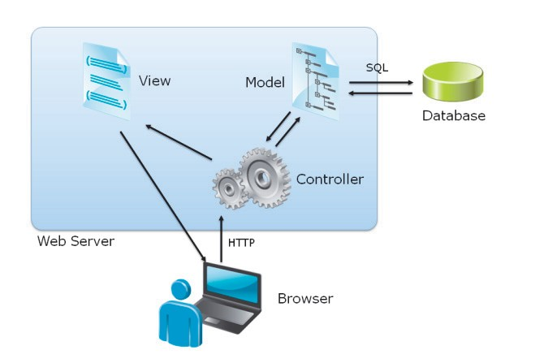
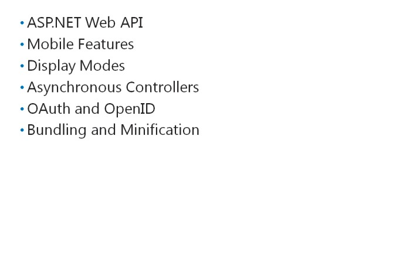

# Module 01 <br> Exploring ASP.NET MVC 5

#### Contents:
[Module Overview](01-0.md)    
[**Lesson 1:** Overview of Microsoft Web Technologies](01-1.md)    
[**Lesson 2:** Overview of ASP.NET 4.5](01-2.md)    
[**Lesson 3:** Introduction to ASP.NET MVC 5](01-3.md)

## <a name="4"></a>Lesson 3 <br> **Introduction to ASP.NET MVC 5**

You need to know how models, views, and controllers work together to render HTML, and how the structure of MVC applications determines the display of information in a Visual Studio 2015 project. You can examine the new features of MVC 5, included in ASP.NET 4.5, to build rich and engaging applications.

### Lesson Objectives

After completing this lesson, you will be able to:
- Describe models, views, and controllers.
- Explore the main features of an ASP.NET MVC 5 web application in Visual Studio.
- Describe the new features of ASP.NET MVC 5.

### Models, Views, and  Controllers



Models represent data and the accompanying business logic, controllers interact with user requests and implement input logic, and views build the user interface. By examining how a user request is processed by ASP.NET MVC 5, you can understand how the data flows through models, views, and controllers before being sent back to the browser.

#### Models and Data

A model is a set of .NET class that represents objects handled by your website. For example, the model for an e-commerce application may
include a Product model class with properties such as Product ID, Part Number, Catalog Number, Name, Description, and Price. Like any .NET class, model classes can include a constructor, which is a procedure that runs when a new instance of that class is created. You can also include other procedures, if necessary. These procedures encapsulate the business logic. For example, you can write a **Publish** procedure that marks the Product as ready-to-sell.

Most websites store information in a database. In an MVC application, the model includes code that reads and writes database records. ASP.NET MVC works with many different data access frameworks. However, the most commonly used framework is the Entity Framework version 5.0.

#### Controllers and Actions

A controller is a .NET class that responds to web browser requests in an MVC application. There is usually one controller class for each model class. Controllers include actions, which are methods that run in response to a user request. For example, the **Product** Controller may include a **Purchase** action that runs when the user clicks the **Add To Cart** button in your web application.
Controllers inherit from the **System.Web.Mvc.Controller** base class. Actions usually return a **System.Web.Mvc.ActionResult** object.

#### Views and Razor

A view is, by default, a .cshtml or .vbhtml file that includes both HTML markup and programming code. A view engine interprets view files, runs the server-side code, and renders HTML to the web browser. Razor is the default view engine in ASP.NET MVC 5, but ASP.NET MVC 5 also supports the ASPX view engine. Additionally, you can install alternate view engines such as Spark and NHaml. The Razor view engine identifies server-side code by searching for the @ symbol, as the following code example demonstrates.

The following lines of code are part of an ASP.NET MVC 5 view and use the Razor syntax. The @ symbol delimits server-side code.

**Part of a Razor View**

``` html
<h2>Details</h2>
<fieldset>
  <legend>Comment</legend>
  <div class="display-label">
    @Html.DisplayNameFor(model => model.Subject)
  </div>
  <div class="display-field">
    @Html.DisplayFor(model => model.Subject)
  </div>
  <div class="display-label">
    @Html.DisplayNameFor(model => model.Body)
  </div>
  <div class="display-field">
    @Html.DisplayFor(model => model.Body)
  </div>
</fieldset>
```
Often, the view displays properties of a model class. In the preceding code example, the **Subject** property and **Body** property are incorporated into the page.

#### Request Life Cycle

The Request life cycle comprises a series of events that happen when a web request is processed. The following steps illustrate the process that MVC applications follow to respond to a typical user request. The request is for the details of a product with the ID “1”:
1.	The user requests the web address: http://www.adventureworks.com/product/display/1
2.	The MVC routing engine examines the request and determines that it should forward the request to the Product Controller and the Display action.
3.	The Display action in the Product Controller creates a new instance of the Product model class.
4.	The Product model class queries the database for information about the product with ID “1”.
5.	The Display action also creates a new instance of the Product Display View and passes the Product Model to it.
6.	The Razor view engine runs the server-side code in the Product Display View to render HTML. In this case, the server-side code inserts properties such as Title, Description, Catalog Number, and Price into the HTML.
7.	The completed HTML page is returned to the browser for display.

**Question:** If you wanted to write some code that renders data from your products catalog into an HTML table, would you place that code in a model, a view, a controller, or a JavaScript function?

### New Features of ASP.NET MVC 5



ASP.NET MVC 5 includes several new features, such as the ASP.NET Web API, mobile features, display modes, asynchronous controllers, **OAuth** and **OpenID** support, and bundling and minification.
- *ASP.NET Web API.* The ASP.NET Web API makes it easy to create a set of web services that can respond to browser requests by using simple HTTP verbs such as GET, POST, and DELETE. Using the Web API, you can build the back-end web services that a client-specific web
application can call. Building web applications by using client-specific HTML pages and the Web API is an alternative to using ASP.NET MVC.
- *Mobile features.* As smartphones and tablets become ubiquitous, you should ensure that your website displays well on all screen sizes, resolutions, color depths, and so on. ASP.NET MVC 5.0 includes several new features to make this easier. For example, the jQuery Mobile script library renders a rich user interface for smartphone browsers, but simpler controls for older models of phones. You can use the new Mobile Project Template that uses jQuery Mobile to create sites specifically for mobile devices. Alternatively, you can add mobile-specific views to your MVC project.
- *Display modes.* Display modes enable you to easily select a view based on the web browser that made the request. Display modes help render HTML for mobile devices and they can be used to display content on unusual desktop browsers. When you add a display mode for a particular browser, you override the views, template views, and partial views that are used to render HTML.
- *Asynchronous controllers.* Usually, a controller action renders synchronously. If the action takes a long time to run, the user has to wait because the action uses a single thread. With asynchronous actions, you can call a long-running method on a separate thread and wait for the results to be returned. This enables an action to complete and respond to the user before the results are returned.
- *Support for OAuth and OpenID standards.* Using the OAuth and OpenID standards to identify users connected to the web application over the Internet, you can call the services of a third- party site to check the credentials of a user. You can trust the identity verified by the external site, and then use it to authorize access to internal resources. Using these technologies, you can, for example, enable users to access internal resources by logging on with their Windows Live account.
- *Bundling and minification.* When a browser requests a webpage, the server often returns the page with a cascading style sheet and one or more JavaScript files. ASP.NET MVC 5.0 can bundle these separate files into a single file to increase the efficiency of the response. It can also minify these files, by removing white space, shortening variable names, and performing other actions that save space. This saves time on downloads and both server and client-side resources, and makes your web application faster.

**Question:** You want to encourage developers to re-use data from your website in mashups with Bing Maps. Which of the new features of MVC 5 would you use to make this possible?