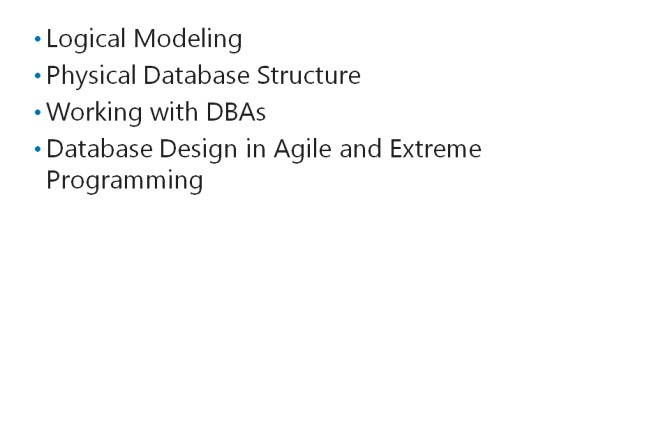
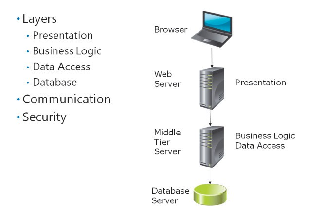
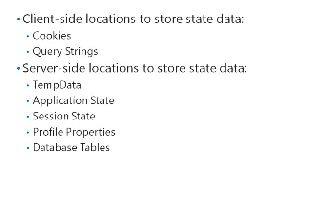
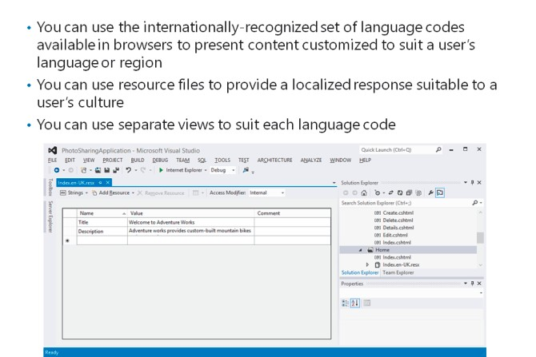

# Module 02   Designing ASP.NET MVC 5 Web Applications

#### Contents:

[Module Overview](02-0.md)  
[**Lesson 1:** Planning in the Project Design Phase](02-1.md)  
[**Lesson 2:** Designing Models, Controllers, and Views](02-2.md)    

## Lesson 1   **Planning in the Project Design Phase**

Before you and your team of developers plan a Model-View-Controller (MVC) web application or write any code, you must have a thorough understanding of two things: the business problem you are trying to solve and the ASP.NET components that you can use to build a solution. Before designing a web application architecture and its database, you should know how to identify the requirements that potential users of a web application have.

### Lesson Objectives

After completing this lesson, you will be able to:

- Describe the various project development models.
- Describe how to gather information about project requirements when building MVC 5 web applications.
- Determine the functional requirements and business problems when building web applications.
- Explain how to plan the database design when building a web application.
- Describe possible distributed application architectures.
- Describe the options for planning state management in a web application.
- Describe the options for planning globalization and localization of a web application.
- Determine the critical aspects of web application design.

### Project Development Methodologies

Developing a web application or intranet application is often a complex process that involves many developers in different teams performing various roles. To organize the development process and ensure that everybody in a project works together, you can use a wide range of development methodologies. These development methodologies describe the phases of the development project, the roles people take, the deliverables that conclude each phase, and other aspects of the project. You should choose a development methodology at an early stage in a project. Many organizations have a standard methodology that they always use for project development.

Some project development methodologies include the waterfall model, the iterative development model, the prototyping model, the agile software development model, extreme programming, and test-driven development.

#### **Waterfall Model**

The waterfall model is an early methodology that defines the following phases of a project:

- _Feasibility analysis._In this phase, planners and developers study and determine the approaches and technologies that can be used to build the software application.

- _Requirement analysis._ In this phase, planners and analysts interview the users, managers, administrators, and other stakeholders of the software application to determine their needs.

- _Application design._ In this phase, planners, analysts, and developers record a proposed solution.

- _Coding and unit testing._ In this phase, developers create the code and test the components that make up the system individually.

- _Integration and system testing._ In this phase, developers integrate the components that they have built and test the system as a whole.

- _Deployment and maintenance._ In this phase, developers and administrators deploy the solution so that users can start using the software application.

The waterfall model classifies the development project into distinct phases with a clear definition of deliverables for each phase. The model also emphasizes the importance of testing. However, the customer does not receive any functional software for review until late in the project. This makes it difficult to deal with changes to the design in response to beta feedback or manage altered circumstances.

#### **Iterative Development Model**

When you use an iterative development model, you break the project into small parts. For each part, you perform the activities related to all the stages of the waterfall model. The project is built up stage by stage, with thorough testing at each stage to ensure quality.

In an iterative project, you can perform corrective action at the end of each iteration. These corrections might reflect a better understanding of the business problems, insightful user feedback, or a better understanding of the technologies that you used to build the solution. Because requirements are added at the end of each iteration, iterative projects require a great deal of project management effort and frequently feature an overrun of planned efforts and schedule.

#### **Prototyping Model**

The prototyping model is suitable for a project where you begin with a few or meagerly defined business requirements. This situation occurs when the customers or stakeholders have only a vague understanding of their needs and how to solve them. In this approach, developers create a simplified version of the software application, and then seek feedback from stakeholders. This feedback on the prototype is used to define the detailed requirements, which developers use in the next iteration to build a solution that matches the needs of stakeholders to better help them perform their jobs.

After two or more iterations, when both stakeholders and developers reach a consensus on the requirements, a complete solution is built and tested. The prototyping model, however, can lead to a poorly-designed application because at no stage in the project is there a clear focus on the overall architecture.

#### **Agile Software Development Model**

The waterfall model, iterative development model, and prototyping model are based on the premise that business requirements and other factors do not change from the beginning to the end of the project. In reality, this assumption is often invalid. Agile software development is a methodology designed to integrate changing circumstances and requirements throughout the development process. Agile projects are characterized by:

- _Incremental development._ Software is developed in rapid cycles that build on earlier cycles. Each iteration is thoroughly tested.

- _Emphasis on people and interactions._ Developers write code based on what people do in their role, rather than what the development tools are good at.

- _Emphasis on working software._ Instead of writing detailed design documents for stakeholders, developers write solutions that stakeholders can evaluate at each iteration to validate if it solves a requirement.

- _Close collaboration with customers._ Developers discuss with customers and stakeholders on a day- to-day basis to check requirements.

#### **Extreme Programming**

Extreme programming evolved from agile software development. In extreme programming, the preliminary design phase is reduced to a minimum and developers focus on solving a few critical tasks. As soon as these critical tasks are finalized, developers test the simplified solution and obtain feedback from stakeholders. This feedback helps developers identify the detailed requirements, which evolve over the project life cycle.

Extreme programming defines a user story for every user role. A user story describes all the interactions that a user with a specific role might perform with the completed application. The collection of all the user stories for all user roles describes the entire application.

In extreme programming, developers often work in pairs. One developer writes the code and the other developer reviews the code to ensure that it uses simple solutions and adheres to best practices. Test- driven development is a core practice in extreme programming.

**Additional Reading:** For more information about the extreme programming model, go to [http://go.microsoft.com/fwlink/?LinkID=288945&clcid=0x409.](http://go.microsoft.com/fwlink/?LinkID=288945&amp;clcid=0x409)

#### **_Test Driven Development_**

In test-driven development (TDD), developers write test code as their first task in a given iteration. For example, if you want to write a component that stores credit card details, you begin by writing tests that such a component would pass. These may be whether it checks the number formats correctly, whether it writes strings to a database table correctly, or whether it calls banking services correctly. After you define the tests, you write the component to pass those tests.

In subsequent iterations, the credit card tests remain in place. This ensures that if you break the credit card functionality, perhaps by refactoring code or by adding a new constructor, you find this out quickly because the tests fail.

In Microsoft Visual Studio 2015, you can define a test project, within the same solution as the main project, to store and run unit tests. After you write the tests, you can run them singly or in groups after every code change. Because MVC projects have the model, view, and controller code in separate files, it is easy to create unit tests for all aspects of application behavior. This is a major advantage of MVC over Web Pages and Web Forms.

#### **Unified Modeling Language**

The Unified Modeling Language (UML) is an industry standard notation to record the design of any application that uses object-oriented technology. UML is not a development model. Rather, UML diagrams are often used for planning and documenting application architecture and components, across all project development methodologies. When you use UML to design and record an application, you create a range of diagrams with standard shapes and connectors. These diagrams can be divided into three classes:

- _Behavior diagrams_. These diagrams depict the behavior of users, applications, and application components.

- _Interaction diagrams_. These diagrams are a subset of behavior diagrams that focus on the interactions between objects.

- _Structure diagrams._ These diagrams depict the elements of an application that are independent of time. This means they do not change through the lifetime of the application.

**Question:**What aspects of agile software development and extreme programming might be of concern to customers? What aspects might reassure them?

### Gathering Requirements

When a project is commissioned, you need a vision of the solution. The vision can often be vague and require in-depth investigation before you can add details and ensure that all stakeholdersrequirements are covered by the web application that you build. These requirements can be of two types:

- _Functional requirements._ These requirements describe how the application behaves and responds to users. Functional requirements are often called behavioral requirements. They include:

  - _User interface requirements._ These requirements describe how the user interacts with an application.

  - _Usage requirements._ These requirements describe what a user can do with the application.

  - _Business requirements._ These requirements describe how the application will fulfill business functions.

- _Technical requirements._ These requirements describe technical features of the application and relate to availability, security, or performance. These requirements are sometimes called non- functional or non-behavioral requirements.

You usually gather requirements by interviewing stakeholders such as users, administrators, other developers, board members, budget holders, and team managers. Each of these groups will have a different set of priorities that the application needs to fulfill.

#### **Usage Scenarios and Use Cases**

A common method by which you can build a set of user interface requirements, business requirements, and usage requirements is to ask users what they will do with the web application that you build. You can record these actions as usage scenarios and use cases.

A usage scenario is a specific real-world example, with names and suggested input values, of an interaction between the application and a user. The following is a simple example:

1. Roger Lengel clicks the **Add Photo** link on the main site menu.

2. Roger provides the input, **RogerL**, in the **User name** box and the password in the **Password** box to authenticate on the site.

3. Roger types the title, **Sunset**, for the photo.

4. Roger browses to the JPEG file for his new photo.

5. Roger clicks the **Upload** button.

6. The web application stores the new photo and displays the photo gallery to Roger.

A use case is similar to a usage scenario, but is more generalized. Use cases do not include user names or input values. They describe multiple paths of an interaction, which depends on what the user provides as input or other values. The following is a simple example:

1. The user clicks the **Add Photo** link on the main site menu.

2. If the user is anonymous, the logon page is shown and the user provides credentials.

3. If the credentials are correct, the **CreatePhoto** view is displayed.

4. The user types a title.

5. The user specifies the photo file to upload.

6. The user optionally types a description for the photo.

7. The user clicks the **Upload** button.

8. The web application stores the new photo and displays the photo gallery to the user.

**Note:** Similar to verbal descriptions, you can use UML Use Case diagrams to record the use cases for your web application.

By analyzing usage scenarios and use cases, you can identify functional requirements of all types. For example, from the preceding use case, you can identify the following user interface requirement: The webpage that enables users to create a new photo must include Title and Description text boxes, a file input control for the photo file, and an Upload button to save the photo.

#### **Agile Requirements Modeling**

In a traditional waterfall model or iterative development model, developers and analysts investigate and record the precise and detailed functional and technical requirements at an early stage of the project, which do not change later. By contrast, in an agile development model-based project, developers recognize that requirements can change at any time during development. Requirements analysis is therefore characterized as follows:

- _Initial requirement modeling._ In the initial design phase, developers identify and record a few broad use cases in an informal manner without full details.

- _Just-in-time modeling._ Before writing code that implements a use case, a developer discusses it with the relevant users. At this point, the developer adds full details to the use case. In an agile development project, developers talk to users and other stakeholders at all times, and not just at the beginning and end of the project.

- _Acceptance testing._ An acceptance test is a test that the application must pass for all stakeholders to accept and sign off the application. When you identify a functional requirement, you can also specify a corresponding acceptance test that must be run to ensure that the requirements are met.

#### **User Stories in Extreme Programming**

In extreme programming projects, developers perform even less functional requirement analysis at the beginning of the project, compared with other development models. They create user stories, instead of use cases or user scenarios. A user story is a very broad example of an interaction between the application and a user, and it is often stated in a single sentence as the following example illustrates:

- Users can upload photos and give new photos a title and a description.

User stories contain just the minimal details to enable developers to estimate the effort involved in developing it. Extreme programmers discuss each user story with stakeholders just before they write code to implement each user story.

**Question:** If a customer asks you to ensure 95% availability, is this a functional requirement or a technical requirement?

### Planning the Database Design

When you have a good understanding of the functional requirements and technical requirements of the proposed web application, you can start designing the physical implementation of the application. One of the most important physical objects to plan for is one or more databases. Although not all web applications use databases for information storage, they are an underlying object for a majority of sites and you will use them in most of your projects.

#### **Logical Modeling**

You can begin your data design at a high level by creating UML Domain Model diagrams and Logical Data Model (LDM) diagrams.

A domain model diagram, also known as a conceptual data model, shows the high-level conceptual objects that your web application manages. For example, in an e-commerce web application, the domain model includes the concepts of customers, shopping carts, and products. The domain model does not include details of the properties each concept has, but shows the relationships between concepts. Use the domain model to record your initial conversations with stakeholders.

In essence, an LDM is a domain model diagram with extra details added. You can use LDM diagrams to fill in more details, such as properties and data types, for the concepts that you defined in the domain model. Note that the objects in the LDM do not correspond to tables in the database. For example, the shopping cart object may display data from both the customer database and product database tables.

#### **Physical Database Structure**

You should consider the following database objects in your project plan:

- _Tables._These are the fundamental storage objects in a database. When you define a table, you need to specify the columns that each table has. For each column, you must define a data type such as **integer**,**string**, usually the **nvarchar**type in SQL Server, or **date and time**. You should also define the primary key for the tablethe value of this column uniquely identifies each record and is essential for defining the relationships with records in other tables.

- _Views._These are common presentations of data in tables and are based on queries. For example, a view can join two tables, such as a products table and a stock levels table.

- _Stored procedures._ These are common sequences of database operations that you define in the database. Some operations are complex and might involve a complex transformation of the data. You can define a stored procedure to implement such a complex routine.

- _Security._You need to consider how the web application will authenticate with the database server and how you will authorize access to each database table.

In UML, a physical data model is a diagram that depicts tables, columns, data types and relationships between tables.

#### **Working with Database Administrators**

Sometimes, the developer team has full control over the database that underlies the web application. This happens, for example, when the organization is small or when the web application has a separate database server with no business-critical data. However, in larger organizations or in projects where the database stores critical business information, there may be a dedicated team of database administrators (DBAs). These DBAs are usually highly skilled in database design and administration, and their job is to ensure data integrity based on the organizations data storage policy.

If your project database is administered by the DBA team, it is essential to communicate well with them. You need to consult with DBAs for their requirements. They frequently impose a list of technical requirements that other stakeholders may not understand. As you build and deploy the web application, DBAs are responsible for creating databases on the right servers or clusters and assigning permissions.

DBAs are critical contributors in delivering the web application.

#### **Database Design in Agile Development and Extreme Programming**

Agile development and extreme programming are characterized by a relatively small amount of initial planning and documentation, and acknowledge that requirements are likely to change throughout the development project. If you are working by using these development methodologies, you will only create domain models during the initial planning phase of your project. You do not develop LDMs or physical data models until you write code that implements the functional requirements. During the development phase, you will discuss requirements with users and DBAs and create LDMs and physical data models just before you write the code.

In agile development and extreme programming, the database design changes throughout the project until deployment. Therefore, developers should be able to alter the database whenever necessary without consulting DBAs or complying with complex data policies. For this reason, you should use a separate database hosted on a dedicated development server.

In some cases, the development project works with a database that already exists. For example, you may be developing a web application that presents and edits information from the company employee database on the intranet. In such cases, the database does not change as the code is developed, but functional and technical requirements may still change. You should copy the database to an isolated development database server to ensure that your developing code does not erroneously modify business- critical data.

**Question:** You want to implement a shopping cart in your web application. How many logical data models are required? How many database tables are required?

### Planning for Distributed Applications

For small web application with less user traffic levels, you can choose to host all the components of your web application on a single server.

However, as your web application grows, a distributed deployment, in which different servers host separate components of the application, is often used. Distributed web applications often use a layered architecture:

- _Presentation layer._ Components in this layer implement the user interface and presentation logic. If you are building an MVC web application, views and controllers make up your presentation layer.

- _Business logic layer._ Components in this layer implement high-level business objects such as products, or customers. If you are building an MVC web application, models make up your business logic layer.

- _Data access layer._ Components in this layer implement database access operations and abstract database objects, such as tables, from business objects. For example, a product business object may include data from both the Products and StockLevels database tables. If you are building an MVC web application, models often make up both business logic and data access layers. However, with careful design and coding practices, it is possible to refactor code to separate these layers.

- _Database layer._ This layer has the database itself.

If you implement such a layered architecture in your web application, you can host each layer on separate servers. Often, for example, the presentation layer is hosted on one or more IIS servers, the business logic and data access layers are hosted on dedicated middle-tier servers, and the database is hosted on a dedicated SQL Server. This approach has the following advantages:

- You can specify server hardware that closely matches each role. For example, a server that hosts business logic components requires good memory and processing resources.

- You can dedicate multiple servers to each role to ensure that a single server failure does not cause an interruption in service.

- Only the web servers must be on the perimeter network. Both middle-tier servers and database servers can be protected by two firewalls without direct access from the Internet.

- Alternatively, you can host middle-tier layers and databases on a cloud service, such as Windows Azure.

#### **Communication Between Layers**

When a single server hosts all the components of a web application, the presentation, business logic, and data access components run in a single process in the web server memory. Communication between components is not an issue. However, when you run different layers on different servers, you must consider two factors:

- How does each layer exchange information and messages?

- How does each server authenticate and secure communications with other servers?

The communication of information and security is performed in different ways between the various layers:

- _Between the browser and presentation layer web server._ In any web application, the web browser, where the presentation layer runs, communicates with the web server by using HTTP. If authentication is required, it is often performed by exchanging plain text credentials. You can also use Secure Sockets Layer (SSL) to encrypt this sensitive communication.

- _Between the web server and the middle-tier server._ The communication and security mechanisms used for communication between the web server and the middle-tier server depends on the technology that you use to build the business logic components:

  - Web services: If you implement business objects and data access classes as web services, the presentation layer components communicate with the web services by using HTTP. You can perform authentication by using the Kerberos protocol that is a part of Windows Integrated Authentication or by using plain text encrypted with SSL.

  - Windows Communication Foundation (WCF) services: If you implement business objects and data access classes as WCF services, you can choose between two hosting mechanisms. You can host the WCF services within IIS, in which case, HTTP is the transport mechanism and SSL is the security mechanism. You can also host the WCF services within a Windows Process Activation Service (WAS), in which case, you can use TCP, Microsoft Message Queuing (MSMQ), or named pipes as the transport mechanism.

- _Between middle-tier server and database._ The middle-tier server sends T-SQL queries to the database server, which authenticates against the database by using the required credentials that are often included in the connection string.

**Note:** Web services and WCF services are covered in detail in Course 20487A: Developing Windows Azure and Web Services.

**Question:** What are the advantages of writing middle-tier components as WCF services and not web services?

### Planning State Management

In application development, the application state refers to the values and information that are maintained across multiple operations. Hypertext Transfer Protocol (HTTP) is fundamentally a stateless protocol, which indicates that it has no mechanism to retain state information across multiple page requests. However, there are many scenarios, such as the following, which require state to be preserved:

- _User preferences._ Some websites enable users to specify preferences. For example, a photo sharing web application mightenable users to choose a preferred size for photos. If this preference information is lost between page requests, users have to continually reapply the preference.

- _User identity._ Some sites authenticate users to provide access to members-only content. If the user identity is lost between page requests, the user must re-enter the credentials for every page.

- _Shopping carts._ If the content of a shopping cart is lost between page requests, the customer cannot buy anything from your web application.

In almost all web applications, state storage is a fundamental requirement. ASP.NET provides several locations where you can store state information, and simple ways to access the state information.

However, you must plan the use of these mechanisms carefully. If you use the wrong location, you may not be able to retrieve a value when you expect to. Furthermore, poor planning of state management frequently results in poor performance.

In general, you should be careful about maintaining large quantities of state data because it either consumes server memory, if it is stored on the server, or slows down the transfer of the webpage to the browser, if it is included in a webpage. If you need to store state values, you can choose between client- side state storage or server-side state storage.

#### **Client-Side State Storage**

When you store state information on the client, you ensure that server resources are not used. However, you should consider that all client-side state information must be sent between the web server and the web browser, and this process can slow down page load time. Use client-side state storage only for small amounts of data:

- _Cookies._Cookies are small text files that you can pass to the browser to store information. A cookie can be stored:

  - In the client computer memory, in which case, it preserves information only for a single user session.

  - On the client computer hard disk drive, in which case, it preserves information across multiple sessions.

Most browsers can store cookies only up to 4,096 bytes and permit only 20 cookies per website. Therefore, cookies can be used only for small quantities of data. Also, some users may disable cookies for privacy purposes, so you should not rely on cookies for critical functions.

- _Query strings._ A query string is the part of the URL after the question mark and is often used to communicate form values and other data to the server. You can use the query string to preserve a small amount of data from one page request to another. All browsers support query strings, but some impose a limit of 2,083 characters on the URL length. You should not place any sensitive information in query strings because it is visible to the user, anyone observing the session, or anyone monitoring web traffic.

**Note:** In ASP.NET Web Forms applications, View State, Control State, and Hidden Fields can be used to store state information in the rendered HTML that the server sends to the client. These mechanisms are not available in MVC web applications because they do not use Web Forms controls.

#### **Server-Side State Storage**

State information that is stored on the server consumes server resources, so you must be careful not to overuse server-side state storage or risk poor performance.

The following locations store state information in server memory:

- _TempData._ This is a state storage location that you can use in MVC applications to store values between one request and another. You can store values by adding them to the **TempData** collection. This information is preserved for a single request only and is designed to help maintain data across a webpage redirect. For example, you can use it to pass an error message to an error page.

- _Application State._ This is a state storage location that you can use to store vales for the lifetime of the application. The values stored in application state are shared among all users. You can store values by adding them to the **Application**collection. If the web server or the web application is restarted, the values are destroyed. The **Application_Start()**procedure in the Global.asax file is an appropriate place to initialize application state values. Application state is not an appropriate place to store user-specific values, such as preferences, because if you store a preference in application state, all users share the same preference, instead of having their own unique value.

- _Session state._ The **Session** collection stores information for the lifetime of a single browser session and values stored here are specific to a single user session; they cannot be accessed by other users. By default, if the web server or the web application is restarted, the values are destroyed. However, you can configure ASP.NET to store session state in a database or state server. If you do this, session state can be preserved across restarts. Session state is available for both authenticated users and anonymous users. By default, session state uses cookies to identify users, but you can configure ASP.NET to store session state without using cookies.

If you choose to use these server memory locations, ensure that you estimate the total volume of state data that may be required for all the concurrent users that you expect to manage. Application state values are stored only once, but session state values are stored once for each concurrent user. Specify server hardware that can easily manage this load, or move state data into the following server hard disk drive- based locations.

- _Profile properties._ If your site uses an ASP.NET profile provider, you can store user preferences in profiles. Profile properties are persisted to the membership database, so they will be kept even if the web application or web server restarts.

- _Database tables._ If your site uses an underlying database, like most sites do, you can store state information in its tables. This is a good place to store large volumes of state data that cannot be placed in server memory or on the client computer. For example, if you want to store a large volume of session-specific state information, you can store a simple ID value in the **Session** collection and use it to query and update a record in the database.

Remember that state data is only one form of information that an ASP.NET application places in server memory. For example, caches must share memory with state data.

**Question:** You show the visitors of your website a choice of countries. When they pick a state, you want to redirect them to a page that shows a map of that state. You will not use the name of the chosen country that the user selected after this. Which location should you use to store the name of the chosen country?

### Planning Globalization and Localization

The Internet is an international network, and unless you are sure that the audience of your web application speaks a single language, you must ensure that everyone can read your content. You limit the sites potential audience if you render pages only in English. The process by which you make a web application available in multiple languages is called globalization or internationalization. The process by which you make a web application available in a specific language and culture is called localization.

#### **Managing Browsers for Languages and Regions**

There is an internationally-recognized set of language codes that specify a culture on the Internet. These codes are in two parts:

1. _The language_. For example, English is "en", and Russian is "ru".

2. _The region_. This specifies regional variations within a language and affects spellings and formats. For example, in United States English, "Globalize" is correct and dates are written in mm/dd/yy format, whereas in British English, "Globalise" is correct and dates are written in dd/mm/yy format.

The full language and region code for United States English is "en-US" and the full language and region code for British English is "en-UK".

The preferred language that users choose is available as the language code in the HTTP Header of the users browser. This is the value that you respond to, so as to globalize your site. Alternatively, you can provide a control, such as a drop-down list, in which users can choose their preferred language. This is a good example of a user-preference that you can store in the session state.

#### **Using Resource Files**

When the user specifies a preferred language and region, you must respond by rendering pages for that culture. One method to provide a localized response is to use resource files to insert text in the appropriate language into the page at run time. A resource file is a simple dictionary of terms in a given language. For each term in the file, you need to specify a name, a value, and optionally, a comment. The file has an .resx extension. The file name also includes the language code that the resources apply to. For example, if you create a resource file for a view called, Index, which stored values in Chilean Spanish, you would name the file, Index.es-CL.resx.

Resource files can also have a neutral culture. This means that the file applies to any region in a given language. For example the Index.es.resx file applies Spanish terms, regardless of the regional code that has been chosen.

You should also create corresponding default resource files, without any language code in the file name, such as Index.resx. These files are used when a preferred language is not specified.

When you use resource files to localize a site, each view applies, regardless of the preferred language. You must insert extra Razor code in the view to take text values from a resource file. This can reduce the readability of view files because all the rendered text comes from resource files. However, supporting new languages is easier, because you only need to add a new resource file for each language that can be created by a professional translator.

#### **Using Separate Views**

Some developers prefer to use separate, parallel sets of views for each supported language code. If you use this approach, you must insert code into the controllers to detect the preferred language that the user has specified. Then, you can use this value to render the correct view.

When you use separate views to globalize and localize a site, views are more readable, because most of the text and labels remain in the view file. However, you must create view files, which requires you or your team members to be proficient in the target language.

**Question:** Which language do you consider would be appropriate to specify in the default resource file?

