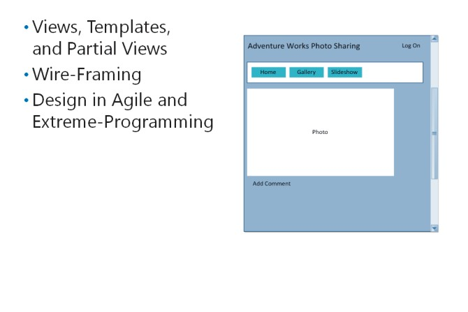

# Module 02   Designing ASP.NET MVC 5 Web Applications

#### Contents:

[Module Overview](02-0.md)  
[**Lesson 1:** Planning in the Project Design Phase](02-1.md)  
[**Lesson 2:** Designing Models, Controllers, and Views](02-2.md)    

## Lesson 2   **Designing Models,Controllers,and Views**

Models, controllers, and views are the fundamental building blocks of an MVC 5 web application. In a complex site, there may be hundreds of models, views, and controllers. You need to manage these objects and plan your application well, so that it is easy to manage the organization and internal structure during development. A thorough plan ensures that you detect any incorrect code and debug problems rapidly.

### Lesson Objectives

After completing this lesson, you will be able to:
- Describe how to design models.
- Describe how to design controllers.
- Describe how to design views.

### Designing Models

A fundamental activity in the MVC design process is designing a model. Each model class within the model represents a kind of object that your application manages. You cannot plan for controllers and views until you understand the structure and design of the model.

#### **Identifying Model Classes and** **Properties**

The use cases, usage scenarios, or user stories that you gathered during the analysis phase of the project should enable you to determine the model classes that you need to create. Each model class

has a range of properties. For example, consider the following use case example shared earlier.

1. The user clicks the **Add Photo** link on the main site menu.

2. If the user is anonymous, the logon page is shown and the user provides credentials.

3. If the credentials are correct, the **CreatePhoto**view is displayed.

4. The user types a title.

5. The user specifies the photo file to upload.

6. The user optionally types a description for the photo.

7. The user clicks the **Upload**button.

8. The web application stores the new photo and displays the photo gallery to the user. 

This example includes the following objects, each of which requires a model class:

- _User_. The User model class must include properties to store credentials, such as the user name and the password.

- _Photo_. The Photo model class must include the **Title**and**Description**properties.

Other use cases similarly help you add new model classes or new properties to the User and Photo model classes.

#### **Domain Model and Logical Data Model Diagrams**

You can use Domain Model diagrams and Logical Data Model (LDM) diagrams to analyze the information your website manages and suggest a physical data model or database design. You can return to these diagrams to plan model classes. Each object in your Domain Model or LDM diagram should be implemented as an MVC model class. The Domain Model diagram includes not only the names of those classes, but also the LDM diagram, if you have created one, with property names and data types.

#### **Relationships and Aggregates**

When you identify the model classes that you will implement in your website, you must also consider the relationships between them. For example, in the use case of the sample Photo Sharing application, each photo is associated with one, and only one, user. This is known as a one-to-one relationship. Each user, however, can create multiple photos. This is known as a one-to-many relationship.

Domain Model diagrams and LDM diagrams include such relationships as links between objects. Numbers at the ends of each link show whether the relationship is one-to-one, one-to-many, or many-to-many.

Aggregates place further limits on the behavior of model classes and clarify relationships. For example, in a photo sharing application, a photo is created by a single user. Other users can make multiple comments on each photo. If a user deletes a photo, all the comments on that photo should also be deleted from the database. However, the user who created the photo should not be deleted with the photo because he or she may add other photos or comments on the site. In this case, comments and photos should be placed in an aggregate, but users should be outside the aggregates. The photo is the root entityof the aggregatethis means that deleting a photo deletes all the associated comments, but deleting a comment does not delete the associated photo.

#### **Entity Framework**

Entity Framework is an Object Relational Mapping (ORM) framework for .NET Framework-based applications. An ORM framework links database tables and views to classes that a developer can program against, by creating instances or calling methods. Entity Framework has been a part of ADO.NET since .NET Framework 3.5.

When you use Entity Framework in your MVC web application, it links tables and views to the model classes that you have planned. You do not need to write SQL code to query or update database tables because Entity Framework does this for you. Entity Framework is well integrated with the Language Integrated Query (LINQ) language.

If you plan to use Entity Framework for data access, you should decide on how the database will be created during the planning phase:

- _Database-First_. Use the Entity Framework in the database-first mode when you have a pre- existing database to work with. This may happen because you already have data from an earlier system or because a DBA has designed the database for you. You can also choose this mode if you are familiar with creating databases in a database administration tool, such as Microsoft SQL Server Management Studio. When you use this mode, you have to specify the database connection string. Entity Framework connects to the database and examines the database schema. It creates a set of classes for you to use for data access.

- _Model-First_. Use Entity Framework in the model-first mode when you do not have a pre-existing database and prefer to design your model in Visual Studio. You can use the Entity Designer tool to name, configure, and link your model classes. This creates XML files that Entity Framework uses both to create model classes and to create the database with its tables and relationships.

- _Code-First_. Use Entity Framework in the code-first mode when you have no pre-existing database and prefer to design your models entirely in C# code. Your code must include **DBContext** and **DBSet** objectsthese correspond to the database and its tables. When you run the application for the first time, Entity Framework creates the database for you.

#### **Design in Agile and Extreme Programming**

Agile and Extreme Programming projects are characterized by short design phases in which data models are not completed. Instead, a simple design, with little detail, is created and developers fill in details as they build code by continuously discussing requirements with users and other stakeholders.

In an MVC project, this means that you identity the model names and relationships during the design phase. You can record these on a Domain Model UML diagram. However, you can leave details such as property names and data types to be finalized in the development phase, along with the complete LDM diagrams.

Entity Framework lets you work in the Agile or Extreme Programming styles. For example, the framework can update the database when the model changes. Alternatively, the framework can update the model when the database changes. Entity Framework can perform these updates in any Entity Framework mode.

### Designing Controllers

In an ASP.NET MVC web application, controllers are .NET Framework-based classes that inherit from the **System.Web.Mvc.Controller** base class. They implement input logicthis means that they receive input from the user in the form of HTTP requests and select both the correct model and view to use, to formulate a response.

#### **Identify Controllers and Actions**

In an ASP.NET MVC web application, there is usually one controller for each model class. Conventionally, if the model class is called "Photo", the controller is called "PhotoController". If you follow this convention in your design, you can use the MVC default routing behavior to select the right controller for a request.

However, for each controller there can be many actionseach action is implemented as a method in the controller and usually returns a view. You often require separate actions for GET and POST HTTP request verbs. Similar to designing a model, you can identify the actions to write in each controller by examining the use cases you gathered during analysis. For example, consider the following use case shared earlier.

1. The user clicks the **Add Photo** link on the main site menu.

2. If the user is anonymous, the logon page is shown and the user provides credentials.

3. If the credentials are correct, the **CreatePhoto** view is displayed.

4. The user types a title.

5. The user specifies the photo file to upload.

6. The user optionally types a description for the photo.

7. The user clicks the **Upload** button.

8. The web application stores the new photo and displays the photo gallery to the user.

You have already identified Photo and User model classes from this use case. Adhering to the MVC convention, you should create a **PhotoController**and a **UserController**. The use case shows that the following actions are needed for each controller.

|Controller|Action|Description|
|-|-|-|
|Photo|**AddPhoto (GET)**|The AddPhoto action for GET requests creates a new instance of the Photo model class, sets default values such as the created date, and passes it to the correct view.|
||**AddPhoto (POST)**|The AddPhoto action for POST requests calls the Photo model class methods to save the photo values to the database and redirects the browser to the DisplayGallery action.|
||**DisplayGallery (GET)**|The DisplayGallery action for GET requests displays all the photos stored in the database.|
|User|**Logon (GET)**|The Logon action for GET requests displays a view that an anonymous user can enter credentials into.|
||**Logon (POST)**|The Logon action for POST requests checks user credentials against the membership database. If the credentials are correct, the Logon action authenticates and redirects the user to the originally requested page.|

#### **Design in Agile and Extreme Programming**

Similar to the design of models, you will only make generalized plans for controllers during the design phase of an Agile Development or Extreme Programming project. Because you have identified the model classes necessary, you can plan the required controllers. However, you should specify only a few actions at this stage.

### Designing Views

The user interface is a vital component of any system because it is the part that the users, budget holders, and other stakeholders see and interact with. Users are most interested in getting this part of the application right and frequently have the most to say about its design. As a developer, you have a chance to impress your users by designing and implementing a sophisticated user interface, which may result in more business.

In an ASP.NET MVC web application, the user interface is created by building views.

#### **Views, Template Views, and Partial Views**

There is a many-to-one relationship between MVC controllers and views. For example, a controller may use one view to display a single photo, another view to display several photos, and a third view to enable users to upload new photos. Each view corresponds to a webpage that the application can display to the user, although it can display different data. For example, the PhotoDetails view can display different photos, depending on the ID parameter that is passed to it.

As you plan views, you should also consider parts of the user interface that appear on all pages. For example, the company logo, main site menu, links to legal information, and logon controls may need to appear on every page. You can place these user interface components in a template view to create a consistent look and feel across pages.

**Note:** Template views in ASP.NET MVC web applications perform the same role as master pages in ASP.NET Web Forms applications.

Some user interface components do not appear on all pages, but are re-used on several pages. For example, comments may be displayed in a single photo display, on the gallery, or on other pages. By creating a partial view, you can create a re-usable user interface element that can appear in many locations in this manner, without duplicating code.

#### **Creating Wireframes**

A common technique to discuss and plan the user interface for your application is to create wireframe diagrams. These are simplified layouts that show where the elements will appear on the final webpages. They are intended to communicate to users the essential functional parts of the user interface, but do not include graphics, logos, or colors. It is not necessary to create a wireframe model for every view in your application, but for only the most important ones.

You can begin a wireframe diagram by sketching it on a whiteboard, in conversation with a user. Many tools are available to create more formal versionsfor example, Microsoft Visio has excellent wireframe drawing capabilities.

#### **Design in Agile and Extreme Programming**

You do not design many parts of the user interface during the initial phases of Agile Development or Extreme Programming projects. Instead, you design views and partial views in close consultation with users during the development phase. This applies even to the template view that displays common components of your user interface, although it is likely that the template view is one of the first user interface components that is designed and created. You will create the template view during the early iterations of the development phase of the project.
