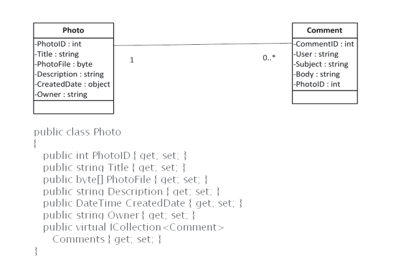
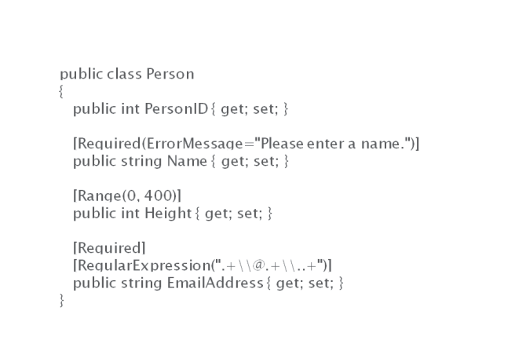
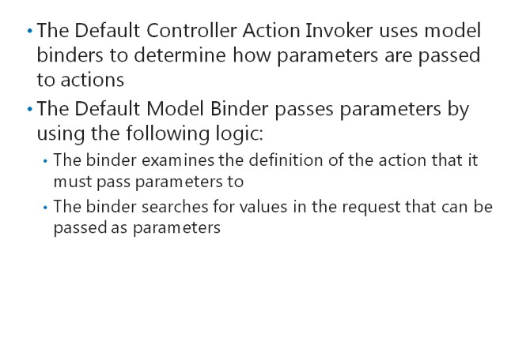
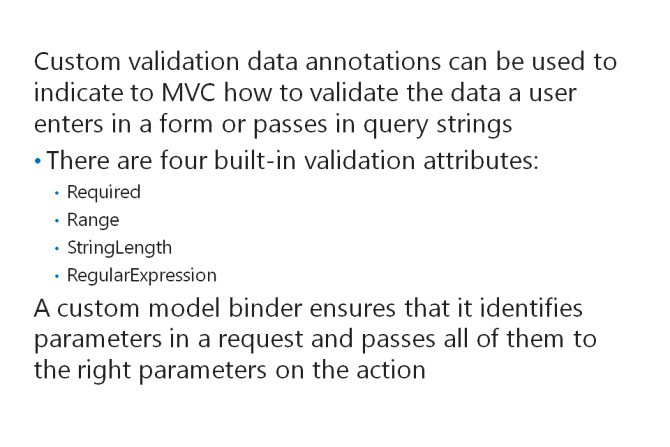

# Module 03 <br> Developing ASP.NET MVC 5 Models

#### Contents:
[Module Overview](03-0.md)    
[**Lesson 1:** Creating MVC Models](03-1.md)    
[**Lesson 2:** Working with Data](03-2.md)    

## Lesson 1 <br> **Creating MVC Models**

An MVC model is a collection of .NET Framework classes. When you create a model class, you define the properties and methods that suit the kind of object the model class describes. You can describe these properties in code so that MVC can determine how to render them in a webpage and how to validate user input. You need to know how to create and describe models, and how to modify the manner in which MVC creates model class instances when it runs your web application.

### Lesson Objectives

After completing this lesson, you will be able to:
- Describe how to create MVC models and develop business logic.
- Use the display and edit data annotations to assign attributes to views and controllers.
- Validate user input with data annotations.
- Describe model binders.
- Describe model extensibility.
- Add a model to an MVC 5 web application.

### Developing Models



Every website presents information about various types of objects. In your web application, you need to define model classes for these objects. When you implement a functional requirement in your web application, you usually start by creating a model class. The model class will probably be revised when you create the controller and views for the model, and then later during the iterations that happen during the project. If you follow the Agile Development model or Extreme Programming, you begin with a simple understanding of the classperhaps its name and a few properties. Then, you discuss with users and add details to the planned model class with the complete set of properties and its relationships to other classes. When developing the model, you can refer to use cases or user stories to ensure that these model details are correct.

When you feel that you fully understand the requirements for a model, you can write model classes to implement the requirements. The following lines of code illustrate how to create an example model class named **Photo**.

**Example Model Class**

``` cs
public class Photo 
{    
  public int PhotoID { get; set; }    
  public string Title { get; set; }    
  public byte[] PhotoFile { get; set; }    
  public string Description { get; set; }   
  public DateTime CreatedDate { get; set; }    
  public string Owner { get; set; }
  public virtual ICollection<Comment> Comments { get; set; }
}
```

Notice that the model class does not inherit from any other class. Also, notice that you have created public properties for each property in the model and included the data type, such as integer or string in the declaration. You can create read-only properties by omitting the **set;** keyword.

The **Photo** class includes a property called **Comments**. This is declared as a collection of **Comment** objects and implements one side of the relationship between photos and comments.

The following lines of code illustrate how you can implement the **Comment** model class.

**Comment Model Class**

``` cs
public class Comment     
{         
  public int CommentID { get; set; }         
  public int PhotoID { get; set; }         
  public string UserName { get; set; }         
  public string Subject { get; set; }         
  public string Body { get; set; }         
  public virtual Photo Photo { get; set; }     
}
```

Notice that the **Comment** class includes a **PhotoID** property. This property stores the ID of the **Photo** that the user commented on, and it ties the comment to a single photo. Also, notice that the **Comment** class includes a **Photo** property, which returns the Photo object that the comment relates to. These properties implement the other side of the relationship between photos and comments. The instances of model classes are usually created in a controller action and passed to a view to display.

The following code example shows how a controller action can create a new photo object from the photo model class and pass it to the Display view.

**Instantiating a Photo in a Controller Action**

``` cs
Photo newPhoto = new Photo(); 
newPhoto.Title = "This is an Example Photo"; 
newPhoto.Owner = User.Identity.Name; 
newPhoto.CreatedDate = DateTime.Today; 
return View("DisplayView", newPhoto);
```

In the Display view, you can render the Title property of a photo by using the **Model** object in the Razor code that you write, as the following code shows.

**Rendering a Property from a Model Class**

``` html
<div id="photo-title">    
  @Model.Title 
</div>
```

### Using Display and Edit Data Annotations on Properties


The model classes usually specify three attributes for each property:

- The name of the property, for example, Title
- The data type of the property, for example, String
- The access levels of the property, for example, the **get** and **set** keywords to indicate read and write access

Additionally by using attributes, you can supply additional metadata to describe properties to ASP.NET MVC. The MVC runtime uses this metadata to determine how to render each property in views for displaying and editing. These attributes are called display and edit annotations.

For example, property names in C# cannot contain spaces. On a rendered webpage, you may often want to include spaces in a property label. For example, you might want to render a property called **CreatedDate** with the label Created Date. To provide MVC with this information, you can use the **DisplayName** annotation.

When you use MVC, you can indicate how you want a property to be named on a view by using the **DisplayName** annotation, as the following lines of code illustrate.

**Setting the DisplayName Annotation**

``` cs
[DisplayName("Created Date")] 
public CreatedDate { get; set; }
```

If you have a **DateTime** property, you can use display and edit data annotations to inform MVC what format you want the property displayed in.

In the following lines of code, the **CreatedDate**property is a **DateTime** and the **DisplayFormat** data annotation is used to indicate to MVC that only the day, month, and year values should be displayed.

**Setting the DataType and DisplayFormat**

``` cs
[DisplayName("Created Date")]  
[DataType(DataType.DateTime)] 
[DisplayFormat(DataFormatString = "{0:MM/dd/yy}", ApplyFormatInEditMode = true)] 
public DateTime CreatedDate { get; set; }
```

All the data annotations that are provided with ASP.NET MVC 5 are included in the **System.ComponentModel.DataAnnotations** namespace.

**Additional Reading:** To read more about all the data annotations provided with MVC 5, see [http://go.microsoft.com/fwlink/?LinkID=288949&clcid=0x409](http://go.microsoft.com/fwlink/?LinkID=288949&amp;clcid=0x409)

**Question:** In the code on the slide, how can you recognize the display and edit annotations and distinguish them from other code?

### ValidatingUserInput withData Annotations



You can use data annotations in MVC models to set validation criteria for user input. Input validation is the process by which MVC checks data provided by a user or a web request to ensure that it is in the right format. The following example shows a webpage form that collects some information from the user:

- _Name_. This is required input. The user must enter some data in this field.

- _Height_. This must be an integer between 0 and 400.

- _Email Address_. This is required input. The value entered must be a valid email address.

In the following example, when the user submits the form, you want MVC to create a new instance of the **Person** model and use it to store the data in the database. However, you want to ensure that the data is valid before it is stored.

To ensure that the data is valid, you can define the **Person** model class by using the following lines of code.

**Using Validation Data Annotations**
``` cs
public class Person  
{    
  public int PersonID { get; set; }    
  [Required]    
  public string Name { get; set; }    
  [Range(0, 400)]    
  public int Height { get; set; }    
  [Required]    
  [RegularExpression(".+\\@.+\\..+")]    
  public string EmailAddress { get; set; } 
}
```

The **Required**, **Range**, **StringLength**, and **RegularExpression** annotations implement input validation in MVC. If users do not enter data that satisfies the criteria specified for each property, the view displays a standard error message that prompts the user to enter the correct data. In the earlier example, you can see that the user must enter a **Name** and a **Height** between 0 and 400\. For the **EmailAddress** property, the user must enter a value that matches the regular expression. The regular expression in the example is a simple expression that requires an @ symbol and a dot.

To specify the error message that the user sees when data is not valid, you can use the **ErrorMessage** property on the validation data annotations, as the following code illustrates.

**Setting a Validation Error Message**

```cs
[Required(ErrorMessage="Please enter a name.")] 
public string Name { get; set; }
```

**Note:** You will see how to ensure that the validation error message is displayed in a view.

**Additional Reading:** For more examples of validation data annotations see [http://go.microsoft.com/fwlink/?LinkID=288950&clcid=0x409](http://go.microsoft.com/fwlink/?LinkID=288950&amp;clcid=0x409)

**Additional Reading:** For more information about the regular expressions that you can use to check user input, see [http://go.microsoft.com/fwlink/?LinkID=288951&clcid=0x409](http://go.microsoft.com/fwlink/?LinkID=288951&amp;clcid=0x409)

**Question**: You want to ensure that users enter a password that is longer than six characters. How should you do this by using a validation data annotation?

### What Are ModelBinders?



A model binder is a component of an ASP.NET MVC application that creates an instance of a model class, based on the data sent in the request from the web browser. ASP.NET MVC includes a default model binder that meets the needs of most web applications. However, you must know how the default model binder works with other components to use it properly. In addition, you may choose to create a custom model binder for advanced situations.

#### **What Does a Model Binder Do?**

A model binder ensures that the right data is sent to the parameters in a controller action method. This enables MVC to create instances of model classes that satisfy the users request. The default model binder, for example, examines both the definition of the controller action parameters and the request parameters to determine which request values to pass to which action parameter.

This model binding process can save developers a lot of time and avoid many unexpected run-time errors that arise from incorrect parameters. MVC includes a default model binder with sophisticated logic that passes parameters correctly in almost all cases without complex custom code.

#### **The Controller Action Invoker and the Default Model Binder**

To understand the default model binding process, consider the following request from a web browser: [http://www.adventureworks.com/product/display/45](http://www.adventureworks.com/product/display/45)

This request identifies three aspects:

- The model class that interests the user. The user has requested a product.

- The operation to perform on the model class. The user has requested that the product be displayed.

- The specific instance of the model class. The user has requested that the product with ID 45 be displayed.

The request is received by an object called the controller action invoker. The controller action invoker of the MVC runtime calls a controller action and passes the correct parameters to it. In the example, the action invoker calls the **Display** action in the **Product** controller and passes the ID "45" as a parameter to the action, so that the right product can be displayed.

The **ControllerActionInvoker** class is the default action invoker. This action invoker uses model binders to determine how parameters are passed to actions.

#### **How the Default Model Binder Passes Parameters**

In a default MVC application, there is only one model binder for the **ControllerActionInvoker** to use. This binder is an instance of the **DefaultModelBinder** class. The default model binder passes parameters by using the following logic:

1.The binder examines the definition of the action that it must pass parameters to. In the example, the binder determines that the action requires an integer parameter called **PhotoID**.

2.The binder searches for values in the request that can be passed as parameters. In the example, the binder searches for integers because the action requires an integer. The binder searches for values in the following locations, in order:

1. _Form Values_. If the user fills out a form and clicks a submit button, you can find parameters in the **Request.Form** collection.

2. _Route Values_. Depending on the routes that you have defined in your web application, the model binder may be able to identify parameters in the URL. In the example URL, 45is identified as a parameter by the default MVC route.

3. _Query Strings_. If the user request includes named parameters after a question mark, you can find these parameters in the **Request.QueryString**collection.

4. _Files_. If the user request includes uploaded files, these can be used as parameters.

Notice that if there are form values and route values in the request, form values take precedence. Query string values are only used if there are no form values and no route values available as parameters.

### Model Extensibility



The MVC architecture has been designed to provide extensibility so that developers can adapt the architecture to unusual or unique requirements. For example, the default action invoker, **ControllerActionInvoker**, can be replaced by your own action invoker if you want to implement your own invoking logic.

Two ways in which you can extend the MVC handling of MVC models are to create custom data annotations and custom model binders.

#### **Custom Validation Data Annotations**

You can use data annotations to indicate to MVC how to validate the data that a user enters in a form or passes in query strings. The four built-in validation attributes in MVC 5, **Required**, **Range**, **StringLength**, and **RegularExpression**, are very flexible. However, in some situations, such as the following examples, you may want to run some custom validation code:

- _Running a Data Store Check_. You want to check the data entered against data that has already been stored in the database or in another database store.

- _Comparing Values_. You want to compare two entered values with each other.

- _Mathematical Checks_. You want to calculate a value from the entered data and check that value is valid.

In such situations you can create a custom validation data annotation. To do this, you create a class that inherits from the **System.ComponentModel.DataAnnotations.ValidationAttribute** class.

The following lines of code illustrate how to create a custom validation data annotation.

**Creating Custom Validation Data Annotation**

``` cs
[AttributeUsage(AttributeTargets.Field)] 
public class LargerThanValidationAttribute : ValidationAttribute 
{    
  public int MinimumValue { get; set; }    
  //Constructor    
  public LargerThanValidationAttribute (int minimum)    
  {       
    MinimumValue = minimum;    
  }    
  //You must override the IsValid method to run your test    
  public override Boolean IsValid (Object value)    
  {       
    var valueToCompare = (int)value;       
    if (valueToCompare > MinimumValue)       
    {          
      return true;       
    }       
    else       
    {          
      return false;       
    }    
  } 
}
```

After you have created a custom validation data attribute, you can use it to annotate a property in your model, as the following lines of code illustrate.

**Using a Custom Validation Data Annotation**

``` cs
[LargerThanValidationAttribute(18)] 
public VoterAge { get; set; }
```

#### **Custom Model Binders**

The default controller action invoker receives requests and calls the right action on the right controller to fulfill the request. The default action invoker uses model binders to identify parameters in the request and pass all of them to the right parameters in the action. This mechanism ensures that query strings, route values, form values, and uploaded files are available for the action to work with.

The default model binder is sophisticated and flexible, but sometimes, you may want to customize its behavior to pass parameters in an unusual way. You can do this by creating a custom model binder and registering it with the MVC runtime.

The following lines of code show how to create a simple custom model binder to pass parameters from the form collection by implementing the **IModelBinder** interface.

**A Simple Custom Model Binder**

``` cs
public class CarModelBinder : IModelBinder {    
  public object BindModel (ControllerContext controllerContext, ModelBindingContext bindingContext)    
  {       //Get the color for the car from the request form       
  string color = controllerContext.HttpContext.Request.Form["color"];       
  //Get the brand for the car from the request form       
  string brand= controllerContext.HttpContext.Request.Form["brand"];       
  //Create a new instance of the car model       
  Car newCar = new Car();       
  newCar.color = color;       
  newCar.brand = brand;
  //return the car       
  return newCar;    
  } 
}
```

The code example assumes that you have a model class in your MVC application called, Car. It also assumes that any request for a Car object includes values for **color** and **brand** in the form collection. This situation can easily be handled by the default model binder. However, this example demonstrates how model binders can locate values from the context of the request and pass those values to the right properties in the model. You can add custom code to implement extra functionality.

**Additional Reading:** You can see more examples of custom model binders at the following locations:

- [http://go.microsoft.com/fwlink/?LinkID=288952&clcid=0x409](http://go.microsoft.com/fwlink/?LinkID=288952&amp;clcid=0x409)

- [http://go.microsoft.com/fwlink/?LinkID=288953&clcid=0x409](http://go.microsoft.com/fwlink/?LinkID=288953&amp;clcid=0x409)

**Question**: You want to ensure that when a user types a value into the Car Model Number box when adding a new car to the website, the text entered is not already used by another car in the database. Would you use a custom validation data annotation or a custom model binder for this?

