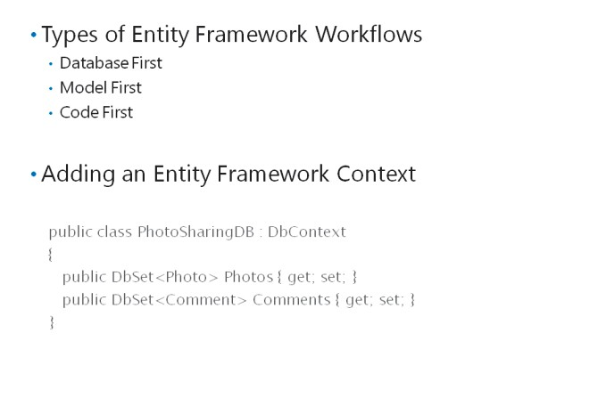
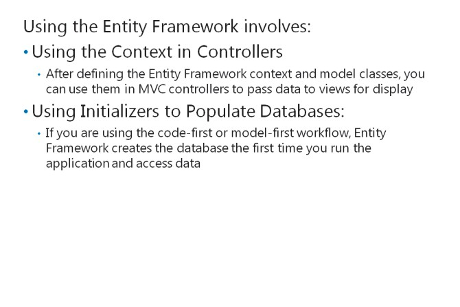

# Module 03 <br> Developing ASP.NET MVC 5 Models

#### Contents:
[Module Overview](03-0.md)    
[**Lesson 1:** Creating MVC Models](03-1.md)    
[**Lesson 2:** Working with Data](03-2.md)    

## Lesson 2 <br> **Working with Data**

All web applications present information and almost all web applications require a data store for that information. By rendering webpages by using data from a data store, you can create a web application that changes continually in response to user input, administrative actions, and publishing events. The data store is usually a database, but other data stores are occasionally used. In MVC applications, you can create a model that implements data access logic and business logic. Alternatively, you can separate business logic, in model classes, from data access logic, in a repository. A repository is a class that a controller can call to read and write data from and to a data store. The .NET Framework includes the Entity Framework and LINQ technologies, which make data access code very quick to write and simple to understand. In addition, you will see how to build a database-driven website in MVC.

### Lesson Objectives

After completing this lesson, you will be able to:
- Connect an application to a database to access and store data.
- Describe the features of the Entity Framework.
- Use LINQ to write queries for selecting, filtering, and grouping data.
- Create separate model classes and corresponding repository classes by using Entity Framework code.
- Explain how to access data in models and repositories.

### Connectingto a Database


Most websites use a database to store dynamic data. By including this data in rendered HTML pages, you can create a dynamic web application with content that changes frequently. For example, you can provide administrative webpages that enable company employees to update the product catalog and publish news items. Products and items are stored in the database. As soon as they are stored, users can view and read them. The employees do not need to edit HTML or republish the website to make their changes visible.

Some websites may store data in other locations, such as a directory service, but databases are the most widely used data store.

#### **ADO.NET and Databases**

When you create .NET Framework applications, including MVC web applications, you can use the ADO.NET technology to access databases. ADO.NET classes are contained in the **System.Data** namespace. ADO.NET supports a wide range of databases by using different data providers. For example:

- _Microsoft SQL Server_. This is an industry-leading database server from Microsoft. ADO.NET includes the **SqlClient** provider for all SQL Server databases.

- _Microsoft SQL Server Express_. This is a free version of SQL Server that includes a wide range of database functionality and is very flexible. Some advanced capabilities, such as database clustering, are not possible with SQL Express. The **SqlClient** provider is used for SQL Express.

- _Microsoft SQL Server Compact_. This version of SQL is also free and uses .sdf files to store data on the hard disk. ADO.NET includes the **SqlServerCe** provider for SQL Compact databases.

- _Oracle Databases_. This is a widely-used database server. ADO.NET includes the **OracleClient** provider for all Oracle databases.

- _OLE DB_. This is a standard that many different databases adhere to. ADO.NET includes the **OleDb** provider for all OLE DB databases.

- _ODBC_. This is another older standard that many different databases adhere to. ADO.NET includes the **Odbc** provider for all ODBC databases. In general, you should use an OLE DB provider, if it is available, instead of an ODBC provider.

You can also use third-party ADO.NET providers to access other databases.

#### **Cloud Databases**

The database of a web application is usually located on the same server as the web application itself or on a dedicated database server at the same physical site. However, if you have a fast, reliable Internet connection, you can consider using a cloud database. Furthermore, if you have chosen to host a web application in the cloud, a cloud database is a logical storage solution. The Microsoft cloud database service is called SQL Database and is a part of Windows Azure.

Windows Azure SQL Database has the following advantages:

- Databases run in Microsoft data centers with the best connectivity and reliability.

- Microsoft guarantees up to 99% uptime.

- You do not need to build and maintain your own database servers or employ database administrators.

- You can scale up the databases very easily.

- You pay only for the data that you use and distribute.

You can use Windows Azure SQL Database with ADO.NET by using the **SqlClient** provider.

#### **Connecting an MVC Web Application to a Database**

To use ADO.NET and connect to a database, you need to add two items to your application:

- Add a reference to the **System.Data** namespace.

- Add a connection string to the **Web.config** file. This string specifies the provider, the location of the database, the security properties, and other properties depending on the provider.

The following markup shows how to add a connection string to **Web.config** to connect to a SQL Express database called, PhotoSharingDB, by using the credentials that the web application runs under.

**Connecting to SQL Express**

``` xml
<connectionStrings>    
  <add name="PhotoSharingDB"       
    connectionString="Data Source=.\SQLEXPRESS;Initial Catalog=PhotoSharingDB;" + "Integrated Security=SSPI"       
    providerName="System.Data.SqlClient"/> 
</connectionStrings>
```

The following connection string connects to a Windows Azure SQL database.

**Connecting to Windows Azure SQL Database**

``` xml
<connectionStrings>    
  <add name="PhotoSharingDB" 
    connectionString="Server=tcp:example.database.windows.net,1433;Database=PhotoSharingDB;" + "User ID=Admin@example;Password=Pa$$w0rd;Trusted_Connection=False;" + "Encrypt=True;Connection Timeout=30;PersistSecurityInfo=true"
    providerName="System.Data.SqlClient"/> 
</connectionStrings>
```
The **`<connectionStrings>`** tag must appear within the **`<configuration>`** tag, after the **`<configSections>`** tag.

**Additional Reading:** The MVC web application templates in Microsoft Visual Studio 2015 include ADO.NET references so you need not add them. However, you must add connection strings. Some of the templates, such as the Internet site template, include SQL Server Express membership databases with connection strings.

### The Entity Framework



Developers write code that works with classes and objects. By contrast, databases store data in tables with columns and rows. Database administrators create and analyze databases by running Transact-SQL queries. You can choose to build and run Transact-SQL queries in your ADO.NET code. However, ADO.NET includes the Entity Frameworkthis technology enables you to read and write data to and from a database by using classes and objects.

Entity Framework is an Object Relational Mapping (ORM) framework. An ORM framework maps the tables and columns found in a database to objects and their properties that you can call from .NET code.

#### **EntityFramework Workflows**

The way you use Entity Framework in your application depends on the manner in which you want to build your database. The three Entity Framework workflows available are database-first, model-first, and code-first:

- _Database First_. You can use the database-first workflow when you have a pre-existing database or if you prefer to create a new database by defining table, columns, views, and other database schema objects. In this workflow, Entity Framework examines the database and creates an XML file with an .edmx extension called the model file. The model file describes classes that you will be able to work with, in code. You can adjust the model by using a designer in Visual Studio and then writing code against the Entity Framework classes.

- _Model First_. You can use the model-first workflow when you do not yet have a database and you prefer to design your model by using an ORM modeling tool. In this workflow, you create the .edmx file in the Visual Studio designer and then write code against the model classes generated by the designer. When you run the application, Entity Framework creates the database tables and columns to support the model. In this workflow, Visual Studio can also create a connection string for you and insert it into Web.config, based on the database that you specify.

- _Code First_. You can use the code-first workflow if you prefer to create a model by writing .NET Framework classes. In this workflow, there is no model file. Instead, you create model classes in C# or Visual Basic. When you run the application, Entity Framework creates the database.

#### **Adding an Entity Framework Context**

When you use Entity Framework in the code-first workflow, you must ensure that the framework creates the right database and tables to store your model classes. To do this, create a class that inherits the Entity Framework **DbContext** class. You will use this class in controllers when you want to manipulate data in the database. Within this class, add a **DbSet<>** property for each database table you want Entity Framework to create in the new database.

The following code shows how to add an Entity Framework context to your model.

**An Entity Framework Context Class**

``` cs
public class PhotoSharingDB: DbContext {
 public DbSet < Photo > Photos {
  get;
  set;
 }
 public DbSet < Comment > Comments {
  get;
  set;
 }
}
```

In the earlier example, Entity Framework looks for a connection string with the name, **PhotoSharingDB**, to match the name of the **DbContext** class. Entity Framework creates the database at the location that the connection string provides, and creates two tables in the new database:

- **Photos:** This table will have columns that match the properties of the **Photo** model class.

- **Comments:** This table will have columns that match the properties of the **Comment** model class.

**Question:** You have a Microsoft Visio diagram, which a business analyst created that shows all the model classes for your web application and their relationships. You want to re-create this diagram in Visual Studio. Which Entity Framework workflow should you use?

### Using an Entity Framework Context



Now that you have defined the Entity Framework context and model classes, you can use them in MVC controllers to pass data to views for display.

The following code shows how to use the Entity Framework context in a controller to pass a single photo, or a collection of photos, to views.

**Using an Entity Framework Context in a** **Controller**

``` cs
public class PhotoController: Controller {
 //Creating a reference to the Entity Framework context class    
 private PhotoSharingDB db = new PhotoSharingDB();
 //This action gets all the photos in the database and passes them to the Index view    
 public ActionResult Index() {
   return View("Index", db.Photos.ToList());
  }
  //This action gets a photo with a particular ID and passes it to the Details view    
 public ActionResult Details(int id = 0) {
  Photo photo = db.Photos.Find(id);
  if (photo == null) {
   return HttpNotFound();
  }
  return View("Details", photo);
 }
}
```

#### **Using Initializers to Populate Databases**

If you are using the code-first or model-first workflow, Entity Framework creates the database the first time you run the application and access data. The database remains empty if you have created the database schema but not populated it with data rows.

You can use an initializer class to populate the database with sample data. This technique ensures that there is sample data to work with, during development.

The following lines of code show how to create an initializer class that adds two **Photo** objects to the Photos table in the database.

**An Example Entity Framework Initializer**

``` cs
public class PhotoSharingInitializer: DropCreateDatabaseAlways < PhotoSharingDB > { //Override the Seed method to populate the database    
 protected override void Seed(PhotoSharingDB context) { //Create a list of Photo objects       
  var photos = new List < Photo > {
   new Photo {
    Title = "My First Photo",
     Description = "This is part of the sample data",
     UserName = "Fred"
   },
   new Photo {
    Title = "My Second Photo",
     Description = "This is part of the sample data",
     UserName = "Sue"
   }
  }; //Add the list of photos to the database and save changes       
  photos.ForEach(s => context.Photos.Add(s));
  context.SaveChanges();
 }
}
```

After you have created an initializer, you need to ensure that it runs by adding a line of code to the

**Global.asax** file in the **Application_Start** method, as the following example illustrates.

**Running the Initializer in Global.asax**

``` cs
protected void Application_Start() { //Seed the database with sample data for development. This code should be removed for production.    
 Database.SetInitializer < PhotoSharingDB > (new PhotoSharingInitializer());
}
```

**Question:** You have created an Entity Framework context class in your model, added an initialize, and called **Database.SetInitializer()** from Global.asax. When you run the application, no database is created and no model objects displayed on the webpages. What have you forgotten to do?

### Using LINQ to Entities


Language Integrated Query (LINQ) is a set of extensions to Visual C# and Visual Basic that enable you to write complex query expressions. You can use these expressions to extract data from databases, enumerable objects, XML documents, and other data sources. The expressions are similar to Transact-SQL queries, but use C# or VB keywords so that you may get IntelliSense support and error checking in Visual Studio.

#### **What Is LINQ to Entities?**

LINQ to Entities is the version of LINQ that works with Entity Framework. LINQ to Entities enables you to write complex and sophisticated queries to locate specific data, join data from multiple objects, update data, and take other actions on objects from an Entity Framework context. If you are using Entity Framework, you can write LINQ queries wherever you require a specific instance of a model class, a set of objects, or for more complex application needs. You can write LINQ queries in query syntax, which resembles SQL syntax, or method syntax, in which operations such as selectare called as methods on objects.

#### **Example LINQ Queries**

In the following lines of code, you can see how to obtain a list of the most recent photos in the database. Both query syntax and method syntax examples are included.

**Using LINQ to Get Recent Photos**

``` cs
//This list will store the photos that are returned List<Photo> photos; 
//This is the Entity Framework context 
PhotoSharingDB context = new PhotoSharingDB();
if (number == 0) {
 //If a number of photos is not specified, we’ll get all the photos in the database    
 //This example is in method syntax.    
 photos = context.Photos.ToList();
} else {
 //The number specifies how many of the most recent photos the user requests    
 //Use a LINQ query with both query and method syntax to get these from the database    
 photos = (from p in context.Photos 
           orderby p.CreatedDate descending 
           select p).Take(number).ToList();
}
```

**Additional Reading:** To read many more example LINQ queries, see [http://go.microsoft.com/fwlink/?LinkID=288954&clcid=0x409](http://go.microsoft.com/fwlink/?LinkID=288954&amp;clcid=0x409)

### Data Access in Models and Repositories


In MVC applications, you can place the data access code in the model, along with the business logic. However, many software architects prefer to separate these two types of code because they serve different purposes:

- _Business Logic_. This code defines the objects that the web application manages, their properties, and their relationships with each other.

- _Data Access Logic_. This code defines the operations necessary to persist data to a database. This includes operations to create new records, read records, update records, and delete records in database tables. A single object in the business logic layer may take data from multiple database tables. This abstraction is handled by the data access logic.

MVC does not require you to separate business and data access logic, and you can create MVC model classes that implement both layers. This is often done in small or simple web applications with small development teams. In these scenarios, Entity Framework classes are used directly in the model classes.

In more complex situations, you need to place the business logic in MVC model classes and place the data access logic in dedicated classes called repositories. When you take this approach, model classes are independent of the database structure and do not include code that depends on database table names, column names, or view names. This approach makes it easier to redesign the database or move to a different data store or data access technology, without the need to re-code your entire application. Using this approach, you employ the Entity Framework in your repository classes, but not in your model classes.

#### **How to Separate Model Classes and Repositories**

If you do choose to separate business logic and data access logic, you must take the following steps for each model class:

1. Define an interface for the repository class. This interface declares the methods that the repository class uses to read and write data from and to the database.

2. Create and write code for the repository class. This class must implement all the data access methods declared in the interface.

3. Remove all data access code from the model class.

4. Modify the controller class to use the repository class. Instead, create an instance of the repository class and call its methods to create the model.

#### **A Simple Example Model Class and Repository Class**

To illustrate how to separate model classes and repository classes, the following examples implement a comment on a photo.

The Comment model class helps users to comment on a photo, as the following lines of code illustrate.

**The Comment Model Class**

``` cs
public class Comment {
 public int CommentID {
  get;
  set;
 }
 public int PhotoID {
  get;
  set;
 }
 public string CommentText {
  get;
  set;
 }
 public virtual Photo Photo {
  get;
  set;
 }
}
```

This interface for a comment repository class defines just one method to get the comments for a given photo, as the following lines of code illustrate.

**The ICommentRepository Interface**

``` cs
public interface ICommentRepository {    
  ICollection<Comment> GetComments (int PhotoID); 
}
```

The CommentRepository class implements the **GetComments** method as the following lines of code illustrate.

**The CommentRepository Class**

``` cs
public class CommentRepository : ICommentRepository {    
  public ICollection<Comment> GetComments(int PhotoID)    {       
    //Implement entity framework calls here.    
  } 
} 
```

The**CommentsController**class uses the repository class, instead of calling Entity Framework methods, as the following lines of code illustrate.

**The CommentsController Class**

``` cs
public class CommentsController : Controller  {    
  ICommentRepository commentRepository = new CommentRepository;    public ActionResult DisplayCommentsForPhoto (int PhotoID)    {       
    //Use the repository to get the comments       
    ICollection<Comments> comments = commentRepository.GetComments(PhotoID);       
    return View("DisplayComments", comments);    
  }
}
```

**Note:** By using the **ICommentRepository** interface, the code makes it easy to replace **CommentRespository** with another implementation if you need to. However, the **CommentController** code still creates a **CommentRespository** object. You have to modify the object to make the replacement.

In an even better architecture, you can replace **CommentRepository** with a different implementation of **ICommentRepository** without any changes to the **CommentController** class. This is an extremely flexible and adaptable approach and is called a loosely coupled architecture.

Loosely coupled architectures are also essential for unit testing.