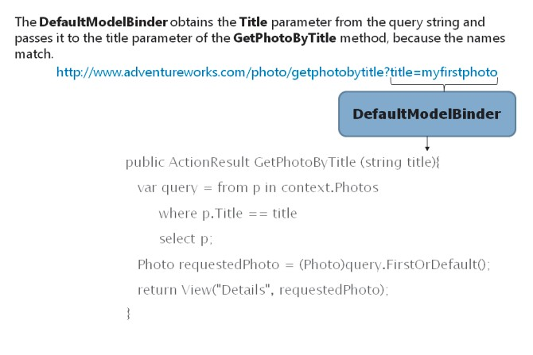
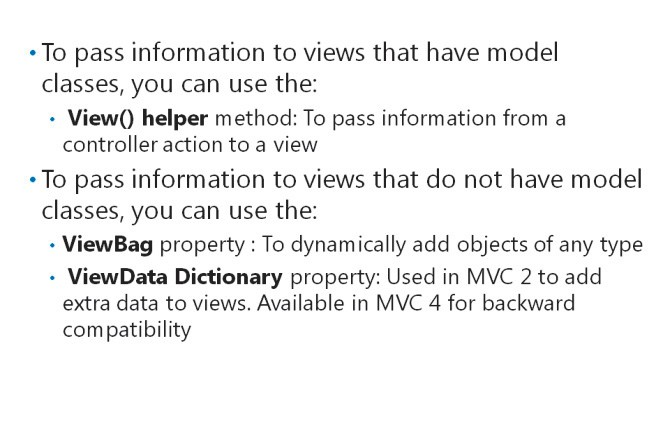
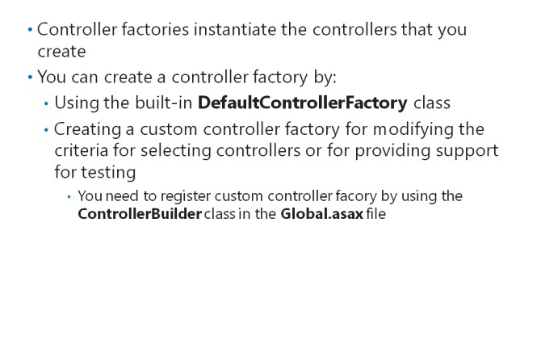

# Module 04 <br> Developing ASP.NET MVC 5 Controllers

#### Contents:

[Module Overview](04-0.md)    
[**Lesson 1:** Writing Controllers and Actions](04-1.md)    
[**Lesson 2:** Writing Action Filters](04-2.md)    

## Lesson 1 <br> **Writing Controllers and Actions**

A controller is a .NET Framework class that inherits from the **System.Web.Mvc.Controller** base class. Controllers respond to user requests. Within a controller class, you create actions to respond to user requests. Actions are methods within a controller that return an **ActionResult** object. The **ActionResult** object is often a view that displays a response to the user request; however, it can also yield other types of results. To process incoming user requests, manage user input and interactions, and implement relevant application logic, you need to know how to create controllers and actions. You must also know how to create parameters in action code blocks and pass objects to actions.

### Lesson Objectives

After completing this lesson, you will be able to:
- Describe how a controller responds to user actions in an MVC 5 web application.

- Write controller actions to respond to web browser requests, create model classes, and call views.

- Explain how to use parameters passed in a browser request to a controller action and use them to change the action result.

- Explain how to pass information to views that have model classes.

- Create a controller and actions.

- Describe controller factories.

## Responding to User Requests


When an MVC web application receives a request from a web browser, the following events happen in sequence:

1. An **MvcHandler** object creates a controller factory. The controller factory is the object that instantiates a controller to respond to the request. Usually, this factory is a **DefaultControllerFactory** object, but you can create a custom controller factory, if necessary. The **MvcHandler**object chooses the controller factory based on the **RequestContext** object, which has information about the request that the user made.

2. The controller factory creates a **Controller**object, and the **MvcHandler**calls the **Execute**method in that controller.

3. The **ControllerActionInvoker** examines the **RequestContext** object and determines the action to call in the **Controller**object.

4. The**ControllerActionInvoker**uses a model binder to determine the values to be passed to the action as parameters.

5. The**ControllerActionInvoker**runs the action. Often, the action creates a new instance of a model class, perhaps by querying the database with the parameters that the invoker passed to it. This model object is passed to a view, to display results to the user. Action methods can do many other things such as rendering views and partial views, redirecting to other websites, displaying snippets of content, or displaying other files.

**Note:** The routing engine determines which controller and action receives a request. Routing is not covered in this section.

#### **The User Request**

Users of web browsers make requests either by typing a URL into the Address bar of the browser, or by clicking a link to some address within your website. Such links can either be within your website, in which case you can control how they are rendered, or from an external website. Whether the request originates from within the website or from an external website, it can include information that controller actions can use as parameters. Consider the following examples:

- This URL is the home page of the website and specifies no further information.

- This URL specifies an extra value, **photo**. By default, the **MvcHandler** interprets this as the name of a controller.

- This URL specifies a second value, **index**. By default, the **MvcHandler**interprets this as the name of an action within the controller.

- This URL specifies a third value, **1**. By default, the **ControllerActionInvoker** interprets this as a parameter to pass to the action method.

- This URL includes a query string, **id=1**. The model binder examines the **Display** actions in the **Photo** controller. If it finds an action with a parameter called **id**, it calls that action and passes **1** as a parameter.

**Note:** You can modify the preceding logic in several ways. For example, you can create routes that interpret the preceding URLs differently. The examples are true when only the default route exists.

Let us consider that a user requests a controller called **photo**, by typing the URL in the Address bar of a web browser. By default, the MVC **DefaultControllerFactory**, names this controller class as **PhotoController**. You should keep to this convention when you create and name controllers. Otherwise, you will receive unexpected 404 errors and controllers will not work as intended. If you create a custom controller factory, you can define your own naming convention for controller classes.

The Microsoft Visual Studio project templates include a folder named **Controllers**. This is a good location to create your controllers. Microsoft Visual Studio places controllers in the **_projectname_****.Controllers** namespace, by default.

The following example shows the code in an MVC controller class called, **PhotoController**. The controller has a single action called **Index**, which returns a list of **Photo** items from the Entity Framework context.

**A Simple Controller Class**

``` cs
public class PhotoController : Controller {    
  private ContextDB context = new ContextDB();    
  public ActionResult Index ()    {       
    return View("Index", context.Photos.ToList());    
  } 
}
```

**Question:** What is the convention that you should follow while creating controllers?

### Writing Controller Actions


Controllers encapsulate user interaction logic for an MVC web application. You specify this logic by writing actions. An action is a method within the controller class. The code you write within an action method determines how the controller responds to the request, and the model class and view that MVC uses to display a webpage in the browser.

**Note:** When you add a new controller to an MVC application, Visual Studio presents scaffolding options to help you create action methods and associated views. For example, if you specify a model class and Entity Framework context class, Visual Studio can create scaffold index and details, and create, edit, and delete action methods in your new controller. You can use these as a starting point for your code. As you become more experienced with action methods, you may prefer to select the **Empty MVC Controller** template and write your own methods without scaffold code.

Controller actions are public methods that return an **ActionResult** object. Alternatively, actions can return objects of many other classes that derive from the **ActionResult** class. For example, you can write code for a controller with an **Index** action to obtain all **Photo** objects and pass them to the **Index** view.

When you want to display a specific model object, you must obtain the correct instance from the database. The following code shows how to display the first **Photo** object.

**A Details Action**

``` cs
public ActionResult First () 
{    
  Photo firstPhoto = context.Photos.ToList()[0];    
  if (firstPhoto != null)    
  {         
    return View("Details", firstPhoto);    
  }    
  else    
  {       
    return HttpNotFound();    
  } 
}
```

Some user actions are in two parts. For example, to create a new **Photo**, a user can make an HTTP GET request to the following URL: [http://www.adventureworks.com/photo/create.](http://www.adventureworks.com/photo/create)

The following code shows an action that responds to a GET request, to display a new photo form.

**A Create Action for the GET Request**

``` cs
public ActionResult Create () 
{    
  Photo newPhoto = new Photo();    
  return View("Create", newPhoto) 
}
```

The **Create** view displays a form where users can fill photo details, such as the title, description, and so on. When a user clicks the **Submit** button, the web browser makes an HTTP POST request.

The following action method responds to a POST request. Note that the method name is the same, but the [HttpPost] annotation is used to specify that this action responds to the HTTP POST verb.

**A Create Action for the POST Request**

``` cs
[HttpPost] 
public ActionResult Create (Photo photo) 
{    
  if (ModelState.IsValid)    
  {       
    context.Photos.Add(photo);       
    context.SaveChanges();       
    return RedirectToAction("Index");    
  }    
  else    
  {       
    return View("Create", photo);    
  } 
}
```

Note that the **ModelState.IsValid** property is used to check whether the user has submitted valid data. You can specify data validation by using validation data annotations in the model class. If the data is valid, the model object is added and saved. Otherwise, the application displays the **Create** view again, so that the user can correct the invalid data.

**Note:** For the preceding code to work, the **Create** view must contain a form that uses the **POST** method.

#### **Possible Return Classes**

Action methods are usually defined with the **ActionResult** class as the return type. **ActionResult** is a base class, and you can use a range of derived classes to return different responses to the web browser.

Controller actions usually return a view and pass a model class to it, for display. You can create an action that calls the **View()** helper, and creates and returns a **ViewResult** object. The **View()** helper is available when you derive from the base **Controller** class.

Alternatively, you can return an HTTP error. For example, you can create an action such that if a **Photo**

object is not found, the code creates a 404 not found error by using the **HttpNotFound()** helper.

Sometimes, you may want to return a file from an action method. For example, let us consider that in a **Photo** model, the image file is stored as a byte array in the database. To display this byte array as an image on a webpage, the action must return it as a .jpeg file, which can be used for the **src** attribute of an

**\** HTML tag. To return files, you can use the **File()**helper to return a **FileContentResult**object. You can use this technique in the **GetImage**action.

Other possible action results include:

- _PartialViewResult._ You can use this action to generate a section of an HTML page, but not a complete HTML page. Partial views can be re-used in many views throughout a web application.

- _RedirectToRouteResult._ You can use this action result to redirect the web browser to another action method or another route.

- _RedirectResult._ You can use this action result to redirect to a specific URL, either inside your web application or to an external location.

- _ContentResult._You can use this action result to return text to the web browser. You can return plain text, XML, a comma-separated table, or other text formats. This text can be rendered in the web browser or parsed with client-side code.

#### **Child Actions**

When an action returns a complete view, MVC sends a new complete webpage to the web browser for display. Sometimes, you may want to call an action from within a view, to return a piece of content for display within a webpage. A child action is an action method that can return a small piece of content in this manner. The **FileContentResult** is often a good example of a child action, because the image returned usually forms part of a webpage. Partial views also support child actions.

To declare an action method as a child action, you can use the **[ChildActionOnly]** annotation. This annotation ensures that the action method can be called only from within a view by using the **Html.Action()** helper. Using this method, you can prevent a user from calling the child action directly by typing the correct URL into the Address bar.

**Question:** What are the various **ActionResult** return types that you can write as code while creating a controller?

### Using Parameters



When users request webpages, they often specify information other than the name of the webpage itself. For example, when they request a product details page, they may specify the name or catalog number of the product to display. Such extra information is referred to as parameters. You must understand how to determine in code what parameters the user sent in their request.

The **ControllerActionInvoker** and the **DefaultModelBinder** classes obtain parameters from a user request and pass them to action methods. The **DefaultModelBinder** can locate parameters in a posted form, the routing values, the query string, or in the posted files. If the model binder finds a parameter in the action method that matches the name and type of a parameter from the request, the action method is called and the parameter is passed from the request. This arrangement enables you to obtain and use parameters in your actions. For example, if a user requests the URL [http://www.adventureworks.com/photo/getphotobytitle/?title=myfirstphoto](http://www.adventureworks.com/photo/getphotobytitle/?title=myfirstphoto), you can easily obtain title values in your action method.

The following example code shows how to determine the value of the title parameter in a controller action.

**Using a Query String Parameter**

``` cs
public ActionResult GetPhotoByTitle (string title) 
{    
  var query = from p in context.Photos         
              where p.Title == title         
              select p;    
  Photo requestedPhoto = (Photo)query.FirstOrDefault();    
  if (requestedPhoto != null)    
  {       
    return View("Details", requestedPhoto);    
  }
  else    
  {       
    return HttpNotFound();    
  } 
}
```

Note that the action method code uses the parameter **title** to formulate a LINQ to Entities query. In this case, the query searches for a **Photo** with the specified **Title**. Parameters in action methods are frequently used in this manner.

**Note:** The example works if the **DefaultModelBinder** passes parameters. If you create a custom model binder in your application, you must ensure that it passes parameters in the correct manner. Otherwise, the action method cannot access the parameters that the user specified in the request.

**Question:** How does **DefaultModelBinder** pass parameters?

### Passing Information to Views



You can pass a model object, such as a **Photo**, from the action method to the view by using the **View()** helper method. This is a frequently-used method to pass information from a controller action to a view. This is because this method adheres closely to the Model-View-Controller pattern, in which each view renders the properties found in the model class, which the view receives from the controller. You should use this approach wherever possible.

However, in some cases, you may want to augment the information in the model class with some extra values. For example, you may want to send a title, which needs to be inserted in the page header, to the view. Furthermore, some views do not use model classes. The home page of a website, for example, often does not have a specific model class. To help in these situations, you can use two other methods to provide extra data: **ViewBag** and **ViewData**.

#### **Using The ViewBag**

The **ViewBag** is a dynamic object that is part of the base controller class. Because it is a dynamic object, you can add properties that are of any type to it, in the action method. In the view, you can use the **ViewBag** object to obtain the values added in the action.

You can add properties to the **ViewBag** object in the action method as illustrated in the following lines of code.

**Adding Properties to the ViewBag Object**

``` cs
ViewBag.Message = "This text is not in the model object"; 
ViewBag.ServerTime = DateTime.Now; 
```

To obtain and use the same properties in a view, you can use the following Razor code.

**Using ViewBag Properties**

``` html
<p>    
  The message of the day is: @ViewBag.Message 
</p> 
<p>    
  The time on the server is: @ViewBag.ServerTime.ToString() 
</p>
```

#### **Using The ViewData Dictionary**

The **ViewBag** object was added to MVC in version 3\. In the earlier versions, you could pass extra data to views by using the **ViewData** dictionary. This feature is still available in MVC 5 for backward compatibility and for developers who prefer to use dictionary objects. In fact, **ViewBag** is a dynamic wrapper above the **ViewData** dictionary. This means that you could save a value in a controller action by using **ViewBag** and read the same value back out by using **ViewData**.

In action methods, you can add data to the **ViewData** dictionary by using key/value pairs as the following lines of code illustrate.

**Adding Data to the ViewData**

``` 
ViewData["Message"] = " This text is not in the model object" 
ViewData["ServerTime"] = DateTime.Now; 
```

To obtain and use the same values in a view, you can use the following Razor code.

**Using ViewData Values**

``` html
<p>    
  The message of the day is: @ViewData["Message"]
</p> 
<p>    
  The time on the server is: @((DateTime)ViewData["ServerTime"])
</p>
```

In the examples, note that you can cast any **ViewData** values other than strings.

**Question:** Do **ViewBag** and **ViewData** serve different purposes?

### What Are ControllerFactories?



A controller factory is an MVC component that instantiates the controller classes that you create. For example, when a user requests a list of **Photo** model objects, a controller factory should create an instance of the **PhotoController** class. An action invoker then calls one of the action methods in that class, and a model binder passes parameters to it.

The MVC framework includes a built-in **DefaultControllerFactory** class that is suitable for most web applications. However, you must understand how **DefaultControllerFactory** determines the controller class that it needs to create. Occasionally, you may need to create a custom controller factory to implement your own controller creation logic.

#### **How the DefaultControllerFactory Class Locates a Controller Class**

The **DefaultControllerFactory** class identifies controller classes by using the following criteria:

- The class scope must be **public**.

- The class must not be marked as **abstract**.

- The class must not take generic parameters.

- The class must have a name that ends with **Controller**.

- The class must implement the **IController**interface.

When the MVC web application starts, **DefaultControllerFactory** creates a list of all the classes in the application that satisfy these criteria. This list helps to create the correct controller rapidly. To write a controller, you must ensure that all the above mentioned criteria are implemented. Usually, you meet the **IController** interface criterion by inheriting from the base **Controller** class.

By default, the DefaultControllerFactory mandates all controller classes to end with the word **Controller**. For example, following this convention, for the **Photo** model class, you would create a controller called **PhotoController**.

#### **Creating a Custom Controller Factory**

Occasionally, you might want to implement a custom controller factory. There are two common reasons for doing this:

- _To modify the criteria for selecting controllers_. The criteria described earlier are suitable for most web applications, but sometimes, you may want to change them. For example, you may not want to name controllers with **Controller** at the end, or you may want to add extra criteria of your own.

- _To support direct injection for testing_. Direct injection is a programming technique that lets you specify classes at run time, instead of specifying classes when writing code. This is helpful for unit testing because you can inject a test class with mock data, instead of real data. The **DefaultControllerFactory** class does not support direct injection.

The following code shows how to create a custom controller factory by implementing the **IControllerFactory**interface.

**A Custom Controller Factory**

``` cs
public class AdWorksControllerFactory: IControllerFactory {
 public IController CreateController(RequestContext requestContext, string ControllerName) {
  Type targetType = null;
  if (ControllerName == "Photo") {
   targetType = typeof(PhotoController);
  } else {
   targetType = typeof(GeneralPurposeController);
  }
  return targetType == null ? null : (IController) Activator.CreateInstance(targetType);
 }
 public SessionStateBehavior GetControllerSessionBehavior(RequestContext requestContext, string controllerName) {
  return SessionStateBehavior.Default;
 }
 public void ReleaseController(IController controller) {
  IDisposable disposable = controller as IDisposable;
  if (disposable != null) {
   disposable.Dispose();
  }
 }
}
```

You must implement the **CreateController**, **GetControllerSessionBehavior**, and **ReleaseController** methods for any custom controller factory you create.

For example, if the controller name passed to a controller factory is Photo, then the **PhotoController** is used. Otherwise, the **GeneralPurposeController** is used. The logic in a real custom controller should be more sophisticated than in this example. However the example illustrates the minimal required code to create a custom controller factory.

#### **Registering a Custom Controller Factory**

Even if you create a custom controller factory in your application, MVC will still use the **DefaultControllerFactory** class, unless you register your custom factory.

You register a custom controller factory by using the **ControllerBuilder** class in the **Global.asax** file, as the following lines of code show.

**Registering a Custom Controller Factory**

``` cs
protected void Application_Start()  {         
  ControllerBuilder.Current.SetControllerFactory(new AdWorksControllerFactory()); 
}
```

**Question:** Can you create a controller that does not end with Controller?

