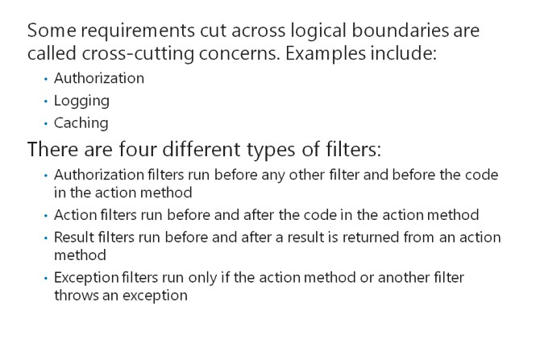
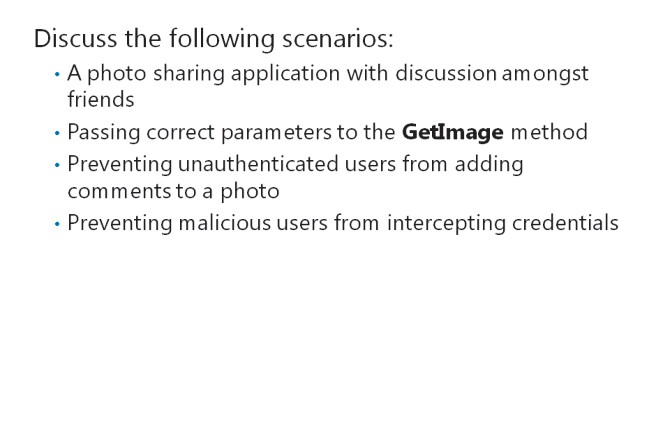

# Module 04 <br> Developing ASP.NET MVC 5 Controllers

#### Contents:

[Module Overview](04-0.md)    
[**Lesson 1:** Writing Controllers and Actions](04-1.md)    
[**Lesson 2:** Writing Action Filters](04-2.md)    

## Lesson 2 <br> **Writing Action Filters**

In some situations, you may need to run code before or after controller actions run. Before a user runs any action that modifies data, you might want to run the code that checks the details of the user account. If you add such code to the actions themselves, you will have to duplicate the code in all the actions where you want the code to run. Action filters provide a convenient way to avoid code duplication. You need to know how to create and use action filters in your web application, and when to use them.

Lesson Objectives

After completing this lesson, you will be able to:

- Describe action filters.

- Create action filters.

- Determine when to use action filters.

### What Are Filters?



The MVC programming model enforces the separation of concerns. For example, the business logic in model classes is separate from the input logic in controllers and the user interface logic in views. Each model class is also clearly distinct from other model classes. However, there are scenarios where requirements may be relevant to many parts of your application and cut across logical boundaries. For example, authorization must be done for many sensitive actions and controllers, regardless of the model and views that they return. These types of requirements are known as

cross-cutting concerns. Some common examples of cross-cutting concerns include authorization, logging, and caching.

**Filters**

Filters are MVC classes that you can use to manage cross-cutting concerns in your web application. You can apply a filter to a controller action by annotating the action method with the appropriate attribute.For example, an action annotated with the **[Authorize]** attribute, can be run only by authenticated users. You can also apply a filter to every action in a controller by annotating the controller class with the attribute.

#### **Filter Types**

There are four types of filters that you can use in MVC. These filters run at slightly different stages in the request process.

|Filter Type|Interface|Default Class|Description|
|---|---|---|---|
|Authorization|IAuthorizationFilter|AuthorizeAttribute|Runs before any other filter and before the code in the action method. Used to check a user’s access rights for the action.|
|Action|IActionFilter|ActionFilterAttribute|Runs before and after the code in the action method.|
|Result|IResultFilter|ActionFilterAttribute|Runs before and after a result is returned from an action method.|
|Exception|IExceptionFilter|HandleErrorAttribute|Runs only if the action method or another filter throws an exception. Used to handle errors.|

**Question**: Which filter type will you use for the following actions?

1. Intercepting an error

2. Modifying a result

3. Authorizing users

4. Inspecting a returned value

### Creating and Using Action Filters


If you have a cross-cutting concern in your web application, you can implement it by creating a custom action filter or a custom result filter. You can create custom filters by implementing the **IActionFilter** interface or the **IResultFilter** interface. However, the **ActionFilterAttribute** base class implements both the **IActionFilter** and **IResultFilter** interfaces for you. By deriving your filter from the **ActionFilterAttribute** class, you can create a single filter that can run code both before and after the action runs, and both before and after the result is returned.

The following code shows how an action filter is used to write text to the Visual Studio Output window in the order in which the IActionFilter and IResultFilter events run. Place this code in a class file within your web application.

**A Simple Custom Action Filter**

``` cs
public class SimpleActionFilter: ActionFilterAttribute {
  public override void OnActionExecuting(ActionExecutingContext filterContext) {
   Debug.WriteLine("This Event Fired: OnActionExecuting");
  }
  public override void OnActionExecuted(ActionExecutedContext filterContext) {
   Debug.WriteLine("This Event Fired: OnActionExecuted");
  }
  public override void OnResultExecuting(ResultExecutingContext filterContext) {
   Debug.WriteLine("This Event Fired: OnResultExecuting");
  }
  public override void OnResultExecuted(ResultExecutedContext filterContext) {
    Debug.WriteLine("This Event Fired: OnResultExecuted");
  } 
} 
```

**Note:** You can also create a custom authorization filter by implementing the **IAuthorizationFilter** interface. However, the default **AuthorizeAttribute** implementation is highly useful and satisfies almost all authentication requirements. You should be careful when overriding the default security code in MVC or any other programming model. If you do so without a full understanding of the implications, you can introduce security vulnerabilities that a malicious user can exploit.

#### **Using a Custom Action Filter**

After you have created a custom action filter, you can apply it to any action method or class in your web application by annotating the method or class with the action filter name.

In the following lines of code, the **SimpleActionFilter** is applied to the **Index** action of the **Photo** controller.

**Using A Custom Action Filter**

``` cs
public class PhotoController: Controller {
 ContextDB contextDB = new ContextDB();
 [SimpleActionFilter] public ActionResult Index() {
  return View("Index", contextDB.Photos.ToList());
 }
}
```

**Question:** What are the advantages of custom action filters?

### Discussion: Action Filter Scenarios



Consider the following scenarios. In each case, discuss with the rest of the class whether the scenario requires a custom filter, or can be solved with a built-in filter type, or cannot be solved with filters.

1. You are writing a photo sharing application and you want to enable each user to discuss photos, cameras, lenses, and other photography equipment with other users whom they have marked as their friends. Other users should be prevented from seeing these discussions.

2. You want to ensure that when MVC calls the **GetImage** action method, the ID in the query string is passed as a parameter.

3. You are writing a photo sharing application and you want to prevent unauthenticated users from adding comments to a photo.

4. You want to prevent malicious users from intercepting the credentials entered by users in the logon form for your web application. You want to ensure that the credentials are encrypted.

