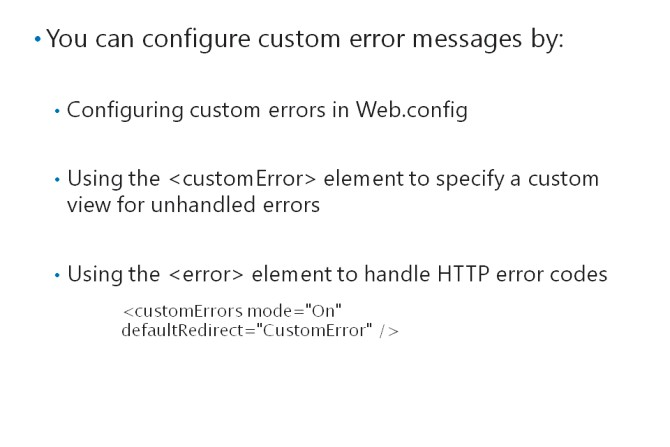

# Module 06 <br> Testing and Debugging ASP.NET MVC 5 Web Applications

#### Contents:

[Module Overview](06-0.md)    
[**Lesson 1:** Unit Testing MVC Components](06-1.md)    
[**Lesson 2:** Implementing an Exception Handling Strategy](06-2.md)    

## Lesson 2 <br> **Implementing an Exception Handling Strategy**

Unexpected events are likely to occur from time to time in any complex system, including MVC web applications. Occasionally, such unexpected run-time events cause an error. When this happens, ASP.NET or the .NET Framework generates an exception, which is an object that you can use to diagnose and resolve the error. The exception contains information that you can use to diagnose the problem.

Exceptions that are not handled in your code will cause the web application to halt and an error message to be displayed to the user. As a web developer, you need to know how to detect, handle, and raise exceptions, and identify the cause of the problem. Visual Studio provides a broad range of tools for debugging exceptions and improving the robustness of your code. You can also log exceptions to databases and other stores, and use the .NET Framework code contracts to reduce the frequency of exceptions.

### Lesson Objectives

After completing this lesson, you will be able to:

- Explain how to raise and catch exceptions.

- Explain how to configure exception handling by using Web.config.

- Explain how to trace exceptions by using the IntelliTrace tool.

- Describe how to log exceptions.

- Describe the health monitoring options for an MVC 5 web application.

### Raising and Catching Exceptions


An error is an unexpected run-time event that prevents an application from completing an operation. When a line of code causes an error, ASP.NET or the common language runtime creates an exception. This exception is an object of a class that inherits from the **System.Exception** base class. There are many exception classes.

Often the object class identifies what went wrong. For example, if there is an **ArgumentNullException**, it indicates that a **null** value was sent to a method that does not accept a **null** value as an argument.

#### **Unhandled Exceptions**

When an exception is not explicitly handled by an application, the application stops and the user sees an error message. In ASP.NET MVC applications, this error message is in the form of a webpage. You can override ASP.NET default error pages to display your own error information to users.

If an unhandled exception arises while you are debugging the application in Visual Studio, execution breaks on the line that generated the exception. You can use the Visual Studio debugging tools to investigate what went wrong, isolate the problem, and debug your code.

Sometimes, you may also want to raise your own exceptions as a form of communication between parts of your application. For example, consider an application that displays products on a website. In the repository, you implement a **FindProduct** method that returns the product with a name that matches the search string that is passed as an attribute. If the **FindProduct** method does not locate a product with the specified name, you may wish to raise an exception. This approach enables code in the controller, which calls the **FindProduct** method, to handle the event that no products are found. You can use the **throw** keyword to raise errors in C# code.

#### **Catching Errors with Try/Catch Blocks**

The most familiar way to catch an exception, which works in any .NET Framework code, is to use the **try/catch** block. Code in the **try** block is run. If any of that code generates an exception, the type of exception is checked against the type declared in the **catch** block. If the type matches, or is of a type derived from the type declared in the **catch** block, the code in the **catch** block runs. You can use the code in the **catch** block to obtain information about what went wrong and resolve the error condition.

The following code example catches any **ArgumentNullException** objects.

**A Simple Try/Catch Block**

``` cs
try 
{    
  Product product = FindProductFromComment(comment); 
} 
catch (ArgumentNullException ex) 
{    
  Console.WriteLine("The comment object was null. Error message: " + ex.Message); 
}
```

In MVC controllers, there are two methods to catch exceptionsthe **OnException** method and the **[HandleError]** annotation.

#### **Catching Controller Exceptions in OnException**

The **OnException** method is defined on the base **Controller** class, so you can override it in any MVC controller. When you override the **OnException** method in a custom controller, MVC runs the method whenever an exception arises and is not handled in a **try/catch** block. Using this approach, you can handle errors anywhere in your controller without adding many **try/catch** blocks throughout the code.

In the **OnException** method, you can catch specific types of exceptions by checking the **ExceptionContext.Exception** property. Your code must set the **context.Result** property to display a view to the user. If you do not set this property, the browser displays a blank webpage to the user.

In the following code example, the **OnException** method is used to catch **InvalidOperationException** objects.

**Using OnException to Catch Controller Errors**

``` cs
protected override void OnException(ExceptionContext context) {
 // Catch invalid operation exception    
 if (filterContext.Exception is InvalidOperationException) {
  var model = new HandleErrorInfo(context.Exception, controllerName, actionName);
  var result = new ViewResult {
   ViewName = "Error", ViewData = new ViewDataDictionary < HandleErrorInfo > (model),
    //Save pass the current Temp Data to the Error view, because it often contains             
    //diagnostic information             
    TempData = context.Controller.TempData
  };
  context.Result = result;
 }
}
```

#### **Catching Controller Exceptions with HandleError**

Using the **[HandleError]** annotation, you can use an attribute on individual action methods or on the controller class itself, in which case, the **[HandleError]** annotation catches errors in any action. When you use the **[HandleError]** annotation without properties, all exceptions are caught and sent to an MVC view called **Error.cshtml**. This default error view should be created in the **/View/Shared** folder.

You can use two properties to control the behavior of **[HandleError]**:

- _ExceptionType_. By default, the **[HandleError]** annotation catches all exceptions. If you set a more specific type with the **ExceptionType** property, only exceptions of that specific type will be caught.

- _View_. By default, the **[HandleError]** annotation forwards users to the **Error.cshtml** view. You can specify another view file by using the **View** property. By setting both the **ExceptionType** and **View** properties, you can divert exceptions of specific types to views designed specifically to display them.

In the code example, the first **[HandleError]** annotation forwards **NotImplementedException** errors to the **NotImplemented** view. All other errors are forwarded to the default error view.

**Using the HandleError Annotation**

``` cs
[HandleError(ExceptionType=typeof(NotImplementedException), View="NotImplemented")] 
[HandleError] 
public ActionResult Index() 
{    
  //Place action code here 
}
```

**Question:**You are using the **[HandleError]** annotation to catch exceptions in your web application. However, you realize that **[HandleError]** catches all exceptions, making it difficult for you to isolate a specific issue. What can you do to narrow down the exceptions that the **[HandleError]** annotation is catching?

### Configuring Exception Handling



ASP.NET applications display a default error page to users when an unhandled exception occurs in your MVC web application. There are two reasons why you may want to change the default error page:

- You want to display a branded and styled error page that has the same layout as other pages in the application and includes the company logo.

- You want to avoid drawing attention to the technology that powers the site. By letting malicious users know that your site runs ASP.NET MVC, you may encourage them to attack it by using methods that have worked in the past.

To configure a custom error page for your application, use the top-level Web.config file. The custom error page will be displayed when an exception in not handled by any **try/catch** block or **[HandleError]** attribute.

#### **Custom Error Modes**

To configure custom errors, add the **\<customErrors\>** element to the Web.config file. This element must be a child of the **\<system.web\>** element. Use the following attributes:

- **mode:** The mode attribute can be set to one of three values:

  - **Off:** Unhandled errors are displayed on the default ASP.NET error page.

  - **On:** Unhandled errors are displayed in the page you specify in the **defaultRedirect**attribute.

  - **RemoteOnly:** In this mode, unhandled errors are displayed differently for browsers on remote computers and browsers on the web server. In a production site, all browsers are remote and errors are displayed on the page that you specify in the **defaultRedirect** attribute. In development situations, the developer often browses to the site on the local computer. When an error occurs, the developer is directed to the default ASP.NET error page, which includes debugging information such as the stack trace. Use the **RemoteOnly** mode on development computers.

- **defaultRedirect:** This attribute sets the name of the view that will be used to display unhandled exceptions. When you create this view, place it in the **Views/Shared** folder.

The code in the following example enables custom errors and specifies that unhandled exceptions are forwarded to the **customError** view.

**Configuring Custom Errors**

``` XML
<system.web>        
  <customErrors mode="On" defaultRedirect="CustomError" /> 
</system.web>
```

#### **HTTP error pages**

Some Hypertext Transfer Protocol-level (HTTP) errors cannot be caught by custom MVC error views as specified in Web.config or the **[HandleError]** annotation. For such errors, you can use the **\<error\>** element in Web.config, as a child element of the **\<customErrors\>**element.

In the following example, the **\<error\>** element is used for specific HTML files to respond to HTTP 500 errors.

**Catching HTTP Error Codes**

``` XML
<customErrors mode="On" defaultRedirect="CustomError" >       
  <error statusCode="500" redirect="~/Error/Error500.html" /> 
</customErrors>
```

**Question:** You have switched off custom errors in the Web.config file. When you run your application without debugging, an exception is thrown in a **try/catch** block. What page displays the exception to the user?

### Using Visual Studio IntelliTrace in MVC


When something goes wrong in your web application, whether it happens during development or in production, you need information about the state of the application, to diagnose the problem. Sometimes, a small amount of information is sufficient. For example, you may be able to see from the URL query string that a link was formulated wrongly. Often, however, problems arise in more obscure places and you need as much information as possible to perform a diagnosis. IntelliTrace is a feature of Visual Studio that assists debugging by presenting as much information as possible. IntelliTrace was introduced with Microsoft Visual Studio 2010 Ultimate.

#### **The Traditional Debugging Workflow**

When developers debug malfunctioning code, they run the application in Visual Studio debugging mode. If an unhandled exception occurs, Visual Studio breaks execution and displays details such as the exception class and the exception message. You can use the Locals, Call Stack, and Error List windows to determine the values of variables and properties that may have caused the exception. All these pieces of information are presented as they were when the error occurred.

If a problem originated before the error occurred, you must halt debugging, set a break point, and then restart debugging. Again, Visual Studio halts execution, but this time, it is at the break point. You can use the same windows to gain information and step through code, line by line, to see how values change, and diagnose the error.

Two problems can occur in this workflow:

- If you set the break point too late, you will miss the origin of the error. You must set another break point and restart debugging.

- If you are stepping through many lines of code, you can miss the error by selecting Debug|StepInto or pressing the F11 shortcut too many times. This is easy to do when there are hundreds of lines of code to step through.

#### **Debugging With IntelliTrace**

IntelliTrace improves this workflow and addresses the two problems that arise during the traditional debugging workflow by recording a timeline of code execution. When you run an application in the debug mode, IntelliTrace records all the events that occur in the background. This can include exceptions, debugging events such as break points, and other events that you can configure.

As before, when the debugger encounters an unhandled exception or a break point, Visual Studio halts execution and displays the details of any exception. However, the developer can now see all the recorded events in the IntelliTrace pane. The current event appears at the end of the list and is named **Live Event.** You can see all the previous events in the list and can click them for more details. In this way, you can investigate what happened before the exception or the break point.

When you click an earlier event in the IntelliTrace pane, the Locals, Call Stack, and Error List windows display the state of the application at the moment of the earlier event. The line of code that corresponds to the selected event is highlighted in orange color. Because of this highlighting, two problems that arise during the traditional debugging workflow are eased, namely, missing the origin of error and stepping too far through the code. Because the relevant code is highlighted, if you miss the origin of the error or step too far through the code, you can get back to earlier events and investigate values.

To help you locate the correct event in the IntelliTrace window, you can filter by event category or execution thread, or use the search option.

#### **IntelliTrace Configuration Options**

To configure IntelliTrace, click **DEBUG**, click **IntelliTrace**, and then click **Open IntelliTrace Settings**. You can enable or disable IntelliTrace event recording and specify a location and maximum size for the IntelliTrace files.

Most of the configuration options concern the amount of data to record in IntelliTrace files. The default settings have a mimimal affect on performance, but if those are insufficient to diagnose a problem, you can choose to log more information to target the problem. This may compromise performance, but remember that IntelliTrace information is only recorded during debugging. Your settings will not degrade performance after the application is deployed to a web server. Under **General**, you can set IntelliTrace to record IntelliTrace events only, or both IntelliTrace events and call information, which includes all calls to methods and classes. You can configure what is included in IntelliTrace events by using the **IntelliTrace Events** list. For example, by default, ASP.NET events such as error pages, page post backs, and redirects are included for MVC applications.

#### **Saving and Opening IntelliTrace Files**

IntelliTrace automatically saves events in an IntelliTrace file when you enter debug mode. The file is automatically deleted when you close Visual Studio, to ensure that IntelliTrace files do not over-use disk space. Note that this means that the IntelliTrace pane includes events from the current debugging session and any previous debugging sessions run since you started Visual Studio. However, these files are temporary.

You can avoid losing an IntelliTrace file when you close Visual Studio by saving it for later analysis. To do this, click **DEBUG**, click **IntelliTrace**, and then click **Save IntelliTrace Session**. The file is saved with an .iTrace extension. If you double-click an .iTrace file, Visual Studio displays the threads, exceptions, modules, and other information that the file contains.

**Additional Reading:** For more information about IntelliTrace and how to use it, see

**Question:** You are looking at IntelliTrace events and suspect that the error originated in a class written by a colleague who works in another country. How can you help the colleague to see the events that you can see in IntelliTrace after you close Visual Studio?

### Logging Exceptions


Exceptions that you face during development can be investigated and debugged by using the Visual Studio debugging tools, including IntelliTrace. In an ideal situation, no exceptions would arise when your web application is complete and deployed for users over the Internet. However, in the real world, unforeseen circumstances arise resulting in exceptions. For example, database failures, network issues, and configuration errors in any part of the system can cause exceptions.

You have already seen how to present a branded and informative custom error page to users when exceptions occur. It is also appropriate to log the exceptions in a production web application, so the administrators and developers can assess the extent of the problem, remove the cause, and improve the robustness of the code.

#### **Writing Error Logging Code**

Before you write code to log exceptions in your web application, consider where exceptions should be recorded. Generally, web applications log exceptions to an Extensible Markup Language (XML) file. This approach can be efficient, especially if the text file is kept on a separate drive from the database of the web application and other critical, commonly accessed files. However, the file size of the XML files can grow large, making them difficult to analyze.

A common approach is to log errors to tables in a database. These tables can be a part of a single web application database, or you can place them in a dedicated database away from product catalogs, user profiles, and other information. By logging exceptions to a database, you create a list of exceptions that can be easily searched and analyzed. You can also build a webpage to present these logged exceptions to administrators so that they can access the details from a browser.

You should also consider sending email messages or other types of messages to administrators and developers when exceptions occur. This approach ensures that administrators and developers hear of an error very quickly. It does not require them to review the exceptions logged in the database. Frequently, error handling code in live applications both logs to a database and send email messages to administrators and developers.

#### **Where to Write Error Logging Code**

When you decide where to write code that logs errors, you should consider that errors might arise in almost any part of your application. You should choose an approach that enables you to write error logging code once that will run for any exception anywhere in your application.

For example, it is not appropriate to write error logging code in individual **try/catch** blocks. If you do this, you will have to create a **try/catch** block for every procedure in your application, and write duplicate logging code in the **catch** block.

A more effective approach is as follows:

- Create a custom base controller class for your web application. This class inherits from the **System.Web.Mvc.Controller** base class.

- In your custom base controller class, override the **OnException()** method. Place you error logging code in this method.

- When you create controllers, inherit from your custom base controller class, instead of **System.Web.Mvc.Controller**.

In this way, you can write error logging code only once in the overridden **OnExcpetion()** method. This catches exceptions from any of the inheriting controllers.

#### **Using Third-Party Logging Tools**

Because exception logging is a very common functional requirement for web applications, there are many third-party solutions that you can choose if you do not want to write your own logging code. Many of these are available within Visual Studio from the NuGet package manager.

Perhaps, the most commonly used and widely supported error logging package is Error Logging Modules and Handlers (ELMAH). ELMAH can be used with any ASP.NET web application and can log exceptions to XML files or a wide variety of databases, including Microsoft SQL Server, Oracle, Microsoft SQL Server Compact, MySQL, and others. In addition, ELMAH includes webpages that you can use to remotely view exception lists and details, and ELMAH can send alert email messages to the address that you configure.

**Question:** You want to ensure that developers can review exception details that arise during debugging. How should you approach error logging code?

### Health Monitoring


Since ASP.NET version 2.0, you can use health monitoring to record what happens in a web application. Health monitoring can record exceptions through error logging techniques. However, health monitoring can also record a wide range of other events such as application starts and stops, failed logon attempts, membership events, and user input validation errors. Some pieces of these information are difficult to access from any other source.

#### **Health Monitoring Features**

You can customize the category of events that health monitoring records. Each event is within one of the five following categories.

|Event Category |Description|
|-|-|
|Application Lifetime Events |Application lifetime events include application starts and stops. |
|Audit Events |Audit events include logons, logoffs, and logon failures. |
|Error Events |Error events incude .NET Framework exceptions and HTTP errors such as 404 errors. |
|Request Processing Events |Request processing events include events that occur as ASP.NET controllers, models, and views receive and respond to webpage requests. |
|Heartbeats |Heartbeats are periodic events that health monitoring can raise and record to confirm that the application is running. |

You can also customize the location where health monitoring stores event details by configuring health monitoring providers. You can choose from the following providers.

|_Health Monitoring Provider_ |Description|
|-|-|
|EventLogWebEventProvider |EventLogWebEventProvider sends events to the Windows Event Log. These events appear in the Windows log. |
|SqlWebEventProvider |SqlWebEventProvider sends events to a SQL Server database. |
|WmiWebEventProvider |WmiWebEventProvider sends events to Windows Management Infrastructure client. |
|SimpleMailWebEventProvider |SimpleMailWebEventProvider sends events in an email message sent to an address you specify. |
|TemplatedMailWebEventProvider |TemplatedMailWebEventProvider also sends events in an email message, but you can use a template email to format the information.|
|TraceWebEventProvider |TraceWebEventProvider sends events to the ASP.NET tracing system. |

#### **Configuring Health Monitoring**

You configure health monitoring by using the **\<healthMonitoring\>** element within the **\<system.web\>** element in Web.config. You can use elements within **\<healthMonitoring\>** to add and configure providers and define rules that govern how events of different types are recorded.

The following code example shows how to configure health monitoring to record application life cycle events to a SQL Server database.

**Configuring Health Monitoring**

``` XML
<system.web>    
  <connectionStrings>       
    <add name="HealthDB" connectionString="your connection string here" />    
  </connectionStrings>    
  <healthMonitoring enabled="true">       
    <providers>          
      <add name="sqlProvider" 
        type="System.Web.Management.SqlWebEventProvider" 
        connectionStringName="HealthDB" 
        buffer="false" 
        bufferMode="Notification" />       
    </providers>       
    <rules>          
      <add name="LifeCycle" 
        provider="sqlProvider" 
        eventName="Application Lifetime Events" />             
    </rules>    
  </healthMonitoring> 
</system.web> 
```

**Additional Reading:**

For full details of all the options that you can configure in Web.config for health monitoring, see [http://go.microsoft.com/fwlink/?LinkID=293685&clcid=0x409](http://go.microsoft.com/fwlink/?LinkID=293685&amp;clcid=0x409)

If you configure health monitoring to use the **SqlWebEventProvider**, ASP.NET will, by default, create a database file called, ASPNETDB.MDF, in the App_Data folder of the web application. You can alter this location by using the connection string in Web.config. However, health monitoring will only work if certain data tables are present in the database that you connect to. You can prepare the database with the correct tables by using the aspnet_regsql.exe tool. This tool is found in the %WINDOWS%\Microsoft.NET\Framework\versiondirectory.

The following command prepares a SQL Server database for health monitoring, authenticating as the current user.

```
aspnet_regsql.exe –E –S HealthDatabaseServer –d HealthDatabase –A w 
```

**Question:** After using your recently-developed web application, several users are facing failed logon attempts. As a result, to track these exceptions, you have decided to set up a monitoring system that will send an email message to a specified email address. Which health monitoring provider will you use to fix this?

