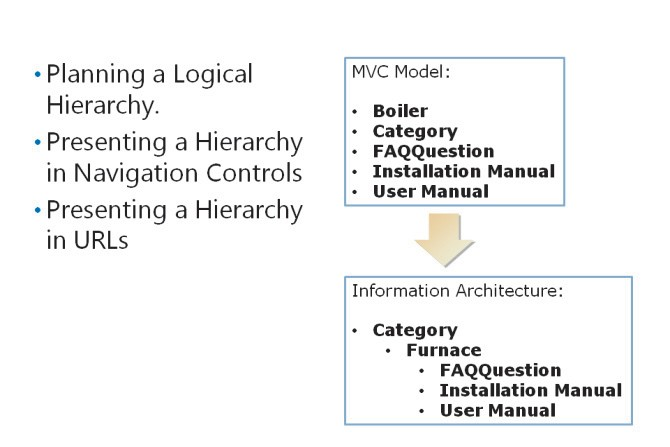

# Module 07   Structuring ASP.NET MVC 5 Web Applications

#### Contents:

[Module Overview](07-0.md)    
[**Lesson 1:** Analyzing Information Architecture](07-1.md)    
[**Lesson 2:** Configuring Routes](07-2.md)    
[**Lesson 3:** Creating a Navigation Structure](07-3.md)

## Lesson 1   **Analyzing Information Architecture**

When you analyze use cases and user stories to plan a model for your web application, you must determine the kinds of objects that your web application will manage. For example, if your web application provides technical documentation for a product, you can plan model classes such as installation guides, user guides, frequently asked questions (FAQs), FAQ answers, categories, comments, and other model classes. The model imposes a logical structure of objects on the web application.

However, you must also consider how users expect information to be structured. Users may expect a hierarchical structure, in which FAQs, FAQ answers, and comments are presented under the product they relate to. When you create a complex MVC web application, you need to know how to present model classes in a logical manner, so that your web application is user-friendly.

### Lesson Objectives

After completing this lesson, you will be able to:

- Describe information architecture.

- Describe search engine optimization and its importance for web developers.

## What Is Information Architecture?

When the information your web application manages is complex and multi-faceted, it is easy to present objects in a confusing way. Unless you think carefully about the way users expect information to be structured and how they expect to navigate to useful content, you may unintentionally create an unusable web application. During development, when you work with a limited amount of data, this confusion may not become apparent. Then, when real-world data is added to your database at production deployment time, it becomes clear that the web application is confusing. You can avoid this eventuality by planning the information architecture.

Information architecture is a logical structure for the objects your web application manages. You should design such architecture in a way that users can find content quickly without understanding any technical aspects of your web application. For example, users should be able to locate a technical answer about their product without understanding the database structure or the classes that constitute the model.

#### **Example Scenario: A Technical Documentation Website**

To understand the need for information architecture, consider a web application that presents technical information about a companys products for customers and engineers. In this example, the company manufactures domestic heating furnaces, which are installed in homes by qualified heating engineers. The web application is intended to enable customers to locate instructions, hints, and tips. This web application is also intended to enable engineers to obtain the technical documentation on installing and servicing furnaces.

The development team has identified the following simple user stories:

- Customers have a certain problem with their boilers. They want to find a specific FAQ answer that solves the problem. They know the boiler product name and the fuel, but not the product number. They visit the web application and navigate to the boiler name. They click the FAQ for their boiler name and locate the answer that they need.

- Engineers need the latest installation manual for a boiler. They know the boiler product number, product name, and fuel type. They visit the site and navigate to the boiler name. They click the Manuals link and locate the installation manual.

- Engineers have web applications, which they want to link to a specific boiler name. You want to ensure that the URL is simple and readable for customers and engineers.

You have already planned the following model classes:

- _Furnace_. Each furnace object is a product manufactured and sold by the company.

- _Category_. Categories organize the furnaces by type. For example, you can have categories such as oil-fired, gas-fired, and solid fuel.

- _FAQ_. Each FAQ relates to a single furnace. Each furnace can have many questions. The class includes both Question and Answer properties.

- _Installation Manual_. Each furnace has a single installation manual in the form of a PDF document.

- _User Manual_. Each furnace has a single user manual in the form of a PDF document.

#### **Planning a Logical Hierarchy**

You can see from the user stories that FAQ and manuals are both accessed by navigating to the relevant product first. You can also see that the company has different products, and both customers and engineers know the fuel type for a particular furnace. Therefore, you can organize furnaces in categories by fuel type. The following list shows a logical hierarchy of objects, which helps both the customers and engineers find the information they need by clicking through each level:

- Category

  - Furnace

  - FAQ

  - User Manual

  - Installation Manual

#### **Presenting a Hierarchy in Navigation Controls**

The information architecture you design should be presented on webpages in the form of navigation controls. Common approaches to such controls include:

- _Site Menus_. Most websites have a main menu that presents the main areas of content. For simple web applications, the main menu may include a small number of static links. For larger web applications, when users click a site menu link, a submenu appears.

- _Tree Views_. A tree view is a menu that shows several levels of information hierarchy. Usually, users can expand or collapse objects at each level, to locate the content they require. Tree views are useful for presenting complex hierarchies in navigable structures.

- _Breadcrumb Trails_. A breadcrumb trail is a navigation control that shows the user where they are in the web application. Usually a breadcrumb trail shows the current pages and all the parent pages in the hierarchy, with the home page as the top level. Breadcrumb trails enable you to understand how a page fits in with the information architecture shown in menus and tree views.

The types of navigation controls you build in your web application depend on how you expect users to find information.

#### **Presenting a Hierarchy in URLs**

You can increase the usability of your web application by reflecting the information architecture in the URLs, which the users see in the Address bar of the web browser. In many web applications, URLs often include long and inscrutable information such as Globally Unique Identifiers (GUIDs) and long query strings with many parameters. Such URLs prevent users from manually formulating the address to an item, and these URLs are difficult to link to a page on your web application. Instead, URLs can be plain and comprehensible, to help users browse through your content.

In MVC web applications, the default configuration is simple, but it is based on controllers, actions, and parameters. The following are some example URLs that follow this default pattern:

- This URL links to the Furnace controller and the Details action, and it displays the furnace with the ID 23.

- This URL links to the FAQQuestion controller and the Details action, and it displays the FAQ with the ID 234.

- This URL links to the InstallationManual controller and the Details action, and it displays the manual with the ID 3654.

As you can see, the web application user is required to understand how controllers, actions, and action parameters work, to formulate URLs themselves. Instead, users can use URLs that are easier to understand, such as the following, because they reflect the information hierarchy:

- This URL links to a Furnace by specifying the fuel category and the product name. Customers and engineers can understand these values.

- This URL links to an FAQ by specifying the furnace name the question relates to.

- This URL links to the Installation Manual by specifying the furnace name the manual relates to.

As you can see, these URLs are easy for customers and engineers to understand, because the URLs are based on a logical hierarchy and the information that the users already have. You can control the URLs that your ASP.NET web application uses, by configuring the ASP.NET routing engine.

**Question:** Why may it be difficult for users to understand URLs based on controllers, actions, and parameters?

### What Is Search Engine Optimization?

Most users find web applications by using search engines. Users tend to visit the links that appear at the top of search engine results more frequently than those lower down and those on the second page of results. For this reason, website administrators and developers try to ensure their web application appears high in search engine results, by using a process known as Search Engine Optimization (SEO). SEO ensures that more people visit your web application.

Search engines examine the content of your web application, by crawling it with a program called a web bot. If you understand the priorities that web bots and search engine indexes use to order search results, you can create a web application that conforms to those priorities and thereby appears high in search engine results.

**SEO Best Practices**

Various search engines have different web bots with different algorithms to prioritize results. The complete details of these algorithms are not usually published. However, if you adopt the following best practices, your site has a good chance of appearing high in search results:

- Ensure that each webpage in your web application has a meaningful \<title\> element in the \<head\> section of the HTML.

- Ensure that you include a \<meta name="keywords"\> tag in the \<head\> element of each page. The content attribute of this element should include keywords that describe the content of the page accurately.

- Ensure that you include a \<meta name="description"\> tag in the \<head\> element of each page. The content attribute of this element should include a sentence that describes the content of the page accurately.

- Ensure that the \<title\> element and the \<meta\> elements are different for each page in your web application.

- Choose a domain name that includes one or more of your most important keywords.

- Ensure that keywords appear in the \<h1\>, \<h2\>, or \<h3\> elements of your webpage.

- Ensure that navigation controls enable web bots to crawl your entire web application. For example, you may have content in your site that users can only find with the search tool, not by clicking through links. As web bots cannot use search tools, this content will not be indexed.

- Ensure that URLs do not include GUIDs or long query text.

#### **SEO and Web Application Structure**

Information architecture is a subject that is closely related to SEO. This is because both information architecture and SEO are relevant to the structure, hierarchy, and accessibility of the objects in your web application. Users click links on menus to navigate to the pages that interest them. Web bots use the same links to navigate the web application and crawl its content. Users prefer URLs without GUIDs and long query text because they are meaningful. Web bots often ignore links with GUIDs and long query text in them. In addition, when keywords appear in URLs, web bots prioritize a webpage in search results.

As an ASP.NET MVC developer, you must understand SEO principles and use them whenever you write code, to ensure that you do not damage the search engine positioning of your web application. Views are critical to SEO because they render \<meta\> tags, and \<title\> elements. Routes and the configuration of the routing engine are also critical, because, by using routes, you can control the URLs that your web application generates.

**Question:** A developer creates a partial view that contains \<meta\> tags and \<title\> tags. The developer uses this partial view on every page in the web application. Do these actions conform to SEO best practices?

