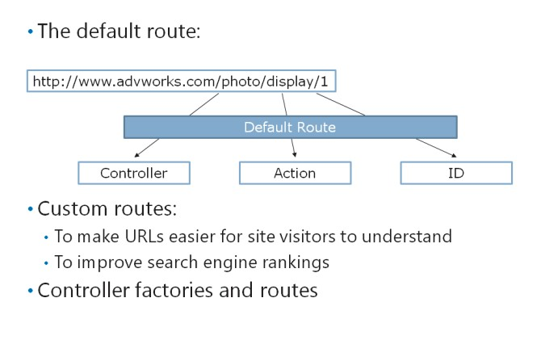
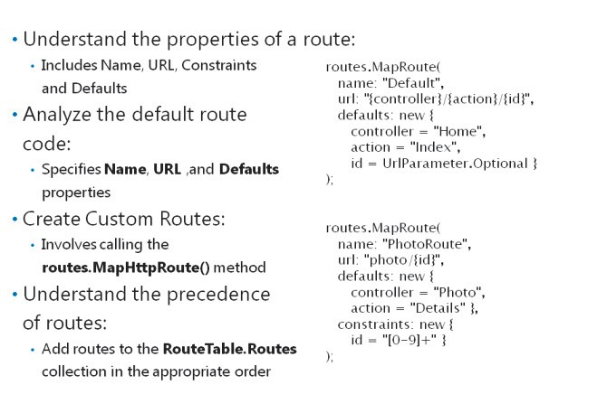
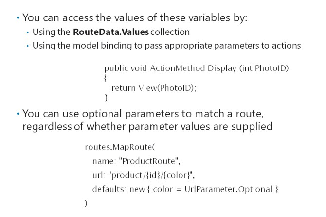

# Module 07 <br> Structuring ASP.NET MVC 5 Web Applications

#### Contents:

[Module Overview](07-0.md)    
[**Lesson 1:** Analyzing Information Architecture](07-1.md)    
[**Lesson 2:** Configuring Routes](07-2.md)    
[**Lesson 3:** Creating a Navigation Structure](07-3.md)

## Lesson 2 <br> **Configuring Routes**

ASP.NET enables developers to control the URLs that a web application uses, to link the URLs and the content by configuring routes. A route is an object that parses a requested URL, and it determines the controller and action to which the request must be forwarded. Such routes are called incoming routes. HTML helpers also use routes when they formulate links to controllers and actions. Such routes are called outgoing routes. You need to know how to write code that adds a new route to your application. You also need to know how the routing engine interprets a route so that requests go to the appropriatecontrollers, and users see meaningful URLs.

### Lesson Objectives

After completing this module, you will be able to:

- Describe the features of the ASP.NET routing engine.

- Describe the benefits of adding routes to an ASP.NET MVC web application.

- Explain how to add and configure routes.

- Explain how to use routes to pass parameters.

- Add routes to manage URL formulation.

### The ASP.NET Routing Engine



Routing governs the way URLs are formulated and how they correspond to controllers and actions.

Routing does not operate on the protocol, server, domain, or port number of a URL, but only on the directories and file name in the relative URL. For example, in the URL, http://www.advworks.com/photo/display/1, routing operates on the relative path /photo/display/1.

In ASP.NET, routes are used for two purposes:

- To parse the URLs requested by browsers. This analysis ensures that requests are forwarded to the right controllers and actions. These are called incoming URLs.

- To formulate URLs in webpage links and other elements. When you use helpers such as **Html.ActionLink()** and **Url.Action()** in MVC views, the helpers construct URLs according to the routes in the routing table. These are called outgoing URLs.

When you create an MVC web application in Visual Studio by using a project template, the application has a default route. You must understand this default route before you consider adding extra routes to manipulate URLs in the application.

**Note:** You can use routes and the routing engine to govern relative URLs in any ASP.NET 4.5 application and not just in those that use the MVC programming model.

#### **The Default Route**

The default route is simple but logical and works well in many web applications. The default route examines the first three segments of the URL. Each segment is delimited by a forward slash:

- The first segment is interpreted as the name of the controller. The routing engine forwards the request to this controller. If a first segment is not specified, the default route forwards the request to a controller called **Home**.

- The second segment is interpreted as the name of the action. The routing engine forwards the request to this action. If a second segment is not specified, the default route forwards the request to a controller called **Index**.

- The third segment is interpreted as an ID value, which is passed to the action as a parameter. The parameter is optional, so if a third segment is not specified, no default value is passed to the action.

You can see that when the user requests the URL, [http://www.advworks.com/photo/display/1](http://www.advworks.com/photo/display/1), the default route passes the ID parameter **1** to the **Display** action of the **Photo** controller.

The following code shows how the default route is implemented in new ASP.NET MVC 5 applications.

**The Default Route**

``` cs
routes.MapRoute(    
  name: "Default",    
  url: "{controller}/{action}/{id}",    
  defaults: new {        
    controller = "Home",        
    action = "Index",        
    id = UrlParameter.Optional     
  } 
);
```

#### **Custom Routes**

Developers add their own custom routes to a web application for two main reasons:

- _To make URLs easier for site visitors to understand._ A URL such as [http://www.advworks.com/photo/display/1](http://www.advworks.com/photo/display/1) is logical to the visitor, but it requires some knowledge to formulate such URLs. In this case, to type the right URL in the Address bar of the web browser, the user must know some information. This information includes the controller name,**Photo**, the action name, **Display**, and the **ID** of the photo of interest. If you use Globally Unique Identifiers (GUIDs) in the database, the **ID** segment of the URL can be long and difficult to remember. Ideally, you should consider what users know and create routes that accept that information. In this example, users may know the title of a photo that they had seen earlier in your application. You should create a route that can interpret a URL such as and forward the URL to an appropriate action to display the right photo. Although users usually click links to make requests, friendly URLs like these make a site easier to use and link to from other sites.

- _To improve search engine rankings._ Search engines do not prioritize webpages that have GUIDs or long query text in the URL. Some web bots do not even crawl such links. In addition, some search engines boost a pages ranking when one or more of its keywords appear in the URL. User-friendly URLs are therefore a critical tool in SEO.

#### **Controller Factories and Routes**

MVC uses controller factories that help create an instance of a controller class to handle a request. MVC uses action invokers to call the right action and pass parameters to that action method. Both controller factories and action invokers refer to the routing table to complete their tasks. The following are steps that MVC conducts when a request is received from a web browser:

1. An **MvcHandler** object creates a controller factory. The controller factory is the object that instantiates a controller to respond to the request.

2. The controller factory consults the routing table to determine the right **Controller** class to use.

3. The controller factory creates a **Controller** object, and the **MvcHandler** calls the **Execute** method in that controller.

4. The**ControllerActionInvoker** examines the request URL and consults the routing table to determine the action in the **Controller** object to call.

5. The **ControllerActionInvoker** uses a model binder to determine the values that should be passed to the action as parameters. The model binder consults the routing table to determine if any segments of the URL should be passed as parameters. The model binder can also pass parameters from a posted form, from the URL query text, or from uploaded files.

6. The **ControllerActionInvoker** runs the action. Often, the action creates a new instance of a model class, perhaps by querying the database with the parameters that the invoker passed to it. This model object is passed to a view, to display results to the user.

As you can see, you can use routes to manage the behavior of controller factories, action invokers, and model binders, because all these objects refer to the routing table. MVC is highly extensible; therefore, developers can create custom implementations of controller factories, action invokers, and model binders. However, by using routes, you can usually implement the URL functionality that you need with the default implementations of these classes. You should ensure that routes cannot implement your required functionality before you plan to customize controller factories, action invokers, or model binders.

**Question:** A user wants to edit a comment that the user created in your MVC application. You have not created any custom routes. What URL do you think the user must request, to see the edit view with the right comment?

### Adding and Configuring Routes



Every MVC web application has a **RouteTable** object in which routes are stored, in the **Routes** properties. You can add routes to the **Routes** property by calling the **MapRoute()** method.

In the Visual Studio project templates for MVC 5, a dedicated **RouteConfig.cs** code file exists in the **App\_Start** folder. This file includes the **RouteConfig.RegisterRoutes()** static method where the default route is added to the **RouteTable** object. You can add custom routes in this method. The **Global.asax.cs** file includes a call to **RouteConfig.RegisterRoutes()** in the **Application_Start()** method, which means that routes are added to the routing table whenever the MVC application starts.

#### **Properties of a Route**

Before you can add a route, you must understand the properties of a route. This is to ensure that these properties match the URL segments correctly and pass requests and parameters to the right location. The properties of a route include the following:

- _Name_. This string property assigns a name to a route. It is not involved in matching or request forwarding.

- _URL_. This string property is a URL pattern that is compared to a request, to determine if the route should be used. You can use segment variables to match a part of the URL. You can specify a segment variable by using braces. For example, if you specify the URL, "photo/{title}", the route matches any request where the relative URL starts with the string, "photo/", and includes one more segment. The segment variable is titleand can be used elsewhere in the route.

- _Constraints_. Sometimes you must place extra constraints on the route to ensure that it matches only with the appropriate requests. For example, if you want relative URLs in the form, "photo/34", to specify a photo with the ID "34", you must use a URL property like "photo/{id}". However, observe that this URL pattern also matches the relative URL, "photo/create", because it has one extra segment. For IDs, you must constrain the URL to match only segments comprising digits. You can do this by adding a constraint to the route. The **Constraints** property enables you to specify a regular expression for each segment variable. The route will match a request only if all the segment variables match the regular expressions that you specify.

- _Defaults_. This string property can assign default values to the segment variables in the URL pattern. Default values are used for segment variables when the request does not specify them.

#### **The Default Route Code**

The default route specifies the **Name**, **URL**, and **Defaults** properties to obtain controller and action names, and ID values, from the requested relative URL. By examining these properties, you can understand how to construct your own routes.

The following code shows the default route in the Visual Studio MVC project templates.

**The Default Route in RouteConfig.cs**

``` cs
routes.MapRoute(    
  name: "Default",    
  url: "{controller}/{action}/{id}",    
  defaults: new { 
    controller = "Home", 
    action = "Index", 
    id = UrlParameter.Optional 
  } 
);
```

Observe that the URL pattern specifies three segments: {controller}, {action}, and {id}. This means that a relative URL in the form, "photo/display/23", will be sent to the **Display** action of the **PhotoController** class. The third segment will be passed as a parameter to the action method. Therefore, if the **Display** action accepts a parameter named **id**, the value, **23**, will be passed by MVC.

In the **defaults** property, the {id} segment is marked as optional. This means that the route still matches a relative URL, even if no third segment is specified. For example, the route matches the relative URL, "photo/create", and passes the URL to the **Create** action of the **PhotoController** class.

The **defaults** property specifies a default value of "Index" for the {action} segment. This means that the route still matches a relative URL, even if no second segment is specified. For example, the route matches the relative URL, "photo", and passes the URL to the **Index** action of the **PhotoController** class.

Finally, the **defaults** property specifies a default value of "Home" for the {controller} segment. This means that the route still matches a relative URL, even if no segments are specified, that is, if there is no relative URL. For example, the absolute URL, "[http://www.advworks.com/](http://www.advworks.com/)", matches this route, and the URL is passed to the **Index**action of the **HomeController** class.

As you can see, with the default route in place, developers build the web applications home page by creating a controller named, **HomeController**, with an action named, **Index**. This action usually returns a view called, **Index**, from the **Views/Home** folder.

#### **Creating Custom Routes**

You can add custom routes by calling the **routes.MapHttpRoute()** method, just like the default route.

In the following code example, a constraint is used to ensure that only digits match the {id} segment variable.

**A Custom Route**

``` cs
routes.MapRoute(    
  name: "PhotoRoute",    
  url: "photo/{id}",    
  defaults: new { 
    controller = "Photo", 
    action = "Details" 
  },    
  constraints: new { id = "[0-9]+" } 
);
```

Observe that the URL pattern in the route matches any relative URL that starts with "photo/" and has one or more segments. However, in the constraints property, the route specifies a regular expression for the {id} segment variable. This regular expression matches only if the segment is composed of digits that range from 1 through 9. If the user requests the relative URL, "photo/234", then this route matches, and the routing engine forwards the request to the **Details** action of the **PhotoController** class. If the user requests the relative URL, "photo/create", then this route does not match and a subsequent route must be used to forward the request.

#### **Precedence of Routes**

Routes are evaluated by the routing engine in the order with which they are added to the **RouteTable.Routes** collection. If a route matches, the routing engine uses it and does not evaluate any later route in the collection. If a route does not match, the routing engine ignores it and evaluates the next route in the collection. For this reason, you must add routes to the **RouteTable.Routes** collection in the appropriate order. You can add the most specific routes first, such as routes that have no segment variables and no default values. Routes with constraints should be added before routes without constraints.

The route named "Default" matches any request, including those with no relative URL. This default route should be the last that you add to the **RouteTable.Routes** collection. If the routing engine evaluates this route, the route is always used. Any routes added after the "Default" route are never used.

**Question:** A developer has removed all code from the **Application_Start()** method in **Global.asax.cs**. When the developer runs the application, he or she receives 404 errors for any request, regardless of the relative URL. Why does this occur?

### Using Routes to PassParameters



The routing engine separates the relative URL in a request into one or more segments. Each forward slash delimits one segment from the next. If you want one of the segments to specify the controller name, you can use the {controller} segment variable. The controller factory always interprets this variable as the controller to instantiate.

Alternatively, to fix a route to a single controller, you can specify a value for the **controller** variable in the **defaults** property. In a similar manner, if you want one of the segments to specify the action method, you can use the {action} segment variable. The action invoker always interprets this variable as the action to call. Alternatively, to fix a route to a single action, you can specify a value for the **action** variable in the **defaults** property.

Segment variables or default values with other names have no special meaning to MVC and are passed to actions. You can access the values of these variables by using one of two methods: the **RouteData.Values** collection or by using model binding to pass values to action parameters.

#### **The RouteData.Values Collection**

In the action method, you can access the values of any segment variable by using the **RouteData.Values** collection. Consider the following example:

- In **RouteConfig.cs**, you have defined a route with the URL pattern "{controller}/{action}/{title}".

- The user requests the relative URL, "photo/edit/my%20photo".

The **RouteData.Values** collection contains the following values, which you can use in the action method:

- **RouteData.Value["controller"]**: This value has the value, "photo".

- **RouteData.Value["action"]**: This value has the value, "edit".

- **RouteData.Value["title"]**: This value has the value, "my%20photo".

#### **Using Model Binding to Obtain Parameters**

Consider the following action method.

``` cs
public void ActionMethod Display (int PhotoID) 
{    
  return View(PhotoID); 
}
```

The default MVC action invoker is a class named, **ControllerActionInvoker**. This invoker uses a class named, **DefaultModelBinder**, to pass the appropriate parameters to actions. This model binder uses the following logic to pass parameters:

1. The binder examines the definition of the action to which it must pass parameters. In the example, the binder determines that the action requires an integer parameter called, **PhotoID**.

2. The binder searches for values in the request, which can be passed as parameters by name. In the example, the binder searches for integers because the action requires integers. The binder searches for values in the following locations in sequential order:
   
   1. _Form Values_. If the user fills out a form and clicks the Submit button, the binder can find parameters in the **Request.Form** collection.

   2. _Route Values_. If the matched route includes the segment variable {photoid}, the binder can find the value for the **PhotoID** parameter in the **RouteData.Values** collection. This match is case- insensitive.

   3. _Query Strings_. If the user request includes named parameters after a question mark, the binder can find these parameters in the **Request.QueryString** collection.

   4. _Files:_ If the user request includes uploaded files, these files can be used as parameters in an action. File parameters in actions must use the **HttpPostedFileBase**type.

Therefore, you can use the default model binder to pass parameters to action strings. If the name of an action method parameter matches the name of a route segment variable, the model binder passes the parameter automatically.

#### **Optional Parameters**

Sometimes, you want requests to match a route, regardless of whether parameter values are supplied. For example, you might want to enable users to specify a color for a product.

In the following example, the route added includes an optional color parameter.

**A Route with an Optional Parameter**

``` cs
routes.MapRoute(    
  name: "ProductRoute",    
  url: "product/{id}/{color}",    
  defaults: new { color = UrlParameter.Optional } 
); 
```

The default values specify that {color} is optional. If the relative URL has three segments, the route matches, and the third segment is passed to the **RouteData.Values["color"]** value. If the relative URL has only two segments, the route matches, because the {color} is optional. In this case, the **RouteData.Values["color"]** value does not exist. If the relative URL has only one segment, the route does not match.

**Question:** A developer has replaced the default model binder with a custom model binder. Now, several action methods are throwing exceptions on lines that use action parameters. How can you fix this bug?

### Unit Tests andRoutes


Unit tests are small, isolated methods that check a specific aspect of your code. As your project grows in complexity, you can rerun all unit tests to ensure that the verified functionality remains in a working state. If your team uses Test Driven Development (TDD), you can define tests to specify a functional requirement and then write code that passes your test. Such approaches significantly increase the quality of your code, by highlighting bugs as soon as they arise.

You can use unit tests to ensure that routes in your MVC web application behave as designed. If you do such tests, you can prevent many 404 HTTP errors and internal server errors from reaching web application users. Users generally have a low tolerance for such errors, and if errors arise too often, they will browse to the websites of your competitors.

#### **Creating a HTTP Context Test Double**

In a webpage request, ASP.NET stores details of the request in an HTTP Context object. These details include the URL that was requested, details of the browser, and other information. To write a unit test for routes, you must simulate the HTTP Context object by creating a test double class.

The following code shows how to create a fake HTTP context object to use as a test double.

**An HTTP Context Test Double**

``` cs
public class FakeHttpContextForRouting: HttpContextBase {
  FakeHttpRequestForRouting _request;
  FakeHttpResponseForRouting _response;
  //The constructor enables you to specify a request URL and an Application path in the test         
  public FakeHttpContextForRouting(string appPath = "/", string requestUrl = "~/") {
    //Create new fake request and response objects             
    _request = new FakeHttpRequestForRouting(appPath, requestUrl);
    _response = new FakeHttpResponseForRouting();
   }
   //This property returns the fake request         
  public override HttpRequestBase Request {
   get {
    return _request;
   }
  }
  //This property returns the fake response         
  public override HttpResponseBase Response {
   get {
    return _response;
   }
  }
 }
 //This is the fake request class     
public class FakeHttpRequestForRouting: HttpRequestBase {
  string _appPath;
  string _requestUrl;
  public FakeHttpRequestForRouting(string appPath, string requestUrl) {
   _appPath = appPath;
   _requestUrl = requestUrl;
  }
  public override string ApplicationPath {
   get {
    return _appPath;
   }
  }
  public override string AppRelativeCurrentExecutionFilePath {
   get {
    return _requestUrl;
   }
  }
  public override string PathInfo {
   get {
    return "";
   }
  }
  public override NameValueCollection ServerVariables {
   get {
    return new NameValueCollection();
   }
  }
 } //This is the fake response class     
 public class FakeHttpResponseForRouting : HttpResponseBase {
  public override string ApplyAppPathModifier(string virtualPath) { 
   return virtualPath;         
  }     
}
```

#### **Writing Routing Tests**

After creating an HTTP context test double, you can write unit tests for each route in the routing table. These unit tests adopt the following general phases:

- _Arrange_. In the Arrange phase of the test, you can create a new HTTP context from your test double class. You can set the request URL for this object to be the URL you want to test. You can then create a new route collection and call the **RouteConfig.RegisterRoutes()** method in your web application.

- _Act_. In the Act phase, you can test the routes by calling the **GetRouteData()** method of the route collection. You can then pass the fake HTTP context to this method.

- _Assert_. In the Assert phase, you can use the **RouteData.Values** collection to check that the controller, action and other values are assigned correctly.

In the following example unit test, the default route is checked. The request URL has only a single segment and the test asserts that this segment is passed as the controller name.

**A Routing Unit Test**

``` cs
 [TestMethod] 
 public void Test_Default_Route_ControllerOnly() {
  //This test checks the default route when only the controller is specified             
  //Arrange             
  var context = new FakeHttpContextForRouting(requestUrl: "~/ControllerName");
  var routes = new RouteCollection();
  MyMVCApplication.RouteConfig.RegisterRoutes(routes);
  // Act             
  RouteData routeData = routes.GetRouteData(context);
  // Assert             
  Assert.AreEqual("ControllerName", routeData.Values["controller"]);
  Assert.AreEqual("Index", routeData.Values["action"]);
  Assert.AreEqual(UrlParameter.Optional, routeData.Values["id"]);
 }
```

**Question:** You are writing a unit test to check your web applications routing table. You want to ensure that the request is passed to an action method called, Edit. What line of code would you use in the Assert phase of the test to check this fact?

