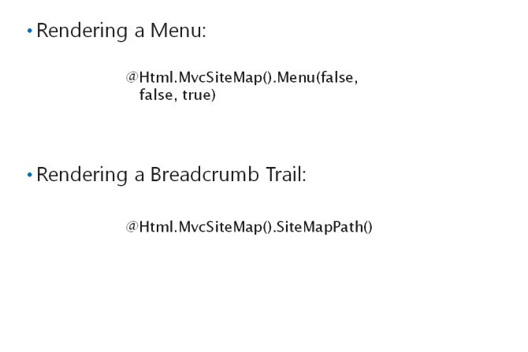

# Module 07 <br> Structuring ASP.NET MVC 5 Web Applications

#### Contents:

[Module Overview](07-0.md)    
[**Lesson 1:** Analyzing Information Architecture](07-1.md)    
[**Lesson 2:** Configuring Routes](07-2.md)    
[**Lesson 3:** Creating a Navigation Structure](07-3.md)

## Lesson 3 <br> **Creating aNavigation Structure**

A navigation structure is a logical hierarchy of webpages, which enables users to browse to the information that interests them. In simple web applications, the design of the navigation structure is also usually simple. As your web application grows, it becomes difficult to present menus and navigation controls that show the users clearly what their next click should be, at every step. You need to understand how to build menus, which help users understand where they are in your site and where to go next. You can do this by building menus and breadcrumb controls.

### Lesson Objectives

After completing this lesson, you will be able to:

- Describe the importance of well-designed navigation.

- Build clear menus in a web application.

- Add breadcrumb controls to a web application.

- Build site navigation in a web application.

### The Importance of Well-Designed Navigation


The information architecture you design for your web application is a logical hierarchy of objects. This hierarchy should be clear and understandable to the audience of your web application. If your web application is designed for people with specialist knowledge, you can implement information architecture that requires specialist knowledge. For example, in an engineering web application, you could base your information architecture on specialist technologies and solutions that engineers understand. However, such information architecture would not be helpful to the general public.

After designing the information architecture, you must present it in your web application. You can add routes to ensure that URLs reflect your information architecture. Similarly, you must add navigation controls to present the information architecture in the body of each webpage. The navigation controls you build are the primary means by which users browse your web application and locate content. You should ensure two things with these navigation controls:

- _An obvious next step_. You should ensure that users can easily decide what link to click, on each page. To achieve this aim, you can consider use cases. For each use case, you can list what the user knows when they arrive at your web application. The user should be able to choose the right link without any specialist or technical knowledge. For example, avoid basing your links on any kind of technical jargon, unless you know that your audience understands it.

- _A clear context_. In a simple web application with only one or two levels in the information architecture, users can easily keep track of where they are. In larger web applications with many levels, you must provide navigation controls, which show users where they are and how to navigate back up the hierarchy. Tree views and breadcrumb controls perform this function well.

**Best Practice:** Base your navigation controls on the information hierarchy, rather than on the model and model classes, database tables, or other technical structures in your web application. Users will probably not understand the model classes, controllers, views, and data storage mechanisms that underlie your web application.

#### **Common Types of Navigation Controls**

Remember that most web application visitors have browsed thousands of Internet applications before they visit your home page. Visitors are usually familiar with common types of menus used on many web applications, and you can make use of this knowledge by using the same types of menus in your web application. Common menu types include the following:

- _Top menus_. Often placed at the top of the page or immediately beneath the application branding, top menus link to the main areas of your web application. In some applications, each item in the top menu has a submenu with links to lower level items and pages.

- _Tree views_. A tree view is a hierarchical menu that can display many items in multiple levels in your web application. By default, a tree view often displays only one or two levels of the information architecture. Users can expand lower levels to find the content they need. Tree views enable users to explore multiple levels on a single page. Tree views can also show clearly the position of the current page, in the hierarchy.

- _Breadcrumb trails_. Often presented as a horizontal sequence of links across the top of a webpage, a breadcrumb trail shows the current page and its parents in all the higher levels of the hierarchy. Breadcrumb trails show the current position of the user, in the context of the web application and enable users to navigate to higher, less specific pages.

- _Footer menus_. The page footer is often not visible when a user arrives on a page. The user must scroll to the end of the page to see the footer. The footer is often used as a location for important, but not business-critical, links. For example, links to copyright and other legal information, links to parent companies, and links to site maps are often placed in the footer menu.

#### **The MVC Site Map Provider**

In ASP.NET, one way to rapidly build information architecture and navigation controls to present that architecture is to use a site map provider. A site map provider is an ASP.NET component that stores the logical hierarchy of your web application. Navigation controls such as top menus, tree views, and breadcrumb trails can take their links from this single hierarchy.

The MVC Site Map Provider is a provider designed to work with MVC controllers and actions. It presents the information architecture that you can configure in a simple XML file. This hierarchy is completely independent of the model, controllers, and actions in your applications, although you can build links to them. The provider also includes HTML helpers, which you can use in views to render menus, tree views, and breadcrumb trails.

**Note:** The MVC Site Map Provider is a component by Maarten Balliauw that is not included in MVC web applications, by default. You can find it in the NuGet package manager by searching for MvcSiteMapProvider.

**Question:** Analysis of web logs has shown that visitors to your web application can navigate to low-level pages in your information architecture, quickly and easily. However, they subsequently find other pages by returning to the home page and navigating the entire hierarchy again from the top, or else they use the search tool. How can you enable users to navigate to higher levels without starting from the home page again?

### Configuring the MVC Site Map Provider


After installing the MVC Site Map Provider from the NuGet package manager, you must configure the provider and set up the logical hierarchy it should present, before you can render any menus.

#### **Configuring the MVC Site Map Provider in Web.Config**

You should configure the MVC Site Map Provider, by adding elements to the Web.config file in the root folder of your MVC web application. When you install the site map provider, the NuGet package adds a **\<siteMap\>** element to the **\<system.web\>** section of this file.

The following code example shows how to configure the site map provider.

**The \<siteMap\> Element in Web.config**

``` XML
<siteMap defaultProvider="MvcSiteMapProvider" enabled="true">    
  <providers>       
  <clear />       
  <add name="MvcSiteMapProvider"           
    type="MvcSiteMapProvider.DefaultSiteMapProvider, MvcSiteMapProvider" 
    siteMapFile="~/Mvc.Sitemap"           
    securityTrimmingEnabled="false"           
    cacheDuration="5"           
    enableLocalization="false"           
    scanAssembliesForSiteMapNodes="false"           
    includeAssembliesForScan=""           
    excludeAssembliesForScan=""           
    attributesToIgnore=""           
    nodeKeyGenerator="MvcSiteMapProvider.DefaultNodeKeyGenerator, MvcSiteMapProvider"           
    controllerTypeResolver="MvcSiteMapProvider.DefaultControllerTypeResolver, MvcSiteMapProvider"           
    actionMethodParameterResolver="MvcSiteMapProvider.DefaultActionMethodParameterResolver,MvcSiteMapProvider"           
    aclModule="MvcSiteMapProvider.DefaultAclModule, MvcSiteMapProvider"
    siteMapNodeUrlResolver="MvcSiteMapProvider.DefaultSiteMapNodeUrlResolver,MvcSiteMapProvider"           siteMapNodeVisibilityProvider="MvcSiteMapProvider.DefaultSiteMapNodeVisibilityProvider, MvcSiteMapProvider"           siteMapProviderEventHandler="MvcSiteMapProvider.DefaultSiteMapProviderEventHandler, MvcSiteMapProvider" />
  </providers>
</siteMap> 
```

Note that you can configure the name of the XML file where the site map is stored, enable security trimming, and configure caching.

**Additional Reading:** For complete details of the configuration values you can use with the MVC Site Map Provider, together with other documentation, go to [http://go.microsoft.com/fwlink/?LinkID=288963&clcid=0x409](http://go.microsoft.com/fwlink/?LinkID=288963&amp;clcid=0x409)

#### **Creating the Site Map File**

The MVC Site Map Provider is the only site map provider that enables you to specify a controller and action for every item in the site map. You do this by completing a site map file. By default, the site map file is named Mvc.sitemap and is stored in the highest level of your web application. The hierarchy consists of nested **\<mvcSiteMapNode\>**elements. This is the hierarchy that the helpers will display in navigation controls.

The following example shows simple information architecture as described in an MVC site map provider site map file.

**An MVC Site Map File**

``` XML
<?xml version="1.0" encoding="utf-8" ?> 
<mvcSiteMap xmlns:xsi="http://www.w3.org/2001/XMLSchema-instance"    
  xmlns="http://mvcsitemap.codeplex.com/schemas/MvcSiteMap-File-3.0"    
  xsi:schemaLocation="http://mvcsitemap.codeplex.com/schemas/MvcSiteMap-File-3.0 MvcSiteMapSchema.xsd"    
  enableLocalization="true">    
  <mvcSiteMapNode title="Home" controller="Home" action="Index">
    <mvcSiteMapNode title="Products" controller="Product" action="Index" key="AllProducts">
      <mvcSiteMapNode title="Bikes" controller="Category" action="Display">
      </mvcSiteMapNode>
    </mvcSiteMapNode>
    <mvcSiteMapNode title="Latest News" controller="Article" action="DisplayLatest" />       
    <mvcSiteMapNode title="About Us" controller="Home" action="About" />     
  </mvcSiteMapNode> 
</mvcSiteMap
```

**Question:** You use the MVC Site Map Provider. Your boss notices that an incorrect link appears in the highest menu and the tree view on every page in your web application. Your boss asks you to fix every page in the web application. What steps should you take?

### Adding Menu Controls



After configuring the site map provider and creating a site map file, you can add menus, tree views, and other navigation controls to your views. The MVC site map provider includes some HTML helpers to make this easy.

The following example code shows how to render a main menu in an MVC view, by using the **HTML.MvcSiteMap()** helper.

**Rendering a Menu Control**

``` Razor
@Html.MvcSiteMap().Menu(false, false, true) 
```

In this example, the first parameter specifies that the menu does not start from the current node. The menu starts from the top-level node, which is usually the home page of the web application. The second parameter specifies that the starting node does not display as a child node at the same level as second- level nodes. The third parameter specifies that the starting node displays in the menu.

You can also use the **Html.MvcSiteMap()** helper to render a breadcrumb control, as displayed in the following code.

**Rendering a Breadcrumb Trail**

``` Razor
@Html.MvcSiteMap().SiteMapPath()
```

The **Html.MvcSiteMap()** helper also includes functions that you can use to render node titles and complete site maps.

**Additional Reading:**

For complete reference documentation that details the **Html.MvcSiteMap()** helper and its functions, go to [http://go.microsoft.com/fwlink/?LinkID=288964&clcid=0x409](http://go.microsoft.com/fwlink/?LinkID=288964&amp;clcid=0x409)

**Question**: What are some of the benefits of using the **Html.MvcSiteMap()** helper?

