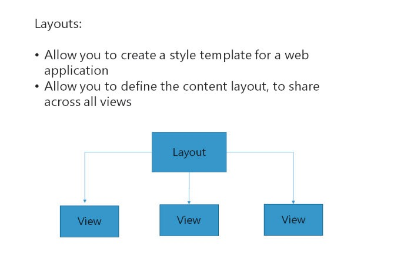
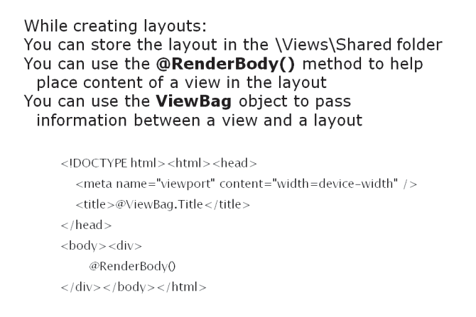

# Module 08 <br> Applying Styles to ASP.NET MVC 5 Web Applications

#### Contents:

[Module Overview](08-0.md)   
[**Lesson 1:** Using Layouts](08-1.md)   
[**Lesson 2:** Applying CSS Styles to an MVC Application](08-2.md)   
[**Lesson 3:** Creating an Adaptive User Interface](08-3.md)   

## Lesson 1 <br>**Using Layouts**

You need to build multiple views to support the operations of the application, such as creating an order and querying order history. However, several maintenance issues arise while changing the common part of the application layout, because of which you need to update each view. To resolve these maintenance issues, you can build a common module or a shared view. A shared view that helps to store the application logic is called a layout. ASP.NET MVC 5 includes features that help simplify the process of creating and using layouts. You can further simplify the application management process by using the \_ViewStart file, to apply the layout to each view, instead of individually editing each view.

### Lesson Objectives

After completing this lesson, you will be able to:

- Describe layouts.

- Describe how to use layouts.

- Describe the _ViewStart file.

### What Are Layouts?



The ASP.NET MVC 5 Razor engine includes a feature called layouts. Layouts are also called template views. Layouts enable you to define a common style template, and then apply it to all the views in a web application. The functionality of layouts is similar to that of the master page in a traditional ASP.NET web application. You can use layouts to define the content layout or logic thatis shared across views.

You can define multiple layouts in an ASP.NET MVC 5 application, and each layout can have multiple sections. You can define these sections anywhere in the layout file, even in the **\<head\>** section of the HTML. Sections enable you to output dynamic content to multiple, non-contiguous, regions of the final response.

**Question**: What are some common scenarios when you would use layouts?

#### Creating a Layout

While creating layouts, you need to store the layout files in the \\Views\\Shared folder of the project. The \\Views\\Shared folder is the default location, where you can store common view files or templates.

The following example illustrates a layout.

**A Layout View**

``` Razor
<!DOCTYPE html>
<html>
<head>
    <meta name="viewport" content="width=device-width" />
    <title>@ViewBag.Title</title>
</head>
<body>
    <div>
        @RenderBody()
    </div>
</body>
</html>
```

In the preceding example, the **@RenderBody()** method indicates to the rendering engine where the content of the view goes.

**ViewBag** is an object that the layout and view shares. You can use the **ViewBag** object to pass information between a view and a layout. To pass information, you need to add a property to the **ViewBag** object, in the ViewPage of the ViewController or View file, and use the same property in the layout file. Properties help you control the content in the layout, to dynamically render webpages from the code in the view file. For example, consider that the template uses the **ViewBag.Title** property to render the **\<title\>** content in the view. This property helps define the **Title** property of the **ViewBag** object in the view and retrieve the property in the layout. This retrieval is possible because the code in the view file runs before the layout runs.

The following example illustrates a layout that contains a section.

**Using Sections in Layouts**

``` Razor
<!DOCTYPE html>
<html>
<head>
    <meta name="viewport" content="width=device-width" />
    <title>@ViewBag.Title</title>
</head>
<body>
    <div id="menu">
        @RenderSection("MenuBar",required:false)
    </div>
    <div>
        @RenderBody()
    </div>
</body>
</html>
```

The **MenuBar** parameter in the **RenderSection()** helper method specifies the name of the section that you want to render in the layout. The **required** parameter is optional; it allows you to determine if the section you render is required. Consider that a section is required, and you do not implement the section in the layout file. In this case, ASP.NET MVC 5.0 displays the **Section not defined** exception at runtime.

Implementing sections in a layout file makes it easier to track content errors. If a section is not required, you can choose to not include it in the layout.

**Additional Reading:** For more information about layouts and sections, you can see: [http://go.microsoft.com/fwlink/?LinkID=288965&clcid=0x409](http://go.microsoft.com/fwlink/?LinkID=288965&amp;clcid=0x409)

**Question**: Why do you have multiple sections in a layout?

### Linking Views and Layouts



After defining the layout, you should link the layout to the view files. You should first remove the content that is not required anymore in the view. Then, you need to create the link between the view and the layout, so that the content removed from the view is not reflected in the layout.

To link a layout to a view, you need to add the **Layout** directive at the top of the view file. The following code shows how to add a layout in a view file.

**Linking to a View**

``` Razor
@{
    ViewBag.Title = "Details";
    Layout = "~/Views/Shared/SiteLayout.cshtml";
}
<h2>Details</h2>
```

You can use the **ViewBag.Title** property to pass page title information from the view to the layout. You can define other properties along with the **ViewBag** object, such as **\<meta\>** elements in the **\<head\>** section, and enable them to pass information to the layout.

If you have multiple sections in the layout file, you define the content of the sections by using the **@section** directive. The following code illustrates how to use the **@section** directive.

**Using the @section Directive**

``` Razor
@{
    ViewBag.Title = "Details";
    Layout = "~/Views/Shared/SiteLayout.cshtml";
}
<h2>Details</h2>
    @section MenuBar {
<p> this is menu</p>
}
```

In the preceding example, you set the layout file to display sections at the top of each view file. Usually, you have the same layout across the entire web application or section. You can define the layout for an application or section, by using the **\_ViewStart** file. During runtime, the code in the **\_ViewStart** file runs before all the other views in the web application. Therefore, you can place all common application logics in the **_ViewStart** file.

To use the **\_ViewStart** file, you need to add the \_ViewStart.cshtml file in the \Views folder of your project. The following code illustrates the contents of the \_ViewStart file.

**The \_ViewStart File**

``` Razor
@{
    Layout = "~/Views/Shared/SiteLayout.cshtml";
}
```

**Question**: When should you use the **\_Viewstart** file?

