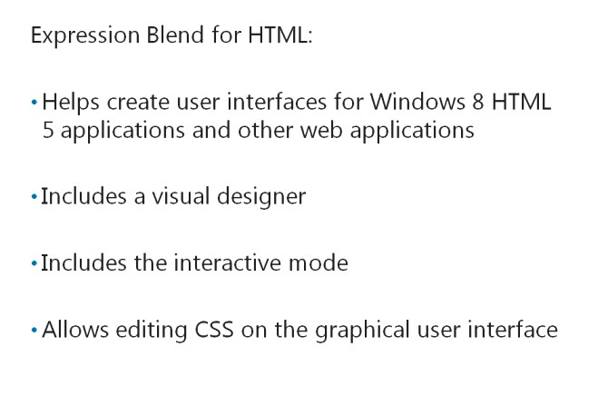
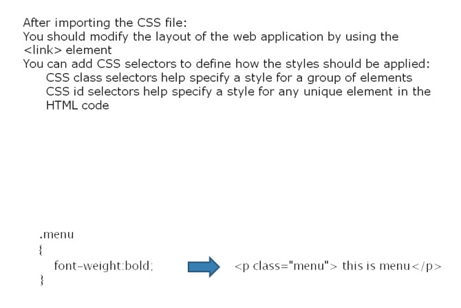

# Module 08 <br> Applying Styles to ASP.NET MVC 5 Web Applications

#### Contents:

[Module Overview](08-0.md)   
[**Lesson 1:** Using Layouts](08-1.md)   
[**Lesson 2:** Applying CSS Styles to an MVC Application](08-2.md)   
[**Lesson 3:** Creating an Adaptive User Interface](08-3.md)   

## Lesson 2 <br> **Applying CSS Styles to an MVC Application**

Cascading Style Sheets (CSS) is an industry standard for applying styles to HTML pages. Different methods of applying CSS to a webpage are available. These methods include external CSS file, inline CSS, and CSS code block in HTML. Developers usually use an external CSS file, because this file is shared across multiple pages and it helps apply a consistent style across the application. You need to know how to import styles into a web application, to ensure consistency in the appearance of the application. You also need to know how to use Expression Blend to create rich and interactive user interfaces.

### Lesson Objectives

After completing this lesson, you will be able to:

- Describe the user experience that can be accomplished by using Expression Blend.

- Import styles into an ASP.NET MVC 5 web application.

- Apply a consistent look and feel to an MVC 5 web application.

### Overview of User Interface Design with Expression Blend



Expression Blend is a visual authoring tool that helps developers and designers to create user interfaces for Windows 8 HTML5 applications and other web applications. Expression Blend for HTML includes a visual designer, which serves as a good complement to Visual Studio. Visual Studio is developer-centric, whereas Expression Blend for HTML is designer-centric. The functions in Expression Blend facilitate developing HTML styles and CSS.

Expression Blend for HTML includes the interactive mode that enables developers to visualize the result of the design, HTML, CSS, and JavaScript, by displaying results on the screen while they edit the code. Expression Blend for HTML also includes CSS tools that enable you to generate and edit CSS styles on the graphical user interface.

**Question**: What are the key benefits of using Expression Blend for HTML to edit CSS?

### Importing Styles into an MVC Web Application



After creating CSS styles, you should import these styles into the web application. After importing the CSS file into the web application, you need to modify the layout of the web application, so that you can use the CSS styles that you imported. You can modify the layout of a web application, by using the **\<link\>** element.

The following example shows how to use the **\<link\>** element.

**Linking to a Style Sheet**

``` Razor
<!DOCTYPE html>
<html>
<head>
    <meta name="viewport" content="width=device-width" />
    <title>@ViewBag.Title</title>
    <link href="~/Views/Shared/StyleSheet1.css" rel="stylesheet" type="text/css" />
</head>
<body>
    <div id="menu">
        @RenderSection("MenuBar",required:false)
    </div>
    <div>
        @RenderBody()
    </div>
</body>
</html>
```

CSS selectors help browsers to determine how the CSS styles should be applied. You can use various selectors, such as class and id selectors, to apply styles to HTML elements.

#### **CSS class Selector**

You can define a CSS class selector to specify a style for a group of elements. To apply the class selector to an HTML element, you need to add the **class** attribute to the HTML element. You can use the **.\<class\>** syntax to add the style in the CSS file.

The following example shows how to add the class selector in a view.

**Using a Class**

``` Razor
@{
    ViewBag.Title = "Details";
    Layout = "~/Views/Shared/SiteLayout.cshtml";
}
<h2>Details</h2>
@section MenuBar {
    <p class=”menu”> this is menu</p>
}
```

The following CSS snippet shows how to create the class selector.

**Applying a Style to a Class**

``` css
.menu
{
    font-weight:bold;
}
```

#### **CSS id Selector**

You can use the CSS id selector to specify a style for any unique element in your HTML code. To apply the id selector to an HTML element, you need to add the **id** attribute and a unique name to the HTML element. You can use the **#\<id\>**syntax to add the style in the CSS file.

The following example shows how to use the id attribute in a view.

**Using The id Selector**

``` Razor
@{
    ViewBag.Title = "Details";
    Layout = "~/Views/Shared/SiteLayout.cshtml";
}
<h2>Details</h2>
@section MenuBar {
    <p id="leftmenu"> this is menu</p>
}
```

The following CSS snippet shows how to create the CSS id selector.

**Creating an ID Style**

``` css
#leftmenu
{
    font-size:16px;
}
```

**Question**: What are some common scenarios when you would use the class selector? What are some common scenarios when you would use the id selector?

