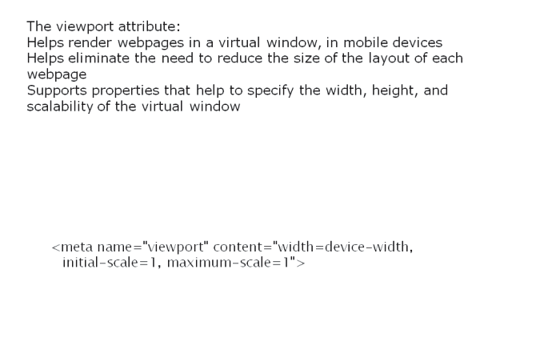
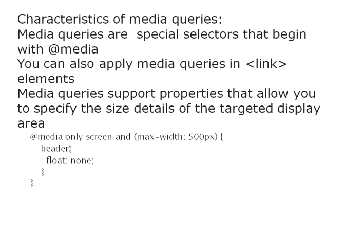
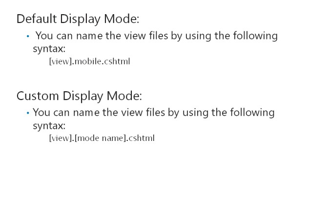
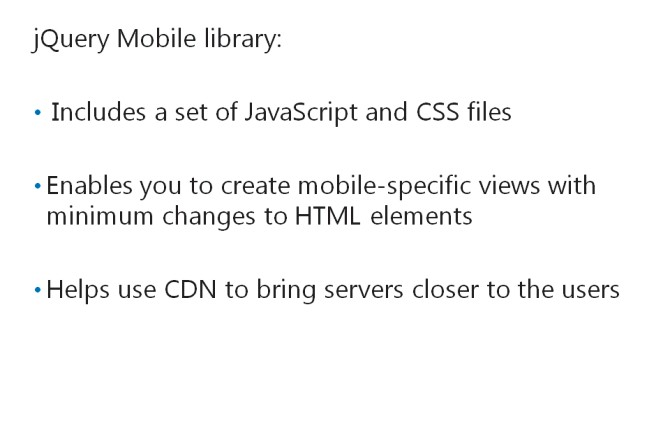

# Module 08 <br> Applying Styles to ASP.NET MVC 5 Web Applications

#### Contents:

[Module Overview](08-0.md)   
[**Lesson 1:** Using Layouts](08-1.md)   
[**Lesson 2:** Applying CSS Styles to an MVC Application](08-2.md)   
[**Lesson 3:** Creating an Adaptive User Interface](08-3.md)   

## Lesson 3 <br> **Creating an Adaptive UserInterface**

ASP.NET MVC 5 applications facilitate adaptive user interface to render content on different devices. Adaptive user interface is a type of user interface that renders content based on the capability of the target web browser or device. You need to ensure that your application supports mobile devices, so that it reaches all types of audience. You also need to know how to use media queries, mobile-specific views, and jQuery Mobile to ensure that your application is effective on mobile devices.

### Lesson Objectives

After completing this lesson, you will be able to:

- Describe the HTML5 **viewport**attribute.

- Explain how CSS media queries apply specific CSS based on the capabilities of the browser.

- Explain how you can use MVC 5 templates to render views based on mobile device screen size.

- Describe the use of jQuery Mobile for building user interfaces that work on a wide variety of mobile devices.

- Use NuGet to add jQuery Mobile to your projects.

### The HTML5 Viewport Attribute



Adaptive rendering allows you to customize your web application to display differently, based on the capabilities of the web browser or device.

**Additional Reading:** For more information about adaptive rendering techniques, go to: [http://go.microsoft.com/fwlink/?LinkID=288966&c](http://go.microsoft.com/fwlink/?LinkID=288966&amp;c) lcid=0x409

Mobile browsers such as Internet Explorer use the **viewport** attribute to render webpages in a virtual window. This virtual window is usually wider than the application screen. The **viewport** attribute helps eliminate the need to reduce the size of layout of each page. Reducing the size of the layout can break or distort the display of non-mobile-optimized web applications. Creating the application interface by using the **viewport** attribute enables users to zoom into the different areas of a webpage.

**Additional Reading:** For more information about the **viewport**attribute, visit: [http://go.microsoft.com/fwlink/?LinkID=288967&clcid=0x409](http://go.microsoft.com/fwlink/?LinkID=288967&amp;clcid=0x409)

The **viewport** tag is a meta tag that helps to control the width and height of webpages, while it renders to web browsers.

The following example illustrates how to use the **viewport** tag.

**Using the Viewport Tag**

``` html
<meta name="viewport" content="width=device-width, initial-scale=1, maximum-scale=1">
```

The **width** and **height** properties help to specify the width and height of the virtual viewport window. You can specify the width in pixels. You can use the keyword **device-width** to enable the content to fit the native screen size of the browser.

The**initial-scale** property controls the initial scale or zoom level of the webpage. The **maximum-scale**, **minimum-scale**, and **user-scalable** properties control the other scalability features of the webpage.

**Question**: How can you control the size of the virtual viewport window?

### CSS Media Queries



You may sometimes need to apply different CSS styles in your application, to support different browsers. HTML5 includes CSS media queries, which are special selectors that begin with **@media**. Media queries allow conditional application of CSS styles, based on the device conditions or browser capabilities. You can apply media queries in CSS and HTML.

The following example illustrates a media query in CSS.

**Using a Media Query**

``` css
@media only screen and (max-width: 500px) {
    header{
        float: none;
    }
}
```

You can also apply a media query in the **\<link\>** element. The following example illustrates how to include a media query in a **\<link\>** element.

**Using a Media Query in the Link Element**

``` css
<link rel="stylesheet" type="text/css" href="smallscreen.css" media="only screen and (max-width: 500px)" />
```

You can use CSS media queries to apply CSS styles when the screen size is less than 500 pixels. However, you can use CSS media queries only for the screen layout, but not the print layout.

**Additional Reading:** For more information about media queries, visit [http://go.microsoft.com/fwlink/?LinkID=288968&clcid=0x409](http://go.microsoft.com/fwlink/?LinkID=288968&amp;clcid=0x409)

The following table describes all properties that you can include in a media query.

|Property |Description|
|---|---|
|**width** |The width of the targeted display area, which includes the browser window in desktop and mobile devices. In desktop computers, when you resize the browser window, the width of the browser changes. However, on most mobile browsers, you cannot resize the browser window. This implies that the width of the browser remains constant.|
|**height** |The height of the targeted display area, which includes the browser window in desktop and mobile devices.|
|**device-width** |The width of the entire screen of a device. For a desktop with a screen resolution of 1,024x768, the device-width is usually 1,024 pixels.|
|**device-height** |The height of the entire screen of a device. For a desktop with a screen resolution of 1,024x768, the device-height is usually 768 pixels.|
|**orientation** |The orientation of the device. If the device-width is larger than the deviceheight, the orientation value is set to landscape; otherwise, it is set to portrait.|
|**aspect-ratio** |The ratio of the width and height properties.|
|**device-aspect-ratio** |The ratio of the device-width and device-height properties. The following example illustrates the device-aspect-ratio for a device with a screen resolution of 1,280x720.|
||`@media screen and (device-aspect-ratio: 16/9) { }`|
||`@media screen and (device-aspect-ratio: 1280/720) { }`|
||`@media screen and (device-aspect-ratio: 2560/1440) { }`|
|**color** |The number of bits per color component of the device. If the device is not a color device, the value is zero.|
|**color-index** |The number of entries in the color lookup table, of the output device.|
|**monochrome** |The number of bits per pixel in a monochrome frame buffer. For nonmonochrome devices, this value is zero.|
|**resolution** |The resolution of the output device, or the density of the pixels. The common units for this property include dpi and dpcm.|
|**scan** |The scanning process of TV output devices.|
|**grid** |The property that detects whether the output is in the grid or bitmap format. Grid-based devices return a value of one; all other devices return a value of zero.|

**Question**: Why would you choose to use CSS media queries, instead of using C# code, to define styles for specific browsers?

### MVC 5 Templates and Mobile-Specific Views



ASP.NET MVC 5 includes two new features, mobile display mode and custom display mode, which help you to create webpages for mobile devices and different browsers.

**Additional Reading:** For more information about creating webpages for mobile device browsers, go to [http://go.microsoft.com/fwlink/?LinkID=288966&c](http://go.microsoft.com/fwlink/?LinkID=288966&amp;clcid=0x409)

ASP.NET MVC 5 enables you to override views for mobile devices by using a different set of view files, rather than using a configuration. When ASP.NET MVC 5 receives a request from a mobile browser, it analyses the request for views with the naming convention **[view].mobile.cshtml**. If ASP.NET MVC 5 detects a view with the mentioned naming convention, ASP.NET MVC 5 will serve the request by using the mobile version of the view; otherwise, it returns the request to the standard view.

Consider that your web application includes a layout that is specific to a browser. In this case, you can create browser-specific views for that browser by checking the **UserAgent** string of that browser. The **UserAgent** string helps identify a browser.

**Additional Reading:** For more information about creating browser-specific view, visit [http://go.microsoft.com/fwlink/?LinkID=288969&amp;clcid=0x409](http://go.microsoft.com/fwlink/?LinkID=288969&amp;clcid=0x409)

**Question**: Why would you choose device-specific display modes over CSS media queries?

### jQuery Mobile



The jQuery Mobile library is a mobile version of the jQuery library, which helps to develop applications that run on mobile devices. jQuery helps to add responsive UI elements to a web application. jQuery also enables developers to add interactive content to the mobile version of a web application. The library also helps to ensure that older mobile devices see usable controls. Similar to jQuery, jQuery Mobile library includes a set of JavaScript and CSS files that enable you to build mobile-specific applications, without adjusting the HTML elements.

jQuery mobile includes the following JavaScript and CSS files:

- jquery.mobile.structure-<version>.css

- jquery.mobile.structure-<version>.min.css

- jquery.mobile.theme-<version>.css

- jquery.mobile.theme-<version>.min.css

- jquery.mobile-<version>.css

- jquery.mobile-<version>.js

- jquery.mobile-<version>.min.css

- jquery.mobile-<version>.min.js

- images/ajax-loader.gif

- images/ajax-loader.png

- images/icons-18-black.png

- images/icons-18-white.png

- images/icons-36-black.png

- images/icons-36-white.png

The jQuery.Mobile.MVC NuGet package simplifies the process of adding the jQuery Mobile library to a web application by eliminating the need to manually install the library files. NuGet is a Visual Studio extension that enables users to download packaged content from the Internet and directly install the content into the project. The NuGet package contains the following items:

- The App_Start\BundleMobileConfig.cs file. This file helps to reference the jQuery JavaScript and CSS files.

- jQuery Mobile CSS files

- A ViewSwitcher controller widget

- jQuery Mobile JavaScript files

- A jQuery Mobile-styled layout file

- A view-switcher partial view. This provides a link at the upper-end of each page; this link helps switch from desktop view to mobile view, and vice versa.

- .png and .gif image files

**Additional Reading:** For more information about the NuGet package, visit [http://go.microsoft.com/fwlink/?LinkID=288970&clcid=0x409](http://go.microsoft.com/fwlink/?LinkID=288970&amp;clcid=0x409)

**Note:** You can use the Microsoft Ajax Content Delivery Network (CDN) to attend to users, by using the servers that are located geographically closer to them. CDN helps to improve the performance of the application. After adding the NuGet package to your ASP.NET MVC application, you can change the code in HTML or the view, to reference the jQuery Mobile library that is hosted on Microsoft Ajax CDN.

**Additional Reading:** For more information about jQuery mobile that is hosted on Microsoft CDN, visit [http://go.microsoft.com/fwlink/?LinkID=288971&clcid=0x409](http://go.microsoft.com/fwlink/?LinkID=288971&amp;clcid=0x409)

**Question**: What are the benefits of using Microsoft Ajax CDN?

