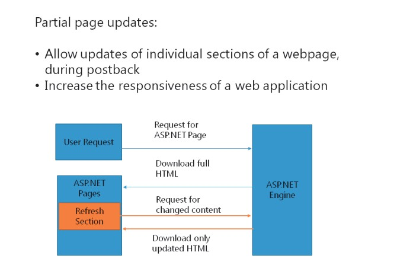
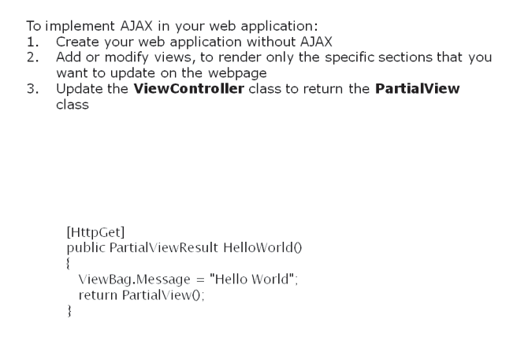
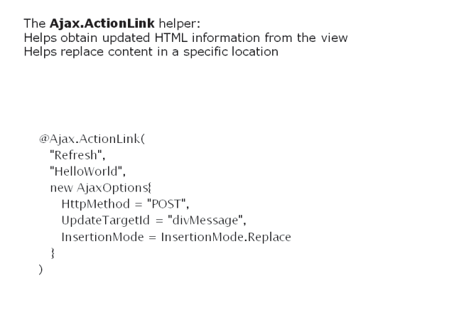

# Module 09 <br> Building Responsive Pages in ASP.NET MVC 5 Web Applications

#### Contents:

[Module Overview](09-0.md)   
[**Lesson 1:** Using AJAX and Partial Page Updates](09-1.md)   
[**Lesson 2:** Implementing a Caching Strategy](09-2.md)   

## Lesson 1 <br> **Using AJAX and Partial Page Updates**

While developing web applications, to update individual sections in the page, you may need to reload the entire webpage. Asynchronous JavaScript and XML (AJAX) in ASP.NET MVC 5 enables partial page updates, to help update sections of a webpage, without reloading the entire page. The **Ajax.ActionLink** helper helps implement partial page updates in your web application.

### Lesson Objectives

After completing this lesson, you will be able to:

- Describe the benefits of using partial page updates.

- Use AJAX in an ASP.NET MVC 5 web application.

- Use the **Ajax.ActionLink** helper.

### Why Use Partial Page Updates?



ASP.NET and MVC facilitate server-side processing. Server-side processing enables HTML rendering to occur at the server side and the server usually generates the HTML. When you update a webpage, any updates or actions performed on the page require a round-trip request to the server. Such constant server requests affect the performance of the application.

The AJAX development model helps reduce the need for refreshing an entire webpage, each time an update of page content is required. AJAX uses JavaScript and XML to obtain information from the client system. AJAX creates webpages based on the XML information downloaded from the server. However, developing web applications by using AJAX is not easy, because it requires using complex technologies, such as JavaScript and XML. Microsoft includes a feature in ASP.NET called partial page updates that functions along with AJAX to reduce the need for refreshing an entire webpage, each time an update occurs.

Partial page updates use AJAX technologies to help update individual sections of a webpage, during postback. Partial page updates:

- Require fewer lines of code.

- Help reduce the data sent to users, each time a webpage update occurs.

- Increase the responsiveness of the web application.

**Question**: How do partial page updates help in improving the responsiveness of a web application?

### Using AJAX in an MVC 5 Web Application



To implement AJAX in your MVC 5 application, you need to create views that render only the updated content, and not the entire webpage. You can initially develop your web application without using AJAX, and then check the application for any functionality errors. This practice helps reduce the time required to troubleshoot the application. This practice also helps separate any application functionality errors from errors that occur while implementing AJAX.

To implement partial page updates, you need to create a view, called a partial view, which includes only the section that you need to update.

For example, consider a view as shown in the following code.

**An Example View**

``` Razor
@{     
    Layout = null; 
} 
<!DOCTYPE html> 
<html> 
<head>     
    <meta name="viewport" content="width=device-width" />  
    <title>Index</title> 
</head> 
<body>     
    <div>         
        <div id="divMessage">@ViewBag.Message</div>          
        @Html.ActionLink("Refresh","HelloWorld")     
    </div> 
</body> 
</html>
```

In the preceding code example, **ActionLink** helps direct users to another view called **HelloWorld**. The following code shows the **HelloWorld** view.

**The Hello World View**

``` Razor
@{     
    Layout = null; 
} 
<!DOCTYPE html> 
<html> 
<head>     
    <meta name="viewport" content="width=device-width" />     
    <title>HelloWorld</title> 
</head> 
<body>     
    <div>         
        @ViewBag.Message     
    </div> 
</body> 
</html> 
```

To implement AJAX in the preceding code example, you need to update the **HelloWorld** view to render only the content that is updated.

Consider another example wherein you want to render only an updated message, on a webpage. The following code shows a view that is updated to render only the changed message.

**A ViewBag Example**

``` Razor
@ViewBag.Message
```

With AJAX, the Javascript retrieves only a specific portion of a webpage, which you want to update, from the server. In the **ViewController** class, you need to update the **View**function to return the **PartialView** class, instead of the entire **View** class.

The following code shows how to update the **View** function to return the **PartialView** class.

**Returning a Partial View in a Controller Action**

``` Razor
public class Default1Controller : Controller     
{         
    //         
    // GET: /Default1/         
    public ActionResult Index()         
    {             
        ViewBag.Message = "Hello";             
        return View();         
    }         
    [HttpGet]         
    public PartialViewResult HelloWorld()         
    {             
        ViewBag.Message = "Hello World";             
        return PartialView();         
    }     
}
```

Optionally, you can add the **HttpGet** or **HttpPost** attributes before the **View** function. These attributes help indicate if the partial page update should be performed over the **HTTP POST** or **HTTP GET** method.

**Question**: What is the mandatory action that you should perform to implement partial page updates in your web application?

### The Ajax.ActionLink Helper



You can use the **Ajax.ActionLink** helper to trigger partial page updates. The **Ajax.ActionLink** helper helps initiate the Javascript, to obtain the updated HTML information from the view and replace or insert the updated HTML information at a specific location.

The following code shows how to use the **Ajax.ActionLink** helper.

**Using the Ajax.ActionLink Helper**

``` Razor
@{     
    Layout = null; 
} 
<!DOCTYPE html> 
<html> 
<head>     
    <meta name="viewport" content="width=device-width" />     
    <title>Index</title>
    <script src="http://ajax.aspnetcdn.com/ajax/jQuery/jquery-1.8.3.js" type="text/javascript"></script>     
    <script src="http://ajax.aspnetcdn.com/ajax/mvc/3.0/jquery.unobtrusive-ajax.min.js"           type="text/javascript"></script> 
</head> 
<body>     
    <div>         
        <div id="divMessage">@ViewBag.Message</div>          
        @Ajax.ActionLink("Refresh","HelloWorld", new AjaxOptions{  
            HttpMethod = "POST", 
            UpdateTargetId = "divMessage", 
            InsertionMode = InsertionMode.Replace 
        })     
        </div> 
    </body> 
</html> 
```

In the preceding example, parameters such as **HttpMethod**and**UpdateTargetId**are included along with the **Ajax.ActionLink** helper, to:

- Obtain the HTML information from the **HelloWorld**view, by using the **HTTP POST** method.

- Replace the content in the **divMessage**HTML element.

While using the **Ajax.ActionLink** helper, you need to include the jQuery and jQuery unobtrusive libraries in the same webpage, because the **Ajax.ActionLink** helper uses scripts from these two libraries.

**Question**: What is the primary function of the **Ajax.ActionLink** helper?

