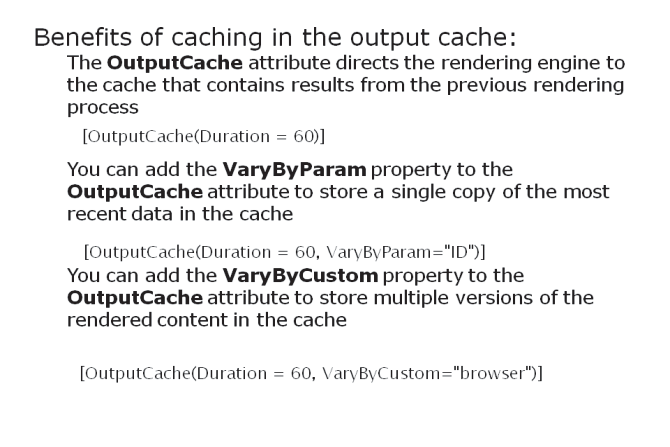
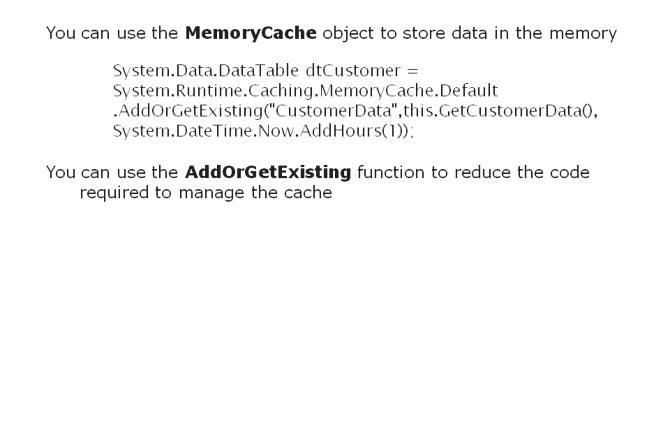
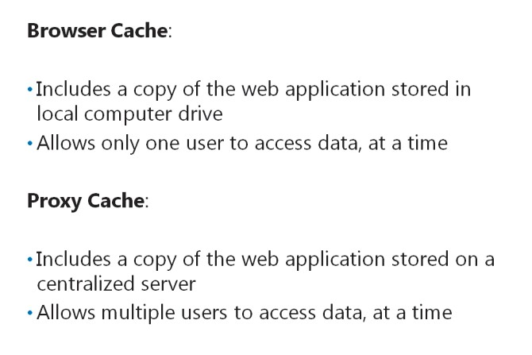
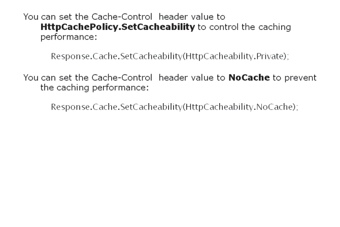

# Module 09 <br> Building Responsive Pages in ASP.NET MVC 5 Web Applications

#### Contents:

[Module Overview](09-0.md)   
[**Lesson 1:** Using AJAX and Partial Page Updates](09-1.md)   
[**Lesson 2:** Implementing a Caching Strategy](09-2.md)   

## Lesson 2 **Implementing a Caching Strategy**

Web applications display information on a webpage by retrieving the information from a database. If the information that should be retrieved from the database is large, the application may take longer to display the information on a webpage. ASP.NET MVC 5 supports some caching techniques to help reduce the time required to process a user request.

Before implementing caching, you should first analyze if caching is relevant to your application, because caching is irrelevant to webpages whose content change frequently. To successfully implement caching in your web application, you need to familiarize yourself with the various types of caches, such as output cache, data cache, and HTTP cache.

### Lesson Objectives

After completing this lesson, you will be able to:

- Describe the benefits of using caching.

- Describe the output cache.

- Describe the data cache.

- Describe the HTTP cache.

- Describe how to prevent caching for webpage content that changes frequently.

- Configure caching.

### Why Use Caching?

Caching involves storing the information that is obtained from a database in the memory of a web server. If the content rendered by a webpage is static in nature, the content can be stored in caches or proxy servers. When a user requests content from a web application, caching ensures that the user receives content from the cache, thereby eliminating the need for repeated real- time processing.

Caching:

- Reduces the need to repeatedly retrieve the same information from the database.

- Reduces the need to reprocess data, if a user places a request multiple times.

- Helps improve the performance of a web application, by reducing the load on servers.

- Helps increase the number of users who can access the server farm.

However, caching does not help web applications that include frequent content changes. This is because, the content rendered from a cache may be outdated, when compared to the current information.

Therefore, you should evaluate the content of your web application and analyze the impact of rendering outdated content, before implementing caching.

**Question**: How does caching help increase the scalability of a web application?

### The Output Cache



Output cache allows ASP.NET engines to store the rendered content of a webpage in the memory of the web server. Therefore, when a user requests a specific page multiple times, the content is retrieved from the cache, thereby avoiding the execution of programming code in the server.

Output cache is a good complement to AJAX partial page updates. Output cache and partial page updates reduce the workload on the server and increase the number of user requests that a server can handle.

In ASP.NET MVC 5, you can implement output caching, by adding the **OutputCache** attribute to the controller.

The following code shows how to implement output caching.

**Configuring the Output Cache**

``` cs
[OutputCache(Duration = 60)]
public PartialViewResult HelloWorld()
{
    ViewBag.Message = "Hello World";
    return PartialView();
}
```

The **OutputCache** attribute helps direct the rendering engine to the cache that contains results from the previous rendering process. The **Duration** parameter of the **OutputCache** attribute helps control the period of time in seconds for which data should be stored in the cache.

By default, the output cache stores only one copy of the rendered content, for each view. Consider a view with the **QueryString** input parameter that enables content to change based on the variable gathered from the database or a prior request. In this case, you can add the **VaryByParam** property to the **OutputCache** attribute, to store a copy of each unique combination of parameters in the cache.

The following code shows how to add the **VaryByParam** property to the **OutputCache** attribute.

**Caching by Parameter Value**

``` cs
[OutputCache(Duration = 60, VaryByParam="ID")]
public PartialViewResult HelloWorld()
{
    ViewBag.Message = "Hello World";
    return PartialView();
}
```

In the preceding example, observe that the **VaryByParam** property refers to **QueryString**, instead of other MVC parameters. You can also use the **VaryByCustom** property.

The following code shows how to add the **VaryByCustom** property to the **OutputCache** attribute.

**Using VaryByCustom**

``` cs
[OutputCache(Duration = 60, VaryByCustom="browser")]
public PartialViewResult HelloWorld()
{
    ViewBag.Message = "Hello World";
    return PartialView();
}
```

You can add **browser** as the input parameter to the **VaryByCustom** property. The **browser** parameter helps store a copy of the rendered content corresponding to each browser that the application is run on. If you want to control and implement your own logic to determine when a new copy should be stored, you need to override the **GetVaryByCustomString** function in the **Global.asax** file of your project.

**Question**: How does the functioning of a web application that implements the output cache differ from an application that does not implement output cache?

### The Data Cache



Web applications usually depend on the content in a database, to render content on a webpage. Databases sometimes encounter performance issues caused by poorly written queries, which can slow down the performance of database requests resulting in poor webpage performance. You can implement the data cache in your web application to avoid loading data from a database every time a user places a request. The **MemoryCache** class allows you to implement data cache in your web application. Implementing the data cache involves the following actions:

1. Loading information from the database

2. Storing content in the **MemoryCache** object

3. Retrieving data from the **MemoryCache** object

4. Ensuring that content is available in the **MemoryCache**object; otherwise, reloading the content The following code shows how to add the **MemoryCache**object.

**Using the Memory Cache**

```cs
System.Data.DataTable dtCustomer = System.Runtime.Caching.MemoryCache.Default.AddOrGetExisting("CustomerData", this.GetCustomerData(), System.DateTime.Now.AddHours(1));
```

In the preceding example, the following parameters are specified:

- _Key_. The unique identifier of the object that should be stored in the memory cache.

- _Value_. The object that should be stored in the memory cache.

- _AbsoluteExpiration_. The time when the cache should expire.

You can use the **AddOrGetExisting** function, instead of the **Add** function, to enable the application to refresh and retrieve data in one line of code. If the cache contains the relevant data, the **AddOrGetExisting** function retrieves the data from the cache. If the cache does not contain the relevant data, the **AddOrGetExisting** function allows adding the data to the cache, and then rendering the same data on the webpage.

**Question**: What are the benefits of implementing data caching in MVC applications?

### The HTTP Cache



You can implement HTTP caching in the Browser Cache and the Proxy Cache.

#### **The Browser Cache**

Most web browsers store the content downloaded from web servers in their local cache. Storing data in the local cache helps remove the need to repeatedly download content from the server.

Web browsers frequently check content for updates. If the content is updated in the server, web browsers download the content from the server, to attend to user requests. Otherwise, web browsers render content from the local cache.

#### **The Proxy Cache**

The functionality of the proxy cache is similar to the functionality of the browser cache. However, the cache is stored on a centralized server. Users can connect to the Internet or web servers by using this proxy server. Proxy servers store a copy of a web application in a manner similar to a web browser storing a copy of an application in the local drives. Many users can access the cache in a proxy server, while only one user can access the browser cache at a time.

**Question**: What is the difference between HTTP cache and output cache?

### Preventing Caching



Caching can sometimes create issues in web applications, because if an application involves frequent content updates, caching prevents users from viewing these content updates. To resolve caching issues, you can implement an HTTP header called Cache-Control. The Cache-Control header indicates to the web browser how to handle the local cache. All HTTP clients, such as browsers and proxy servers, respond to the instructions provided in the Cache-Control header to determine how to handle the local cache of a web application.

**Additional Reading:** For more information about setting this header, go to: http://go.microsoft.com/fwlink/?LinkID=288972&clcid=0x409

You can use the **HttpCachePolicy.SetCacheability** method to specify the value of the Cache- Control header. The **HttpCachePolicy.SetCacheability** method helps control caching performance.

The following code shows how to use the **HttpCachePolicy.SetCacheability** method.

**Using SetCacheability**

``` cs
Response.Cache.SetCacheability(HttpCacheability.Private);
```

In the preceding example, the **HttpCachePolicy.SetCacheability** method takes the **Private** enumeration value.

To prevent caching in your web application, you should set the Cache-Control header value to **NoCache**. 

The code shows how to exclude the HTTP cache in your web application.

**Preventing Caching**

``` cs
Response.Cache.SetCacheability(HttpCacheability.NoCache);
```

**Question**: What scenarios would require you to prevent caching for a web application?

