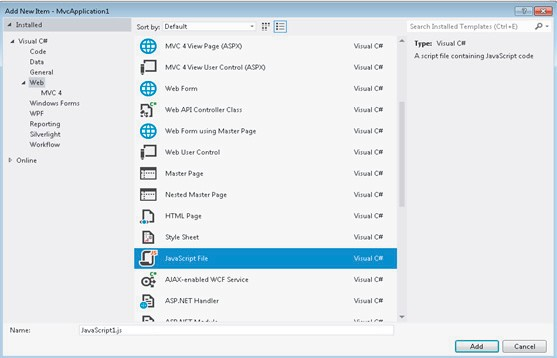
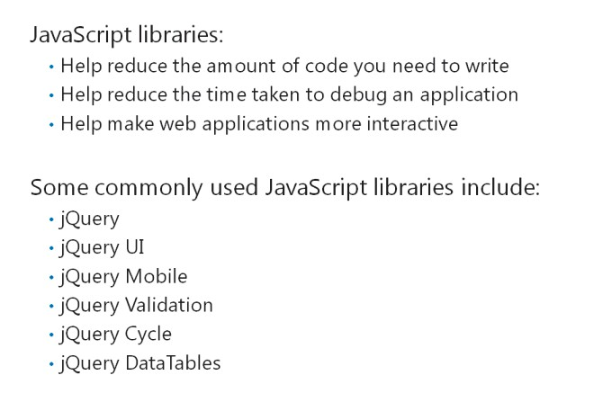
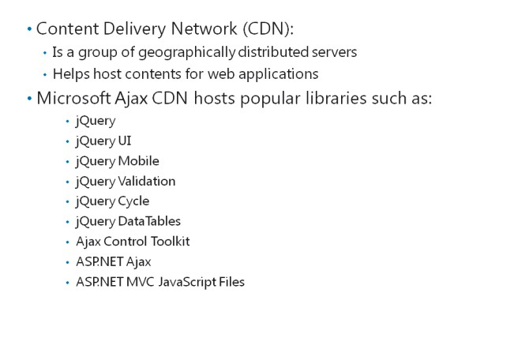
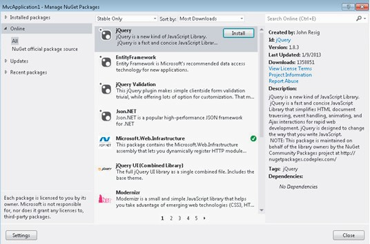

# Module 10 <br> Using JavaScript and jQuery for Responsive MVC 5 Web Applications

#### Contents:

[Module Overview](10-0.md)   
[**Lesson 1:** Rendering and Executing JavaScript Code](10-1.md)   
[**Lesson 2:** Using jQuery and jQueryUI](10-2.md)

## Lesson 1 <br> **Rendering and Executing JavaScript Code**

You can create interactive HTML elements in your web application by using JavaScript. ASP.NET renders these interactive elements on your webpages. You can add packaged JavaScript libraries to your project by using the NuGet tool. You should know how to use AJAX to update the contents of webpages. By using AJAX, you can optimize the performance of your web application. In addition, you should know how the content delivery network (CDN) helps take content geographically closer to users.

### Lesson Objectives

After completing this lesson, you will be able to:

- Describe how to add JavaScript files to an MVC application.

- Describe how to call JavaScript functions in JavaScript libraries.

- Describe how to use JavaScript Libraries in MVC 5 web applications.

- List the benefits of using CDN to improve the performance of JavaScript libraries.

- Describe how to use the NuGet tool to add packages.

- Use the NuGet tool to add a JavaScript Library.

### Adding JavaScript Files


You can add JavaScript code to web applications by:

- Adding the JavaScript code to HTML.

- Defining the JavaScript code in dedicated JavaScript files.

JavaScript code helps add interactive functionalities to the webpages of your application. The following example shows how to add JavaScript to HTML.

**Inserting a JavaScript Function**

``` Html
<body>
    <script type="text/javascript">
        function HelloWorld() {
            alert('Hello World');
        }
    </script>
    <div>
        ...
    </div>
</body>
```

If you have multiple HTML pages in a web application, you need to add JavaScript code for each HTML page. You cannot simultaneously add JavaScript code for multiple HTML pages. Therefore, you can define the JavaScript code in a JavaScript file (.js file). Then, you can reference the JavaScript file in multiple HTML pages. This enables you to maintain a single JavaScript file, to edit the JavaScript code for multiple HTML pages. You can also have multiple JavaScript code files for a single HTML page.

The following image displays the Add New Item dialog box that helps to add a JavaScript file.



**FIGURE 10.1: ADDING A JAVASCRIPT FILE**

The following example shows how to reference the new JavaScript file in HTML pages.

**Referencing JavaScript Files**

``` Html
<script src="~/Scripts/JavaScript1.js" type="text/javascript"></script>
```

You can create the Scripts folder in the root folder of your MVC project, and then save all JavaScript files in the Scripts folder.

**Question**: What are the advantages of using a JavaScript file?

### Calling JavaScript Procedures


You can call functions defined in JavaScript files by using script blocks or event handlers.

The following code shows how to call the **HelloWorld** function from a script block.

**Using a Script Block**

``` Html
<body>
    <script type="text/javascript"> 
        HelloWorld();
    </script>
    <div>
        Hello
    </div>
</body>
```

Before calling a JavaScript function, you need to define the function by using a script block. Then, you must reference the JavaScript file from the HTML pages.

If you want to avoid calling the JavaScript function directly, you can use the **onclick** JavaScript event to trigger JavaScript functions. The **onclick** event initiates the JavaScript function assigned to an HTML file, when you click the corresponding HTML element. JavaScript functions that are attached to document object model (DOM) events are called event handlers.

The following code shows how to add the HelloWorld event handler to the buttons **onclick** event.

**Using an Event Handler**

``` Html
<body>
    <div>
        Hello <input type="button" value="Hello" onclick="HelloWorld();" />
    </div>
</body>
```

**Additional Reading:** For more information about events that are available for HTML elements, go to [http://go.microsoft.com/fwlink/?LinkID=288973&clcid=0x409](http://go.microsoft.com/fwlink/?LinkID=288973&amp;clcid=0x409)

**Question**: What is the advantage of initiating JavaScript functions by using JavaScript events?

### JavaScript Libraries



You can reduce the time taken to develop applications by using JavaScript libraries. JavaScript libraries help to:

- Reduce the amount of code you need to write to add functions.

- Reduce the time the system takes to debug the application.

Some commonly used JavaScript libraries include the following:

- jQuery ([http://go.microsoft.com/fwlink/?LinkID=288974&clcid=0x409](http://go.microsoft.com/fwlink/?LinkID=288974&clcid=0x409))

- jQuery UI ([http://go.microsoft.com/fwlink/?LinkID=288975&clcid=0x410)](http://go.microsoft.com/fwlink/?LinkID=288975&amp;clcid=0x410))

- jQueryMobile ([http://go.microsoft.com/fwlink/?LinkID=288976&clcid=0x411)](http://go.microsoft.com/fwlink/?LinkID=288976&amp;clcid=0x411))

- jQuery Validation ([http://go.microsoft.com/fwlink/?LinkID=288977&clcid=0x412)](http://go.microsoft.com/fwlink/?LinkID=288977&amp;clcid=0x412))

- jQuery Cycle ([http://go.microsoft.com/fwlink/?LinkID=288978&clcid=0x413)](http://go.microsoft.com/fwlink/?LinkID=288978&amp;clcid=0x413))

- jQuery DataTables ([http://go.microsoft.com/fwlink/?LinkID=288979&clcid=0x409)](http://go.microsoft.com/fwlink/?LinkID=288979&amp;clcid=0x409))

- Prototype ([http://go.microsoft.com/fwlink/?LinkID=299651&clcid=0x409)](http://go.microsoft.com/fwlink/?LinkID=299651&amp;clcid=0x409))

- MooTools ([http://go.microsoft.com/fwlink/?LinkID=299652&clcid=0x409)](http://go.microsoft.com/fwlink/?LinkID=299652&amp;clcid=0x409))

You can use JavaScript libraries to make your application more interactive. The functioning of JavaScript codes depends on the version of the library you use. Not all code may work with all versions of a library.

The jQuery library (and its related libraries) has the additional advantage of dealing with the differences in the DOM across different browsers and different browser versions.

**Question**: What is the advantage of using JavaScript libraries?

### Using Content Delivery Networks for JavaScript Libraries



A content delivery network (CDN) is a group of geographically distributed servers used for hosting contents for web applications. In many cases, you can bring web content geographically closer to your applications users by using a CDN to host libraries. This will also improve the scalability and robustness of the delivery of that content.

The amount of content stored in a CDN varies among different web applications. Some applications store all their content on a CDN, while other applications store only some of their content.

Microsoft has a dedicated CDN called Microsoft Ajax CDN that hosts some popular JavaScript libraries, such as:

- jQuery

- jQuery UI

- jQuery Mobile

- jQuery Validation

- jQuery Cycle

- jQuery DataTables

- Ajax Control Toolkit

- ASP.NET Ajax

- ASP.NET MVC JavaScript Files

Note that Microsoft does not own the license of the JavaScript libraries mentioned in the preceding list. Microsoft only hosts the libraries for developers.

You can often reduce the loading time of your web application, by using the JavaScript libraries hosted on Microsoft Ajax CDN. Web browsers can cache these JavaScript libraries on a local system.

The following code shows how to use JavaScript libraries.

**Linking to JavaScript Libraries**

``` Html
<script src="http://ajax.aspnetcdn.com/ajax/jquery/jquery-1.8.0.js" type="text/javascript"></script>
```

**Additional Reading:** For more information about Microsoft AJAX CDN, go to [http://go.microsoft.com/fwlink/?LinkID=293689&clcid=0x409](http://go.microsoft.com/fwlink/?LinkID=293689&clcid=0x409)

**Question**: How can CDN help improve the performance of a web application?

### Using the NuGet Tool to Add Packages


You can use the NuGet package manager to manage JavaScript libraries. You can avoid adding JavaScript libraries manually to your web application by installing the NuGet package manager in your application. This practice helps reduce the need for configuration tasks, while adding JavaScript libraries to an application.

Microsoft Visual Studio 2015 supports installing and using NuGet packages. You can search for NuGet packages in the NuGet store of Microsoft Visual Studio 2015\. Then, you can directly install them into your MVC application.

The following image shows the application page that you can use to manage NuGet packages.



**FIGURE 10.2: MANAGING NUGET PACKAGES**

After you select the NuGet package that you wish to install, click **Install**, to download and install the package into your project.

**Additional Reading:** To search for NuGet packages and analyze the details of each package, go to [http://go.microsoft.com/fwlink/?LinkID=288981&clcid=0x410](http://go.microsoft.com/fwlink/?LinkID=288981&amp;clcid=0x410)

**Question**: Why should you use NuGet packages to add JavaScript libraries to your web application?

