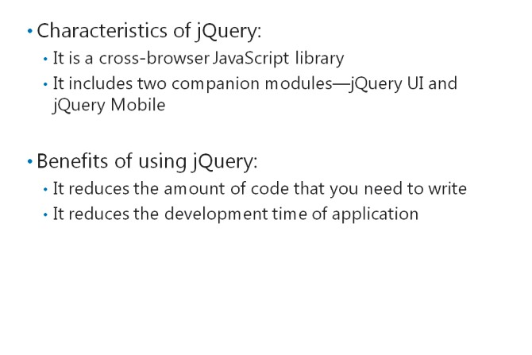
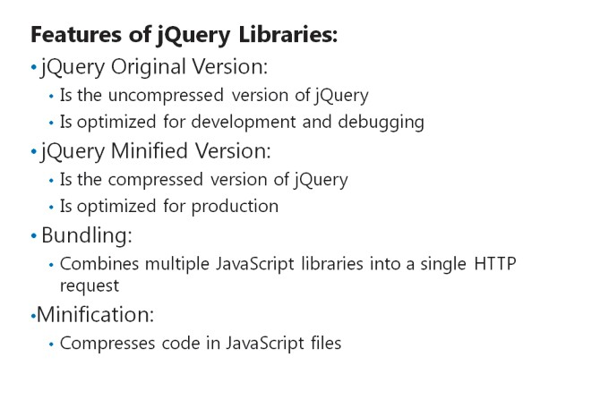
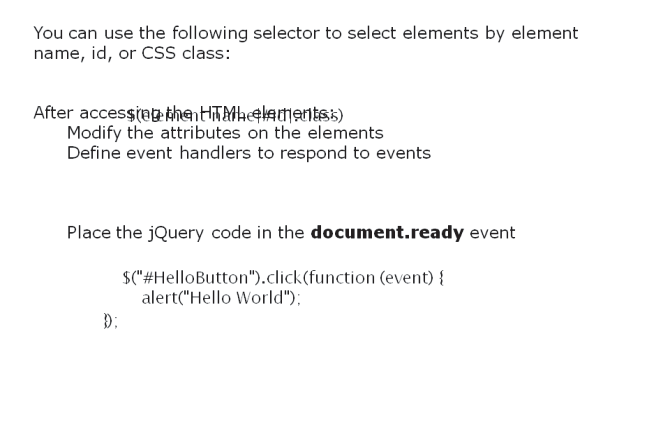
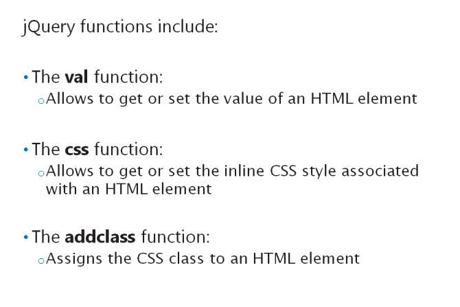
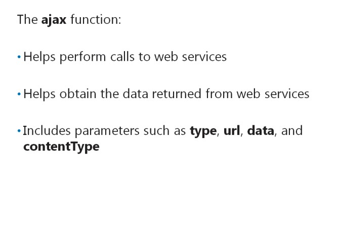
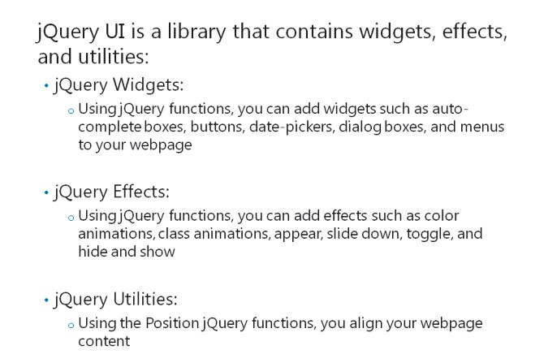

# Module 10 <br> Using JavaScript and jQuery for Responsive MVC 5 Web Applications

#### Contents:

[Module Overview](10-0.md)   
[**Lesson 1:** Rendering and Executing JavaScript Code](10-1.md)   
[**Lesson 2:** Using jQuery and jQueryUI](10-2.md)

## Lesson 2 <br> **Using jQuery and jQueryUI**

jQuery is a JavaScript library that simplifies the adding of JavaScript to HTML pages. jQuery is an open- source software that you can use for free. It helps reduce the amount of code that you need to write, to perform tasks such as accessing and modifying HTML elements on a webpage. You can use the **ajax** function in jQuery to call a web service in your application. You can also use jQuery UI to add interactions, animations, effects, and widgets to your web applications.

### Lesson Objectives

After completing this lesson, you will be able to:

- Describe jQuery.

- Describe how to link web applications to jQuery Libraries for client-side scripting.

- Describe how jQuery helps access the HTML elements of a webpage.

- Describe how to modify elements by using jQuery.

- Describe how to call a web service by using jQuery.

- Describe jQuery UI.

- Add a jQuery UI widget to an MVC 5 web application.

### Introduction to jQuery



jQuery is a JavaScript library that you can use with different browsers. jQuery was first released in 2006\. jQuery helps query the HTML Document Object Model (DOM) and obtain a set of HTML DOM elements. This feature of jQuery helps:

- Reduce the amount of code that you need to write, to perform a task.

- Reduce the development time of HTML applications.

jQuery includes the following features:

- DOM element selections

- DOM traversal and modification

- DOM manipulation, based on CSS selectors

- Events

- Effects and animations

- AJAX

- Extensibility through plug-ins

- Utilities

- Compatibility methods

- Multi-browser support

**Additional Reading:** For more information about jQuery, go to: [http://go.microsoft.com/fwlink/?LinkID=288982&clcid=0x411](http://go.microsoft.com/fwlink/?LinkID=288982&clcid=0x411)

The jQuery family includes the following two companion modules:

- _jQuery UI_. This library adds functions and other supporting elements that help implement a rich interface to HTML-based applications.

- _jQuery mobile_. This library adds functions that optimize the application interface for mobile devices.

**Question**: Why should you use jQuery while developing web applications?

### Linking to jQuery Libraries



jQuery Original Version and jQuery Minified Version provide similar functionalities; however, they optimize web applications for different purposes:

- _jQuery Original Version_ (jQuery-<_version_>.js). This is the uncompressed version of the jQuery library, with files sizes larger than 200 kilobytes (KB).

- _jQuery Minified Version_ (jQuery-<_version_>.min.js). This includes the compressed and gZip versions of jQuery, with file sizes of about 30 KB.

When you develop the production environment, you can use jQuery Minified Version to reduce the loading time of the web application. If you use the minified version while working on the development environment, you cannot access the source code of the JavaScript libraries during the debug operation. Therefore, you can use the original version of jQuery, while creating the development environment.

The following code shows how to reference the jQuery library in your web application. You can add the line of code in the **\<head\>** element of your HTML.

**Referencing jQuery**

``` Html
<script src="http://ajax.aspnetcdn.com/ajax/jquery/jquery-1.8.0.min.js" type="text/javascript"></script>
```

#### **Bundling and Minification**

Bundling is a new feature in ASP.NET 4.5 that you can use in MVC 5 web applications. Bundling helps combine multiple JavaScript libraries into a single HTTP request.

Minification compresses code files before incorporating them in the client application. Bundling and minification help reduce the loading time of web applications by reducing both the number and size of HTTP requests.

To use bundling and minification in your web application, you should perform the following steps:

1. Reference the **Microsoft.AspNet.Web.Optimization**library in your application by using NuGet packages.

2. In the App_Start folder of your project, add the BundleConfig.cs file.

3. In the BundleConfig.cs file, add the following code.

    ``` cs
    public static void RegisterBundles(System.Web.Optimization.BundleCollection bundles)
    {
        bundles.Add(new System.Web.Optimization
            .ScriptBundle("~/bundles/jquery")
            .Include("~/Scripts/jquery-{version}.js", "~/Scripts/JavaScript1.js")
        );
    }
    ```

4. In the **Global.asax Application\_Start** event, add the following code.

    ``` cs
    BundleConfig.RegisterBundles(System.Web.Optimization.BundleTable.Bundles);
    ```

The **ScriptBundle** class enables you to define the bundle that helps combine multiple JavaScript libraries into a single file. You can use a special placeholder, such as **{version}** in the JavaScript path, to help update the version of jQuery libraries. ASP.NET replaces **{version}** with the latest version number of the JavaScript libraries present in the Scripts folder. If the minified version of jQuery is available in the Scripts folder, the MVC 5 engine selects the minified version for bundling. Then, in your View file, you can include the following lines of code to render the bundled JavaScript file.

``` Html
<head>
    @Scripts.Render("~/bundles/jquery")
</head>
```

You should add the following line of code in a page or namespace of the Web.config file in the View folder. This code helps trigger the functioning of **@Scripts.Render**.

``` XML
<add namespace="System.Web.Optimization"/>
```

Based on the compilation setting in the Web.config file, the jQuery library renders minified versions of Javascript. For example, the following code sets the **debug** attribute of the **compilation** element to **false**, which allows jQuery to use the non-minified version of the libraries, making debugging of the libraries easier.

``` XML
<compilation debug="false" />
```

**Question**: What are the benefits of using the minified version of jQuery in the production environment?

### Accessing HTML Elements by Using jQuery



jQuery helps access HTML elements, to create interactive web applications. You use the following selector to select elements by element name, id, or CSS class, while adding jQuery code to access HTML elements.

``` js
$(element name|#id|.class)
```

The following jQuery selector accesses the HTML element with the **HelloButton** ID.

``` js
$(“#HelloButton”)
```

You can use jQuery to access or modify all instances of a specific HTML element, in an HTML page. The following jQuery selector identifies all instances of the **A** element in an HTML page.

``` js
$(“a”)
```

After accessing the HTML elements, you can perform actions on the elements, such as:

- Modifying the attributes on the HTML elements.

- Defining event handlers to respond to events associated with the selected HTML elements. The following example adds an event handler to the click event of the **HelloButton** HTML element.

**Using a jQuery Event Handler**

``` js
$("#HelloButton").click(function (event) {
    alert("Hello World");
});
```

If the jQuery scripts load before the webpage loads, you may encounter errors such as **object not defined**. You can place the jQuery code in the **document.ready** event, to prevent the code from loading until all HTML elements in the page load.

The following code shows how to use the **document.ready** function

**Using the Document Ready Function**

``` js
$(document).ready(function () {
    //Code placed here will not execute before the page is fully loaded.
});
```

The following complete example shows how to access HTML elements by using jQuery.

**A Complete Example**

``` Html
<body>
    <div>
        Hello <input type="button" value="Hello" id="HelloButton" />
    </div>
    <script type="text/javascript">
        $(document).ready(function () {
            $("#HelloButton").click(function (event) {
                alert("Hello World");
            });
        });
    </script>
</body>
```

**Question**: Why should you include the jQuery code in the **document.ready** event?

### Modifying HTML Elements by Using jQuery



You can use jQuery to query HTML DOM and obtain HTML elements. You can use jQuery functions to modify the attributes associated with the HTML elements. The following are some commonly used jQuery functions, which enable you to modify HTML elements:

You can use the **val** function to get or set the value of an HTML element. The following example shows how to use the **val** function to set the value of the HelloButton element to Hello World.

**The val Function**

``` js
$('#HelloButton').val('Hello World');
```

You can use the **css** function to get or set the inline CSS style associated with an HTML element. The following example shows how to use the **css** function to set the background color of an HTML element to blue.

**The css Function**

``` js
$('#HelloButton').css('background-color','blue');
```

You can use the **addclass** function to assign a CSS class to an HTML element. The following example shows how to use the **addclass** function to add the **input_css_class** to an HTML element.

The addclass Function

``` js
$('#HelloButton').addClass('input_css_class');
```

**Additional Reading:** For more information about jQuery functions, go to [http://go.microsoft.com/fwlink/?LinkID=288983&clcid=0x412](http://go.microsoft.com/fwlink/?LinkID=288983&amp;clcid=0x412)

**Question**: If querying HTML DOM returns multiple HTML elements, how will jQuery functions handle these elements?

### Calling a Web Service by Using jQuery



jQuery includes the **ajax** function that helps:

1. Perform asynchronous calls to web services.

2. Retrieve the data returned from web services. The following example illustrates how to use the **ajax** function.

**Using the ajax Function**

``` js
var req= $.ajax({
    type: "POST",
    dataType: "json",
    url: "Customer.asmx/GetCustomerInfo",
    data: "{'ID': '123'}",
    contentType: "application/json; charset=utf-8",
    success: function (msg) {
        alert("Data Saved: " + msg);
    },
    failure: function (msg) {
        alert(msg);
    }
});
```

The **ajax** function uses the parameters **type**, **datatype**, **url**, **data**, **contentType**, **success**, and **failure** to control how to call the web services. These parameters are described as follows:

- _type_. This parameter controls the request type that you should use while querying the web services.

- _dataype_. This parameter defines the data type to be sent for AJAX services.

- _url_. This parameter provides the URL of the web services.

- _data_. This parameter defines the data that you should provide as a parameter to the web services.

- _contentType_. This parameter defines the HTTP content type that you should use, when you submit HTTP requests to web services.

- _success._ This parameter defines the name of the function, which will be triggered when the call completes successfully_._

- _failure._This parameter defines the name of the function, which will be triggered when the call completes with errors.

When calls to the web services complete, jQuery triggers one of two callback functions based on the success of the call.

**Additional Reading:** For more information about the AJAX function, go to [http://go.microsoft.com/fwlink/?LinkID=288984&clcid=0x413](http://go.microsoft.com/fwlink/?LinkID=288984&clcid=0x413)

**Question**: Why should you call web services by using jQuery?

### Introduction to jQueryUI



jQuery simplifies interacting with JavaScript elements, by providing a simple query-based syntax. jQuery UI is a library that includes widgets, animations, and themes that help you to build a rich user interface.

#### **jQuery Widgets**

You can add different types of widgets to your pages by using the following jQuery functions:

- _Accordion_. This function adds accordion containers to your webpage.

- _Autocomplete_. This function adds auto- complete boxes that are based on user input.

- _Button_. This function adds buttons to your webpage.

- _Datepicker_. This function adds date-pickers to your webpage.

- _Dialog_. This function adds dialog boxes to your webpage.

- _Menu_. This function adds a menu to your webpage.

- _Progressbar_. This function adds animated and static progress bars to your webpage.

- _Slider._This function adds sliders to your webpage.

- _Spinner_. This function adds a number spinner to a data entry box.

- _Tabs_. This function adds tabs to your webpage.

- _Tooltip_. This function displays a tooltip for interface elements.

#### **jQuery Effects**

You can add various effects by using the following jQuery functions:

- _Color Animation_. This function animates colors.

- _Toggle Class_, _Add Class_, _Remove Class_, and _Switch Class_. This function adds or removes CSS classes.

- _Effect_. This function adds a variety of effects, such as appear, slide-down, explode, and fade-in.

- _Toggle_. This function toggles any jQuery effect on and off.

- _Hide and Show_. This function displays or hides any jQuery effect.

#### **jQuery Utility**

You can align your webpage content by using the **Position** jQuery utility. This utility helps align an element in relation to the position of another element.

To use jQuery UI:

1. Download the script and supporting files from [http://go.microsoft.com/fwlink/?LinkID=288985&clcid=0x414](http://go.microsoft.com/fwlink/?LinkID=288985&amp;clcid=0x414)

2. Reference the JavaScript libraries in the HTML files. The following line of code shows how to use jQuery UI.

**Linking to jQuery UI**

``` Html
<script src="http://ajax.aspnetcdn.com/ajax/jquery.ui/1.9.2/jquery-ui.min.js" type="text/javascript"></script>
```

**Question**: What is the key difference between jQuery and jQuery UI?