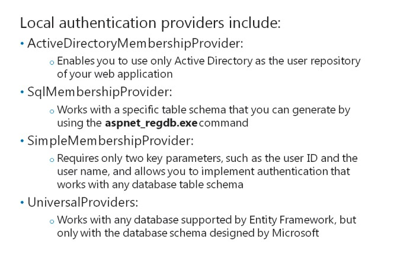
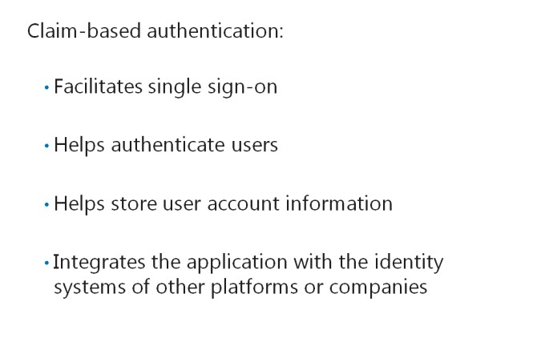
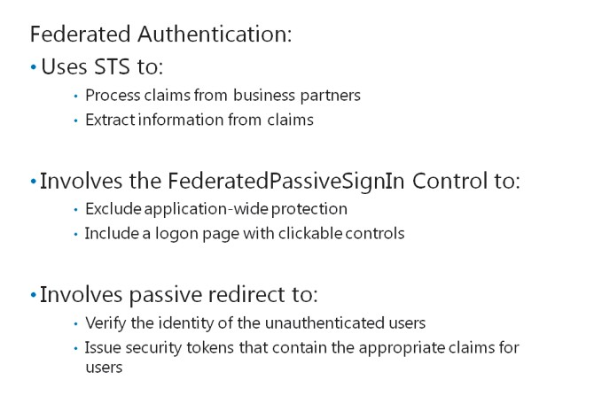
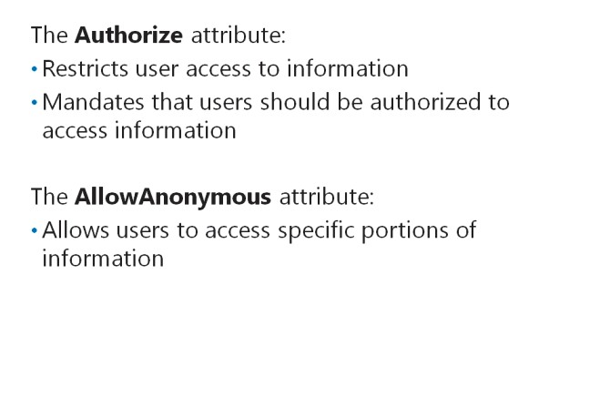

# Module 11 <br> Controlling Access to ASP.NET MVC 5 Web Applications

#### Contents:

[Module Overview](11-0.md)    
[**Lesson 1:** Implementing Authentication and Authorization](11-1.md)    
[**Lesson 2:** Assigning Roles and Membership](11-2.md)

## Lesson 1 <br> **Implementing Authentication and Authorization**

Membership providers, which were introduced in ASP.NET 2.0, help you to create secure authenticationand authorizations systems for web applications. You need to know how to use the membership provider model in ASP.NET 4.5, to change authentication methods with minimum changes to the code. You canuse claim-based authentication and federated authentication to allow external users to authenticate themselves, and access and use the web application. You should know how to configure restrictions in the web application to ensure that users access only specific information that is permitted and relevant tothem.

### Lesson Objectives

After completing this lesson, you will be ableto:

- List the local authentication options available for an ASP.NET 4 webapplication.

- Describe how client-based authentication works.

- Describe how federated authentication works.

- Describe how to restrict access to resources.

- Authorize access to specific users to MVC 5 web application controller actions.

### Local Authentication Providers



Authentication providers include code that runs when ASP.NET needs to authorize a user. Thecode authenticates users by using the information stored in back-end databases, such as Active Directory or Microsoft SQL Server. The membership system in ASP.NET 4.5 includes the following authentication providers: **ActiveDirectoryMembershipProvider**, **SqlMembershipProvider**, **SimpleMembershipProvider**, and **UniversalProviders**. The **SimpleMembershipProvider** and **UniversalProviders** are new authentication providers that support the OAuth authentication mechanism.

The ASP.NET 4.5 membership system allows application developers to switch amongst authentication providers, without modifying the code.

The following is a description of the authentication providers&mdash;**ActiveDirectoryMembershipProvider** and **SqlMembershipProvider**:

- _ActiveDirectoryMembershipProvider_. This provider class is defined in the **System.Web.Security** namespace, and the provider enables you to use Active Directory as the membership and role repository of your web application.

- _SqlMembershipProvider_. This provider class is defined in the **System.Web.Security** namespace. The provider works with a specific table schema that you can generate by using the **aspnet_regdb.exe** command.

**ActiveDirectoryMembershipProvider** and **SqlMembershipProvider** are configured to work only with a specific table schema or directory. To overcome this restriction, Microsoft developed **SimpleMembershipProvider** and **UniversalProviders** to replace **ActiveDirectoryMembershipProvider** and **SqlMembershipProvider**.

- _SimpleMembershipProvider_. This is a new generation of membership providers that works with the SQL Server, SQL Server Compact Edition, Windows Azure SQL Database, and other versions of SQL Server. **SimpleMembershipProvider** requires only three key parameterstable name, user ID, and user name. You use this provider to implement authentication that works with any SQL Server database table schema.

- _UniversalProviders_. This is a set of membership providers that works with any database that Entity Framework supports. However, these providers work only with the database schema designed by Microsoft. While initializing a universal provider, if the schema does not exist in the database, the provider generates the schema.

**Question**: What is the benefit of using **SimpleMembershipProvider**?

Claims-Based Authentication



Claims-based authentication is a model that facilitates single sign-on. Single sign-on isafeature that allows you to receive a claim when you log on to a centralized authentication system. The claim is a ticket that authentication systems use to authenticate user logons. The claimcontains user identity information that helps authentication systems identify users. With claims- based authentication systems, you can focus efforts on developing business functions, rather than worrying about authenticating users.

Claims-based authentication facilitates:

- Authenticating users to access applications.

- Storing user account information and passwords.

- Checking enterprise directories for user information.

- Integrating the application with the identity systems of other platforms orcompanies.

To implement claims-based authentication in your web application, you need to use Windows Identity Foundation (WIF) 4.5\. WIF 4.5.is a set of .NET Framework classes that helps read information from the claims in a web application.

The following steps describe the functioning of claims-based authenticationsystems:

1. When an unauthenticated user requests a webpage, the request is redirected to the Identity Provider (IP) pages.

2. The IP requires you to enter credentials such as the user name and password.

3. After you enter the credentials, the IP issues a token. Then, the token is returned to the web browser.

4. The web browser is redirected to the webpage that you originally requested. WIF determines if the token satisfies the requirements to access the webpage. If the token satisfies all requirements, a cookie is issued to establish a session. This cookie ensures that the authentication process occurs only once. Then, the authentication control is passed on to theapplication.

**Question**: What are the benefits of using claims-based authentication?

Federated Authentication



Federations rely on claims-based authentication to allow external parties such as trusted companies to access their applications.

Federations use the WS-Federations claim standard to enable the exchange of claims between two parties in a standardized manner.

WIF provides support for federations by using the **WSFederationAuthenticationModule** HTTP module. **WSFederationAuthenticationModule** enables you to implement support for federations in your ASP.NET 4.5 application, without implementingindividual logic.

Federated authentication enables Security Token Service (STS) to:

- Process the claims from business partners.

- Extract user information from the claims.

STS enables you to focus more on writing the business logic. It eliminates the need to manage the authentication information of business partners, in your web application.

Configuring the **WSFederationAuthenticationModule** helps specify the STS to which non-authenticated requests should be redirected. WIF provides two methods of federated authentication **FederatedPassiveSignIn** and **Passive Redirect**.

#### **FederatedPassiveSignIn Control**

Consider cases when unauthenticated users try to access protected resources and you want to redirect these users to a logon page. For such cases, you can embed the **FederatedPassiveSignIn** control in the logon page of your web application, to redirect unauthenticated users to the logon page. The **FederatedPassiveSignIn** control is configured with issuer (STS) information.

You can use the **FederatedPassiveSignIn** control to:

- Exclude application-wide protection.

- Include a logon page with clickable controls.

#### **Passive Redirect**

Consider cases when unauthenticated users try to access a protected resource, and you want to redirect these users to an STS without using an application logon page. For such cases, you can use passive redirect.

Passive redirect enables STS to:

- Verify the identity of the unauthenticated users.

- Issue security tokens that contain the appropriate claims for users.

Passive redirect requires you to add **WSFederationAuthenticationModule** in the pipeline of the Hypertext Transfer Protocol (HTTP) modules, to identify unauthenticated user requests and redirectusers to the STS you specify. Adding **WSFederationAuthenticationModule** in the HTTP pipeline processes the claim information before passing the claim to the ASP.NET 4.5engine.

You can instantiate **WSFederationAuthenticationModule** and use it to trigger the sign-on process. This functionality is similar to that of the **FederatedPassiveSignIn** control; however, passive redirect implements this sign-on functionality with minimum codingeffort.

**Question**: What are the benefits of using federated authentication?

### Restricting Access to Resources



You can restrict user access by implementing the **Authorize** attribute in a controller, instead of using the Web.config file as you would use in an ASP.NET WebForms application. The Web.config file requires physical files to exist, for access control to work. You cannot use the Web.config file to restrict user access because MVC applications route requests to actions, not pages.

The following code shows how to add the **Authorize** attribute to your controller class.

**Authorizing Action Methods**

``` cs
[Authorize()]
public ActionResult GetEmployee()
{
    return View();
}
```

Observe the **Authorize** attribute in the code sample. If you specify this attribute, ASP.NET 4.5 mandates that users should be authorized to access the view returned by the codesample.

If you add the **Authorize** attribute at the class level, the attribute requires users to log on before they can access anything in the controller class. To allow anonymous users to access a specific portion of your class, you can use the **AllowAnonymous** attribute.

The following code shows how to use the **AllowAnonymous** attribute.

**Using the AllowAnonymousAttribute**

``` cs
[AllowAnonymous()]
public ActionResult Register()
{
    return View();
}
```

**Question**: Why should you use the **Authorize**attribute, instead of the Web.config file to control authorization of pages in your ASP.NET MVCapplication?

