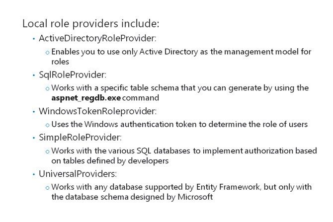
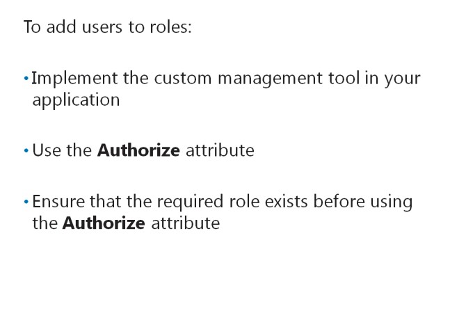
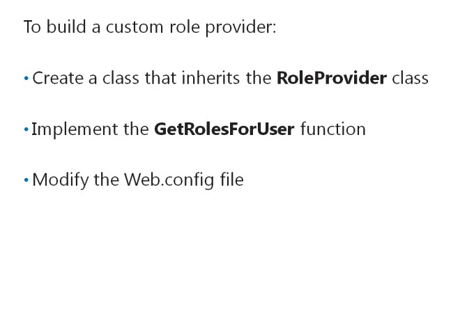
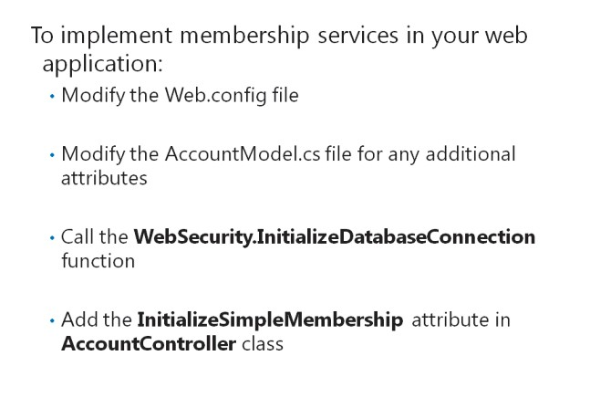
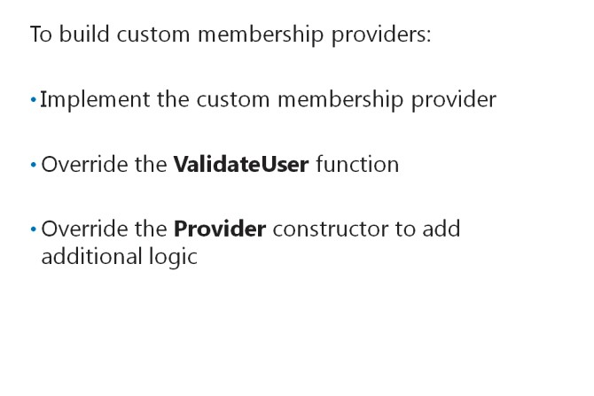

# Module 11 <br> Controlling Access to ASP.NET MVC 5 Web Applications

#### Contents:

[Module Overview](11-0.md)    
[**Lesson 1:** Implementing Authentication and Authorization](11-1.md)    
[**Lesson 2:** Assigning Roles and Membership](11-2.md)

## Lesson 2 <br> **Assigning Roles and Membership**

Roles and memberships complement authentication features, to help you control all modes of access in web applications. To define access levels for different types of users, you need to know how to implement roles and users. ASP.NET 4.5 provides role providers and membership providers to help you assign rolesand users. ASP.NET 4.5 also enables you to create custom role providers and custom membershipproviders. These custom providers allow you to store role and user information in data sources not supported by ASP.NET 4.5, such as a FoxPro or Oracledatabase.

Lesson Objectives

After completing this lesson, you will be ableto:

- Describe role providers in ASP.NET 4.5.

- Describe how to add user accounts toroles.

- Describe how to build custom role providers.

- Describe membership services.

- Describe how to build custom membership providers.

- Add code to an MVC 5 web application to help users reset their password.

### Role Providers in ASP.NET 4.5



Role providers help develop applications by usinga role-based security model. Similar to membership providers, two types of role providers are available in ASP.NET 4.5 **ActiveDirectoryRoleProvider** and **SqlRoleProvider**:

- _ActiveDirectoryRoleProvider_. This provider class is defined in the **System.Web.Security** namespace, and the provider enables you to use Active Directory as the management model for roles.

- _SqlRoleProvider_. This provider class is defined in the **System.Web.Security** namespace. The provider works with only a specific table schema in Microsoft SQL Server. You can generate this schema by using the **aspnet_regdb.exe** command.

- _WindowsTokenRoleProvider_. This provider uses the Windows authentication token to determine the role of users. Then, the provider checks if users belong to any group stored in the Windows authentication token that was generated when they first logged on. The format of the group name is **Domain\Group**.

**ActiveDirectoryRoleProvider** and **SqlRoleProvider** have restrictions such as lack of support for non-SQL databases or developer-defined schema. Therefore, Microsoft developed **SimpleRoleProvider** and **UniversalProviders** to replace **ActiveDirectoryRoleProvider** and **SqlRoleProvider**. The following list describes the **SimpleRoleProvider** and **UniversalProviders**:

- _SimpleRoleProvider_. This is a new generation of role provider that works with SQL Server, SQL Compact Editions, and others versions of SQL Server. **SimpleRoleProvider** enables you to implement authorization based on the table defined by applicationdevelopers.

- _UniversalProviders_. This is a database agnostic version that works with any database that Entity Framework supports. However, the database schema is determined by Microsoft. The provider usually generates tables during initialization.

You can choose a role provider based on the membership provider that you select. You can also mix role providers; for example, you can combine **SimpleMembershipProvider** and **UniversalRoleProvider**.

However, you should avoid mixing role providers because the manner in which each provider identifies users is different.

**Question**: What is the difference between **SimpleRoleProvider** and **SqlRoleProvider**?

### Adding User Accounts to Roles



When you use a database-based role provider, such as **SimpleRoleProvider** or **UniversalRoleProvider**, you can load the initial data onto the database by directly editing the table. You can also edit the table by using the **AddUsersToRoles** function. To use the **AddUsersToRoles** function, you need to implement the custom management tool in your application. The custom management tool helps call the **AddUsersToRoles** function, to add roles to a database.

The following code shows how to use the **AddUsersToRoles** function.

**Using the AddUsersToRoles Function**

``` cs
AddUserToRoles("Peter", new string[] {"Admin","Staff"})
```

You can also use the **AddUsersToRoles** function in business applications to add users to a role. However, you must ensure that the role to which you want to add users exists, before using the **AddUsersToRoles** function. ASP.NET 4.0 and all previous versions of ASP.NET include the Website Administration Tool (WSAT). Unfortunately, WSAT does not work with the **SimpleRoleProvider**.

**Question**: Why should we not use WSAT while using **SimpleRoleProvider**?

### Building a Custom Roles Provider



ASP.NET 4.5 allows you to build custom role providers. Custom role providers enable you to implement role management that uses your own database schema and logic. To build a custom role provider, you need to create a class that inherits the **RoleProvider** class.

The following code shows how to build a custom role provider.

**Creating a Custom Role Provider**

``` cs
public class CustomRoleProvider : RoleProvider
{
}
```

In the **RoleProvider** class, you need to implement the **GetRolesForUser** function. The **GetRolesForUser** function takes the user name as the input and returns a list of roles to which the user belongs. You can write your own code to obtain role information from the database or other back-endstores.

The following code shows how to use the **GetRolesForUser** method.

**Implementing the GetRolesForUser Function**

``` cs
public override string[] GetRolesForUser(string username)
{
    //code to return a list of roles for users
}
```

After implementing the **GetRolesForUser** function, you need to apply the custom role provider to the application by modifying the Web.config file.

The following code shows how to apply the custom role provider to theapplication.

**Configuring a Site to Use a Custom Role Provider**

``` XML
<roleManager defaultProvider="CustomRoleProvider" enabled="true" cacheRolesInCookie="false">
    <providers>
        <clear />
        <add name="CustomRoleProvider" type="CustomRoleProvider" />
    </providers>
</roleManager>
```

**Question**: Why should you create a custom role provider?

### Providing Membership Services



You need to add the **SimpleMembershipProvider** to the membership section of the Web.config file to use it for membership services.

The following code shows how to add **SimpleMembershipProvider** to the Web.config file.

**Configuring the Simple Membership Provider**

``` XML
<membership defaultProvider="SimpleMembershipProvider">
    <providers>
        <clear />
        <add name="SimpleMembershipProvider" type="WebMatrix.WebData.SimpleMembershipProvider, WebMatrix.WebData" />
    </providers>
</membership>
```

Next, you need to create a User table. If you do not have a User table created already, you can modify the AccountModel.cs file, to generate the table. To view the AccountModel.cs file, you should select the Internet Application template, when you create the project.

In the following code sample, the **UserProfile** class from AccountModel.cs has been modified to add an additional property, Country.

**Creating a User Table**

``` cs
[Table("UserProfile")]
public class UserProfile
{
    [Key]
    [DatabaseGeneratedAttribute(DatabaseGeneratedOption.Identity)]
    public int UserId { get; set; }
    public string UserName { get; set; }
    public string Country { get; set; }
}
```

After modifying the AccountModel.cs file, you need to call the **WebSecurity.InitializeDatabaseConnection** function in the App.Start.cs file. The **WebSecurity.InitializeDatabaseConnection** function ensures that **SimpleMembershipProvider** is configured with connection strings to thedatabase.

The following code shows how the membership provider connects to the User table, by usingthe

**DBConn** connection string.

**Connecting to the User Table**

``` cs
WebSecurity.InitializeDatabaseConnection(“DBConn”,”User”,”id”,”Username”,false)
```

If a specific table does not exist in a database, the **autoCreateTables** parameter helps indicate to the membership provider that it may create the table. To initialize **SimpleMembershipProvider**, you need to add the **InitializeSimpleMembership** attribute to the **AccountController** class.

The following code shows how to add the **InitializeSimpleMembership** attribute to the **AccountController** class.

**Addingthe InitializeSimpleMembership Attribute**

``` cs
[Authorize]
[InitializeSimpleMembership]
public class AccountController : Controller
{
}
```

**Question**: Why should we use the **InitializeDatabaseConnection** method?

### Building a Custom Membership Provider



If you need to add functionality to a membership provider, such as custom logic for authentication, you need to implement a custom membership provider.

The following code shows how to implement a custom membership provider.

**A Custom Membership Provider**

``` cs
public class CustomMembershipProvider :
SimpleMembershipProvider
{
}
```

After implementing the custom membership provider, you override the **ValidateUser** method defined in **SimpleMembershipProvider**. The following code shows how to override the **ValidateUser** method defined in **SimpleMembershipProvider**.

**Overriding the ValidateUser Method**

``` cs
public override bool ValidateUser(string username, string password)
{
}
```

In the preceding code sample, the **ValidateUser** method validates the user name and password against the membership store.

Perhaps, you want to add logic to get the decryption key for passwords. To add this logic, you can override the **Provider** constructor, when the custom membership provider is initializing. Overriding the **Provider** constructor initializes the encryption engine.

**Overriding the Provider Constructor**

``` cs
public CustomAdminMembershipProvider(SimpleSecurityContext simpleSecurityContext)
{
}
```

After adding logic to the custom membership provider, you need to modify the Web.config file to apply the custom provider class to theapplication.

**Adding a Custom Provider to Web.config**

``` XML
<membership defaultProvider="CustomMemberProvider">
    <providers>
        <clear/>
        <add name="CustomMemberProvider" type=" CustomAdminMembershipProvider " />
    </providers>
</membership>
```

**Question**: Why should you implement a custom membership provider?

