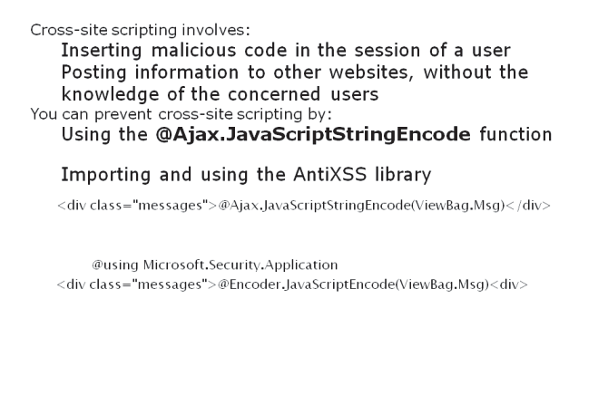
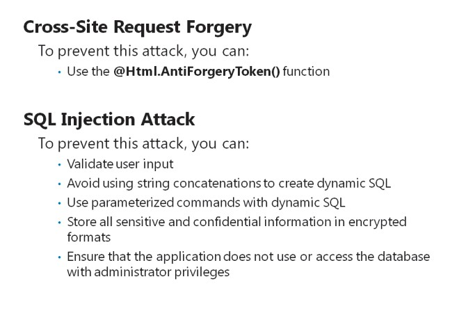
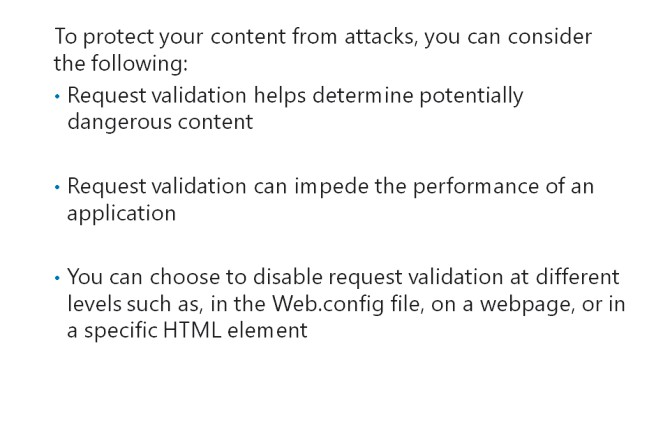
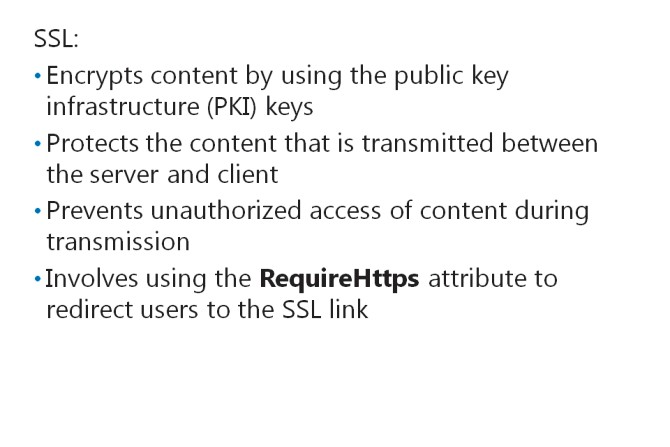

# Module 12 <br> Building a Resilient ASP.NET MVC 5 Web Application

Contents:

[Module Overview](12-0.md)    
[**Lesson 1:** Developing Secure Sites](12-1.md)    
[**Lesson 2:** State Management](12-2.md)

## Lesson 1 <br> **Developing Secure Sites**

Web applications are often subject to security attacks. These attacks prevent the applications from functioning properly, and the attackers try to access sensitive information stored in the underlying data store. ASP.NET provides built-in protection mechanisms that help prevent such attacks. However, such mechanisms also tend to affect the operation of your applications. You should know when to enable or disable the protection mechanisms to avoid any impact on the functionalities of your application. You also need to know how to use Secure Sockets Layer (SSL) to prevent unauthorized access to information during information transmission.

### Lesson Objectives

After completing this lesson, you will be able to:

- Describe how to avoid malicious attacks that use cross-site scripting.

- Describe the common attack techniques used by malicious users.

- Describe how to disable attack protection in your MVC application.

- Decide whether to disable attack protection in various scenarios.

- Describe the role of Secure Sockets Layer in helping secure web applications.

### Cross-Site Scripting



Cross-site scripting involves the malicious insertion of scripts in a user session. Cross-site scripting poses information to other websites, by using the authentication information of users, without their knowledge. For example, consider the code inserted into a web application to maliciously post messages on social networking websites, without the knowledge of the users.

When a script is inserted into a web application, the script has full access to the Document Object Model (DOM) of the HTML. This access allows the attacker to create fake input boxes in the application, create fake users, and post fake information on the web application.

The cross-site scripting attack usually takes input from improperly escaped output. These scripting attacks usually impact query strings. For example, consider the following URL:

[http://localhost/Default1/?msg=Hello](http://localhost/Default1/?msg=Hello)

The following code shows how to access the msg querystring parameter from a controller action.

**Accessing a Query String Parameter**

``` cs
public ActionResult Index(string msg)
{
    ViewBag.Msg = msg;
    return View();
}
```

The following code shows how to display the value of the querystring parameter in a view.

**Displaying the Query String Parameter**

``` Razor
<div class="messages">@ViewBag.Msg<div>
```

After running the preceding code samples, the application should display the resultant word, **Hello**. Now, consider a scenario where the query string parameter **msg** is changed to a less benign value resulting in the following URL:

[http://localhost/Default1/?msg=\<script\>alert('pwnd')\</script\>](http://localhost/Default1/?msg=<script>alert('pwnd')</script>)

As a result, the script block included in the query string is displayed to users. In such cases, attackers can inject malicious code into your app by using the value of a query string parameter.

ASP.NET includes request validation, to help protect the input values that are subject to cross-site scripting attacks. However, attackers can bypass this mechanism by using encoding to subvert common cross-site scripting filters. For example, here is the same query string, this time encoded:

[http://localhost/Default1/?msg=Jon\x3cscript\x3e%20alert(\x27pwnd\x27)%20\x3c/script\x3e](http://localhost/Default1/?msg=Jon\x3cscript\x3e%20alert(\x27pwnd\x27)%20\x3c/script\x3e)

You can modify the view class to use the **@Ajax.JavaScriptStringEncode** function to help prevent cross- site scripting attacks, instead of directly using the input from query strings. The following line of code shows how to use the **@Ajax.JavaScriptStringEncode** function.

**Using the JavaScriptStringEncodeFunction**

``` cs
<div class="messages">@Ajax.JavaScriptStringEncode(ViewBag.Msg)<div>
```

You can also import the AntiXSS library to check the query string content for possible attacks. The AntiXSS library is part of the Web Protection Library, which was developed by Microsoft to detect more complex web attacks than those that the request validation of ASP.NET can detect.

**Additional Reading:** To view more information on the AntiXSS library, go to [http://go.microsoft.com/fwlink/?LinkID=293690&clcid=0x409](http://go.microsoft.com/fwlink/?LinkID=293690&amp;clcid=0x409)

After importing the AntiXSS library in your MVC application, you can use the library to encode any output content in HTML.

The following code shows how to use the AntiXSS library.

**Using the AntiXSS Library**

``` Razor
@using Microsoft.Security.Application
<div class="messages">@Encoder.JavaScriptEncode(ViewBag.Msg)<div>
```

The code in the preceding sample illustrates how to encode input values by using the JavaScriptEncode method of the AntiXSS library, when displaying output in HTML. This practice ensures that the input values are safe for display.

**Question**: What causes cross-site scripting attacks?

### Other Attack Techniques



In addition to cross-site scripting attacks, hackers can use other types of attacks, including cross-site request forgery and SQL injection attacks to subvert web applications.

**Cross-Site Request Forgery**

Cross-site request forgery (CSRF) is an attack that occurs when you open a URL in a web browser, by using your user context, without knowing that you are allowing attackers to make changes to your system. For example, consider that your application uses query strings to pass information

to other applications. You receive an email message with a link such as the following:

``` html
<a href="http://localhost/Default1/?id=100">Click Me</a>
```

When you click the link, the action associated with the view runs on your web browser. Because, you are an authenticated user in the application, the attacker can now access your system.

You can prevent CSRF by using the following rules:

1. Ensure that a GET request does not replay by clicking a link. The HTTP specifications for GET requests imply that GET requests should be used only for retrieval and not for state modifications.

2. Ensure that a request does not replay if an attacker uses JavaScript to simulate a form POST request.

3. Prevent any data modifications that use the GET request. These modifications should require some user interaction. This practice of introducing user interaction does not help prevent form-based attacks. However, user interaction limits several types of easier attacks, such as malicious links embedded in XSS-compromised sites.

The **@Html.AntiForgeryToken()** function helps protect your system from CSRF by using unique tokens that are passed to the application along with requests. The **@Html.AntiForgeryToken()** function uses not only a hidden form field but also a cookie value, making it more difficult to forge a request.

The following code shows how to use the **@Html.AntiForgeryToken()** function in a view.

**Using an Anti-Forgery Token**

``` Razor
@using (Html.BeginForm())
{
    @Html.AntiForgeryToken();
    @Html.EditorForModel();
    <input type="submit" value="Submit" />
}
```

The following code shows how to force Anti-Forgery token checking in a controller by using the ValidateAntiForgeryTokenattribute.

**Forcing Anti-Forgery Token Checking**

``` cs
[HttpPost]
[ValidateAntiForgeryToken()]
public ActionResult Index(User user)
{
    Return View();
}
```

Note the **ValidateAntiForgeryToken()** attribute in the preceding code sample. This attribute enables the controller to check if the user input from the HTML form includes the token generated by the **@Html.AntiForgeryToken()**, before accepting a request.

#### **SQL Injection Attack**

SQL injection attacks are similar to cross-site scripting attacks. However, the difference is that the user input is used to create dynamic SQL, instead of HTML. Observe the following line of code.

``` SQL
cmd.CommandText = "select userID from Users where userID = '" + Request.QueryString["user"] + "'";
```

Consider a scenario where an attacker modifies the query string as displayed in the following line of code.

``` SQL
user=1' AND 1=1 GO SELECT * from Users WHERE NOT 0='
```

The following line of code denotes the resultant SQL.

``` SQL
select userID from Users where userID = '1' AND 1=1 GO SELECT * from Users WHERE NOT 0=''
```

In this case, SQL returns everything from the **Users** table. To prevent SQL injection attacks, you should:

1. Validate user input.

2. Avoid using string concatenations to create dynamic SQL.

3. Use parameterized commands with dynamic SQL.

4. Store all sensitive and confidential information in encrypted formats.

5. Ensure that the application does not use or access the database with administrator privileges.

**Question**: What is the best way to prevent SQL injection attacks if you cannot avoid dynamic SQL?

Disabling Attack Protection



Request validation is an ASP.NET feature that examines an HTTP request and determines if it contains potentially dangerous content.

Potentially dangerous content can include any HTML markup or JavaScript code in the body, header, query string, or cookies of the request.

However, request validation can also cause the application to function improperly by preventing some input from entering the application page for processing. Consider a situation in which your application uses an HTML editor to generate HTML code for user input, before saving the input on the database. In this case, you may want to disable the request validation to allow the HTML editor to function properly.

You can choose to disable request validation at different levels, such as, in the Web.config file, on a webpage, or in a specific HTML element.

The following code shows how to disable request validation for your application in the Web.config file.

**Disabling Request Validation**

``` XML
<system.web>
    <httpRuntime requestValidationMode="2.0" />
</system.web>
```

The following code shows how to add the **ValidateInput(false)** attribute to the controller, to disable request validation for an action in a controller.

**Using the ValidateInput Attribute**

``` cs
[HttpPost]
[ValidateInput(false)]
public ActionResult Edit(string comment)
{
    return View(comment);
}
```

The following code shows how to add the **AllowHtml** attribute to the **Prop1** property of the model, to disable request validation for this property

**Using the AllowHtml Attribute**

``` cs
[AllowHtml]
public string Prop1 { get; set; }
```

You should consider using attack protection techniques that:

- Have a minimum impact on the application.

- Involve minimum fields to accept HTML elements in the request validations.

**Question**: Describe a scenario when you would want to disable request validation?

### SecureSockets Layer



Secure Sockets Layer (SSL) is an application layer protocol that helps:

- Encrypt content by using the public key infrastructure (PKI) keys.

- Protect the content that is transmitted between the server and client.

- Prevent unauthorized access of content during transmission.

- Reassure users that a site is genuine and certified.

You can use SSL on views that accept user input if the input includes sensitive information, such as credit card information and passwords. Using SSL on such crucial views ensures the confidentiality of the content and the authenticity of the sender. However, you may not be able to analyze your code and easily detect if a user accesses the web application by using SSL.

ASP.NET MVC 5 includes the **RequireHttps** attribute that enables you to use SSL on the views that involve sensitive information. The **RequireHttps** attribute redirects users to the SSL link, if they request a view by using normal HTTP.

The following code shows how to add the **RequireHttps** attribute in your controller class and action methods to require a user to use the SSL protocol.

**Using the RequireHttps Attribute**

``` cs
[RequireHttps]
public class Controller1
{
    [RequireHttps]
    public ActionResult Edit()
    {
    }
}
```

You can use the **RequireHttps** attribute at the controller level or action level. This flexibility allows you to choose SSL when required in your web application.

Note that web servers require you to configure the PKI certificate so that the server accepts SSL connections. SSL certificates need to be purchased from a certificate authority (CA). During application development, you can use the self-sign certificate to simplify the configuration process.

**Question**: What action is required to be performed on the web server, before implementing SSL?

