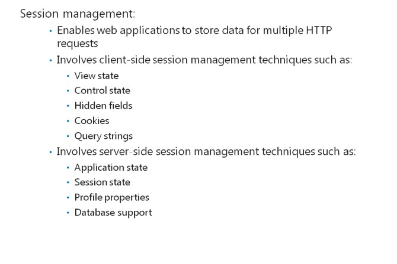
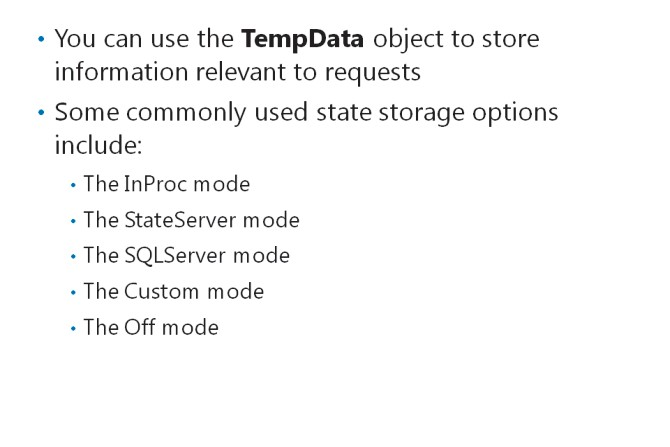
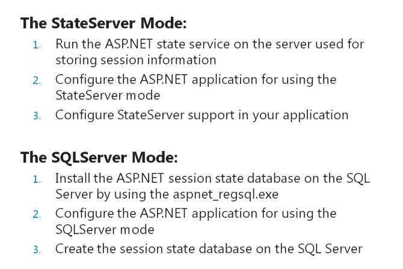
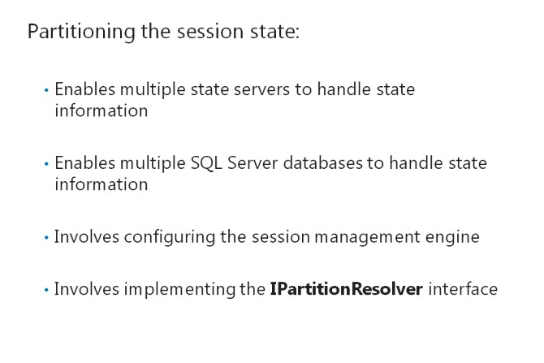

# Module 12 <br> Building a Resilient ASP.NET MVC 5 Web Application

Contents:

[Module Overview](12-0.md)    
[**Lesson 1:** Developing Secure Sites](12-1.md)    
[**Lesson 2:** State Management](12-2.md)

## Lesson 2 <br> **State Management**

While developing applications, you may want to create functions that require information to be retained across requests. For example, consider an application in which you need to first select a customer and then work on the order relevant to the customer. HTTP is a stateless protocol. Therefore, ASP.NET includes different state management techniques to help store information for multiple HTTP requests. You need to know how to configure and scale state storage mechanisms to support web server farms.

### Lesson Objectives

After completing this lesson, you will be able to:

- Describe the benefits of storing state information.

- List the options for storing state information.

- Configure state storage.

- Describe the scalability of state storage mechanisms.

- Store and retrieve state information in an MVC 5 web application.

### Why Store State Information?



HTTP is a stateless protocol that does not relate submitted requests to each other. HTTP treats each request as a new request. However, this independence among the requests affects business applications that have information dependencies amongst functions. For example, consider that you can access the Update Address function only after you provide the user logon information. The page that handles the User Logon function is different from the page that handles the Update Address function. Therefore, these functions require two separate HTTP requests. With the default HTTP implementation, the server may lose the result of the logon request, when a user accesses the Update Address page. ASP.NET implements the session management technology to retain dependent information for multiple HTTP requests.

Session management enables web applications to store values for multiple HTTP requests, regardless of whether the request is directed to the same page or multiple pages. The session management process involves two techniquesserver-side techniques and client-side techniques, to retain user information pertinent to multiple HTTP requests.

**Client-SideSession Management**

Client-side session management technologies include:

- Hidden fields

- Cookies

- Query strings

Client-side session management technologies help retain dependent information when a user triggers the HTTP POST action by clicking a button on a webpage. Then, when a page is rendered, the server generates the dependent information.

**Note:** If you are familiar with ASP.NET Web Forms, you may have used View State and Control State as client-side state storage. These techniques are not available in MVC because they rely on Web Forms server controls.

#### **Server-Side Session Management**

Server-side options provide higher security for storing page information than the client-side options because information retained by using client-side options is not visible to the client system. However, server-side options require more web server resources such as memory for storing data. This additional usage of resources can lead to scalability issues if the size of the information to be stored is large.

ASP.NET provides the following server-side session management options:

- Application state

- Session state

- TempData

- Profile properties

- Database support

**Additional Reading:** For more information about ASP.NET state management recommendations, go to [http://go.microsoft.com/fwlink/?LinkID=288986&clcid=0x415](http://go.microsoft.com/fwlink/?LinkID=288986&amp;clcid=0x415)

**Question**: Why do you need to implement session management?

### State Storage Options



You can store values for requests, and the subsequent requests related to the previous requests, by using the **TempData** object. By default, the **TempData** object uses the **Session** variable to store information relevant to requests. You can use the **TempData** object to access session information, instead of using the **Session** variable. The **TempData** object includes logic to handle redirection of information to different views.

You can use the **sessionState** element in the Web.config file, to define the repository that

should retain the session state information. You can also use the **sessionState** element to turn off session- state support. The following list describes some of the commonly used session state storage options:

- _The InProc mode_. Stores the session in the ASP.NET process.

- _The StateServer mode_. Stores session information in dedicated services running on the web server or on a dedicated server. It does not store information on Internet Information Services (IIS).

- _The SQLServer mode_. Stores the session information in a SQL Server database.

- _The Off mode_. Deactivates the session state support in your application.

**Question**: Consider that you have a web server that contains multiple web servers. You want to allow users to access the same state information for all the web servers they access. In this case, which state storage mode should you used?

### Configuring State Storage



You can configure state storage to use the StateServer and SQLServer modes.

#### **The StateServer Mode**

You need to run the ASP.NET state service on the server used for storing session information, before using the StateServer mode. The ASP.NET state service is installed as a service when ASP.NET and the .NET Framework are installed as part of Microsoft .NET Framework. The ASP.NET service is installed at the following location: _systemroot_\Microsoft.NET\Framework\\_versionNumber_\aspnet\_state.exe

To configure an ASP.NET application for using the StateServermode, you should perform the following steps:

- In the Web.config file of the application, set the **mode** attribute of the **sessionState** element to **StateServer**.

- In the Web.config file of the application, set the **stateConnectionString** attribute to **tcpip=<**_serverName_**>:42424**.

To configure StateServer support in your application, you should perform the following steps:

1. Run the services.msc file.

2. Set the ASP.NET state service **Startup Type** attribute to **automatic**, and right-click the service.

3. Open the Web.config file, identify the **sessionState** element, and then update the code.

Consider that a session state is stored on the **SampleStateServer** remote computer. The following code shows how to configure the **StateServer** mode.

**Configuring the State Server Mode**

``` XML
<configuration>
    <system.web>
        <sessionState mode="StateServer"
            stateConnectionString="tcpip=SampleStateServer:42424"
            cookieless="false"
            timeout="20"/>
    </system.web>
</configuration>
```

**Note:** The objects stored in session state must be serializable, if the mode is set to StateServer or SQLServer.

#### **The SQLServer Mode**

Before using the **SQLServer** mode, you need to install the ASP.NET session state database on the SQL Server.. You can install the ASP.NET session state database by using the aspnet_regsql.exe tool. To configure an ASP.NET application for using the SQLServermode, you should perform the following steps:

- In the Web.config file of the application, set the **mode** attribute of the **sessionState** element to **SQLServer**.

- In the Web.config file of the application, set the **sqlConnectionString** attribute to a connection string for your SQL Server database.

To create the session state database on SQL Server, you should perform the following steps:

1. Open the command prompt with administrative privileges.

2. From the _&lt;systemroot\Microsoft.NET\Framework\versionNumber&gt;_ folder on your web server, run the Aspnet_regsql.exe tool.

3. Open the Web.config file, identify the **sessionState** element, and then update the code.

Consider that a session state is stored on the **SampleSqlServer** SQL Server. The following code shows how to configure the **SQLServer** mode.

**Configuring SQL Server Session State Storage**

``` XML
<configuration>
    <system.web>
        <sessionState mode="SQLServer"
        sqlConnectionString="Integrated Security=SSPI; data source=SampleSqlServer;" />
    </system.web>
</configuration>
```

You can customize the behavior of the aspnet_regsql.exe tool by using switches such as **-E**, **-S**, and **-d**. You can use these switches to change the name of the default ASPState database.

**Additional Reading:** For more information about the aspnet_regsql.exe tool, go to: [http://go.microsoft.com/fwlink/?LinkID=293693&clcid=0x409](http://go.microsoft.com/fwlink/?LinkID=293693&amp;clcid=0x409)

**Question**: Which tool should you install before using the SQLServer mode?

### Scaling State Storage Mechanisms



The StateServer and SQLServer modes help access the state storage on a web server. These modes allow multiple servers to access state storage information. This process distributes the web workload among multiple web servers.

You can implement partitioning of session state to allow multiple state servers or multiple SQL Server databases to handle session state information. You can apply the logic for partitioning, by implementing the **IPartitionResolver** interface in your application. You need to configure the Web.config file to control the session management engine. Configuring the session management engine helps you use the logic to identify the appropriate web server on which you can store information.

The following code shows how to configure the Web.config file, to enable the **IPartitionResolver** interface.

**Using the IPartitionResolver Interface**

``` XML
<configuration>
    <system.web>
        <sessionState
            mode="SQLServer"
            partitionResolverType="PartitionResolverClass" />
    </system.web>
</configuration>
```

You can use the **IPartitionResolver** interface only when the session state uses the SQLServer or StateServer modes. In the preceding code sample, note that no connection string is specified by using the **sqlConnectionString** or **stateConnectionString** attributes.

**Additional Reading:** For more details about implementing state partitioning, go to: [http://go.microsoft.com/fwlink/?LinkID=288988&clcid=0x417](http://go.microsoft.com/fwlink/?LinkID=288988&clcid=0x417)

**Question**: When should you implement the **IPartitionResolver** interface?

