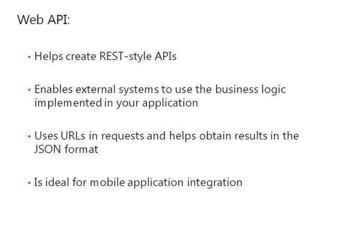
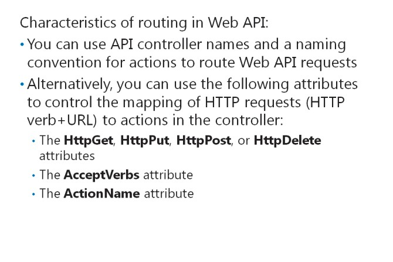
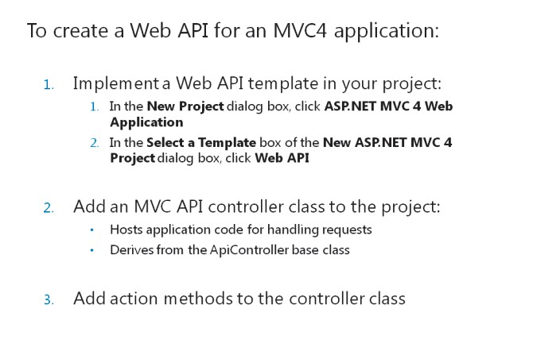
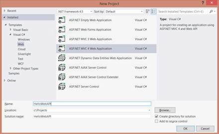
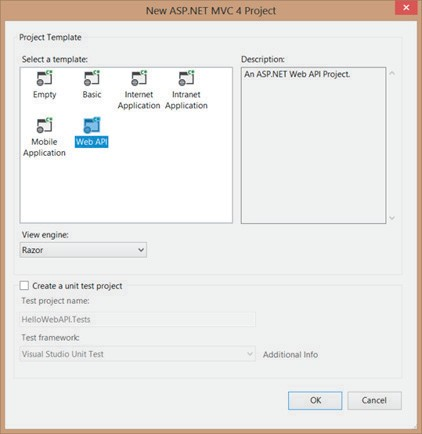
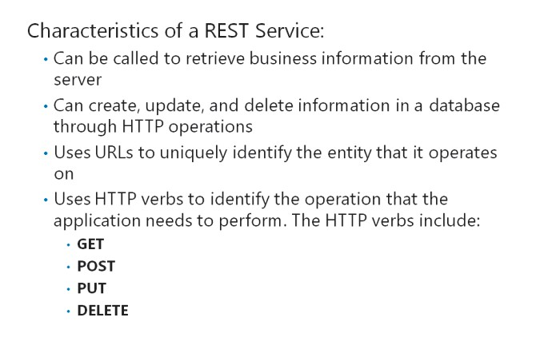
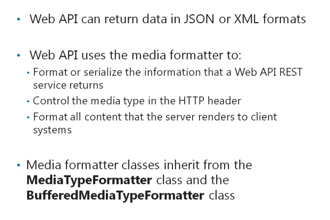

# Module 13 <br> Implementing Web APIs in ASP.NET MVC 5 Web Applications

#### Contents:

[Module Overview](13-0.md)    
[**Lesson 1:** Developing a Web API](13-1.md)    
[**Lesson 2:** Calling a Web API from Mobile and Web Applications](13-2.md)

## Lesson 1 <br> **Developing a Web API**

You need to know how to develop Web API for applications, because Web API facilitates creating APIs for mobile applications, desktop applications, web services, web applications, and other applications. By creating a Web API, you make the information in your web application available for other developers to use in their systems. Each web application has a different functional methodology; this difference can cause interoperability issues in applications. REST services have a lightweight design, and Web API helps implement REST services to solve the interoperability issues. You need to know how to use the different routing methods that ASP.NET provides to implement REST services.

### Lesson Objectives

After completing this lesson, you will be able to:

- Describe Web APIs.

- Create a Web API for an MVC 5 web application.

- Describe REST services.

- Describe data return formats.

- Explain how to use routes and controllers to implement REST in Web APIs.

- Explore a Web API by using Internet Explorer as a client.

### What Is a WebAPI?



Web API is a framework that is part of ASP.NET MVC 5 that enables you to build Representational State Transfer (REST)-enabled APIs. REST-enabled APIs help external systems use the business logic implemented in your application to increase the reusability of the application logic. Web API facilitates two-way communication between the client system and the server through tasks such as:

- Instructing an application to perform a specific task

- Reading data values

- Updating data values

Web API enables developers to obtain business information by using REST, without creating complicated XML requests such as Simple Object Access Protocol (SOAP). Web APIs use URLs in requests, thereby eliminating the need for complicated requests. For example, the following URL obtains information for a customer entity with the ID **1**:

[http://api.contoso.com/api/customers/1](http://api.contoso.com/api/customers/1)

Web API uses such URLs in requests and obtains results in the JSON format. The following code shows a Web API request response in the JSON format.

**A Web API JSON Response**

``` JSON
[
    {
        "Id":1,
        "Name":"Tomato soup",
        "Category":"Groceries",
        "Price":1.0
    },
    {
        "Id":2,
        "Name":"Yo-yo",
        "Category":"Toys",
        "Price":3.75
    },
    {
        "Id":3,
        "Name":"Hammer",
        "Category":"Hardware",
        "Price":16.99
    }
]
```

REST and Web API enable all kinds of different applications, including mobile device applications, to interact with services. In particular, REST and Web API provide the following benefits for mobile applications:

- They reduce the processing power needed to create complex request messages for data retrieval.

- They enhance the performance of the application by reducing the amount of data exchange between client and server.

**Question**: What is the key benefit of using REST with Web APIs?

### Routing in Web API



When you create a new project by using the Web API template in <u>ASP.NET</u> MVC 5, it includes a default routing rule. This routing rule helps map HTTP requests to the Web API controllers and actions by using HTTP verbs and the request URL. You can make use of a naming convention to map requests to actions, or you can control the behavior of the mapping by using annotations on action methods.

#### **The Default API Route**

Like standard MVC web applications, MVC Web API uses routes to map requests to the right API

controller and action. In the Visual Studio project templates, the default API route is defined in the WebApiConfig.cs file in the App_Start folder.

The following code shows the default route.

**The Default API Route**

``` cs
routes.MapHttpRoute(     
    name: "API Default",     
    routeTemplate: "api/{controller}/{id}",     
    defaults: new { id = RouteParameter.Optional } 
);
```

In the preceding code sample, observe that the default route includes the literal path segment **api**. This segment ensures that Web API requests are clearly separate from MVC controller routes, because Web API requests must start with **api**.

The first placeholder variable, _{controller}_ helps identify the API controller to forward the request to. As for MVC controllers, Web API appends the word, Controller, to this value to locate the right API controller class. For example, Web API routes a request to the URI, **api/products**, to the controller called, **ProductsController**. As for MVC controllers, the optional placeholder variable, _{id}_, is sent to the action as a parameter.

You can also define your own API routes in the same manner as you do for MVC routes. Observe, however, that Web API routes can handle requests from many types of client systems, including mobile device applications, desktop applications, web applications, and web services. MVC routes only handle web browser requests.

#### **Using the Action Naming Convention**

The default Web API route does not include a placeholder variable for the action name. This is because Web API uses the HTTP verb and a naming convention to route requests to the right action within a given controller.

Clients can make HTTP requests with one of four standard verbs: **GET**, **POST**, **PUT**, and **DELETE**. Other verbs are possible. Web API looks for an action whose name begins with the requested HTTP verb. For example, if the client sends a **DELETE** request to the URI **api/products/23**, Web API looks for a controller called **ProductsController**. Within this controller, it locates an action whose name begins with **Delete**.

According to the default route, the segment **23** is the **{id}** parameter. If there is more than one action whose name begins with **Delete**, Web API chooses the action that accepts a parameter called **id**.

#### **The HttpGet, HttpPut, HttpPost, and HttpDelete Attributes**

You can use the **HttpGet**, **HttpPut**, **HttpPost**, or **HttpDelete** attributes in your controller action to override the action naming convention. You can also use these verbs to specify that a function is mapped to a specific HTTP verb. The following table describes how the HTTP attributes map to the HTTP verbs.

|Attribute |HTTP Verb |
|---|---|
|HttpGet |GET|
|HttpPut |PUT |
|HttpPost |POST |
|HttpDelete |DELETE |

The following code illustrates the use of the HttpGet attribute on the FindProduct action.

**Specifying the HTTP Verb**

``` cs
public class ProductsController : ApiController {     
    [HttpGet]     
    public Product FindProduct(id) {} 
}
```

In the preceding code sample, observe that the HTTP attributes only allow mapping of one HTTP verb to an action in the controller.

#### **The AcceptVerbs Attribute**

The use of the **AcceptVerbs** attribute allows you to specify custom HTTP Verbs or multiple HTTP verbs to the same actions in the controller.

The following code shows the use of the **AcceptVerbs** attribute to map specific HTTP verbs to the action.

**The AcceptVerbs Attribute**

``` cs
public class ProductsController : ApiController {     
    [AcceptVerbs("GET", "HEAD")]     
    public Product FindProduct(id) { }     
    [AcceptVerbs("MKCOL")]     
    public void MakeCollection() { } 
}
```

#### **The ActionName attribute**

By default, the action name is the name of the action you specify in the controller. You can use the

**ActionName** attribute to specify the action name to be used in the routing.

The following code shows how to map an action to an HTTP request by using a custom action name.

**Mapping an Action**

``` cs
public class ProductsController : ApiController {     
    [HttpGet]     
    [ActionName("Thumbnail")]     
    public HttpResponseMessage GetThumbnailImage(int id);     
    [HttpPost]     
    [ActionName("Thumbnail")]     
    public void AddThumbnailImage(int id); 
} 
```

**Question**: What is the purpose of using the HTTP attributes?

### Creating a Web API for an MVC 5 Web Application



MVC4 provides a Web API project template that helps implement Web API in a project.

The following image shows the list of project templates available in Microsoft Visual Studio.



**FIGURE 14.1:THE NEW PROJECT DIALOG BOX**

To implement a Web API template in your project, you need to perform the following steps:

1. In the **New Project** dialog box, click **ASP.NET MVC 5 Web Application**.

2. In the **Select a Template** box of the **New ASP.NET MVC 5 Project** dialog box, click **Web API**. The following image shows the New ASP.NET MVC 5 Project dialog box.



**FIGURE 14.2:THE NEW ASP.NET MVC 5 PROJECT DIALOG BOX**

After selecting the Web API template, you need to add a new MVC controller class that derives from **ApiController**. The API controller class hosts application code for handling Web API requests. ASP.NET MVC4 engine maps the URL together with the HTTP verb and the controller or the action function of a controller, in the following format.

``` HTML
<http verb> http://<hostname>/api/<entity name>/<parameters>
```

The HTTP verb communicates to the Web API about the operations that it should perform; whereas, the rest is to communicate which entity and operations to perform on. Therefore, HTTP plays an important role. For example, consider the following API controller class.

``` cs
public class ProductsController : ApiController {         
    public IEnumerable<Product> GetAllProducts()         
    {         

    }         
    public Product GetProductById(int id)         
    {         

    }  
}
```

In the preceding code sample, note the controller classes **GetAllProducts** and **GetProductById**. The **GetAllProducts**controller class helps obtain a full list of products from the database. You can map the following URL and HTTP verb with the **GetAllProducts** controller class.

```
GET /api/products
```

The **GetProductById** controller class helps obtain a specific product by using the ID detail. You can map the following URL with the **GetProductById** controller class.

```
GET /api/products/id 
```

**Question**: What is the syntax that the ASP.NET MVC engine uses for mapping controllers and action functions?

### RESTful Services



REST uses URLs and HTTP verbs to uniquely identify the entity that it operates on and the action that it performs. REST helps retrieve business information from the server. However, in addition to data retrieval, business applications perform more tasks such as creating, updating, and deleting information on the database. Web API and REST facilitate handling such additional tasks. They use the HTTP method to identify the operation that the application needs to perform.

The following table provides information on some HTTP methods that Web API and REST use.

|HTTP Verb |Description|
|---|---|
|GET |Use this method with the following URL to obtain a list of all customers. |
||`/api/customers`|
|GET |Use this method with the following URL to obtain a customer by using the ID detail. |
||`/api/customers/id`|
|GET |Use this method with the following URL to obtain customers by using the category detail. |
||`/api/customers?country=country`|
|POST |Use this method with the following URL to create a customer record. |
||`/api/customers`|
|PUT |Use this method with the following URL to update a customer record. |
||`/api/customers/id `|
|DELETE |Use this method with the following URL to delete a customer record. |
||`/api/customers/id `|

Web API allows developers to use a strong typed model for developers to manipulate HTTP request. The following code shows how to use the POST, PUT, and DELETE methods for the create, update, and delete requests to handle the creation, retrieval, updation, and deletion (CRUD) of the customer records.

**CRUD Operations**

``` cs
public HttpResponseMessage PostCustomer(Customer item) { } 
public void PutCustomer(int id, Customer item) { } 
public void DeleteProduct(int id) { }
```

**Question**: What is the mandatory requirement of create and update requests?

### Data Return Formats



When a client makes a request to a Web API controller, the controller action often returns some data. For GET requests, for example, this data might be all the properties of a specific product or all the properties of all the products. Web API can return this data in one of two formats: JavaScript Object Notation (JSON) or XML.

#### **JSON and XML Data Formats**

Both JSON and XML are text formats that represent information as strings. You can also use JSON outside the JavaScript code.

The following code is a simple example of JSON.

**A JSON Response**

``` JSON
{
    "Name":"Albert",
    "Age":29,
    "Height":145,
    "Skills":["Programming", "Technical Writing"]
} 
```

You can represent the same data in the previous code sample, by using XML as shown in the following code.

**An XML Response**

``` XML
<Employee Name="Albert" Age="29" Height="145">    
    <Skills>       
        <Skill Name="Programming" />       
        <Skill Name="Technical Writing" />    
    </Skills> 
</Employee>
```

When a client makes a request, the client can specify the data format for the response. If the data format is not specified, Web API formats data as JSON by default.

#### **Media Formatters**

Web API uses a media formatter to format or serialize the information that a Web API REST service returns. Web applications usually use the JSON format to format the data that functions return. However, you can alternatively use the XML media formatter or add a custom media formatter to control the data returned. Media formatters format the content that the server renders to the client systems.

For example, consider that you want Web API to return CSV files. In this case, you need to create a custom media formatter, to create as output data files in the CSV format, instead of XML files in the JSON format.

The following code shows to add a new class in your project, to create a custom media formatter.

**A Custom Media Formatter**

``` cs
public class CsvFormatter : BufferedMediaTypeFormatter  { }
```

Media formatter classes inherit from the following classes:

- _MediaTypeFormatter_. This is the fundamental class for all formatter classes.

- _BufferedMediaTypeFormatter_. This is an extended class of formatter classes, which provides support for buffering and asynchronous operations.

**Additional Reading:** For more information on creating media formatters, go to: [http://go.microsoft.com/fwlink/?LinkID=288992&clcid=0x421](http://go.microsoft.com/fwlink/?LinkID=288992&clcid=0x421)

**Question**: Why should you use a media formatter for Web API REST services?

### Using Routes and Controllers in Web APIs

ASP.NET MVC 5 uses a route table to map a URL and a controller. When you create a project, ASP.NET adds a default route by using the Web API template. This default route helps support the operations of the REST-style Web APIs.

The following code shows the default route.

**The Default API Route**

``` cs
routes.MapHttpRoute(     
    name: "API Default",     
    routeTemplate: "api/{controller}/{id}",     
    defaults: new { id = RouteParameter.Optional } 
);
```

Consider that you want to include multiple actions, such as creating customers with XML and JSON, in the same HTTP method. In this case, you cannot use the default route because it requires a new request for each HTTP method and URL combination. Therefore, you need to update the routing by modifying the Route Map in the **WebApiConfig** class.

The following code shows how to update the routing, to support multiple operations in the same HTTP method.

**Supporting Multiple Operations**

```
routes.MapHttpRoute(     
    name: "ActionApi",     
    routeTemplate: "api/{controller}/{action}/{id}",     
    defaults: new { id = RouteParameter.Optional } 
);
```

You can use the **WebApiConfig** class to enable multiple versions of API to coexist in the same project. For example, you can include **/api/v1/{controller}** as Version One of your API and include **/api/v2/{controller}** as a new version or Version Two of the API.

You may want to include supporting functions in the controller class, and hide the supporting functions from the REST functions. You can eliminate the exposure of the function to the REST interface by adding the **NoAction** attribute to the action function.

The following code shows how to add the **NoAction** attribute to the action function.

**Using NoAction**

``` cs
[NonAction]   
public string GetPrivateData()  { } 
```

By default, Web API exposes all public methods as REST services. You can prevent this by making the function **private**, but this action prevents application code in the same project from accessing the function. Therefore, you can use the **NonAction** attribute for functions that need to be in public, but do not need to be exposed in REST.

**Question**: What is the key benefit of using the routing map?

