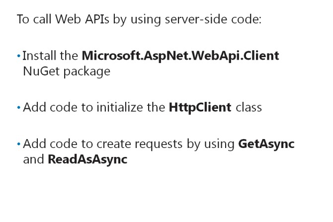
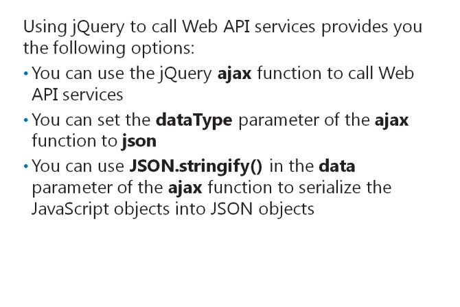
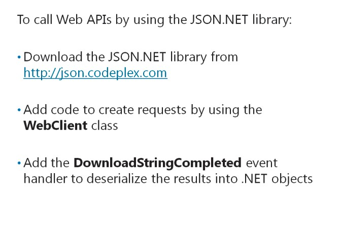

# Module 13 <br> Implementing Web APIs in ASP.NET MVC 5 Web Applications

#### Contents:

[Module Overview](13-0.md)    
[**Lesson 1:** Developing a Web API](13-1.md)    
[**Lesson 2:** Calling a Web API from Mobile and Web Applications](13-2.md)

## Lesson 2 <br> **Calling a Web API from Mobile and Web Applications**

After you complete the development of the Web API services, you need to create the client applications to call these services. Calling Web API services is different from calling WCF services. However, the methods that you need to use to call these services are similar, regardless of the platform. You need to know how to call Web API services by using server-side code, jQuery code and JSON.NET library, to effectively implement Web API services in most application platforms.

Lesson Objectives

After completing this lesson, you will be able to:

- Call Web APIs by using server-side code.

- Call Web APIs by using jQuery.

- Call Web APIs by using Windows Phone applications.

### Calling Web APIs by Using Server-Side Code



You can call REST-style services by using ASP.NET server-side code. You can use the **HttpWebRequest** class to create a manual HTTP request to the REST services. ASP.NET provides a .NET library that you can use in web applications to call REST-enabled Web API services from the .NET server. To use the .NET library, you need to install the **Microsoft.AspNet.WebApi.Client** NuGet package. This NuGet package provides access to the **HttpClient** class. The **HttpClient** class simplifies interacting with Web APIs, because it reduces coding efforts.

After installing the NuGet package, you need to initialize the **HttpClient** class. The following code illustrates how to initialize the **HttpClient** class.

**Initializing the HttpClient Class**

``` cs
HttpClient client = new 
HttpClient(); client.BaseAddress = new Uri("http://localhost/"); 
client.DefaultRequestHeaders.Accept.Add(new    
    MediaTypeWithQualityHeaderValue("application/json")
); 
```

The last line of code in the preceding code sample informs the client system about the media type that the client system should use. The default media type that applications use is **application/json**. However, applications can use any other media type, based on the media type that the REST-style services support.

The following code shows how to call Web API REST services by using server-side code.

**Calling the API from Server-Side Code**

``` cs
HttpResponseMessage response = client.GetAsync("api/customers").Result;  
if (response.IsSuccessStatusCode) {     
    var products = response.Content.ReadAsAsync<IEnumerable<Customer>>().Result; 
} 
else {     
    Console.WriteLine("{0} ({1})", (int)response.StatusCode, response.ReasonPhrase); 
} 
```

After running the code in the preceding code sample, you need to define a data model that aligns itself with the one used by the Web API service to enable the .NET library to:

- Process the results of the server-side code.

- Return results as .NET objects for the application to use. Then, you can use the **GetAsync** and **ReadAsAsync** methods to:

- Create requests to Web API REST services.

- Parse the content into .NET objects.

The **PostAsJsonAsync** function uses the HTTP POST method to call Web API services that support the POST method.

**Question**: What is the benefit of using the **Microsoft.AspNet.WebApi.Client** NuGet package?

### Calling Web APIs by Using jQuery Code



You can call Web API services in the same manner as you call other services that use technologies such as WCF. You can also call Web API services by using the jQuery **ajax** function.

The following code shows how to call a Web API service by using the jQuery **ajax** function.

**Using the jQuery ajax Function**

``` JavaScript
$.ajax({
    url: 'http://localhost/api/customers/',
    type: 'GET', 
    dataType: 'json',
    success: function (data) { },
    error: function (e) {}
});
```
In the preceding code sample, observe the **dataType** parameter of the **ajax** function. You should set this parameter to **json** or another data type that the Web API service supports. Most applications use JSON because it is light weight. The **ajax** function has built-in functionalities that parse JSON results for the ease of developers.

You can use **JSON.stringify()** in the **data** parameter of the **ajax** function to serialize the JavaScript objects into JSON objects for sending to the Web API method. The following code shows how to use **JSON.stringify()** in the **data** parameter of the **ajax** function.

**Using the stringify function**

```
var customer = {             
    ID:'1',             
    CustName: 'customer 1'         
};
$.ajax({             
    url: 'http://localhost/api/customer',             
    type: 'POST',             
    data:JSON.stringify(customer),                         
    contentType: "application/json;charset=utf-8",             
    success: function (data) { },             
    error: function (x) { }         
}); 
```

**Question**: What is the benefit of using **JSON.stringify()** in the **ajax** function?

### Calling Web APIs Using Windows Phone Applications



You can use NuGet packages to call Web API REST services in .NET applications. However, in Windows Phone web applications, you need to use the JSON.NET library to call Web API REST services. The JSON.NET library is more light weight and it enhances the performance of Windows Phone applications. You can download the library from [http://go.microsoft.com/fwlink/?LinkID=288993&clcid=0x422](http://go.microsoft.com/fwlink/?LinkID=288993&clcid=0x422)

The JSON.NET library contains a set of .NET classes that help create JSON requests to any REST-style APIs. To use the JSON.NET library, you need to download it and place the JSON.NET assembly in the /WindowsPhone folder of the /bin folder.

The following code shows how to call an HTTP request by using the **WebClient** class.

**Using the WebClient Class**

``` cs
WebClient webClient = new WebClient(); 
Uri uri = new Uri("http://localhost/api/customer/"); 
webClient.DownloadStringCompleted += new DownloadStringCompletedEventHandler(webClient_DownloadStringCompleted); 
webClient.DownloadStringAsync(uri);
```

When you make a request by using the **WebClient** class, the JSON.NET library processes the request and produces results from the WebClient class to return .NET objects. When you call Web APIs by using the library, you need to add the **DownloadStringCompleted** event handler. This event handler helps place logic to handle the data that Web APIs return.

In the **DownloadStringCompleted** event handler, you should add the code similar to the following.

**Coding the Event Handler**

``` cs
using Newtonsoft.Json; 
/// Lines skipped 
List<Customer> customers = JsonConvert.DeserializeObject<List<Customer>>(e.Result);       
foreach (Customer em in customers) { } 
```

The code in the preceding sample helps enable the JSON.NET library to deserialize the results into .NET objects.

**Question**: What is the key benefit of using the JSON.NET library?

