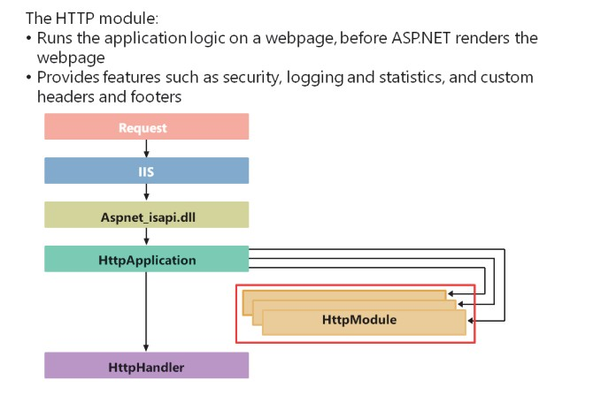
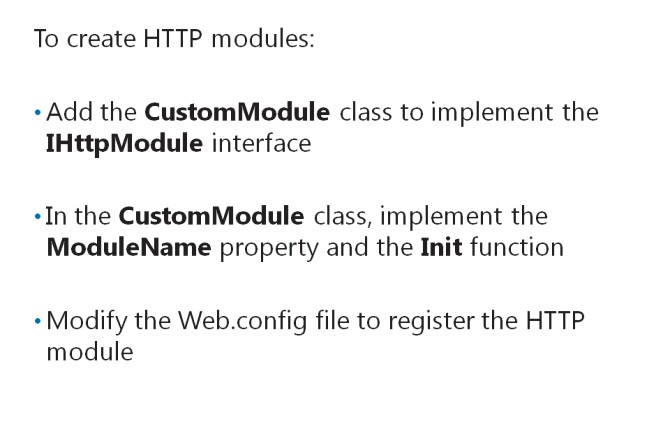
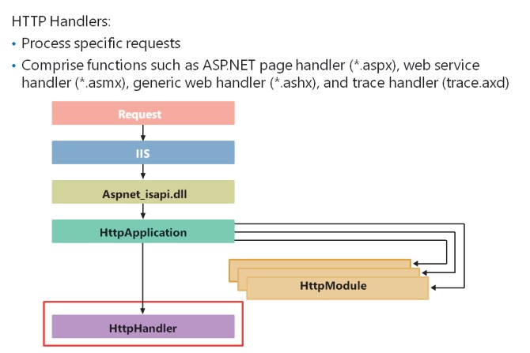
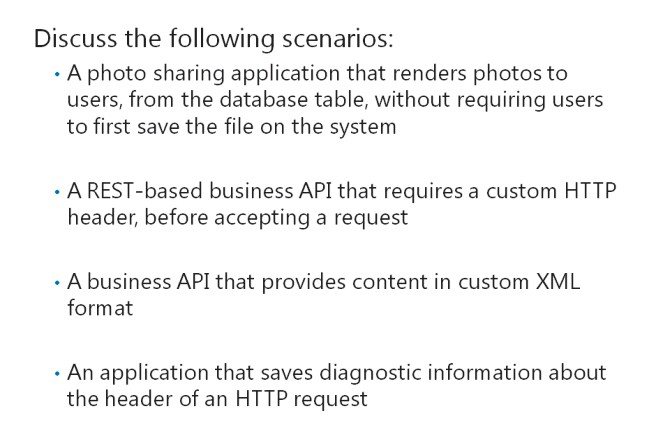

# Module 14 <br> Handling Requests in ASP.NET MVC 4 Web  Applications 

#### Contents:

[Module Overview](14-0.md)    
[**Lesson 1:** Using HTTP Modules and HTTP Handlers](14-1.md)    
[**Lesson 2:** Using Web Sockets ](14-2.md)

## Lesson 1 <br> **Using HTTP Modules and HTTP Handlers**

Applications perform actions on a request in the HTTP pipeline, before rendering a webpage. You need to know how to use an HTTP module to implement custom authentication mechanism for a webpage, before rendering the webpage. You can also use an HTTP module to create code that renders content in a non-default encoding format that fits application needs. Sometimes, you may need the application to handle requests by using application logic that differs from the built-in ASP.NET page rendering logic. In such cases, you should know how to use the HTTP handler to process such specific requests.

### Lesson Objectives

After completing this lesson, you will be able to:

- Describe how HTTP modules intercept web requests.

- Create HTTP modules.

- Describe how HTTP handlers intercept web requests.

- Create HTTP handlers.

- Determine when to use HTTP modules and HTTP handlers.

### What Is an HTTP Module?



An HTTP module is a program that runs application logic on a webpage, before ASP.NET renders the webpage. To understand the relevance of an HTTP module, you need to know about the HTTP request pipeline. The IIS HTTP request pipeline is a sequence of programs that run on requests, to help the application perform tasks. When the application receives a request, it passes the request to the **isapi_aspnet.dll** ISAPI library and starts the ASP.NET execution pipeline, to process the request.

Then, the request passes through the **HttpApplication** instance of the application and the **HttpModule** library.

HTTP modules provide the following features to an application:

- _Security_. Provide support for the custom authentication and authorization logic of your application

- _Logging and statistics_. Gather low-level information about the web application execution cycle, for monitoring and logging purposes

- _Custom headers and footers_. Allow insertion of custom header information in the response of each request

The following is a list of HTTP modules in ASP.NET:

- OutputCache

- Session

- WindowsAuthentication

- FormsAuthentication

- PassportAuthentication

- UrlAuthorization

- FileAuthorization

- DefaultAuthentication

If you configure HTTP modules in an application, HTTP modules apply to all the HTTP requests that the application receives. You cannot configure an HTTP module for a specific page.

**Question**: What are the benefits of using HTTP modules in web applications?

### Creating HTTP Modules



You can create an HTTP module by adding the **CustomModule** class to your project; this class implements the **IHttpModule** interface in your application.

The following code shows how to create the **CustomModule** class in a project.

**Coding a Custom Module**

``` cs
public class CustomModule : IHttpModule
{
    public CustomModule ()
    {
    }

    public String ModuleName
    {
        get { return "CustomModule"; }
    }

    public void Init(HttpApplication application)
    {
        context.Response.Write("<h1>Demo<h1>");
    }
}
```
In the **CustomModule** class, you need to implement the following two methods:

- _ModuleName property_. Provides a display name that enables other application code to identify the HTTP module.

- _Init function_. Provides the location to implement all logic for an HTTP module. The **HttpApplication** class triggers this function when the application receives a request.

After you complete the development of an HTTP module, you need to register the HTTP module in the Web.config file. The following code shows how to register an HTTP module for an application running in IIS 6.0 or later versions, configured in the Classic mode.

**Registering an HTTP Module for IIS 6.0**

``` XML
<configuration>   
    <system.web>     
        <httpModules>       
            <add name="CustomModule" type="CustomModule "/>     
        </httpModules> 
    </system.web>
</configuration>
```

The following code shows how to register an HTTP module for an application running in IIS 7.0 or later versions, configured in the Integrated mode.

**Registering an HTTP Module for IIS 7.0 or Later**

``` XML
<configuration>   
    <system.webServer>     
        <modules>       
            <add name="CustomModule" type="CustomModule"/>     
        </modules>   
    </system.webServer> 
</configuration>
```

**Question**: You have developed a custom HttpModule. What must you do to ensure that your ASP.NET application uses the custom module developed?

### What Is an HTTPHandler?



HTTP modules help apply logic to all HTTP requests that an application receives. The **HttpHandler** function is a processing engine that processes specific HTTP requests. For example, you can configure an **HttpHandler** function to handle *.ashx files. You can map an **HttpHandler** function to a URL based on the file extension of the requested server-side page, such as *.aspx.

The following list describes some common **HttpHandler** functions:

- _ASP.NET page handler (*.aspx)_. This is the default HTTP handler for ASP.NET pages.

- _Web service handler (*.asmx)_. This is the default HTTP handler for web service pages.

- _Generic web handler (*.ashx)_. This is the default HTTP handler for all web handlers that do not have a user interface and include the **@WebHandler**directive.

- _Trace handler (trace.axd)_. This is a handler that helps display page trace information. 

You can use the *.ashx file extension with the Http handler because:

- The extension does not include any page-rendering logic.

- The extension allows developers to write logic to send responses to the client systems.

You can use a custom HTTP handler with the ***.rss** extension, to generate Real Simple Syndication (RSS) feed content for user requests. You can also use a custom handler to request images from the database and send the images to the client systems.

**Question**: What is the primary use of the HTTP generic handler (*.ashx)?

### Discussion: Scenarios for HTTP Modules and Handlers



Consider the following scenarios. In each case, discuss with the rest of the class to determine whether an HttpModule or HttpHandler best suits the case.

- You are creating a photo sharing application, and you want to enable each user to discuss photos and cycling trips with their friends. You need to ensure that the application renders photos to users, from the database table, without requiring users tofirst save the file on their system.

- You are creating a Representational State Transfer (REST)-based business application programming interface (API) that requires a custom HTTP header, before accepting a request.

- You are creating a business API to provide content in custom XML format.

- You developing an application that requires saving diagnostic information about the header of an HTTP request.

