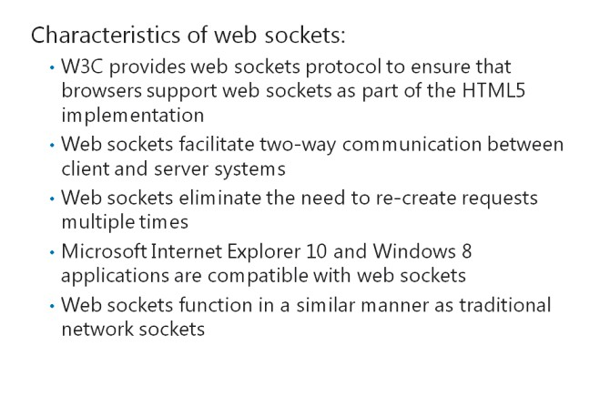
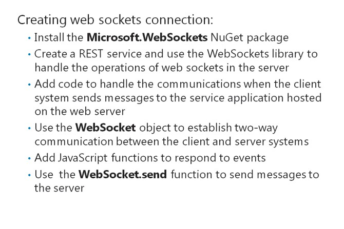
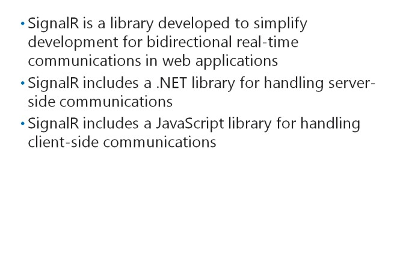

# Module 14 <br> Handling Requests in ASP.NET MVC 4 Web  Applications 

#### Contents:

[Module Overview](14-0.md)    
[**Lesson 1:** Using HTTP Modules and HTTP Handlers](14-1.md)    
[**Lesson 2:** Using Web Sockets ](14-2.md)

## Lesson 2 <br> **Using Web Sockets**

AJAX technologies are constantly evolving. The HTTP protocol does not cater to crucial requirements such as real-time information updates from the server. You need to know how to use web sockets to create two-way communication between the client and server systems. You also need to know when to use the traditional HTTP model and the web sockets protocol, based on the needs of your application.

### Lesson Objectives

After completing this lesson, you will be able to:

- Describe the WebSocket protocol.

- Describe how to create web sockets connections.

- Determine when to use web sockets.

- Add a web sockets-based application to an ASP.NET MVC 5 web application.

### What Is the WebSocket Protocol?



The WebSocket protocol is a standard from the World Wide Web Consortium (W3C). The HTML 5 specification includes support for web sockets.

**Additional Reading:** For more information about the WebSocket protocol, go to: http://go.microsoft.com/fwlink/?LinkID=288994&c lcid=0x423  

The protocol facilitates two-way communication between web browsers and web servers. The protocol helps overcome the issue of HTTP not providing two-way communication.

Developers often build two-way communication applications by using inefficient techniques such as long running loops and polling. These techniques consume large amounts of memory and other resources of both the server and client systems. The WebSocket protocol resolves the problems that arise with using such techniques by creating a constant socket connection between the client and server. All communication between the client and server systems then occurs through the socket. This socket eliminates the need to re-create a request multiple times, during real-time communications between the client and server systems. Remember that all browsers may not support web sockets. Microsoft Internet Explorer 10 and Windows 8 applications, which use JScript and HTML5, do support web sockets. Latest versions of Chrome, Safari, and Firefox also support web sockets.

The web sockets work in a similar manner as traditional network sockets. The only difference is that during the initial handshake, web sockets use the Upgrade HTTP request that includes the **Upgrade** HTTP header. If the server accepts web sockets, the server returns a response with the status code, 101\. Then, the client and server systems send the payload by using the socket. When the client system no longer requires communication with the server, the application sends a close connection payload, to notify the server to close the web socket.

**Question**: What is the key difference between traditional HTTP and web sockets?

### Coding Web Sockets Connections



To use web sockets, you need to implement server-side services that can handle the two-way communication between the server and the client systems. To simplify the programming work, Microsoft provides the **Microsoft.WebSockets** NuGet package. This package includes a library that helps handle web socket operations on the server. While coding web sockets, you can:

- Use the Web API framework to create a REST service that handles the initial handshake.

- Use the WebSocket library to promote communication between the client and server systems.

The following code shows how to create a REST service and use the WebSocket library, to handle the operations of web sockets on the server.

**Using the Web Sockets Library**

``` cs
public class ChatController : ApiController 
{    
    public HttpResponseMessage Get(string username)    
    {       
        HttpContext.Current.AcceptWebSocketRequest(new ChatWebSocketHandler());       
        return Request.CreateResponse(HttpStatusCode.SwitchingProtocols); 
    }    
    
    class ChatWebSocketHandler : WebSocketHandler    
    {           
        public ChatWebSocketHandler()       
        {       

        }       
        public override void OnOpen()       
        {       

        }       
        public override void OnMessage(string message)       
        {       

        }    
    } 
}
```

Observe the **Get** function in the preceding code sample. The ASP.NET engine maps this function to a URL and the controller with a GET request. After the initial handshake:

- The WebSocket library establishes the web socket at the client and server end.

- The application passes the handling of communications to the **ChatWebSocketHandler** class inherited from the **WebSocketHandler** class.

Whenever the client system sends a message to the service application hosted on the web server, the message triggers the **OnMessage** function. The **OnMessage** function enables you to respond to the message.

To ensure that a message triggers the **OnMessage** function, you need to add the following code to the Web.config file.

**Configuring Web Sockets**

``` XML 
<configuration> 
    <appSettings>       
        <add key="aspnet:UseTaskFriendlySynchronizationContext" value="true" />    
    </appSettings> 
</configuration> 
```

On the client side, you can use the **WebSocket** object to establish two-way communication between the client and server systems. The following code shows how to use the **WebSocket** object in JavaScript.

**Calling Web Sockets from the Browser**

``` JavaScript
$(document).ready(function () {    
    websocket = new WebSocket('ws://localhost/api/service1');    
    websocket.onopen = function () { };    
    websocket.onerror = function (event) { };    
    websocket.onmessage = function (event) { };    
    websocket.send('Hello');   
    websocket.close(); 
}); 
```

The preceding code sample shows how to add JavaScript functions to respond to events. The following list describes some common JavaScript functions.

- _onmessage_. You can use this function when the client system receives a message from the server.

- _onopen_. You can use this function when the WebSocket library establishes the web socket.

- _onerror_. You can use this function when an error occurs.

To send a message in JavaScript, you can use the **WebSocket.send()** function. After all communications between the client and server systems end and you no longer need the web socket connection, you can use the **WebSocket.close()** function. This function helps close the web socket communication channel between the client and server systems.

**Question**: What is the purpose of using Web APIs to create a service for handling web sockets?

### What Is SignalR?



SignalR is a set of components that simplifies the development of bidirectional real-time web applications, such as chat rooms in websites.

SignalR uses WebSockets wherever possible to connect. This means that it supports all HTML5 compatible browsers. A key advantage of using SignalR is that it supports remote procedure calls (RPCs) with HTML or even .NET applications and can automatically switch to periodic polling for older browsers.

To install the package to your application, you can use NuGet to find the package, **Microsoft.AspNet.SignalR**.

After installation, you can implement the server-side code for the server logic.

To use SignalR, you need to implement a class that inherits from SignalR library. The following example broadcasts a message to all clients when a message is received from one client.

**Coding SignalR Connections**

``` cs
using System.Threading.Tasks; 
using Microsoft.AspNet.SignalR; 
public class DemoConnection : PersistentConnection  
{     
    protected override Task OnReceived(IRequest request, string connectionId, string data)      
    {         
        return Connection.Broadcast(data);     
    } 
} 
```

After the server code is implemented, you need to add ASP.NET routing to map the URL back to the SignalR library. The following code maps the /demo URL to the DemoConnection library for handling the message communication by using SignalR.

**Mapping SignalR URLs**

``` cs
public class Global : System.Web.HttpApplication  
{     
    protected void Application_Start(object sender, EventArgs e)      
    {         
        RouteTable.Routes.MapConnection<DemoConnection>("demo", "/demo"); 
    } 
}
```

SignalR also includes a JavaScript library that can be used by clients to help perform communications between client and server. The SignalR library depends on the jQuery library.

The following JavaScript code sends a message to the server, receives a message back, and displays the received message.

**Client-Side SignalR Code**

``` HTML
<script src="http://code.jquery.com/jquery-1.7.min.js" type="text/javascript"></script> 
<script src="Scripts/jquery.signalR-1.0.1.min.js" type="text/javascript"></script> 
<script type="text/javascript">    
    $(function () {       
        var connection = $.connection('/demo);       
        connection.received(function (data) {          
            alert(data);       
        });       
        connection.start().done(function() {           
            $("#broadcast").click(function () {             
                connection.send('Hello');          
            });       
        });   
    }); 
</script> 
```

**Question:** What is the key benefit of using SignalR, instead of WebSockets directly?