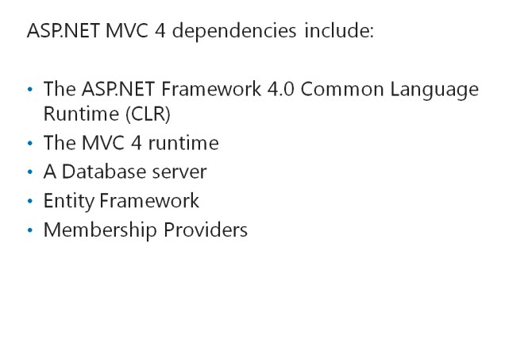
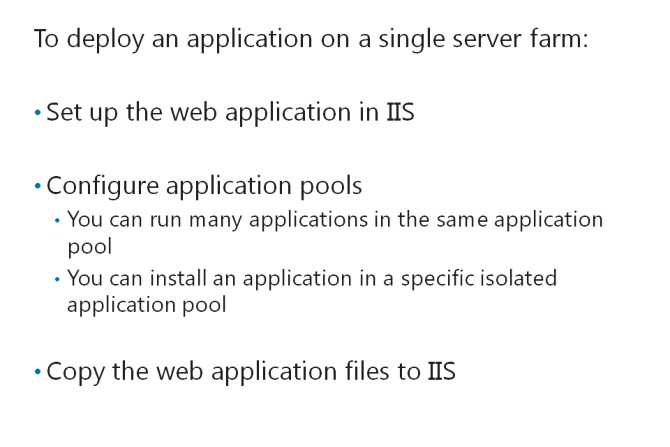
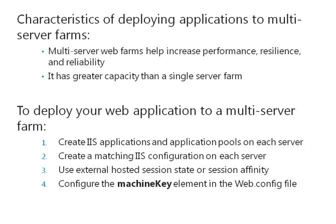
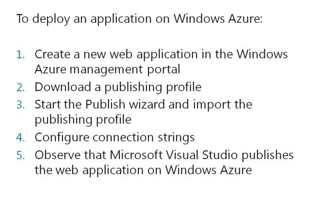

# Module 15   Deploying ASP.NET MVC 5 Web Applications

#### Contents:

[Module Overview](15-0.md)    
[**Lesson 1:** Deploying a Web Application](15-1.md)     
[**Lesson 2:** Deploying an ASP.NET MVC 5 Web Application](15-2.md)

## Lesson 1   **Deploying a Web Application**

The considerations for deploying a web application to a web farm are different for single and multi-server configurations. For example, in multi-server web farms, you need to ensure that the state information is available on all web servers. You also need to ensure that the dependencies needed for hosting ASP.NET MVC 5 web applications are present in the web farm. If any of the application dependencies are missing on the production web servers, some or all of your applications may not function and users may encounter errors. You need to apply special considerations while deploying web applications on Windows Azure. Deploying a web application on Windows Azure provides advantages such as high availability and flexibility.

### Lesson Objectives

After completing this lesson, you will be able to:

- Ensure that dependencies are present for hosting ASP.NET MVC 5 applications.

- Deploy an ASP.NET MVC 5 web application to a single-server web farm.

- Deploy an ASP.NET MVC 5 web application to a multi-server web farm.

- Deploy an ASP.NET MVC 5 web application on Windows Azure.

ASP.NET MVC 5 Dependencies

ASP.NET MVC 5 is built on the ASP.NET Framework 4.0. Each web application requires a range of different components to be present on the web server, to function appropriately.

Examples of common requirements include:

- _The ASP.NET Framework 4.0 Common Language Runtime (CLR_). The CLR runs any managed code such as C# classes. All ASP.NET web applications require the CLR, and you can install the CLR with Internet Information Services (IIS).

- _The ASP.NET MVC 5 runtime._ The ASP.NET MVC 5 runtime locates controllers and actions to handle each request that the web application receives, and it returns the compiled webpages to users. You can install the MVC runtime in your web application by installing the MVC 5 NuGet package. All MVC web applications require the MVC runtime.

- _A Database server._ Most web applications use a database to store information such as product details, customer details, images, and other entities. You need to ensure that the production environment supports the database that you used during development. For example, if you use SQL Compact during development, you need to ensure that Microsoft SQL Compact is installed on the production server. Alternatively, you can migrate the database to Microsoft SQL Server.

- _Entity Framework._ If you use Entity Framework to model data in your web application, you need to ensure that you deploy the framework with your application.

- _Membership Providers._ If your application uses membership providers to store user accounts and roles, you need to ensure that these providers are available on the server. The .NET Framework includes the SQL Server Membership Provider. If you use the Universal Membership Providers by installing the NuGet package, you need to ensure that you include the NuGet package with your deployed application.

**Question:** Which of the common requirements in the above list is required to support forms authentication?

### Deploying Web Applications to Web Servers

Before you deploy a web application to a production IIS web server, you must create and configure the IIS application and the folder that hosts the application.

**Creating an IIS Web Application**

You need to host ASP.NET MVC 5 web applications in an IIS web folder that is marked as a web application starting point. You can use the Internet Service Manager tool to configure this setting on the top-level folder of the web application. When you mark a web folder as a web application, you enable IIS to recognize that the content of the folder is ASP.NET and requires the ASP.NET runtime engine to process each request.

After creating an application, you need to configure the application to use .NET 4.0 or above. This practice enables ASP.NET MVC 5 to run, because the MVC runtime components are part of the .NET framework.

**IIS Application Pools**

In IIS, web applications are run within a context known as an application pool. You can run many applications in the same application pool or install an application in its own isolated pool. Applications that run in the same application pool share the following resources:

- _Worker Process._ The worker process uses a single execution process to run all the applications in a pool.

- _Memory_. The applications share a single memory range, because the applications in a pool share a single worker process.

- _Identity._The applications within a single pool share a user account.

You can place two or more applications in an application pool, and thereby reduce the total memory usage, because the applications share memory. However, this arrangement can reduce the reliability of each application, because a malfunctioning application can affect all the applications in the pool. To maximize the reliability of an application, you should install the application in an isolated pool that runs only one specific application.

The shared identity within an application pool affects the way the applications authenticate resources such as database servers when using integrated authentication. Each application within a pool shares a single user account. If each application has a separate database, you need to set permissions, to enable the user accounts to access all the databases. If you separate applications into isolated pools, you can use a different user account for each application. This practice can enhance the security of the application, because each account can access only one database.

#### **Deploying the Application**

When the IIS web application is ready, you need to copy the web application files to IIS. These files include all the model classes, controllers, views, script files, style sheets, images, and any other content in the Microsoft Visual Studio ASP.NET MVC 5 project. You can use the deployment tools available in Microsoft Visual Studio, or other technologies such as FTP, to copy these files. When the copy operation is complete, the web application is ready for deployment.

**Question:** What is the purpose of configuring additional application pools?

### Deploying Web Applications to Multi-Server Farms

You can deploy a web application to a multi- server web farm to increase performance, resilience, and reliability. In a multi-server web farm, a group of two or more web servers host a single web application. All the servers in the farm share a single server name, such as [www.contoso.com](http://www.contoso.com/). Windows Network Load Balancing or dedicated hardware load balancers distribute browser requests to the servers.

A multi-server farm usually has greater capacity than a single web server, because the multi-server farm almost equally shares the load amongst several servers. Multi-server farms also increase reliability. When a server fails for any reason, the load balancing mechanism automatically directs requests to another server that remains online.

If you decide to deploy your web application to a multi-server farm, you need to perform the following steps. To complete these steps, you may need to work with the web server administrator who is responsible for the server farm:

1. Create IIS applications and application pools on each server. This step is the same as configuring the applications and application pools in a single-server scenario. However, you need to perform this step on every server in the farm. You also need to ensure that applications and application pools have the same configuration, throughout the farm.

2. Create a matching IIS configuration on each server. IIS configuration options, such as any encryption certificates, file extensions, and optional components, should be identical on every server in the farm.

3. Use external hosted session state or session affinity. You can configure ASP.NET web applications to store session state in the Windows State Service or a database. You should use this technique in a multi-server farm, because each request from a single user session might be directed to a different web server. Alternatively, by configuring session affinity, you can ensure that all requests from a user session are always sent to the same web server. If you do not use external hosted session state or session affinity, the user preference on one web server may get lost when a request is sent to another web server. Session affinity is supported by some but not all load balancing solutions. Work with your web server administrator to determine if affinity is available on your farm.

4. Configure the **machineKey** element in the Web.config file. If you are using external hosted session state, you can encrypt the connection between the web servers and the State Service server or database server. This technique improves security by protecting session state during network transmissions. You can configure this encryption by setting up the **machineKey** element in the Windows registry.

**Additional Reading:** For more information about configuring the **machineKey**element, go to: [http://go.microsoft.com/fwlink/?LinkID=288995&clcid=0x424](http://go.microsoft.com/fwlink/?LinkID=288995&amp;clcid=0x424)

**Question:** What is the purpose of configuring the **machineKey** element in the Web.config file?

### Deploying Web Applications on Windows Azure

You can deploy any ASP.NET web application, including ASP.NET MVC 5 web applications, on Windows Azure. By choosing Windows Azure as a platform, you can use a highly-available and flexible infrastructure that you can optimize to cope with intense load. You have a choice of subscriptions, which can help you to pay only for the traffic that your web application uses.

Deploying a web application on Windows Azure is different from deploying the application on on- premise versions of IIS. To deploy an application on Windows Azure, you perform the following steps:

1. Create a new web application in the Windows Azure management portal.

2. Download and save a publishing profile for the new web application.

3. In Microsoft Visual Studio, open your web application solution. Then, start the Publish wizard and import the publishing profile.

4. Ensure that you select the correct connection strings for Entity Framework connections, service database connections, and any other database connections.

5. Complete the Publish wizard.

6. Observe that Microsoft Visual Studio publishes the web application to Windows Azure.

When the process is complete, you can access the Windows Azure-hosted web application from any Internet-connected browser.

**Note:** At the time of writing, Windows Azure web applications are still in preview, within the Windows Azure platform.

#### **Windows Azure Web Applications and Windows Azure Cloud Services**

Instead of publishing an ASP.NET MVC web application as a web application in Windows Azure, you can choose to build and publish a Windows Azure cloud service. A cloud service is a Windows Azure component that you can use to build a flexible multi-tiered application, with a discrete architecture. A cloud service consists of one or more web roles and worker roles, each with its own application files and configuration.

In a Windows Azure web application, all components of your web application run in a single process. You can administer the web application as a single object.

Windows Azure cloud services help separate user interface logic that you build in a web-role project, from business logic that you build in a worker process project. This separation provides greater flexibility, and it enables calling the business logic from other processes, such as mobile applications. You can separately administer web roles and worker processes, and run them in separate processes. However, to publish a web application as a cloud service with separate web roles and worker roles, you need to download and install the Windows Azure SDK. You can download and install the Windows Azure SDK by using the Web Platform Installer. You can use the Windows Azure cloud service templates as the starting point for your application.

**Question**: How does Windows Azure cloud services help enhance the flexibility of the application?

