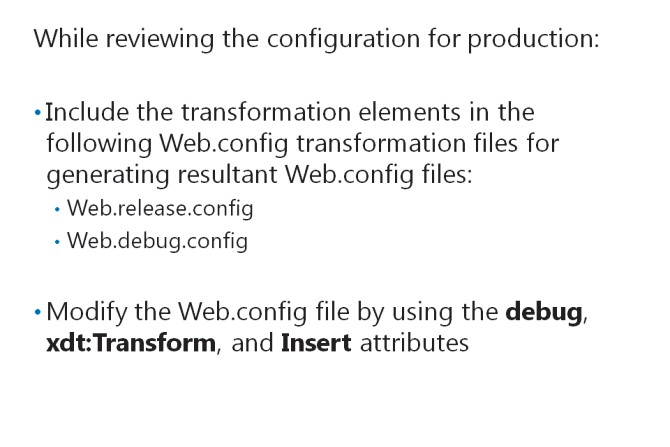
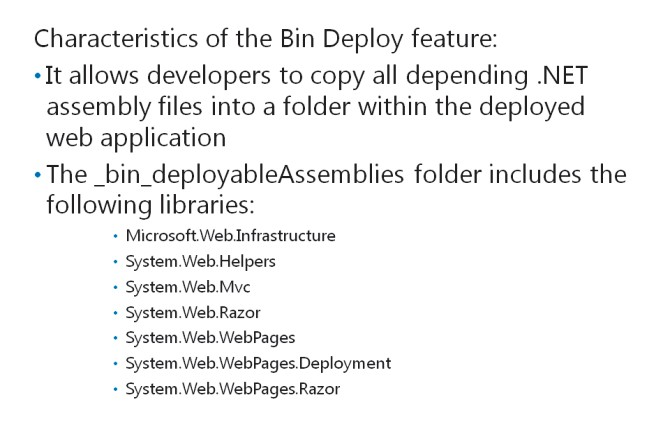
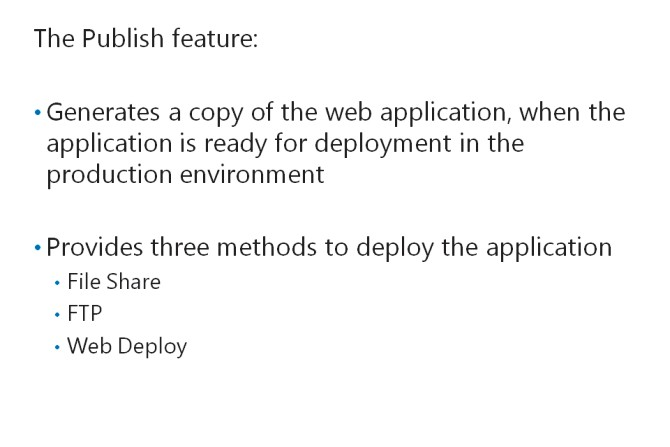
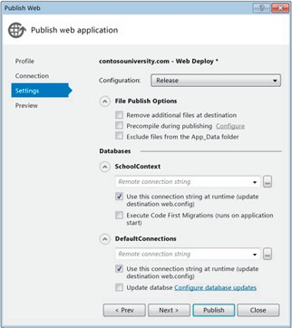

# Module 15 <br> Deploying ASP.NET MVC 5 Web Applications

#### Contents:

[Module Overview](15-0.md)    
[**Lesson 1:** Deploying a Web Application](15-1.md)    
[**Lesson 2:** Deploying an ASP.NET MVC 5 Web Application](15-2.md)

## Lesson 2 <br> **Deploying an ASP.NET MVC 5 Web Application**

Deploying ASP.NET MVC applications is similar to deploying other ASP.NET applications. This process is simple and straightforward. However, you need to update the configuration of the application for use in the production environment. Microsoft Visual Studio includes features that simplify updating the configuration of the application. You can also automate the deployment process by using deployment tools available in Microsoft Visual Studio.

### Lesson Objectives

After completing this lesson, you will be able to:

- Reconfigure an ASP.NET MVC application to deploy it on a production web server.

- Use the Bin Deploy method to deploy the .NET Framework libraries along with your web application.

- Use the deployment tools in Visual Studio.

### Reviewing Configuration for Production



Each ASP.NET MVC web application includes a Web.config file. In addition to this file, Microsoft Visual Studio creates two variance files to specify deployment transformations to the Web.config file. You can use these variance files for different build configurations. The variance files include:

- _The Web.release.config file_. This file stores the changes that Microsoft Visual Studio applies to the Web.config file, when you compile the application in the Release mode.

- _The Web.debug.config file_. This file stores the changes that Microsoft Visual Studio applies to the Web.config file, when you compile the application in the Debug mode.

Microsoft Visual Studio can automatically transform the Web.config file for use in different environments. Before you publish the application, you can remove the **debug** attribute from the Web.config file.

The following code shows how to remove the **debug** attribute from the Web.config file by using a deployment transformation.

**Removing the Debug Attribute for Deployment**

``` xml
<system.web>   
    <compilation xdt:Transform="RemoveAttributes(debug)" /> 
</system.web>
```

The following code shows how to remove the **debug** attribute from the Web.config file by using a deployment transformation.

**Removing the Debug Attribute by Using a Deployment Transformation**

``` xml
<system.web>
    <compilation xdt:Transform="RemoveAttributes(debug)" /> 
</system.web> 
```

The preceding code sample uses the **xdt:Transform** attribute to modify the existing Web.config file and produce the published Web.config file. You can also use the **Insert** value to add additional elements to the resultant Web.config file.

For example, the following code shows how to insert a new connection string setting in the resultant Web.config file.

**Inserting a Connection String**

``` xml
<connectionStrings>    
    <add name="DemoConnStr" 
    connectionString="Data Source=|DataDirectory|demo.sdf" 
    providerName="System.Data.SqlServerCe.4.0" 
    xdt:Transform="Insert"/> 
</connectionStrings>
```

**Question:** How can you configure the Web.config file for publishing to a production environment without using the Web.release.config configuration file?

### Using Bin Deploy



ASP.NET MVC applications depend on a range of .NET assemblies; these assemblies ensure that the application functions as required. These assemblies are dynamic-link library (DLL) files available in your project references. The assembly files are usually already present on the web server because they are included as part of the MVC library installation. However, sometimes the web server administrators do not install all .NET Framework assemblies. Microsoft Visual Studio provides the Bin Deploy feature to copy all depending assembly files into a folder within the deployed web application. This feature helps deploy dependencies on the server.

You can use the **Add Deployable Dependencies** feature to generate the \_bin\_deployableAssemblies folder. This folder includes the following libraries:

- Microsoft.Web.Infrastructure

- System.Web.Helpers

- System.Web.Mvc

- System.Web.Razor

- System.Web.WebPages

- System.Web.WebPages.Deployment

- System.Web.WebPages.Razor

You can choose a specific set of libraries to include in Microsoft Visual Studio. This practice enables you to ensure that Microsoft Visual Studio deploys the:

- Right assemblies.

- Right versions of the assemblies.

You can then copy the library to the bin folder of the production server, after adding it to the library of your project.

**Question:** Why should you use the deployable assembly as part of the deployment plan?

### Using Visual Studio 2015 Deployment Tools



The Publish feature helps generate a copy of the web application when the application is ready for deployment in the production environment. The feature includes three methods to deploy the application:

- File Share

- FTP

- Web Deploy

On the Publish web application page, you can publish the application by using File Share or FTP.

You can use File Share for servers to which you have direct network access. Alternatively, you can use File Share to publish a web application first to a local folder. Then, you can manually copy the files to the web server. File Share also allows you to specify a profile to store all deployment options. This practice eliminates the need to specify the deployment options every time you publish the application.

If you select **Web Deploy**, you can specify database settings, such as connection strings, in the publishing wizard. These settings will override the settings in the Web.config file in the target environment. Web Deploy also includes tools to automatically update the schema of the database. These tools eliminate the need to manually update the schema. The publishing tool detects all schema changes and generates scripts to apply those changes to the published database. If your development and production web servers are isolated from each other, you can run these generated scripts on the production environment. This practice replicates schema changes on a server where Microsoft Visual Studio is not installed.

The following image shows the Publish web application page.



**FIGURE 16.1: THE PUBLISH WEB APPLICATION PAGE**

**Question:** What is the benefit of using the Web Deploy publish tool?

