# Module 01   Exploring ASP.NET MVC 5

## Lab 1 -  Creating an ASP.NET MVC 5 Application

**Estimated time to complete this lab: 45 minutes**

ASP.NET MVC is a framework for building web applications that applies the general Model-View-Controller pattern to the ASP.NET framework. Let’s break that down by first looking at how ASP.NET MVC and the ASP.NET framework are related. In this lab, you will create and explore a web application project using ASP.NET MVC 5.

### Lab Objectives

After completing this lab, you will be able for:
- Create ASP.NET MVC 5 application project 
- Explore ASP.NET MVC 5 application project

### Lab Procedures

#### A. Creating ASP.NET MVC 5 Applications Project

Follow these steps to create a new MVC 5 project:

1. Choose **File** &rarr; **New Project**, as shown in the following figure:

    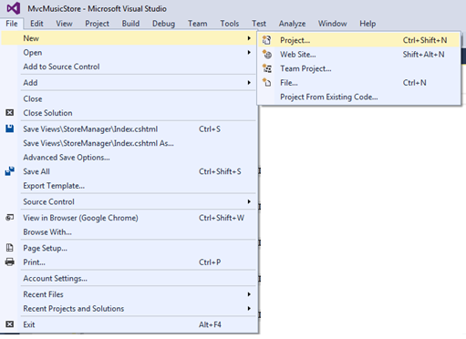

2. In the **Installed Templates** ection in the left column of the **New Project** dialog, shown in the following figure, select the **Visual C#** &rarr; **Web templates** list. A list of web application types appears in the center column.

    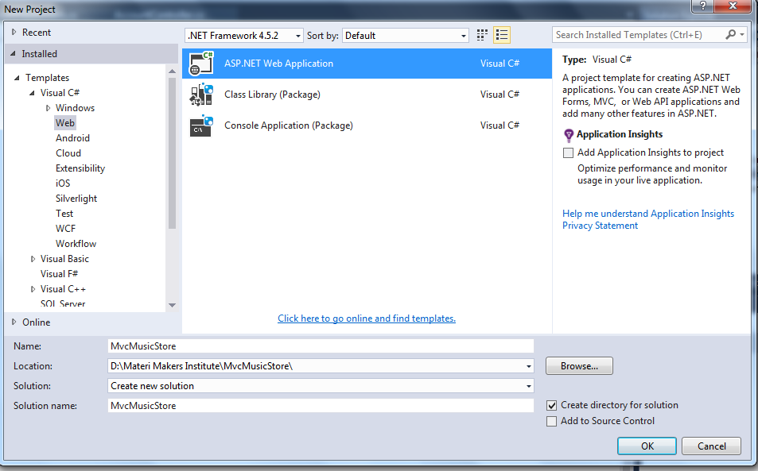

3. Select **ASP.NET Web Application**, name your application MvcMusicStore, and click **OK**.

4. After you create a new MVC 5 application, the New  ASP.NET Project dialog appears, as shown in the below figure. This presents common options for all ASP.NET applications:
    - Select a template
    - Add framework-specific folders and core references
    - Add unit tests
    - Configure authentication
    - Windows azure (Visual Studio 2013.2 and later)

    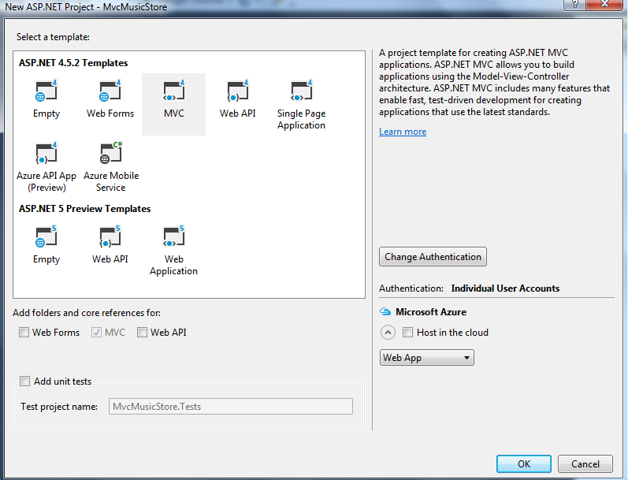

    The first two selections (Select a **Template** and **Add Folders and Core References For**) work together. The template selects the starting point, but then you can use then framework checkboxes to add support for Web Forms, MVC, and Web API. This means you can select an MVC template and add in Web Forms support, or select an Empty template and add in support for any of the frameworks.

    That capability extends beyond new project creation; you can add in support for any of the framework at any time, because the framework folders and core references are added via NuGet packages.

    For this lab, select **MVC** in the **Select a template** and choose the MVC check box in **Add Folders and Core References For**. 

5. Choose the **Add unit tests** and type “**MvcMusicStore.Tests**” in the **Test Project Name** field.

    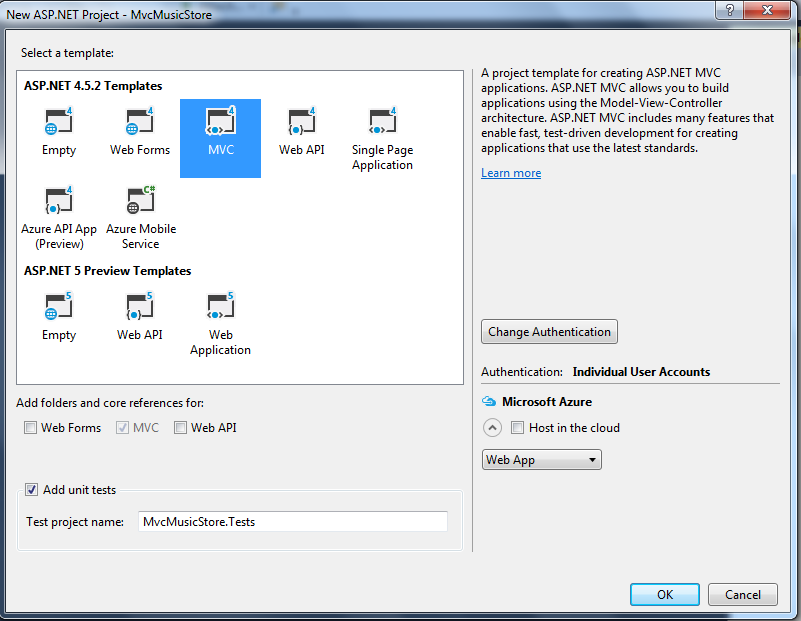

6. Click **Change Authentication** button to open Change Authentication dialog. For this lab, choose **Individual User Accounts** option, and then click OK as shown in the following figure.

    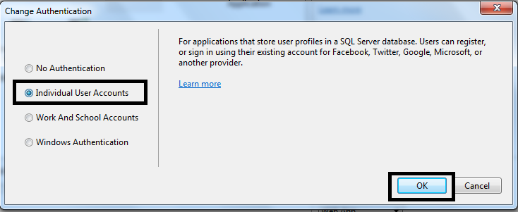

    This option is used for applications that store user profiles locally, suck as in a SQL Server database. This includes support for username / password accounts as well as social authentication providers.

7. Review your settings on the **New ASP.NET MVC 5 Project** dialog to make sure they match in the following figure, and then click **OK**.

8. This creates a solution for you with two projects – one for the web application and one for the unit tests, as shown in the following figure.

    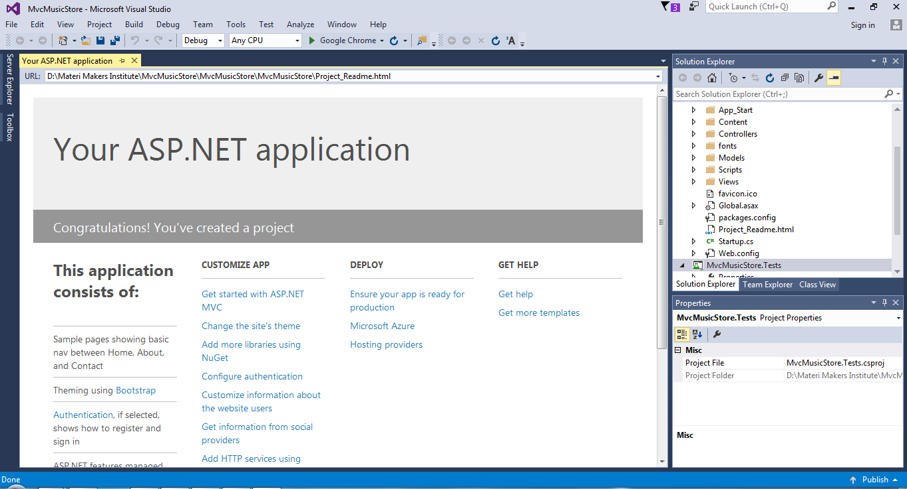

    New MVC projects include a **Project\_Readme.html** file in the root of the application. This file is automatically displayed when your project is created, as shown in the above figure.

    It is completely self-contained— all styles are included via HTML style tags, so when you’re done with it you can just delete the one file. This **Project\_Redme.html** file is customized for each application template and contains a lot of useful links to help you get started.

#### B. Exploring ASP.NET MVC 5 Application Project

Follow these steps to explore the ASP.NET MVC 5 application project elements:

1. When you create a new ASP.NET MVC application with Visual Studio, it automatically adds several files and directories to the project, as shown in the following figure.

    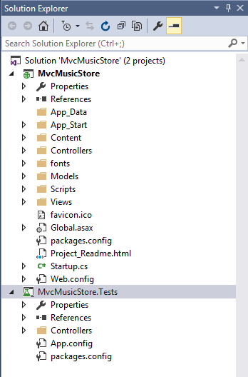

2.	ASP.NET MVC projects created with the internet application template have eight top-level directories, shown in table:

    |DIRECTORY	|PURPOSE|
    |---|---|
    |`/Controllers`	|Where you put Controller classes that handle URL requests|
    |`/Models`	|Where you put classes that represent and manipulate data and business objects|
    |`/Views`	|Where you put UI template files that are responsible for rendering output, such as HTML|
    |`/Scripts`	|Where you put JavaScript library files and scripts(.js)|
    |`/fonts`	|The bootsrap template system includes some custom web fonts, which are placed in this history|
    |`/Content` 	|Where you put CSS, images and other site content, other than scripts|
    |`/App_Data`	|Where you store data files you want to read/write|
    |`/App_Start`	|Where you put configuration code for features like Routing, bundling, and Web API|

3. Expands the `/Controllers` directory, you’ll find that Visual Studio added two Controller classes (see the below figure)—`HomeController` and `AccountController`—by default to the project.

    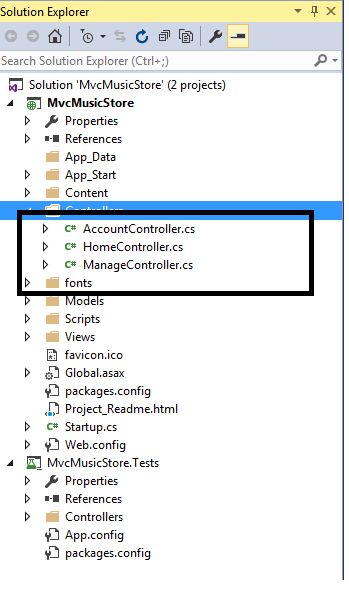

4. Expands the `/Views` directory, you’ll find that three subdirectories—`/Account`, `/Home`, and `/Shared`—as well as several template files within them, were also added to the project by default (see the below figure).

    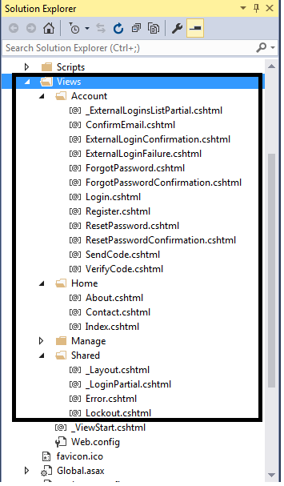

5. Expands the `/Content` and `/Scripts` directories, you’ll find the CSS files that is used to style all HTML on the site, as well as JavaScript libraries that can enable jQuery support within the application (see the below figure).

    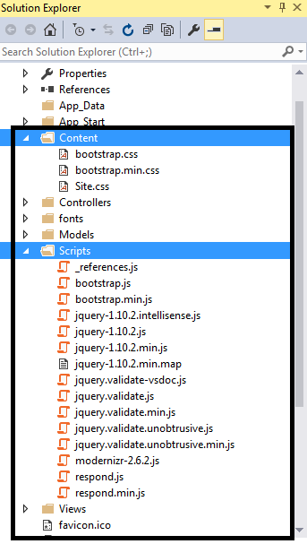

6. Expands the **MvcMusicStore.Tests** project, you’ll find a class that containts unit tests for your HomeController classes (see the below figure).

    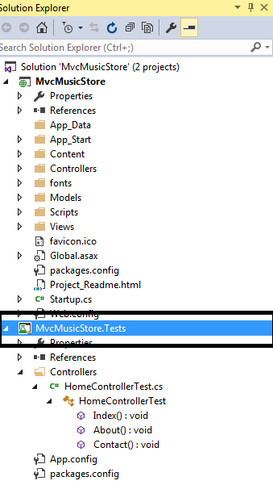
