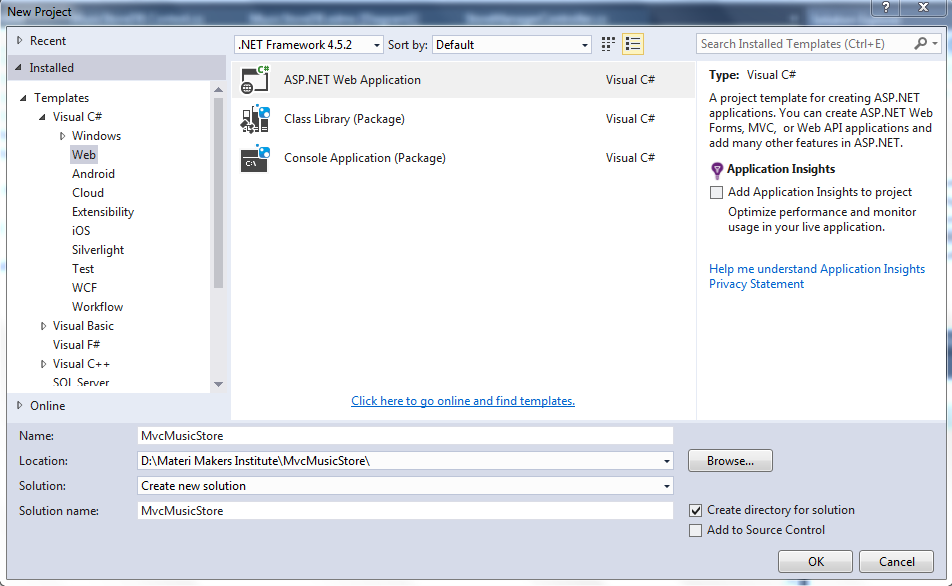
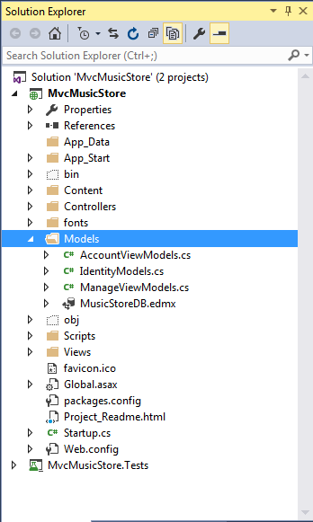
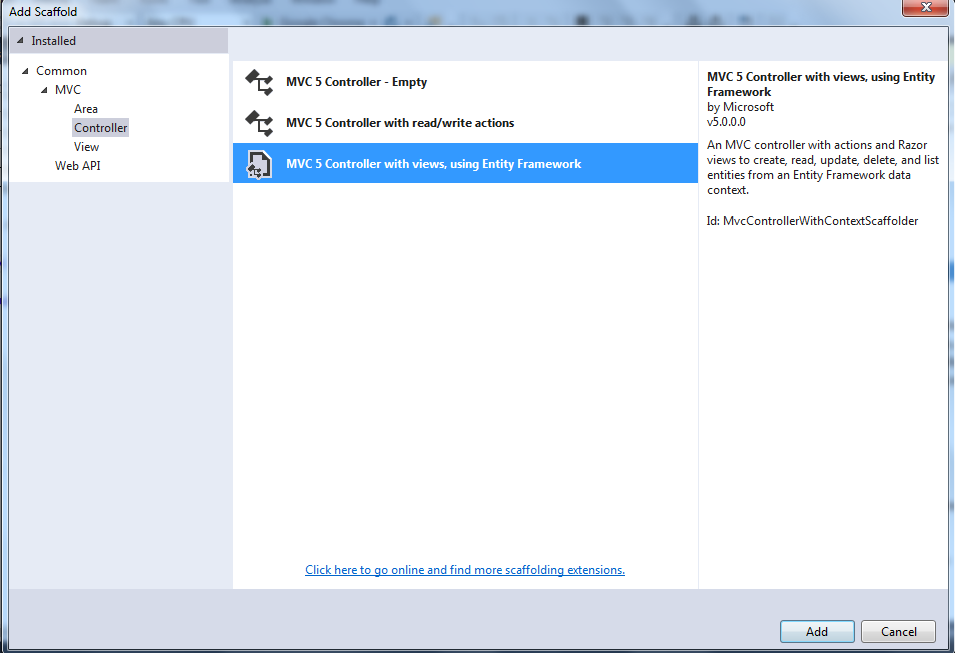
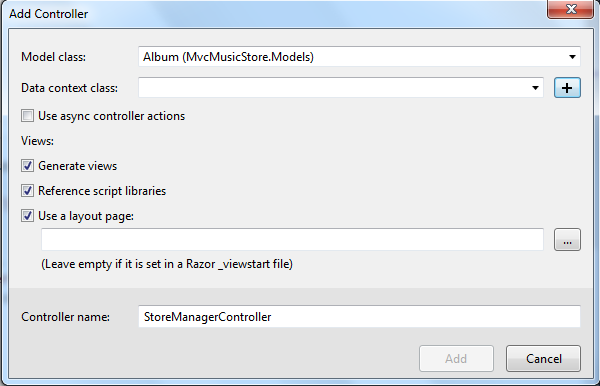
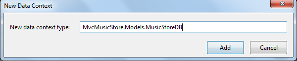
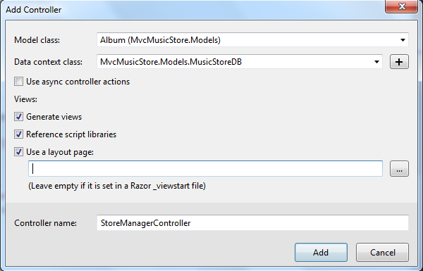
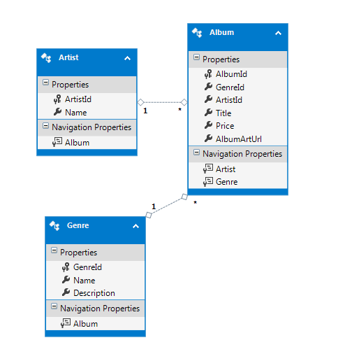
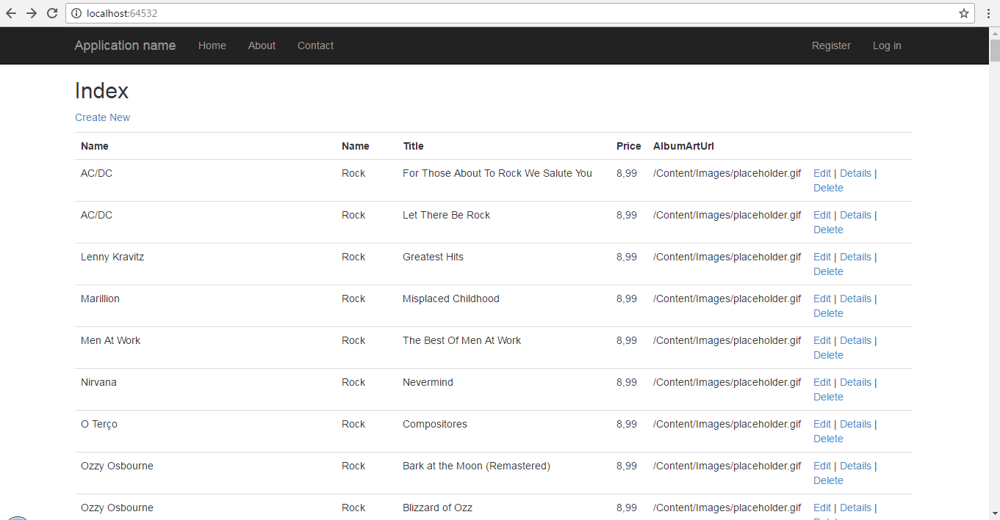
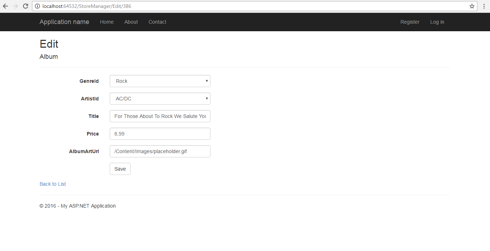
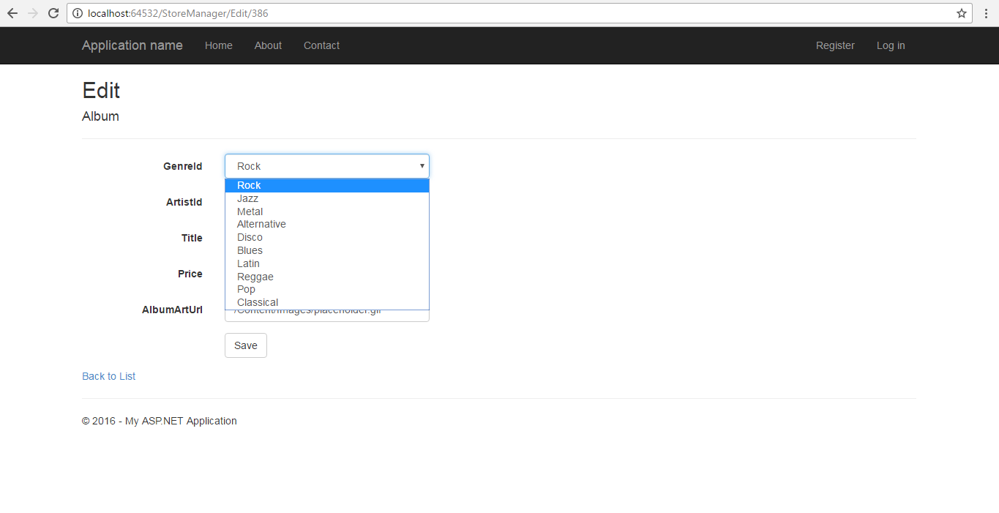

# Module 3 <br> Developing ASP.NET MVC 5 Models

## Lab 3 - Executing The Scaffolding Template

**Estimated time to complete this lab: 45 minutes**

Scaffolding in ASP.NET MVC can generate the boilerplate code you need for create, read, update, and delete (CRUD) functionality in an application. The scaffolding template can examine the type definition for model (such as the Album class you’ve created), and then generate a controller, the controller’s associated views, and in some cases data access classes as well. The scaffolding knows how to name controllers, how to name views, what code needs to go in each component, and where to place all these pieces in the project for the application to work.

A variety of Scaffolding templates are available in MVC 5. The scaffolding template you select controls just how far the scaffolding goes with code generation.

In this lab, you will execute the Scaffolding template, create database with the Entity Framework, build a resource to edit an album, and respond to the edit POST request.

### Lab Objectives

After completing this lab, you will be able to:
- Execute the Scaffolding template
- Create databases with the Entity Framework (EF)
- Use databases initializers
- Seed a database
- Build a resource to edit an album
- Respond to the edit POST request

### Lab Procedures

#### A.	Executing the Scaffolding Template

Follow these steps to execute Scaffolding template:

1.	Click File &rarr; New Project menu command to create a new ASP.NET Web Application in Visual Studio as shown in the following figure. 

    

2. The first step in building a music store is having the ability to list, create, edit, and delete the music album information. To add a new `Album` class to the `Models` folder, right-click the Models folder, select `Add... class`, and name the class `Album`. Leave the existing using and namespace statements intact and enter the properties shown in the bellow listing code to your newly created Album class:

    

    ``` cs
    public class Album {     
        public virtual int AlbumId { get; set; }
        public virtual int GenreId { get; set; }
        public virtual int ArtistId { get; set; }
        public virtual string Title { get; set; }
        public virtual decimal Price { get; set; }
        public virtual string AlbumArtUrl { get; set; }
        public virtual Genre Genre { get; set; }
        public virtual Artist Artist { get; set; }
    }
    ```

3. The primary purpose of the album model is to simulate attributes of a music album, such as the title and the price. Every album also has an association with a single artist, which you’ll model using a new `Artist` class. To do so, add new `Artist` class to the Models folder and enter the properties shown in the following code.

    ``` cs
    public class Artist {
        public virtual int ArtistId { get; set; }
        public virtual string Name { get; set; }
    }
    ```

4.	You might notice how each Album has two properties for managing an associated artist: the `Artist` property and the `ArtistId` Property. We call the artist property a *navigational* property, because given an album, you can navigate to the album’s associated artist using the dot operator (`favorite-Album.Artist`).

    We call the `ArtistId` property a foreign key property, because you know a bit about how database work, and you know artists and albums will each maintain an associatin with multiple albums. You want to have the foreign key value for an artist embedded in the model for your album, because a foreign key relationship will exist between the table of artist records and the table of album records.

5. An album also has an associated `genre`, and every genre can maintain a list of associated albums. Create a `genre` class in your `Models` folder and add the properties shown in the following code.

    ``` cs
    public class Genre {
        public virtual int GenreId { get; set; }
        public virtual string Name { get; set; }
        public virtual string Description { get; set; }
        public virtual List<Album> Albums { get; set; }
    }
    ```

    You might also notice that every property is virtual. We discuss why the properties are virtual later in the chapter. For now, these three simple class definitions are your starting models and includes everything you need to scaffold out a controller and some views and even create a database.

6. Now that you’ve finished adding the code for the three model classes, you can compile your application either with the Visual Studio **Build &rarr; Build Solution** menu item or the keyboard shortcut, **Ctrl + Shift + B**. Compiling your newly added model classes is important for two reasons:
    - It serves as a quick check to catch any simple syntax errors.
    - Nearly as important, the newly added classes won’t show up in the Visual Studio scaffolding dialogs in the next section until you’ve compiled the application. Compiling before using the scaffolding system is not just a good practice, it’s required for any new or changed models to show up in the scaffolding dialogs.

7. Right-click the **Controllers** folder and select **Add &rarr; Controller**. **The Add Scaffold** dialog appears, as shown in above figure.

    

8. Select the **MVC 5 Controller with views**, using the **Entity Framework** template and click the **Add**  button to display the corresponding **Add Contoller** dialog.

9. In the Add Controller dialog box (shown in the below figure), change the controller name to StoreManagerController and select Album as the Model class type, as shown in below figure. Note that the Add button is disabled because you haven’t selected the Data context class—you’ll do that next.

    

10. Click the **New data context** button to launch the **New Data Context** dialog, as shown in below figure. This dialog has just one field, which allows you to enter the name of the class you’ll use to access the database (including the namespace for the class).

11. Name your context `MusicStoreDB`, as shown in below figure, and click the **Add** button to set the context name. Because the **Add Controller** dialog now contains all required information, the **Add** button is now enabled.

    

12.	Verify that your dialog matches the example shown in below figure and click the **Add** button to scaffold a `StoreManagerController` and its associated views for the Album class.

    

13. After you click the **Add** button, scaffolding jumps into action and adds new files to various locations in the project.

14.	The scaffolding adds a `MusicStoreDB.cs` file into the models folder of your project. The class inside the file derives from the EF’s `DbContext` class and gives you access to album, genre, and artist information in the database. Even though you told the scaffolding only about the Album class, the scaffolding saw the related models and included them in the context, as shown in Listing below:

    ``` cs
    public class MusicStoreDB : DbContext
    {
      // You can add custom code to this file. Changes will not be overwritten
      //
      // If you want Entity Framework to drop and regenerate your database
      // Automatically whenever you change your model schema,
      // Please use data migrations.
      // For more information refer to the documentation:
      // http://msdn.microsoft.com/en-us/data/jj591621.aspx
      public MusicStoreDB() : base("name=MusicStoreDB")
      {
      } 
      public DbSet<MvcMusicStore.Models.Album> Albums { get; set; }
      public DbSet<MvcMusicStore.Models.Genre> Genres { get; set; }
      public DbSet<MvcMusicStore.Models.Artist> Artists { get; set; }
    }
    ```

15. To access a database, all you need to do is instantiate the data context class. You might be wondering what database the context will use. That question is answered later when you first run the application.

16.	The scaffolding template you selected also generates a `StoreManagerController` in the controllers folder of the application. The controller has all the code required to select and edit album information. Look at the starting few lines of the class definition, as shown in Listing below:

    ``` cs
    public class StoreManagerController : Controller 
    {
      private MusicStoreDB db = new MusicStoreDB();

      //
      // GET: /StoreManager/

      public ActionResult Index()
    {
    var albums = db.Albums.Include(a => a.Artist).Include(a => a.Genre);
      return View(albums.ToList());
    }
    // more later ...
    ```

17.	In this first code snippet, you can see the scaffolding adds a private field of type `MusicStoreDB` to the controller. The scaffolding also initializes the field with a new instance of the data context because every controller action requires database access. In the Index action, you can see the code is using the context to load all albums from the database into a list, and passing the list as the model for the default view.

18.	After the scaffolding finishes running, you’ll also find a collection of views under the new `Views/StoreManager` folder. These views provide the UI for listing, editing, and deleting albums. You can see the list in below figure. These views provide the UI for listing.

19.	The Index view has all the code needed to display a table full of music albums. The model for the view is an enumerable sequence of Album objects, and as you saw in the Index action earlier, an enumerable sequence of Album objects is precisely what the Index action delivers. The view takes the model and uses a foreach loop to create HTML table rows with album information, as shown in Listing below:

    ``` Razor
    @model IEnumerable<MvcMusicStore.Models.Album>

    @{
        ViewBag.Title = "Index";
    }

    <h2>Index</h2>

    <p>
        @Html.ActionLink("Create New", "Create")
    </p>

    <table class="table">
        <tr>
            <th>@Html.DisplayNameFor(model => model.Artist.Name)</th>
            <th>@Html.DisplayNameFor(model => model.Genre.Name)</th>
            <th>@Html.DisplayNameFor(model => model.Title)</th>
            <th>@Html.DisplayNameFor(model => model.Price)</th>
            <th>@Html.DisplayNameFor(model => model.AlbumArtUrl)</th>
            <th></th>
        </tr>

        @foreach (var item in Model) {
            <tr>
                <td>
                    @Html.DisplayFor(modelItem => item.Artist.Name)
                </td>
                <td>
                    @Html.DisplayFor(modelItem => item.Genre.Name)
                </td>
                <td>
                    @Html.DisplayFor(modelItem => item.Title)
                </td>
                <td>
                    @Html.DisplayFor(modelItem => item.Price)
                </td>
                <td>
                    @Html.DisplayFor(modelItem => item.AlbumArtUrl)
                </td>
                <td>
                    @Html.ActionLink("Edit", "Edit", new { id=item.AlbumId }) |
                    @Html.ActionLink("Details", "Details", new { id=item.AlbumId }) |
                    @Html.ActionLink("Delete", "Delete", new { id=item.AlbumId })
                </td>
            </tr>
        }
    </table>
    ```

    Notice how the scaffolding selected all the “important” fields for the customer to see. In other words, the table in the view does not display any foreign key property values (they would be meaningless to a customer), but does display the associated genre’s name and the associated artist’s name.

#### B.	Creating Databases with the Entity Framework (EF)

Before you start the application running, let’s address a burning question from earlier in this lab. What database does `MusicStoreDB` use? You haven’t created a database for the application to use or even specified a database connection. Follow these steps to create database with the EF:

1.	The code-first approach of EF attempts to use convention over configuration as much as possible. If you don’t configure specific mappings from your models to database tables and columns, EF uses conventions to create a database schema. If you don’t configure a specific database connection to use at runtime, EF creates one using a convention.

2.	Explicitly configuring a connection for a code-first data context is as easy as adding a connection string to the web.config file. By convention, EF will look for a connection string with a name matching the name of the data context class. This allows you to control the context’s database connections in two ways.

3.	Without a specific connection configured, EF tries to connection to a `LocalDB` instance of SQL Server and find a database with the same name as the `DbContext`, derived class. If EF can connect to the database server, but doesn’t find a database, the framework creates the database. If you run the application after scaffolding completes, and navigate to the /StoreManager URL, you’ll discover that the EF has created a database named MvcMusicStore.Models.MusicStoreDB in LocalDB. If you look at an Entity Data Model diagram of the new database, you’ll see what’s shown in below Figure.

4.	The EF automatically creates tables to store album, artist, and genre information. The framework uses the model’s property names and data types to determine the names and data types of the table column. Notice how the framework also deduced each table’s primary key column and the foreign key relationships between tables.

    

#### C.	Using Database Initializers

An easy way to keep the database in sync with changes to your model is to allow the Entity Framework to re-create an existing database. You can tell EF to re-create the database every time an application starts, or you can tell EF to re-create the database only when it detects a change in the model. You choose one of these two strategies when calling the static `SetInializer` method of EF’s Database class (from the `System.Data.Entity` namespace).

When you call `SetInializer` you need to pass in an `IdatabaseInitializer` object, and two are provided with the framework: `DropCreateDatabaseAlways` and `DropCreateDatabaseIfModelChanges`. You can tell by the names of the classes which strategy each class represents. Both initializers require a generic type parameter, and the parameter must be a `DbContext` derived class.

To re-create the music store database every time the application starts afresh. Inside global.asax.cs, you can set an initializer during application startup:

``` cs
protected void Application_Start(){
    Database.SetInitializer(new DropCreateDatabaseAlways<MvcMusicStore>());
    AreaRegistration.RegisterAllAreas();
    FilterConfig.RegisterGlobalFilters(GlobalFilters.Filters);
    RouteConfig.RegisterRoutes(RouteTable.Routes);
    BundleConfig.RegisterBundles(BundleTable).Bundles;
}
```

#### D.	Seeding a Database

For the MVC Music Store, pretend you want to start development by re-creating the database every time your application restarts. However, you want the new database to have a couple of genres, artists, and even an album available so you can work with the application without entering data to put the application into usable state. In this lab you can derive a class from the `DropCreateDatabaseAlways` class and override the seed method. The seed method enables you to create some initial data for the appication. To see this in action, create a new `MusicStoreDbInitializer` class in your Models folder, inserting the Seed method shown in Listing below.

``` cs
public class MusicStoreDbInitializer : System.Data.Entity.DropCreateDatabaseAlways<MusicStoreDB>
{
    protected override void Seed(MusicStoreDB context)
    {
        context.Artists.Add(new Artist { Name = "Al Di Meola" });
        context.Genres.Add(new Genre { Name = "Jazz" });
        context.Albums.Add(new Album
        {
            Artist = new Artist { Name = "Rush" },
            Genre = new Genre { Name = "Rock" },
            Price = 9.99m,
            Title = "Caravan"
        });
        base.Seed(context);
    }	
}
```

Calling into the base class implementation of the Seed method saves your new objects into the database. You’ll have a total of two genres (Jazz and Rock), two artist (Al Di Meola and Rush), and single album every time your music store database is regenerated. For the new database initializer to work, you need to change the application startup code to register the initializer, as shown in Listing below. 

``` cs
protected void Application_Start()
{
    Database.SetInitializer(new MusicStoreDbInitializer());
	AreaRegistration.RegisterAllAreas();
    FilterConfig.RegisterGlobalFilters(RegisterGlobalFilters.Filters);
    RouteConfig.RegisterRoutes(RouteTable.Routes);
    BundleConfig.RegisterBundles(BundleTable.Bundles);
}
```

If you restart and run the application now, and navigate to the `/StoreManager` URL, you’ll see the store manager’s `Index` view, as shown in below Figure. 



#### E.	Building a Resource to Edit an Album

The default MVC routing rules deliver the HTTP GET for `/StoreManager/Edit/5` to the Edit action of the `StoreManager` controller (shown in the following code—you don’t need to type this in, because it was generated when you scaffolded the `StoreManager` controller):

``` cs
// GET: /StoreManager/Edit/5
public ActionResult Edit(int? id)
{
    if (id == null)
    {
        return new HttpStatusCodeResult(HttpStatusCode.BadRequest);
    }
    Album album = db.Albums.Find(id);
    if (album == null)
    {
        return HttpNotFound();
    }
    ViewBag.ArtistId = new SelectList(db.Artists, "ArtistId", "Name", album.ArtistId);
    ViewBag.GenreId = new SelectList(db.Genres, "GenreId", "Name", album.GenreId);
            
    return View(album);
}
```

The Edit action has the responsibility of building a model to edit album #5. It uses `theMusicStoreDB` class to retrieve the album and hands the album to the view as the model. But what is the purpose of the two lines of code putting data into the `ViewBag`? These two lines might make more sense when you look at the page a user sees for editing an album (shown in below figure). Because you only have one album in your database, you’ll browse to `/StoreManager/Edit/1`.



When users edit an album, you don’t want them to enter free form text for the genre and artist values. Instead, you want them to select a genre and artist that are already available from database.

The scaffolding is smart enough to realize this, too, because it understands the association beween album, artist, and genre.

Instead of giving the user a textbox to type into, the scaffolding generates an edit view with a dropdown list to select an existing genre, as shown in below figure.



The following code is from the store manager’s Edit view, and it is the code that builds the dropdown list for genre (shown opened with the two available genres in below figure):

``` cs
<div class="col-md-10">
    @Html.DropDownList("GenreId", String.Empty)
    @Html.ValidationMessageFor(model => model.GenreId)
</div>
```

You look at the `DropDownList` helper in more detail in the next chapter, but for now picture yourself buiding a drop-down list from scratch. To build the list, you need to know what list items are available. An Album model object does not keep all the available genres from database—an Album object holds only the one genre associated with itself. The two extra lines of code in the edit action are building the lists of every posibble artist and every possible genre, and storing those list in the ViewBag for the `DropDownList` helper to retrieve later.

``` cs
ViewBag.ArtistId = new SelectList(db.Artists, "ArtistId", "Name", album.ArtistId);
ViewBag.GenreId = new SelectList(db.Genres, "GenreId", "Name", album.GenreId);
```

The SelectList class that the code uses represents the data required to build a drop-down list. The first parameter to the constructor specifies the items to place in the list. The second parameter is this name of the property containing the value to use when the user selects a specific item (a key value, such as 52 or 2). The third is the text to display for each item (such as “Rock” or “Rush”). Finally, the third parameter contains the value of the initially selected item.

#### F.	Responding to the Edit POST Request

The action accepting an HTTP POST request to edit album information also has the name Edit, but is differentiated from the previous Edit action you saw because of an `HttpPost` action selector attribute:

``` cs
// POST: /StoreManager/Edit/5
// To protect from overposting attacks, please enable the specific
// properties you want to bind to, for more details see.
// https://go.microsoft.com/fwlink/?LinkId=317598.  
[HttpPost]
[ValidateAntiForgeryToken]
public ActionResult Edit ([Bind(Include="AlbumId,GenreId,ArtistId,Title,Price,AlbumArtUrl")]   Album album)
{
    if (ModelState.IsValid)
    {
        db.Entry(album).State = EntityState.Modified;
        db.SaveChanges();
        return RedirectToAction("Index");
    }
	ViewBag.ArtistId = new SelectList(db.Artists, "ArtistId", "Name", album.ArtistId);
    ViewBag.GenreId = new SelectList(db.Genres, "GenreId", "Name", album.GenreId);
    
    return View(album);
}
```

The responsibility of this action is to accept an Album model object with all the user’s edits inside, and save the object into the database. You might be wondering how to updated Album object appears as a parameter to the action.
