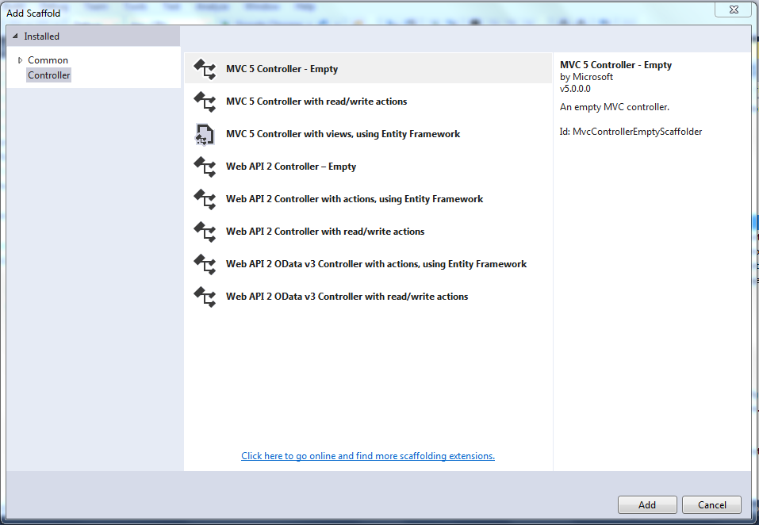
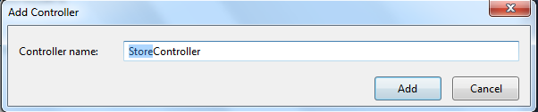
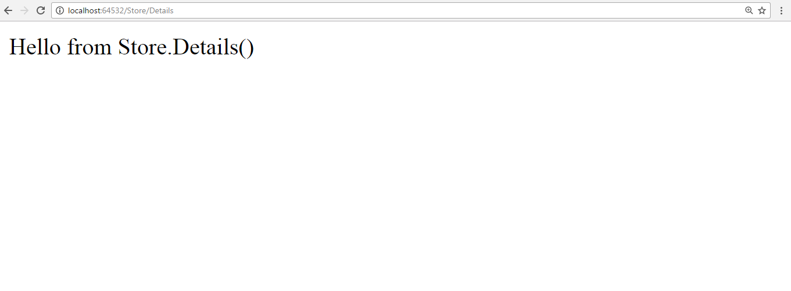
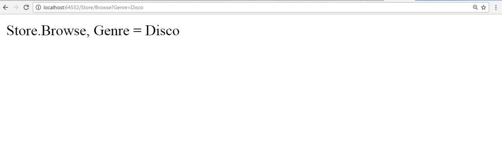
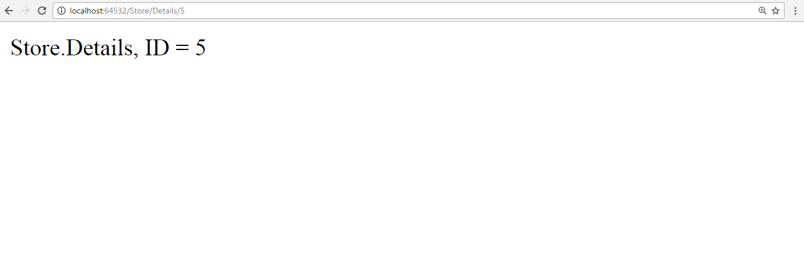

# Module 4 <br> Developing ASP.NET MVC 5 Controllers

## Lab 4 - Creating the New Controllers

**Estimated time to complete this lab: 30 minutes**

Controllers within the MVC pattern are responsible for responding to user input, often making changes to the model in response to user input. In this way, controllers in the MVC pattern are concerned with flow of the application, working with data coming in, and providing adara going out to the relevant view.

In this lab, you'll create a controller to handle URLs related to browsing through the music catalog. This controller will support three scenarios:
- The index page lists the music genres that your store carries.
- Clicking a genre leads to a browse page that list all the music albums in a particular genre.
- Clicking an album leads to a details page that shows information about a specific music album.

### Lab Objectives

After completing this lab, you will be able to: 
- Create the new controller
- Write your action methods
- Modify parameters in controller actions

### Lab Procedures

#### A. Creating the New Controllers

To create the controller, you start by adding a new `StoreController` class. To do so:

1. Right-click the **Controllers** folder within the **Solution Explorer** and select the **Add &rarr; Controller** menu item, as shown in below figure.

    

2. Select the **MVC Controller - Empty** scaffolding template, as shown in below figure.

    

3. Name the controller `StoreController` and press the **Add** button, as shown in below figure.

    

#### B. Writing Your Action methods

Your new `StoreController` already has and Index method. You'll use this Index method to implement your listing page that lists all genres in your music store. You'll also add two additional methods to implement the two other scenarios you want your `StoreController` to handle: `Browser` and `Details`.

These methods (`Index`, `Browse`, and `Details`) within your controller are called _controller actions_. As you've already seen with the `HomeController.Index` action method, their job is to respond to URL request, perform the appropriate actions, and return a response back to the browser or user that invoked the URL. 

To get an idea of how a controller action works, follow these steps:

1. Change the signature of the Index method to return a string (rather than an `ActionResult`) and change the return value to `"Hello from Store.Index()"` as follows:

    ``` cs
    //
    // GET: /Store/
    public string Index()
    {
        return "Hello from Store.Index()";
    }
    ```
2. Add a `Store.Browse` action that returns `"Hello form Store.Browse"` and a `Store.Details` action that returns `"Hello from Store.Details()"`, as shown in the complete code for the `StoreController` that follows:

    ``` cs
    using System;
    using System.Collections.Generic;
    using System.Linq;
    using System.Web;
    using System.Web.Mvc;

    namespace MvcMusicStore.Controllers
    {
        public class StoreController : Controller
        {
            //
            // GET: /Store/
            public string Index()
            {
                return "Hello from Store.Index()";
            }

            //
            // GET: /Store/Browse
            public string Browse()
            {
                return "Hello from Store.Browse()";
            }

            //
            // GET: /Store/Details
            public string Details()
            {
                return "Hello from Store.Details()";
            }
        }
    }
    ```

3. Run the project again and browse the following URLs:
    - `http://localhost:49307/Store`
    - `http://localhost:49307/Store/Browse`
    - `http://localhost:49307/Store/Details`

4. Accessing these URLs invokes the action methods within your controller and returns string responses, as shown in below figure.

    

#### C. Modifying Parameters in Controller actions

The previous examples have been of writing out constant strings. The next step is to make them dynamic actions by reacting to parameters that are passed in via the URL. You can do so by following these steps:

1. Change the `Browse` action method to retrieve a  query string value from the URL. You can do this by adding a "genre" parameter of type `string` to you action method. When you do this, ASP.NET MVC automatically passes any query string or form post parameters named "genre" to your action method when it is invoked.

    ``` cs
    //
    // GET : /Store/Browse?genre=?Disco
    pubic string Browse(string genre)
    {
        string message = HttpUtility.HtmlEncode("Store.Browse, Genre = " + genre);
        return message;
    }
    ```

2. Browse to `http://localhost:49307/Store/Browse?Genre=Disco` as shown in below figure.

    

3. This show that your controller actions can read a query string value by accepting it as a parameter on the action method.

4. Change the `Details` action to read and display an input parameter named ID. Unlike the previous method, you won't be embedding the ID value as a query string parameter. Instead you'll embed it directly within the URL itself. For example: /Store/Details/5. ASP.NET MVC lets you easily do this without having to configure anything extra. ASP.NET MVC's default routing convention is to treat the segment of a URL after the action method name as a parameter named ID. If your action method has a parameter named ID, then ASP.NET MVC automatically passes the URL segment to you as parameter.

    ``` cs
    //
    // GET: /Store/Details/5
    public string Details(int id)
    { 
        string message = "Store.Details, ID = " + id;
        return message;
    }
    ```

5. Run the application and browse to `http://localhost:49307/Store/5`, as shown in below figure.

    

    As the preceding examples indicate, you can look at controller actions as if the web browser were directly callings methods on your controller class.

    The class, method, and parameters are all specified  as path segments or query string in the URL, and the result is a string that's returned to the browser. That's a huge oversimplification, ignoring things such as:
    
    - The way routing maps the URL to actions.

    - The fact that you'll almost always use views as templates to generate the strings (usually HTML) to be returned to the browser.

    - The fact that actions rarely return raw strings; they usually return the appropriate `ActionResult`, which handles things such as HTTP status codes, calling the View templating system, and so on.

    Controllers offer a lot of opportunities for customization and extensibility, but you'll probably find that you rarely&mdash;if ever&mdash;need to take advantage of that fact. In general use, controllers are called via a URL, they execute you custom code, and they return a view. With that in mind, we'll defer our look at the gory details behind how controllers are defined, invoked, and extended.