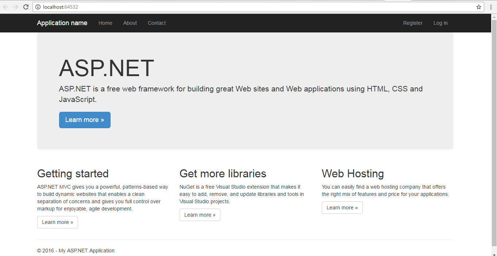
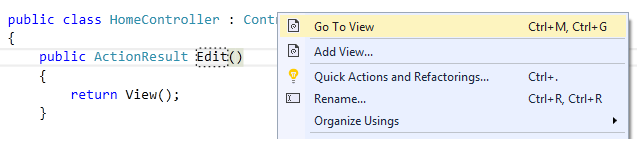

# Module 5 <br> Developing ASP.NET MVC 5 Views

## Lab 5 - Adding a View

**Estimated time to complete this lab: 45 minutes**

Developers spend a lot of time focusing on crafting wll-factored controller and model objects—and for good reason, because clean, well-written code in these areas forms the basis of a maintainable web application.

But when user a visits your web application in a browser, none of that work is visible. A user’s first impression and entire interaction with your application starts with the view. The view is effectively your application’s ambassador to the user.

In this lab, you will demonstrate how views work in ASP.NET MVC and what their responsibilities are, and provide you with the tools to build views that your application will be proud to wear.

### Lab Objectives

After completing this lab, you will be able to:

-	Explore the View component
-	Add View
-	Specify a partial view

### Lab Procedures

#### A.	Exploring the View Component

We’re going to start off pretty slow, for those of you who are new to ASP.NET MVC in general. The easiest way to get the hang of what views do is to take a look at the sample views that are created in a new ASP.NET MVC application. Follow these steps to explore the View Component within the ASP.NET MVC 5 application project:

1.	Open the /Views/Home/Index.cshtml file from the project you have created. (See the below script).

    ``` Razor
    @{
        ViewBag.Title = "Home Page";
    }

    <div class="jumbotron">
        <h1>ASP.NET</h1>
        <p class="lead">ASP.NET is a free web framework for building great Web sites and Web applications using HTML, CSS and JavaScript.</p>
        <p><a href="http://asp.net" class="btn btn-primary btn-lg">Learn more &raquo;</a></p>
    </div>
    <div class="row">
        <div class="col-md-4">
            <h2>Getting started</h2>
            <p>
                ASP.NET MVC gives you a powerful, patterns-based way to build dynamic websites that enables a clean separation of concerns and gives you full control over markup for enjoyable, agile development.
            </p>
            <p><a class="btn btn-default" href="http://go.microsoft.com/fwlink/?LinkId=301865">Learn more &raquo;</a></p>
        </div>
        <div class="col-md-4">
            <h2>Get more libraries</h2>
            <p>NuGet is a free Visual Studio extension that makes it easy to add, remove, and update libraries and tools in Visual Studio projects.</p>
            <p><a class="btn btn-default" href="http://go.microsoft.com/fwlink/?LinkId=301866">Learn more &raquo;</a></p>
        </div>
        <div class="col-md-4">
            <h2>Web Hosting</h2>
            <p>You can easily find a web hosting company that offers the right mix of features and price for your applications.</p>
            <p><a class="btn btn-default" href="http://go.microsoft.com/fwlink/?LinkId=301867">Learn more &raquo;</a></p>
        </div>
    </div>
    ```

    Aside from the tiny bit of code at the top that sets the page title, this is all just standard HTML.

2.	Open the **/Contoller/HomeController.cs** and see the following script:

    ``` cs
    public ActionResult Index()
    {
        return View();
    }
    ```

3.	Browsing to the root of the site (as shown in the following figure) yields no surprises: the Index method of the HomeController renders the Home Index view, which is just the preceding view’s HTML content wrapped in a header and footer provided by the site layout.

    

#### B.	Adding a View

In the previous labs you learned how a controller specifies a view. But how does that view get created in the first place? You could certainly create a file by hand and add it to your **Views** directory, but the ASP.NET MVC tooling for Visual Studio makes adding a view using the Add View dialog very easy. Follow these steps to add your custom Views:

1.	Create a new action method within **HomeController** file and then named Edit.
2.	Right-click in **Edit** action method **&rarr; Add View ...** (see the below figure) to open **Add View** dialog.

    

3.	Please fill the following fields within the **Add View** dialog.
    -	View name		            : **Edit**
    -	Template			        : **Empty (without model)**
    -	Reference script libraries	: <use default layout> 
    -	Create as a partial view 	: <use default value>
    -	Use a layout page		    : <use default layout: **\_ViewStart.cshtml**>

4.	Click **Add** button to confirm the **Add View** dialog.

#### C.	Specifying a Partial View 

In addition to returning a view, an action method can also return a partial view in the form of a **PartialViewResult** via the **PartialView method**. Follow these steps to the specify a partial view.

1.	Write the following scripts within HomeController to specify a partial view.

    ``` cs
    public class HomeController : Controller
    {
        public ActionResult Message()
        {
            ViewBag.Message = "This is a partial view.";
    return PartialView();
        }
    }
    ```

    If the layout is specified by a **\_ViewStart.cshtml** page (and not directly within the view), the layout is not rendered.

2.	In this lab, the view named **Message.cshtml** is rendered; however, if the layout is specified by **\_ViewStart.cshtml** page (and not directly within the view), the layout is not rendered. For this lab, you will choose the default value.

3.	Open the **view** file.

4.	Write the following partial view. Its looks like a normal view, except it doesn’t specify a layout:

    ``` HTML
    <h2>@ViewBag.Message</h2>
    ```
    
    This is useful in partial update scenarios using Ajax.

5.	Write the following example using jQuery to load the contents of a partial view into the current view using an Ajax call:

    ``` Razor
    <div id=”result”></div>
    @section scripts {
        <script type=”text/javascript”>
            $(function() {
                $(‘#result’).load(‘/home/message’);
            });
        </script>
    }
    ```

6.	The preceding code uses the jQuery load method to make an Ajax request to the **Message action** and update the **DIV** with the id result with the result of the request.

7.	Press **Ctrl+F5** on your project and visit the following path:
    -	/home/Edit
    -	/home/message
