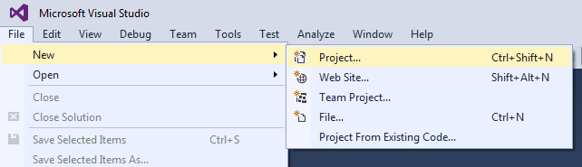
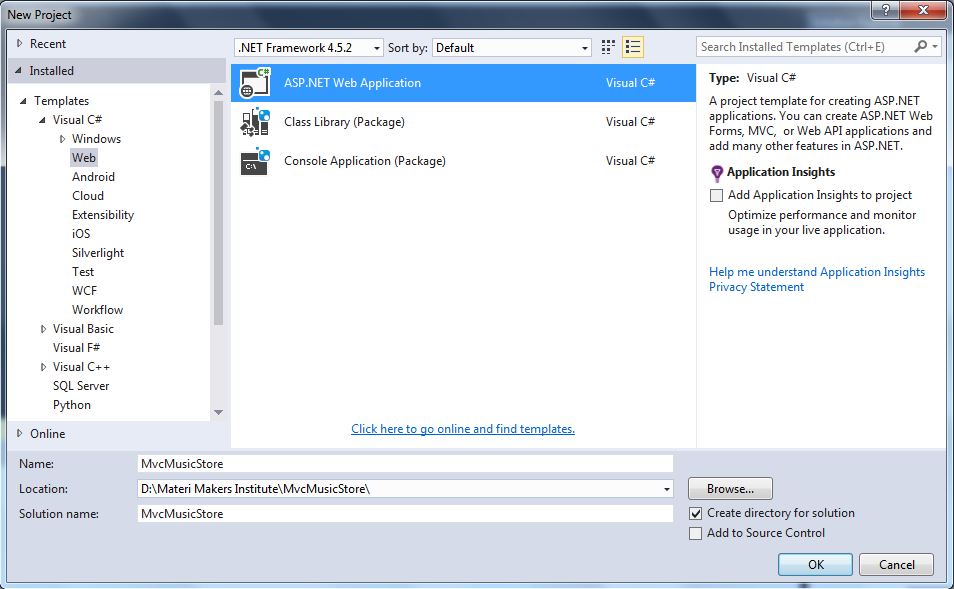
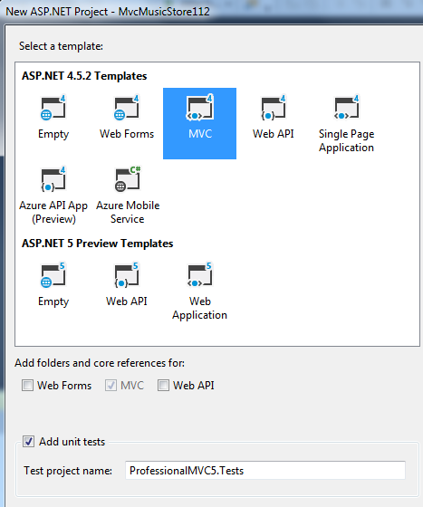
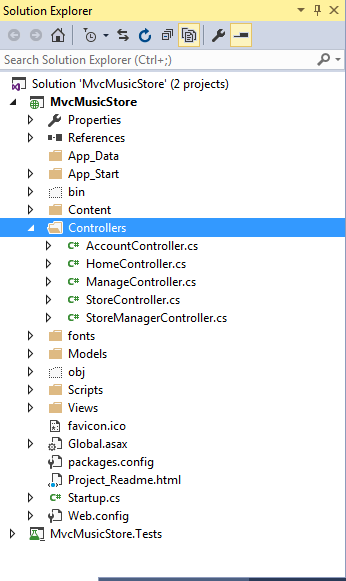

# **MODULE 6** <br> TESTING AND DEBUGGING ASP.NET MVC 5 WEB APPLICATIONS

## LAB  6 -  BUILDING A UNIT TEST PROJECT

**Estimated time to complete this lab: 30 minutes**

Unit testing and developing testable software have become recognized as essential elements in the software quality process. Most professional developers practice some form of unit testing in their daily jobs. Test-Driven Development (TDD) is a style of writing unit tests where the developer writes a test before writing any production code. Test-driven development is the process of using unit tests to drive the design of your production code by writing the tests first; and then writing just enough production code to make the tests pass.
TDD allows the developer to evolve the design in an organic way, while still gaining the quality and regression testing benefits of unit tests. ASP.NET MVC was written with unit testing in mind. In this lab you will lean how unit testing (and TDD in particular) applies to ASP.NET MVC.

### Lab Objectives
After completing this lab, you will be able to:
-	Build ASP.NET MVC web applications with unit test   project
-	Examine the default unit tests
-	Test only the code you write
-	Test validators

### Lab Procedures

#### A.	Building ASP.NET MVC Web Application  with  Unit Test Project

The MS Test unit-testing framework is included with all editions of Visual Studio 2013 (even the free editions) and contains a much-improved unit test runner. Follow these steps to build a new project with unit test:
1. Choose **File &rarr; New Project**, as shown in the following figure:
    
    

2.	In the **Installed Templates** section, choose **Web ASP.NET Web Application**.
    
    
 
3.	Give the name for your application with **MvcMusicStoreTestingProject**, and click **OK**.

4.	Select the **Add Unit Tests** checkbox to create the unit test project as shown in the following figure.
    
    

By selecting the checkbox, you're telling the ASP.NET **New Project Wizard** not only to create an associated unit test project, but also to populate it with a set of default unit tests. These default unit tests can help new users understand how to write tests against an MVC application. 

#### B.	Examining the Default Unit Tests

The default application templates give you just enough functionality to get you started with your first application. Follow these steps to examine the default unit tests for HomeController (the default controller class):
1.	Click **HomeController.cs** from **Solution Explorer**.
    
    

    Make sure that this file contains three action methods (**Index**, **About**, and **Contact**). This is the source for the Index action:
    
    ``` cs
    public ActionResult Index() 
    {
        return View();
    }
    ```

2.	The default unit test project has exactly one test for the **Index** action:

    ``` cs
    [TestMethod]
    public void Index()
    {
        // Arrange
        HomeController controller = new HomeController();
        // Act
        ViewResult result = controller.Index() as ViewResult;
        //Assert
        Assert.IsNotNull(result);
    }
    ```

    This is a pretty good unit test. However, even this unit test has room for improvement. 

    The action method (`Index()`) is only one line of code, but it's actually doing two things:
    -	It returns a view  result.
    -	The view result uses the default view.
    
    This unit test is only testing one of these two behaviors. You could argue that you need to at least add a second assert (to ensure that the view name is null).
    
    The unit test needs to have an instance of the `ViewResult` class so that it can get access to the `ViewBag` property. So you need to use the as keyword to cast  the result  of action `Index` into the `ViewResult` type.
    
    You can change the above scripts into the below so that the cast is unnecessary:

    ``` cs
    public ViewResultm Index()
    {
        return View();
    }
    ```

    By changing the return value of the action method from the general `ActionResult` to the specific `ViewResult`, you've more clearly expressed the intention of your code: This action method always returns a view.

3.	Let’s rewrite the test now to verify both behaviors:  
    
    ``` cs
    [TestMethod]
    public void IndexShouldAskForDefaultView()
    {
        var controller = new HomeController{); 
        ViewResult result = controller.Index(); 
        Assert.IsNotNull(result); 
        Assert.IsNull(result.ViewName);
    }
    ```

#### C.	Testing Only the Code You Write

One of the more common mistakes that people new to unit testing and TDD make is to test code they didn't write, even if inadvertently. Your tests should be focused on the code that you wrote, and not the code or logic  that it  depends  upon. Follow  these steps to test only the  code you write:
1.	Let’s revisit the test from the last lab:

    ``` cs
    [TestMethod]  
    public void Index()
    {
        // Arrange 
        HomeController controller = new HomeController();
        // Act
        ViewResult result = controller.Index() as ViewResult();
        // Assert
        Assert.IsNotNull(result); 
    }
    ```

2.	When a controller action is invoked and a view is rendered by the MVC pipeline, a whole lot of stuff happens: Action methods are located by MVC, they are called with model binders invoked for any action parameters, the result is taken from the method and executed, and the resulting output is sent back to the browser. In addition, because you asked for the default view, that means the system attempts to find a view named **Index** (to match your action name), and it will look in the **~/Views/Home** and **~/Views/Shared** folders to find it. This unit test doesn't concern itself with any of that code. You focus on the code under test and none of its collaborators.

#### D.	Testing Validators

Follow these steps to create the testing validators for your ASP.NET MVC web applications.
1.	The following code shows how you would initialize the validation context to unit test model-level validation (assuming you were testing an instance of a hypothetical class named  `ModelClass`):

    ``` cs
    var	 model new	ModelClass	{	
        / *	initialize properties here */ 
    };
    var  context  = new ValidationContext(model, null, null) {
        DisplayName =  model.GetType().Name
    }


    var validator = new ValidationAttribute UnderTest(); 
    validator.Validate(model, context);
    ```

2.	Inside the test, the call to `Validate` will throw an instance of the `ValidationException` class if there were any validation errors. When you're expecting the validation to fail, surround the call to `Validate` with a `try/catch` block, or use your test framework's preferred method for testing for exceptions.

    Now let's show what the code might look like to test property-level validation. If you were testing a property named `FirstName` on your `ModelClass` model, the test code might look something like this:

    ``` cs
	var model =   new ModelClass { FirstName =  "Brad"};
 	var context = new ValidationContext(model, null, null) {
 	    DisplayName = "The First Name", 
        MemberName = "FirstName"
    };
    var validator = new ValidationAttributeUnderTest(); 
    validator.Validate(model.FirstName, context);
    ```
3.	Comparing this code to the previous example, you can see two key differences:
    -	The code sets the value of `MemberName` to match the property name, whereas the model-level validation sample didn't set any value for `MemberName`.
    -	You pass the value of the property you're testing when you call `Validate`, whereas in the model-level validation sample you passed the value of the model itself to `Validate`.
    
    All this code is necessary only if you know that your validation attribute requires access to the validation context. If you know that the attribute doesn't need validation context information, then you can use the simpler `Validate` method, which takes only the object value and the display name.

    These two values match the value you're passing to the `ValidationContext` constructor and the value you're setting into the `DisplayName` property of the validation context, respectively. 
