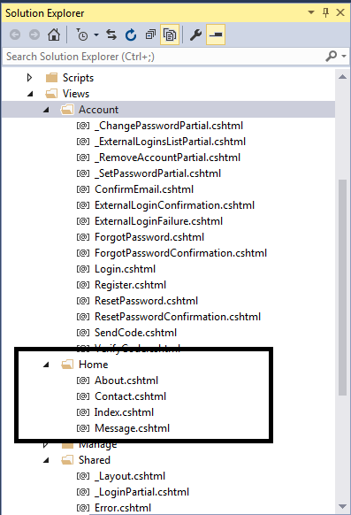
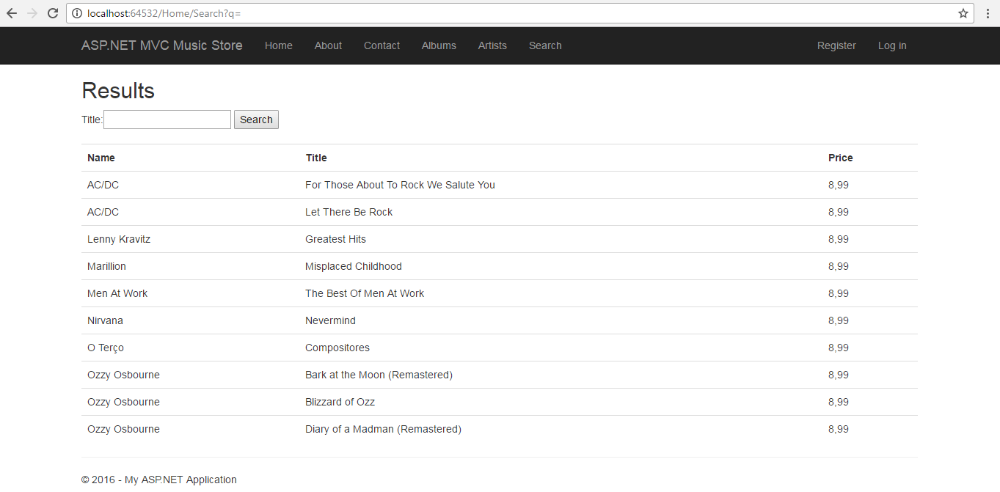

## MODULES 8 <br>APPLYING STYLES TO ASP.NET MVC 5 WEB APPLICATIONS

### LAB 8 - WORKING WITH HTML HELPERS
**Estimated time to complete this lab: 45 minutes**

HTML helpers help you work with HTML. Because it seems like a simple task to type HTML elements into a text editor, you might wonder why you need any help with your HTML. Tag names are the easy part, however. The hard part  of working with HTML is making sure the URLs inside of links point to the correct locations, form elements have the proper names and va]ues for mode] binding, and other elements disp]ay the appropriate errors when model binding fails.
Tying all these pieces together requires more than just HTML markup. It also requires some coordination between a view and the runtime. In this lab, you will learn how to establish this coordination.

#### Lab Objectives

After completing this lab, you will be able to:
* Work with Forms
* Work with HTML helpers
* Setup the album edit form
* Add input components

#### Lab Procedures

**A. Working  with Forms**

Before you begin working with helpers, however, you first learn about forms. Forms are where most of the hard work happens inside an application, and are where you need to use HTML helpers the most.
A form is a container for input elements: buttons, checkboxes, text inputs, and more. The input elements in a form enable a user to enter information into a page and submit information to a server&mdash; but which server? And how does the information get to the server? The answers to these questions are in the two most important attributes of a form tag: the action and the method attributes.

Follow these steps to explore the form action and form method:

1.	Open lndex.cshtml from Views /Home path in your Solution Explorer as shown in the following figure.

    

2.	Enter the following script to declare the tag form within this view file:

    ``` html
    <form action="http://www.bing.com/search">
        <input name="q" type="text" />
        <input type="submit" value="Search!" />
    </form>
    ```

    When a user submits a from using an `HTTP GET` request, the browser takes the input names and values inside the form and puts them in the query string.
    In other words, the preceding from would send the browser to the following URL (assuming the user is searching for love): `http://www.bing.com/search?q=love.`

3. Enter the following script to make searching for music function with a
search form:

    ``` html
    <form action="/Home/Search" method="get">
        <input type="text" name="q" />
        <input type="submit" value="Search" />
    </form>
    ```

4. The next step is to implement a Search method on the HomeController. The code block shown in the below makes the simplifying assumption that a user is always searching for music  by album name:

    ``` cs
    using MvcMusicStore.Models;
    . . .
    public class HomeController : Controller
    {
    private MusicStoreDB storeDB = new MusicStoreDB();
    . . .

    public ActionResult Search(string q)
    {
        var albums= storeDB.Albums
        .Include("Artist")
        .Where(a => a.Title.Contains(q))
        .Take (10) ;
        return View(albums);
    }
    . . .
    ```

    Notice how the `Search` action expects to receive a string parameter named `q`. The MVC framework automatically finds this value in the query string, when the name `q` is present, and also finds the value in posted form values if you made your search form issue a POST instead of a GET.

5.	Add a few `Bootstrap` classes to the `table` tag to make it look more presentable because the controller tells the MVC framework to render a view. Code for an example view, which would render the results of the search, appears in the following scripts.

    ``` cs
    @modal IEnumerable<MvcMusicStore.Models.Album>
    @{ ViewBag.Title = "Search"; }

    <h2>Results</h2>
    <table class="table table-condensed table-striped">
        <tr>
            <th>Artist</th>
            <th>Title</th>
            <th>Price</th>
        </tr>

        @foreach (var item in Model) {
            <tr>
                <td>@item.Artist.Name</td>
                <td>@item.Title</td>
                <td>@String.Format("{O:c}", item.Price)</td>
            </tr>
        }
    </table>
    ```
    
    The result lets customers search for terms such as "work," which produces the output shown in the following figure:

    

**B. Working with HTML Helpers**

HTML helpers are methods you can invoke on the HTML property of a view. You also have access to URL helpers (via the Url property), and Ajax helpers (via the Ajax property). All these helpers have the same goal: to make views easy to author. The URL helper is also available from within the controller.

Follow these steps to create the searching for  music  function  usmg  HTML Helpers:

1. Make sure the lndex.cshtml is active in your workspace.

2. Comment the form search that you create in the previous practice.

	``` cs
	<!--
	@modal IEnuaerable<MvcHusicStore.Models,Album>
	@{ ViewBag.Title="Search"; }
	<table>
	</table>
	-->
	```

3. Enter the following code to create form of searching/or music using HTML Helpers.

    ``` cs
    @{Html.BeginForm("Search", "Home", FormMethod.Get);}
        <input type="text" name="q" />
        <input type="submit" value="Search" />
    @{Html.EndForm();}
    ```

    Note the `BeginForm` helper outputs both the opening `<form>` and the closing `</form>`. The helper emits the opening tag during the call to `BeginForm`, and the call returns an object implementing `IDisposable.`

**C. Setting Up the Album Edit Form**

Follow these steps to setup the Album editing page form within Music Store applications.

1. Open  **edit.cshtml**  from  `Views/Album` path  in  your  **Solution Explorer**.

2. If you need to build a view that lets a user edit album information, you might start with the following view code:

    ``` cs
    @using (Html.BeginForm()) (
    @Html.ValidationSummary(excludePropertyErrors: true)
    <fieldset>
        <legend>Edit Album</legend>
        <p>
            <input type="submit" value="Save" />
        </p>
    </fieldset>
    ```

    The version of `BeginForm` in the preceding code, with no parameters, sends an HTIP POST to the current URL, so if the view is a response to `/StoreManager/Edit/52`, the opening form tag will look like the following:

	```<form action="/StoreManager/Edit/52" method="post">```

    The `ValidationSummary` helper displays an unordered list of all validation errors in the `ModelState` dictionary. The Boolean parameter you are using (with a value of true)is telling the helper to exclude property-level errors. In other words, you are telling the summary to display only the errors in `ModelState` associated with the model itself, and exclude any errors associated with a specific model property. You will be displaying property-level errors separately.

3.	Assume you have the following code somewhere in the controller action rendering the edit view:

    ``` cs 
    Mode1State.AddModelError("", "This is all wrong!");
    Mode1State.AddModelError("Title", "What a terrible name!");
    ```

    The first error is a model-level  error, because you didn't provide   a key (or provided an empty **key**) to associate the error with  a  specific property. The second error you associated with the `Title` property, so in your view it will not display in the validation summary area (unless you remove the parameter to the helper method, or change the value to `false`). In this lab, the helper renders the following HTML:

    ``` html
    <div class="validation-summary-errors">
        <ul>
            <li>This is all wrong!</li>
        </ul>
    </div>
    ```

    Other overloads of the ValidationSummary helper enable you to provide header text and set specific HTML attributes.

**D. Adding Input Components**

After you have the form and validation summary in place, follow  these steps to add some inputs for the user to enter album information into the view.

1.	Open **StoreManagerEdit.cshtml** from Views/Album.

2.	Add the following script into **StoreManagerEdit.cshtml**.

    ``` cs
    @using (Html.BeginForm())
    {
        @Html.AntiForgeryToken()
        
        <div class="form-horizontal">
            <h4>Album</h4>
            <hr />
            @Html.ValidationSummary(true, "", new { @class = "text-danger" })
            @Html.HiddenFor(model => model.AlbumId)

            <div class="form-group">
                @Html.LabelFor(model => model.GenreId, "GenreId", htmlAttributes: new { @class = "control-label col-md-2" })
                <div class="col-md-10">
                    @Html.DropDownList("GenreId", null, htmlAttributes: new { @class = "form-control" })
                    @Html.ValidationMessageFor(model => model.GenreId, "", new { @class = "text-danger" })
                </div>
            </div>

            <div class="form-group">
                @Html.LabelFor(model => model.ArtistId, "ArtistId", htmlAttributes: new { @class = "control-label col-md-2" })
                <div class="col-md-10">
                    @Html.DropDownList("ArtistId", null, htmlAttributes: new { @class = "form-control" })
                    @Html.ValidationMessageFor(model => model.ArtistId, "", new { @class = "text-danger" })
                </div>
            </div>

            <div class="form-group">
                @Html.LabelFor(model => model.Title, htmlAttributes: new { @class = "control-label col-md-2" })
                <div class="col-md-10">
                    @Html.EditorFor(model => model.Title, new { htmlAttributes = new { @class = "form-control" } })
                    @Html.ValidationMessageFor(model => model.Title, "", new { @class = "text-danger" })
                </div>
            </div>

            <div class="form-group">
                @Html.LabelFor(model => model.Price, htmlAttributes: new { @class = "control-label col-md-2" })
                <div class="col-md-10">
                    @Html.EditorFor(model => model.Price, new { htmlAttributes = new { @class = "form-control" } })
                    @Html.ValidationMessageFor(model => model.Price, "", new { @class = "text-danger" })
                </div>
            </div>

            <div class="form-group">
                @Html.LabelFor(model => model.AlbumArtUrl, htmlAttributes: new { @class = "control-label col-md-2" })
                <div class="col-md-10">
                    @Html.EditorFor(model => model.AlbumArtUrl, new { htmlAttributes = new { @class = "form-control" } })
                    @Html.ValidationMessageFor(model => model.AlbumArtUrl, "", new { @class = "text-danger" })
                </div>
            </div>

            <div class="form-group">
                <div class="col-md-offset-2 col-md-10">
                    <input type="submit" value="Save" class="btn btn-default" />
                </div>
            </div>
        </div>
    }
    ```

    As a reminder, these helpers give the user the display shown in the following figure.

    


