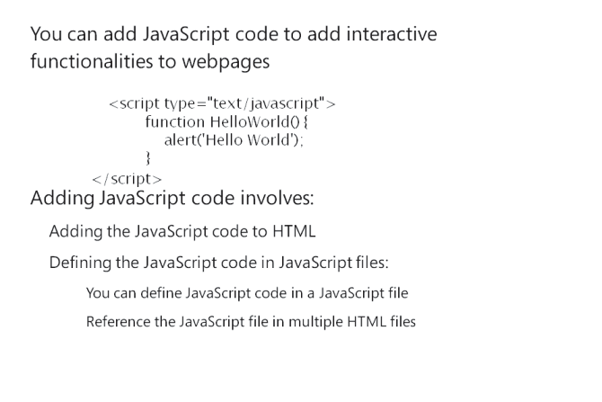
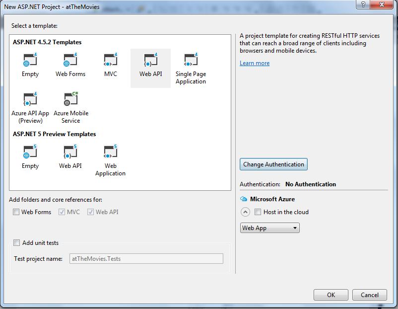
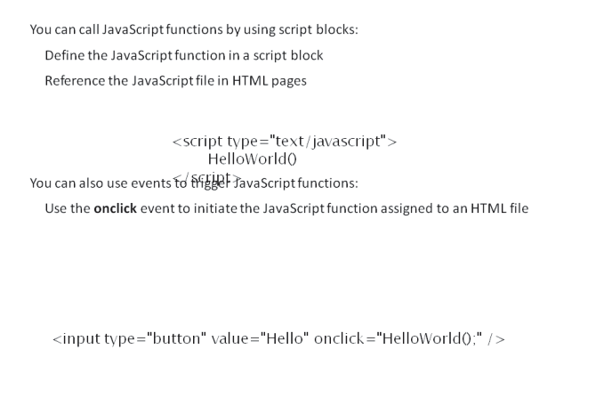
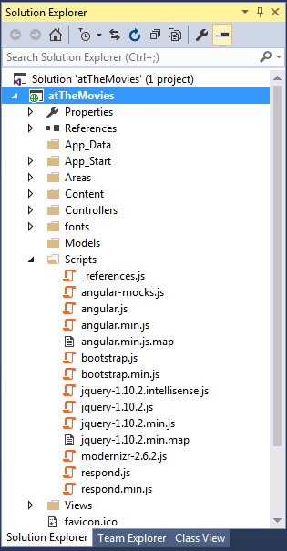
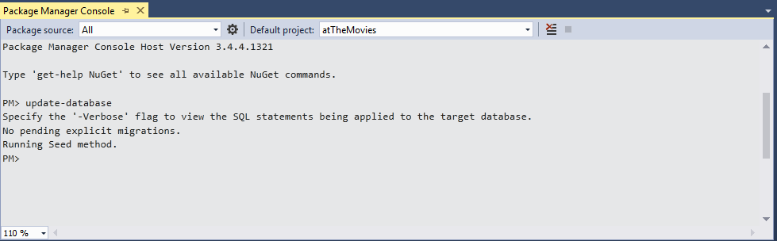
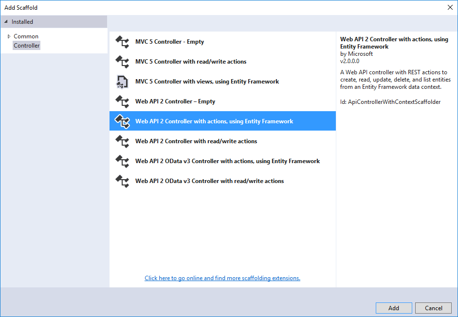
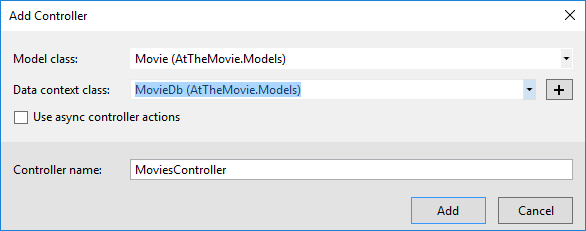
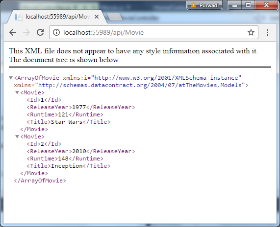

## MODULE 10 <br>USING JAVA5CRIPT AND JQUERY FOR RESPONSIVE MVC 5 WEB APPLICATIONS

#### LAB  10 -  UNDERSTANDING  AND SETTING UP ANGULARJS

**Estimated time to complete this lab: 45 minutes**

AngularJS is a JavaScript framework developed by a team inside Google. The team built an extensible, testable framework that provides data binding and server communication features as well as view management, history management, localization, validation, and more. AngularJS (hereafter referred to as Angular) also uses controllers, models, and views, which should sound familiar to you because ASP.NET MVC also has the concept of controllers, models, and views, but Angular is all about JavaScript and HTML instead of C# and Razor.
In this lab you will add AngularJS to the site, set up database, build the Web API and modules.

AngularJS is a JavaScript framework developed by a team inside Google. The team built an extensible, testable framework that provides data binding and server communication features as well as view management, history management, localization, validation, and more. AngularJS (hereafter referred to as Angular) also uses controllers, models, and views, which should sound familiar to you because ASP.NET MVC also has the concept of controllers, models, and views, but Angular is all about JavaScript and HTML instead of C# and Razor.
In this lab you will add AngularJS to the site, set up database, build the Web API and modules.

#### Lab Objectives

After completing this lab, you will be able to:
- Create new ASP.NET Application
- Add AngularJS to the site
- Setup the database 
- Build the Web API
- Build applications and modules

#### Lab Procedures 

**A.	Creating  New ASP.NET Application**

Follow these steps to set up AngularJS:

1.	First	you'll	create	a	new	ASP.NET	application	named `atTheMovies` in Visual Studio 2013, as shown in below figure.

    

2.	Many of the views in this project are constructed using HTML files, and the client mostly requests JSON from the server (except for the initial request). The best fit for this scenario is the Web API project template, which you select on the next screen, shown in below figure. Note that the Web API template also includes ASP.NET MVC support, which provides only a home page as a starting point. This is ideal for the application's needs.

    

3. After you create the project,  you can run  the application  and see the home page working, as shown in below Figure

    

**B.	Adding AngularJS to the Site**

Follow these steps to add AngularJS to the site:

1.	You have different approaches for installing Angular. If you are particular about the Angular version and features you need, you might go to the Angular website (angularjs.org) and download the script files directly. The easiest approach, however, is to use NuGet and the Package Manager Console.
		
    ```
    Install-Package AngularJS.core
    ```

2.	The package installs a number of new script fi Jes into the Scripts folder of the project. The most important file is the angular.js file (see below figure) because it contains the essential pieces of the Angular framework.
 
	  
    
3.	The next step is to include the core Angular script in the application so it arrives in the browser. In some applications you might include the Angular scripts in the Layout view for a website, but not every page needs Angular. A better approach is to place the Angular script only on those pages that become client-side applications. In this ASP.NET MVC project, the home page is one such page, so you can modify the `Index.cshtml` view for the `HomeController` to include Angular. In fact, you can remove all the markup inside the Index view and replace the code with the following:

    ``` html
    @section scripts {
      <script src="~/Scripts/angular.js"></script>
    }
    <div ng-app>
      {{2+3}}
    </div>
    ```

4.	Adding Angular to the home page is easy because the  default layout view includes a section named "scripts" that allows you to place script tags at the bottom of a page. You can also use the bundling and minification features of ASP.NET to minify the Angular script, but in the preceding code you'll use a script tag pointing to the raw source code file.

5.	The div in the previous listing includes a funny attribute ng-app, which is an Angular directive. A directive allows Angular  to  extend HTML with new features and abilities, and directives from the core of Angular start with an `"ng"` prefix (short for Angular). You'll see more of directives as you progress through the chapter, but for now you should know that the `ng-app` directive is the application bootstrap directive for Angular. In other words, `ng-app` tells Angular to jump in and take control of this section of the DOM by initializing an application and looking for other directives and templates inside (a process Angular refers to as compiling the DOM).

6.	The previous listing also includes a template `{{2+3}}`. The double curly braces identify templates in HTML, and an Angular application automatically finds all templates and evaluates the JavaScript expression inside. If you run the application,you'll see that Angular loads because it replaces the template {{2+3}} with the value 5, as shown in below Figure.

	  

7.	Here is a different variation of the previous code:

    ``` html
    <div data-ng-app>
      {{true ? "true" : "false"}}
    </div>
    ```

**C.	Setting Up the Database**

Follow these steps to set up the database:

1. The template you use to create this project doesn't  include  the  Entity Framework by default, so you'll need to return to the Package Manager Console window and run the following command:

    ```
    Install-Package EntityFramework
    ```

2.	The Entity Framework will store data in a SQL Server database. What data? You can add a Movie class to the Models folder, and this class holds the infonnation you want to store in the database.

    ``` cs
    public class Movie
    {
      public int Id { get; set; }  
      public string Title { get; set;} 
      public int ReleaseYear { get; set;} 
      public int Runtime { get; set; }
    }
    ```

3.	You'll  also  need  a `DbContext` derived  class  with a  DbSet typed
property to add, delete, and query movie objects.

    ``` cs
    public class MovieDb: DbContext
    {
      public DbSet<Movie> Movies { get; set; }
    }
    ```

4.	Back in the Package Manager Console, you can now enable Entity Framework migrations. Migrations allow you to manage the  schema of the database and apply schema changes. However,  in  this chapter, I'll only be using migrations to seed the database  with some initial data. In the console, you can execute the following command:

    ```
    Enable-Migrations
    ```

5.	Migrations create a Migrations folder in the project with a Configuration.cs file. Inside Configuration.cs you'll find a class with a Seed method. You can add the following code to the Seed method to populate the database with three movie objects.

    ``` cs
    protected override void Seed(MovieDb context)
    {
        context.Movies.AddOrUpdate(m=>m.Title, 
          new Movie
          {
            Title="Star Wars", 
            ReleaseYear=1977, 
            Runtirne=121
          },
          new Movie
          {
            Title="Inception", 
            ReleaseYear=2010, 
            Runtime=148
          },
          new Movie
          {
            Title="Toy Story", 
            ReleaseYear=1995, 
            Runtime=81
          }
        );
    }
    ```

 6.	You can also enable automatic migrations to make the process of adding new features easier. Automatic migrations  are  off  by default, but you find the setting in the constructor of the Configuration  class in the Migrations folder.

    ```
    public Configuration() 
    { 
        AutomaticMigrationsEnabled = true;
    }
    ```

 7.	With these settings in pJace, you can now create the database using the Package Manager console window and the Update-Database command. The output should look like the screenshot shown in below figure.
 
    

8.	With a database in place, you can now create an API to manipulate and retrieve the data inside.

**D.	Building the Web API**

The Web API is simple to build because you only need basic create, read, update, and delete functionality, and the scaffolding provided by Visual Studio 2013 can generate the code you need. Just follow these steps:

1.   Right-click the **Controller**  folder and select **Add &rArr; Controller**, which opens the **Add Scaffold** dialog shown in below figure.

      
  
2.	Use the **"Web API 2 Controller with read/write actions, using Entity Framework"** option and click **Add. The Add Controller** dialog appears, as shown  in  below figure.

    

3.	Name the new controller `MovieController`. The model class is the Movie class you created earlier, and the Data context class will be the `MovieDb` class. After you click Add, the new  `MovieController.cs`  file appears in  Visual Studio.

4.	Run the application and navigate to `/api/movies` in  the browser. You should see movie information encoded into XML or JSON (depending on the browser), as shown in below figure.

	  
    
5. You now have all the code you need on the server. The rest of the chapter focuses on client code and AngularJS.

**E. Building Applications and Modules**

So far you've bootstrapped an Angular application in the home page of the website, but you've only used a single template in the page to output the result of a simple expression. Building out the features required for managing movies requires a proper application with modules.

A module in Angular is an abstraction that allows you to group various components to keep them isolated from other components and pieces of code in an application. One of the benefits of isolation is to make Angular code easier to unit test, and easy testability is om: of the goals the framework creators set out to achieve.

Various features of the Angular framework are organized into different module s that you'll need for the application. But, before you use these modules you need a custom module for your application itself.
To start, follow these steps:

1.	Create a new folder in the project named **Client**. Some people might call this folder **App**, but the name doesn' t matter and you can name the folder whatever you like. The idea is to organize the scripts for the home page application into a dedicated folder instead of using the existing Scripts folder to hold all JavaScript. I group and organize C# source code into various fi les and directories to make code easier to maintain, and the same rules apply to JavaScript as you build bigger and bigger applications on the client.

2.	Inside the **Client** folder, create a subfolder named **Scripts**. Inside this   **Scripts**   folder, create a new **JavaScript** file named `atTheMovies.js` with the following code:

    ```
    (function() {
      var app = angular.module("atTheMovies",[]);
    }());
    ```

    The angular variable is the global Angular object. Just like the jQuery API is available through a global $ variable, Angular exposes a top-level API through angular. In the previous code, the module function creates a new module named atTheM ov i es, whereas the second parameter, the empty array, declares dependencies for the module (technically this module depends on the core Angular module "ng".

3.	Also modify the Index view to include the new script:

    ```
    @section scripts {
        <script src="~/Scripts/angular.js"></script>
        <script src="~/Client/Scripts/atTheMovies.js"></script>
    }
    <div ng-app="atTheMovies">
    </div>
    ```

    Notice the div element in the code now specifies a value for the ng­ app directive. The markup instructs Angular to load atTheMovies as the application module. This allows you to configure additional components into the module that are initialized when Angular bootstraps the application. The application needs these additional components to achieve the fi t goal, which is to display a list of all movies in the database. Specifically, the application needs a controller.