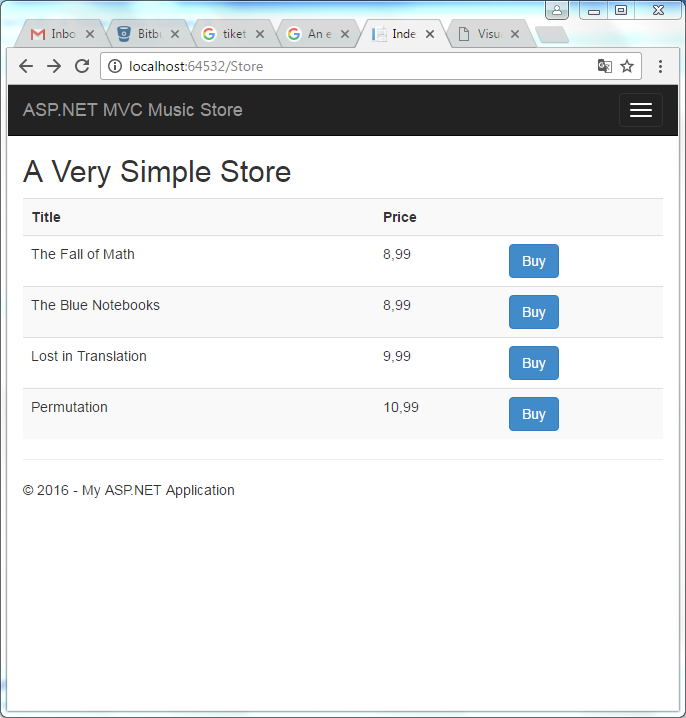
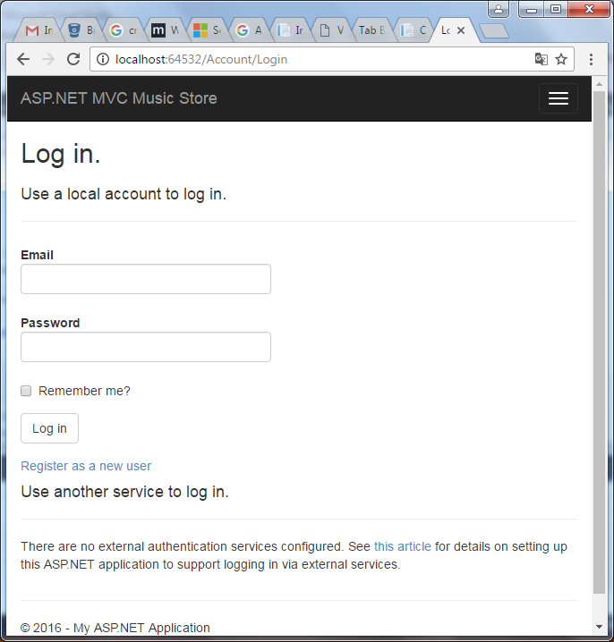
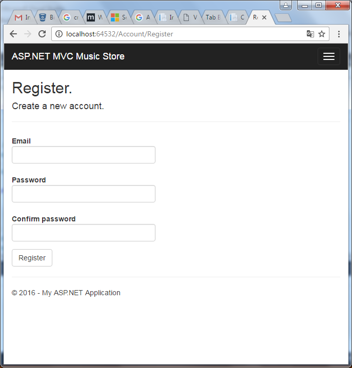
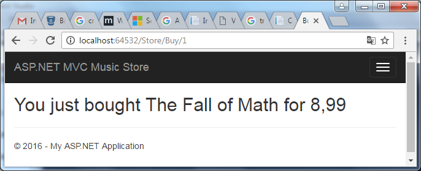
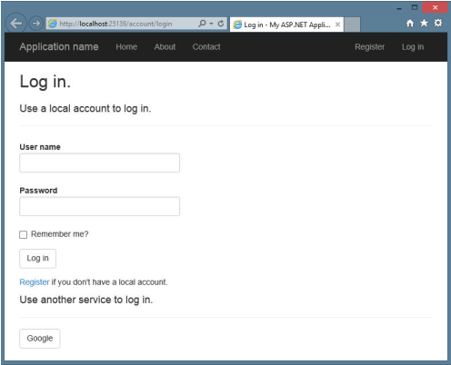
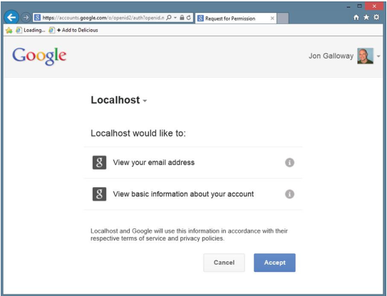
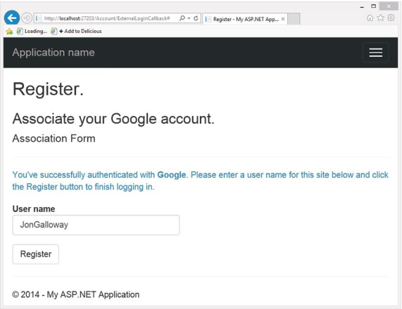

# MODULE 11 <br> CONTROLLING ACCESS TO ASP.NET MVC 5  <br>WEB APPLICATIONS

## LAB 11 - SECURING CONTROLLER ACTIONS

**Estimated time to complete this lab: 30 minutes**

Securing your web applications can seem like a chore. Security is generally something you have to do because you don't want to be caught in an embarrassing security breach. ASP.NET MVC doesn't have as many automatic protections as ASP.NET Web Forms does to secure your page against malicious users.  ASP.NET Web Forms tries hard to protect you from a lot of things.
In this lab you will use the security features in ASP.NET MVC to perform application functions such as authorization and handle common security threats.

### Lab Objectives

After completing this lab, you will be able to:
- Use the AuthorizeAttribute  to require login
- Use AuthorizeAttribute to require role membership

### Lab Procedures

**A.	Using the AuthorizeAttribute to Require Login**

The simplest step in securing an application is requiring that a user be logged in to access specific parts of the application. You can do that using the Authorize action filter on a controller, on specific actions within a controller, or even globally for the entire application. The AuthorizeAttribute is the default authorization filter included with ASP.NET MVC. Applying this attribute to a controller is shorthand for applying it to every action method within the controller.
Follow these steps to use it to restrict access to an action method:

1.	Assume that you've naively started on your music store application with a simple shopping scenario a StoreController with two actions-Index (which displays the list of albums) and Buy:

  ``` cs
  using System.Collections.Generic;
  using System.Ling; 
  using System.Web.Mvc;
  using Wrox.ProMvc5.Security.Authorize.Models; 
  namespace Wrox.ProMvc5.Security.Authorize.Controllers
  {
  public class StoreController: Controller
  {
      public ActionResult Index()
      { 
        var albums= GetAlbums(); 
        return View(albums);
      }

      public ActionResult Buy(int id)
      {
          var album= GetAlbums().Single(a => a.Albumid == id);
          //Charge the user and ship the album!!' 
          return View(album);
      }

      // A simple music catalog
      private static List<Album> GetAlbums()
      {

      var albums= new List<Album>{ 
          new Album { Albumid = 1, Title = "The Fall of The Blue Math",Price = 8.99M},
          new Album { Albumld = 2, Title = "The Blue Notebooks", Price = 8.99M},
          new Album { Albumld = 3, Title = "Lost in Translation",Price =  9.99M },
          new Album { Albumld = 4, Title=  "Permutation",Price= 10.99M },
      }
      return albums;
    }
  }
  }
  ```

2.	However, you're obviously not done, because the current controller would allow a user to buy an album anonymously. *You need to know who the users are* when they buy the album. You can resolve
this by adding the `AuthorizeAttribute` to the Buy action, like this:

    ``` cs
    [Authorize]
    public ActionResult Buy(int id)
    {
      var album= GetAlbums().Single(a  => a.Albumld == id);
      //Charge the user and ship the album!!!
      return View(album);
    }
    ```

3.	To	see	this	code,	use	NuGet	to install the `Wrox.ProMvcS.Security.Authorize`		package into a default ASP.NET MVC project, as follows:
 
    ```
    Install-Package Wrox.ProMvc5.Security.AuthorizeCreate
    ```

4.	Run the application and browse to `/Store`. You'll see a list of albums, and you haven't had to log in or register at this point, as shown in the following figure.

    

5.	When you click the **Buy** link, however, you are required to log in (see the following figure).

	  

6.	Because  you don't have an  account  yet, you'll need to click the **Register** link, which displays a standard account signup page (see the following figure).

  	

Notice that the standard `AccountController` registration doesn't track the referrer when you create a new account, so after creating a new account you'll need to navigate back to `/Store` to try again. You can add this functionality in yourself, but if you do you need to make sure you don't add in an open redirection vulnerability.

7. When you click the **Buy** button after registering, the authorization check passes and you're shown the purchase confirmation page, as shown in the following figure.

	  

8.	For securing the entire controllers (other controllers, for example: `browsing`, `shopping cart`, and `checkout`) portions of your website each deserve separate controllers. Several actions are associated with both the anonymous `Shopping cart (view cart, add item to cart, remove from cart)` and the authenticated Checkout(`add address and payment information, complete checkout`).
Requiring Authorization on Checkout lets you transparently handle the transition from Shopping Cart (anonymous) to Checkout (registration required) in the Music Store scenario. You accomplish this by putting the `AuthorizeAttribute` on the `CheckoutController`, like this:

    ``` cs
    [Authorize]
    public class CheckoutController : Controller
    ```

    This says that all actions in the CheckoutController will allow any registered user, but will not allow anonymous access.

9.	Register the `AuthorizeAttribute` as a global filter for securing your entire application. Add it to the global filters collection in the `RegisterGlobalFilters`	method,	located	in `\App_Start\FilterConfig.cs`: 

    ``` cs
    public static void
    RegisterGlobalFilters(GlobalFilterCollectionfilters)   {
      filters.Add(new System.Web.Hvc.AuthorizeAttribute());
      filters.Add(new  HandleErrorAttribute());
    }
    ```

    This applies the `AuthorizeAttribute` to all controller actions in the application.

**B. Using `AuthorizeAttribute` to Require Role Membership**

So far you've looked at the use of `AuthorizeAttribute` to prevent anonymous access to a controller or controller action. However, as mentioned, you can also limit access to specific users or roles.
A common example of where this technique is used is in administrative functions. Your Music Store application has grown to the point that you're no longer happy with editing the album catalog by directly editing the database. It's time for a `StoreManagerController`.
However, this `StoreManagerController` can't just allow any random registered user who just opened an account to edit, add, or delete an album. You need the ability to limit access to specific roles or users. Fortunately, AuthorizeAttribute allows you to specify both roles and users, as shown here:

``` cs
[Authorize(Roles="Administrator")]
public class StoreManagerController: Controller
```

This restricts access to the `storeManagerController` to users who belong to the Administrator role. Anonymous users, or registered users who are not members of the Administrator role, are prevented from accessing any of the actions in the `StoreManagerController`.
Follow these steps to implement authorization control for your applications.

1. As implied by the name, the `Roles` parameter can take more than one role. You can pass in a comma-delimited list:

    ``` cs
    [Authorize(Roles="Administrator,SuperAdmin")] 
    public class TopSecretController:Controller
    ```

2.	Perform the authorize by a list of users:

    ``` cs
    [Authorize(Users="Jon,Phil,Scott,Brad,David")] 
    public class TopSecretController:Controller
    ```

3.	Combine them, as well:

    ``` cs
    [Authorize(Roles="UsersNamedScott", Users="Jon,Phil,Brad,David")]
    public class TopSecretController:Controller
    ```

4.	To  implement  Google  provider  support  is  already  included  in
`Startup.Auth.cs`, so just uncomment it.

    ``` cs
    public partial class Startup
    {
      public void ConfigureAuth(IAppBuilder app)
      {
      // Use a cookie to temporarily store
      // information about
      // a user logging in with a third
      // party login provider
      app.UseExternalSignlnCookie(DefaultAuthenticationTypes.ExternalCooki) ;
      app.UseGooglaAuthentication();
      }
    }
    ```

5. To test this, run the application and click the **Log In** link in the header (or browse to **/Account/Login**). You'll see a button for Google authentication displayed in the external sites list, as shown in the following figure.

	  

6. Next, click the **Google** Log in button. This redirects you to a Google confirmation page, as shown in the following figure, that verifies you want to provide information (in this case, your e-mail address) back to the requesting site

	  


7. After clicking **Accept**, you are redirected back to the ASP.NET MVC site to complete the registration process (see the following figure).

	  

    After clicking the **Register** button, you are redirected to the home page as an authenticated user. At the time of this writing, the new ASP.NET Identity system doesn't provide more in-depth account management for you after you're authenticated. This will likely change in the future because ASP. NET Identity 2.0 includes more advanced features like password reset and account confirmation.


