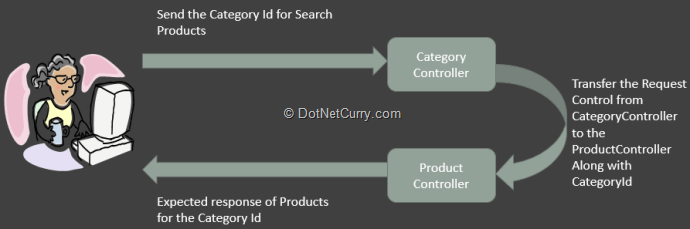
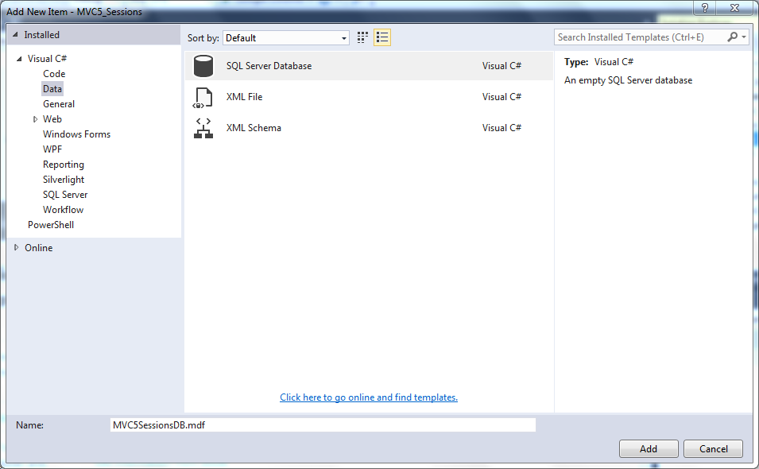
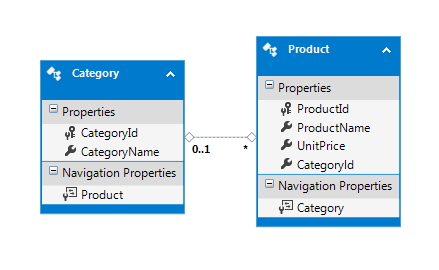
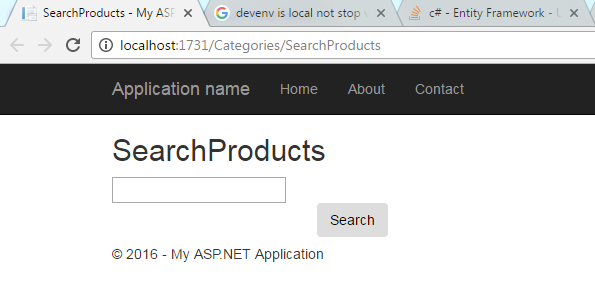
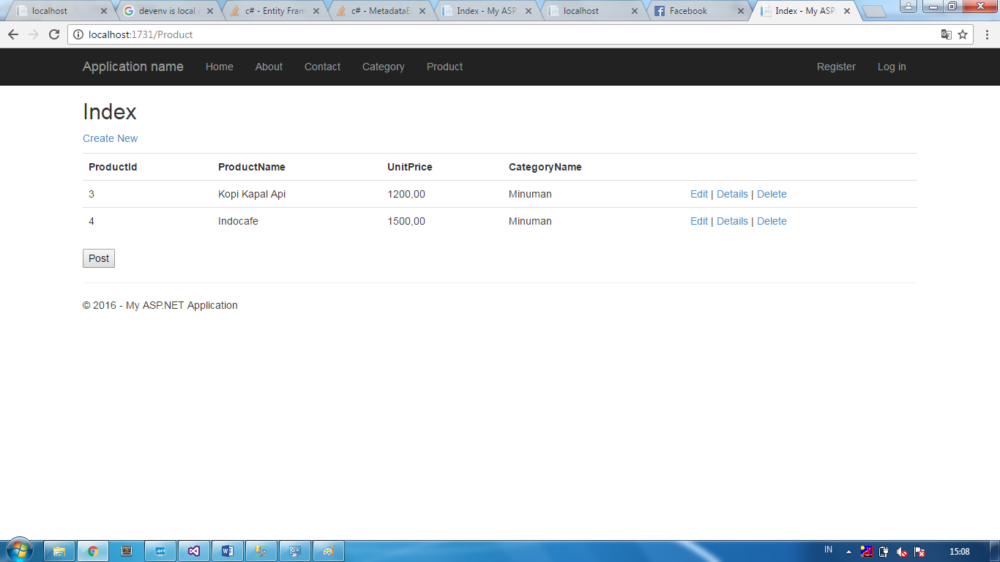
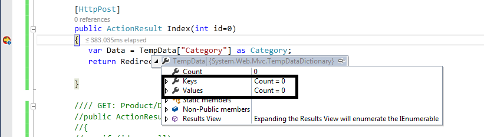
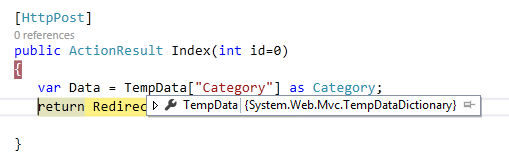
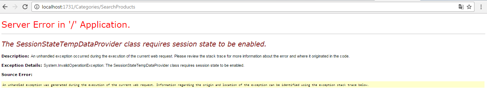

# MODULE 12 <br> BUILDING A RESILIENT ASP.NET MVC 5 <br> WEB APPLICATIONS

## LAB 12 - STATE MANAGEMENT WITH ASP.NET MVC 5

**Estimated time to complete this lab: 45 minutes**

ASP.NET has numerous useful features and one of it is state management. ASP.NET Web Form developers have the habit of using Session objects for passing values across pages.
Since in ASP.NET, everything is controlled by Page, the use of various state management techniques like ViewState, Cookies, Sessions, etc. play an important role here. But unlike ASP.NET Web Forms, in ASP.NET MVC the Controller decides what values are accepted from a view and which. view to send the response to.
The Controller in MVC is the major component for request processing and has its own lifecycle. Consider a scenario where one controller has an action method which returns the action method for. another controller. During this controller transition, value entered from one controller needs to be used by another controller for some processing.
In MVC the following image explains the scenario:



Here the question is how to implement this? Since ASP.NET MVC builds on the top of the ASP.NET framework, we have access to the Session objects derived from HttpSessionBase. Like ASP.NET WebForms, in MVC the Session property is provided by HttpContext class. But MVC has its own TempData object which is used to pass data across controllers. This is derived from TempDataDictionary. The TempData has a very short life and sets itself to null when the target view is fully loaded. The Life time of the TempData can be managed using the `Keep()` method. Here are some features of TempData and Session objects.

**TempData:**

- is the property of the ControllerBase class
- is used to pass data from one controller to other
- its life is ended when the target view is loaded completely
- it is recommended to type-cast the value when TempData value is used for processing
- Mostly used to store Validation Error Messages. etc.

**Session:**

- is used to pass data across controllers in MVC Application.
- Session data never expires.

Like TempData the value must be type-casted when it is used for processing.

In this lab, you will make ASP.NET MVC5 web application with a mechanism to maintain the state of the value across various controllers.

### Lab Objectives

After completing this lab, you will be able to:

- Implement TempData
- Use TempData to pass values across   controllers

### Lab Procedures

#### A. Implementing TempData

Follow these steps to implement state management using TempData:

1.	Create a new empty MVC	application	of	the	name **MVC5 Sessions**.
2.	Rigth  click in **`App_Data` &rArr; Add	&rArr; New Item** to open **Add New Item** dialog.
3.	Choose **SQL Server Database &rArr;** type **MVC5SessionsDB.mdf** in name field Click **Add** button to add a new SQL Server database for this project (see the following figure).

    

4.	Expand	the	`App_Data` folder &rArr; double	click **MVC5SessionsDB.mdf** and add the following  tables:

    **Category Table**

    ``` SQL
    CREATE TABLE [dbo].[Category]
    (
        Categoryld int primary key Identity, 
        CategoryName varchar(100) Not Null
    )
    ```

    **Product Table**

    ``` SQL
    CREATE TABLE [dbo].[Product]
    (
        Product!d INT NOT NULL PRIMARY KEY identity,
        ProductName varchar(100) Not Null,
        UnitPrice decimal Not Null,
        Categoryld int References Category (Category!d)
    )
    ```

    Add some sample data in these tables.

5.	In the Models `folder` add a new **ADO.NET Entity Data Model.** In the wizard select the **Application** database we added in step 4. Select all tables from the database. After completing the wizard, the following mapping will be displayed:

    

**B.	Using TempData to Pass Values Across Controllers**

Follow these steps to pass values across controllers using TempData:

1.	In the **Controllers** add a new **Empty MVC Controller** of the name **CategoryController**. In this **Controllers**, we already have an Index method along with the add SerachProducts action method with HttpGet and HttpPost as below:

    ``` cs
    using System;
    using System.Web.Mvc;
    using MVC5_Sessions.Models;

    namespace MVC5_Sessions.Controllers
    {
        public class CategoriesController : Controller
        {
            ApplicationEntities ctx;

            public CategoriesController()
            {
                ctx = new ApplicationEntities();
            }
            // GET: Categories
            public ActionResult Index()
            {
                return View(ctx.Categories.ToList());
            }

            public ActionResult SearchProducts()
            {
                return View();
            }
        
            [HttpPost]
            public ActionResult SearchProducts(Category c)
            {
                TempData["Category"] = c;
                return RedirectToAction("Index", "Product");
            }
        }
    }
    ```
    The above code has the `SearchProducts` action method for `[HttpPost]`. This method declares the TempData object with key as `'Category'`. This object is set to the Category object passed to the SearchProducts action method. The `SearchProducts` action method returns the `Index` method of the `ProductController` using the below statement:

	``` cs
    return RedirectToAction("Index","Product");
    ```
        
2.	Scaffold `Index.cshtml` and `SearchProducts.cshtml` from the `Index` and `SearchProducts` action method. Change the `SearchProducts.cshtml` to the following:

    ``` cs
    @model MVC5_Sessions.Models.Category
    @{
        ViewBag.Title = "SearchProducts";
    }

    <h2>SearchProducts</h2>

    @using (Html.BeginForm())
    {
        @Html.EditorFor(cat => cat.CategoryId);

        <div class="form-group">
            <div class="col-md-offset-2 col-md-10">
                <input type="submit" value="Search" class="btn btn­ default" />
            </div>
        </div>
    }
    ```

    The above view has a textbox which is bound with the `CategoryId` of the `Category` Model class.

3.	In the `Controllers` folder, add a new **Empty MVC Controller** of the name `ProductController` and add the following code in it:
    
    ``` cs
    using System.Linq;
    using System.Web.Mvc;
    using MVC5_Sessions.Models;

    namespace MVC5_Sessions.Controllers
    {
        public class ProductController : Controller
        {
            ApplicationEntities ctx;
            public ProductController()
            {
                ctx = new ApplicationEntities();
            }

            // GET: Product
            /// <summary>
            /// Type Case the TempData to Category
            /// </summary>
            /// <returns></returns>
            public ActionResult Index()
            {
                if (TempData["Category"] !=null)
                {
                    var Cat = (Category)TempData["Category"];
                    var Products = from p in ctx.Products
                                where p.CategoryId == Cat.CategoryId
                                select p;
                    return View(Products.ToList());
                } else
                {
                    return View(ctx.Products.ToList());
                } 
            }
        }
    }
    ```

    The above code has `Index` action methods for `HttpGet` and `HttpPost`. The `HttpGet` Index method accepts the `TempData["Category"]` object and type casts it to `Category`. The code further queries the `Products` based upon the `Categoryid` and returns `Products` under the category.

4.	Scaffold  the  `Index.cshtml` from  the `Index` action  method and make the following changes in it:

    ``` Html
    @model IEnumerable<MVC5_Sessions.Models.Product>

    @{
        ViewBag.Title = "Index";
        Layout = "~/Views/Shared/_Layout.cshtml";
    }

    <h2>Index</h2>

    <p>
        @Html.ActionLink("Create New", "Create")
    </p>
    <table class="table">
        <tr>
            <th>
                @Html.DisplayNameFor(model => model.ProductId)
            </th>
            <th>
                @Html.DisplayNameFor(model => model.ProductName)
            </th>
            <th>
                @Html.DisplayNameFor(model => model.UnitPrice)
            </th>
            <th>
                @Html.DisplayNameFor(model => model.Category.CategoryName)
            </th>
            <th></th>
        </tr>

    @foreach (var item in Model) {
        <tr>
            <td>
                @Html.DisplayFor(modelItem => item.ProductId)
            </td>
            <td>
                @Html.DisplayFor(modelItem => item.ProductName)
            </td>
            <td>
                @Html.DisplayFor(modelItem => item.UnitPrice)
            </td>
            <td>
                @Html.DisplayFor(modelItem => item.Category.CategoryName)
            </td>
            <td>
                @Html.ActionLink("Edit", "Edit", new { id=item.ProductId }) |
                @Html.ActionLink("Details", "Details", new { id=item.ProductId }) |
                @Html.ActionLink("Delete", "Delete", new { id=item.ProductId })
            </td>
        </tr>
    }

    </table>
    @using (Html.BeginForm())
    {
        <input type="submit" value="Post" />
    }
    ```

    When the **Submit** button is clicked, it posts to the `Index` action method with `HttpPost`. Apply breakpoint on the `HttpPost` Indexaction method to check the value in the `TempData[" Category"]` when the end-user posts to the `Index` view.

    Run the Application and navigate to the `SearchProducts` action of the `Category` Controller: **http://\<server\>/Category/SearchProducts**
    The following view will be displayed:

    

    Enter `CategoryId` in the **TextBox** and click on the **Search button**. The Product Index view will be displayed:

    
   
5.	Click on the **Post** button which will enter in the debug-mode to the `HttpPost` `Index` action method. We have already applied the breakpoint on this `Index` method. Here check the value of the `TempData["Category"]`. It will  display  the  values  in  the `TempData["Category"]` as zero (0) and the data will be null  as shown here:

	
    
    (**Note**: These are two different images showing debug from LHS and RHS of this expression)

    The value from the `TempData["Category"]` is null because the TempData gets killed when the response is completely loaded.

6.	To maintain the life of the `TempData["Category"]`, make the following  change  in  the `HttpGet`  Index  Action  method  of the `ProductController`:

    ``` cs
    public ActionResult Index()
    {
    if (TempData["Category"] !=null)
    {
        var Cat = (Category)TempData["Category"];
        var Products = from p in ctx.Products
        where p.Categoryld == Cat.CategoryId
        select p;
        TempData.Keep("Category");
        return View(Products.ToList());
    } 
    else
    {
        return View(ctx.Products.ToList());
    }
    }
    ```
    The `TempData.Keep("Category")` will maintain the state of the data now even when the response view is loaded.

7. Repeat **Step 4**. You will see the` TempData["Category"]` is maintained as shown here:

    
  
    That's it, in MVC we can make use ofTempData to maintain the state  of the values across the requests using which data can be passed across controllers.

    **Something very Important about TempData and Session** Since TempData makes use of the Session State behavior, it must be enabled on the controller using TempData. By default it is always *enabled*, however using code, the session state can be disabled on the controller. In the `CategoryController` class, add the following attribute:

    ```
    [SessionState(System.Web.SessionState.SessionStateBehavior.Disabled)]
    public class CategoriesController : Controller
    {
    ```
    The above code disables the session state on request processing. Run the application and navigate to the `Category/SearchProducts` View, enter `CategoryId` in the TextBox, and click on the **Search** button. The following page gets displayed:

    
        
    The	above error	clearly	shows that `'SessionStateTempDataProvider'` requires the Session State to be enabled.
    The  same  result  can be implemented  using `Session["Category"]` object to pass data across controllers.
    
