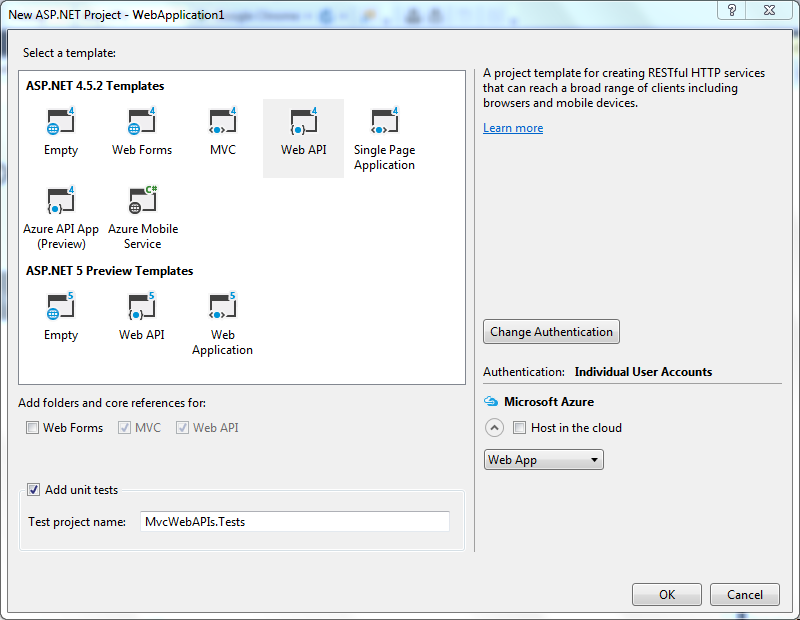

# MODULE 13 <br> IMPLEMENTING WEB APIS IN ASP.NET MVC 5 WEB APPLICATIONS

## LAB  13  - BUILDING WEB API APPLICATIONS

**Estimated time to complete this lab: 45 minutes**

ASP.NET Web API excels at accepting and generating structured data like JSON and XML. MVC has flirted with providing structured data support (with JsonResult and the JSON value provider), but it still fell short in several ways that are important to API programmers, including:
-	Dispatching to actions based on HTTP verbs rather than action names.
-	Accepting and generating content that might not necessarily be object oriented (not only XML, but also content such as images, PDF files, or VCARDs).
- Content type negotiation, which allows the developer to both accept and generate structured content independent of its wire representation.
-	Hosting outside of the ASP.NET runtime stack and IIS web server, something which WCF has been able to do for years.

This lab helps illustrate the similarities and differences between MVC and Web API and help you decide whether you want to start including Web API in your MVC projects.

### Lab Objectives

After completing this lab, you will be able to:
- Write an API controller
- Configure Web API
- Create Web API Controller

### Lab Procedures

**A. Writing an API Controller**

Web API ships with MVC, and both utilize controllers. However, Web API does not share the Model-View-Controller design of MVC. They both share the notion of mapping HTTP requests to controller  actions,  but rather than MVC's pattern of using an output template and view engine to render a result, Web API directly renders the resulting model object as the response. Many of the design differences between Web API and MVC controllers come from this core difference between the two frameworks.
Follow these steps to write an API controller:

1. Create new project ASP. NET MVC 5 with Web API project template using procedure that described in **Lab 1**. Make sure you choose **Web API** icon in **Select a template**  section:

    

2.	The following script shows `valuesController` that you get when you create a new project.

    ``` cs
    using System;
    using System.Collections.Generic;
    using System.Linq;
    using System.Net;
    using System.Net.Http;
    using System.Web.Http;

    namespace MvcWebAPIs.Controllers
    {
        [Authorize]
        public class ValuesController : ApiController
        {
            // GET api/values
            public IEnumerable<string> Get()
            {
                return new string[] { "value1", "value2" };
            }

            // GET api/values/5
            public string Get(int id)
            {
                return "value";
            }

            // POST api/values
            public void Post([FromBody]string value)
            {
            }

            // PUT api/values/5
            public void Put(int id, [FromBody]string value)
            {
            }

            // DELETE api/values/5
            public void Delete(int id)
            {
            }
        }
    }
    ```
    The first difference you'll notice is that a new base class is used for all `API controllers: ApiController`. The second thing you'll notice is that the methods in the controller return raw objects rather than views (or other action results). Instead of returning views composed of HTML, the objects that API controllers return are transformed into the best matched format that the request  asked for.
    
    The third difference owes to conventional dispatching differences between MVC and Web APL Whereas MVC controllers always dispatch to actions by name, Web  API  controllers  by  default dispatch to actions by HTTP verb. Although you can use  verb override  attributes  such  as  `[HttpGet]`  or  `[HttpPost]`,   most   of your verb-based actions will probably follow the pattern of starting  the action name with the verb name. The action methods in  the sample controller are named directly after the verb, but they could  also have just started with the verb name (meaning `Get` and `GetValues` are both reachable with the `GET` verb).
    
    It's also worth noting that `ApiController` is defined in the namespace `System.Web.Http` and not in `System.Web.Mvc` where Controller is defined. When we discuss self-hosting later, the reason for this will be clearer.

3.	Add the interface of `API controller` with the following script:

    ``` cs
    namespace System.Web.Http {
        public abstract class ApiController: IHttpController, IDisposable { 
        
            // Properties
            public HttpConfiguration Configuration {get; set;}
            public HttpControllerContext ControllerContext {get; set;}
            public ModelStateDictionary ModelState {get; set;}
            public HttpRequestMessage Request {get; set;}
            public HttpRequestContext RequestContext {get; set;}
            public UrlHelper Url {get; set;}
            public IPrincipal User {get; set;}
            
            // Request execution        
            public virtual Task <HttpResponseMessage> ExecuteAsync(HttpControllerContext controllerContext, CancellationToken cancellationToken);
            protected virtual void Initialize(HttpControllerContext controllerContext);
            
            // Action results
            protected virtual BadRequestResult BadRequest();
            protected virtual InvalidModelStateResult BadRequest(ModelStateDictionary modelState);
            protected virtual BadRequestErrorMessageResult BadRequest(string message);
            protected virtual ConflictResult Conflict();
            protected virtual NegotiatedContentResult <T> Content <T> (HttpStatusCode statusCode, T value);
            protected FormattedContentResult <T> Content <T> (HttpStatusCode statusCode, T value, MediaTypeFormatter formatter);
            protected FormattedContentResult <T> Content <T> (HttpStatusCode statusCode, T value, MediaTypeFormatter formatter, string mediaType);
            protected virtual FormattedContentResult <T> Content <T> (HttpStatusCode statusCode, T value, MediaTypeFormatter formatter, MediaTypeHeaderValue mediaType);
            protected CreatedNegotiatedContentResult <T> Created <T> (string location, T content);
            protected virtual CreatedNegotiatedContentResult <T> Created <T> (Uri location, T content);
            protected CreatedAtRouteNegotiatedContentResult <T> CreatedAtRoute <T> (string routeName, object routeValues, T content);
            protected virtual CreatedAtRouteNegotiatedContentResult <T> CreatedAtRoute <T> (string routeName, IDictionary <string, object> routeValues, T content);
            protected virtual InternalServerErrorResult InternalServerError();
            protected virtual ExceptionResult InternalServerError(Exception exception);
            protected JsonResult <T> Json <T> (T content);
            protected JsonResult <T> Json <T> (T content, JsonSerializerSettings serializerSettings);
            protected virtual JsonResult <T> Json <T> (T content, JsonSerializerSettings serializerSettings, Encoding encoding);
            protected virtual NotFoundResult NotFound();
            protected virtual OkResult Ok();
            protected virtual OkNegotiatedContentResult <T> Ok <T> (T content);
            protected virtual RedirectResult Redirect(string location);
            protected virtual RedirectResult Redirect(Uri location);
            protected virtual RedirectToRouteResult RedirectToRoute(string routeName, IDictionary <string, object> routeValues);
            protected RedirectToRouteResult RedirectToRoute(string routeName, object routeValues);
            protected virtual ResponseMessageResult ResponseMessage(HttpResponseMessage response);
            protected virtual StatusCodeResult StatusCode(HttpStatusCode status);
            protected UnauthorizedResult Unauthorized(params AuthenticationHeaderValue[] challenges);
            protected virtual UnauthorizedResult Unauthorized(IEnumerable<AuthenticationHeaderValue> challenges);
        }
    }
    ```

**B. Configuring Web API**

Web API was designed not to have any such static global values, and instead put its confi guration into the `Httpconfiguration` class. Follow these steps to configure the Web API for WCF self-host:

1. The configuration class you need to Instantiate is `HttpSelfHostConfiguration`, which extends the base `HttpConfiguration` class by requiring a base URL to listen to.

2.	After  setting  up  the  configuration,  you  create  an  instance    of `HttpSelfHostServer`, and then tell it to start listening. Here is a sample snippet of startup code for WCF self-host:

    ``` js
    var config = new HttpSelfHostConfiguration("http://localhost:8080/");
    config.Routes.MapHttpRoute(
        name: "DefaultApi",
        routeTemplate: "api/{controller}/{id}",
        defaults: new { id = RouteParameter.Optional }
    );
    var server = new HttpSelfHostServer(config);
    server.OpenAsync().Wait();
    ```

3.	You should also shut down the server when you're done:
    `server.CloseAsync().Wait();`

4.	If you are self-hosting in a console app, you would probably run this code in your `Main` function.

5.	For self-hosting in other application types, just find the appropriate place to run application startup and shutdown code and run    these things there. In both cases, the `.Wait()` call could (and should) be replaced with an async code (using `async` and `await`) if your application development framework allows you to write an asynchronous startup and shutdown code.

**C. Creating Web API Controller**

Here's an example Web API controller that exposes a simple data object through Entity Framework's Code First feature. To support this example, you will need the following scripts:

- **The model**—Product.cs

- **The database context**—DataContext.cs

- **The controller**—ProductsController.cs

Follow these steps to create Web API controller:

1.	Create new class within Controller folder and give Product as name.

2.	Write the foJlowing script into the Product class.
    
    ``` cs
    public class Product
    {
        public int ID { get; set; }
        public string Name { get; set; }
        public decimal Price { get; set; }
        public int UnitsInStock { get; set; }
    }
    ```

3.	Create other  class within  the same  folder  and give `Datacontext` as name.

4.	Write the following script into the DataContext class.
    
    ``` cs
    public class DataContext : DbContext
    {
        public DbSet<Product> Products { get; set; }
    }
    ```

5.	Finally,  create Controller  class  within  the same  folder  and give `ProductController` as name.

    ``` cs
    public class ProductsController : ApiController
    {
        private DataContext db = new DataContext();
        // GET api/Products
        public IEnumerable<Product> GetProducts()
        {
            return db.Products;
        }
        // GET api/Products/5
        public IHttpActionResult GetProduct(int id)
        {
            Product product = db.Products.Find(id);
            if (product == null)
            {
                return NotFound();
            }
            return Ok(product);
        }
        // PUT api/Products/5
        public IHttpActionResult PutProduct(int id, Product product)
        {
            if (ModelState.IsValid && id == product.ID)
            {
                db.Entry(product).State = EntityState.Modified;
                try
                {
                    db.SaveChanges();
                }
                catch (DbUpdateConcurrencyException)
                {
                    return NotFound();
                }
                return Ok(product);
            }
            else
            {
                return BadRequest(ModelState);
            }
        }
        // POST api/Products
        public IHttpActionResult PostProduct(Product product)
        {
            if (ModelState.IsValid)
            {
                db.Products.Add(product);
                db.SaveChanges();
                var uri = new Uri(
                Url.Link( "DefaultApi",
                    new { id = product.ID }));
                return Created(uri, product);
            }
            else
            {
                return BadRequest(ModelState);
            }
        }
        // DELETE api/Products/5
        public IHttpActionResult DeleteProduct(int id)
        {
            Product product = db.Products.Find(id);
            if (product == null)
            {
                return NotFound();
            }
            db.Products.Remove(product);
            try
            {
                db.SaveChanges();
            }
            catch (DbUpdateConcurrencyException)
            {
                return NotFound();
            }
            return Ok(product);
        }
        protected override void Dispose(bool disposing)
        {
            db.Dispose();
            base.Dispose(disposing);
        }
    }
    ```

