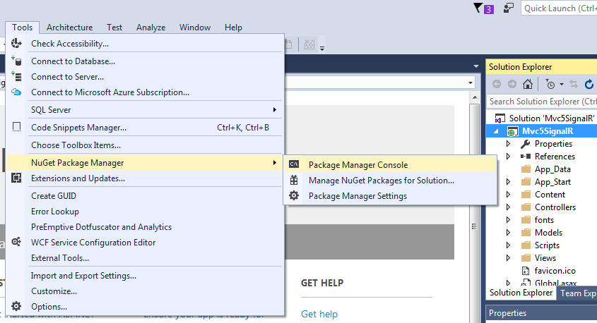
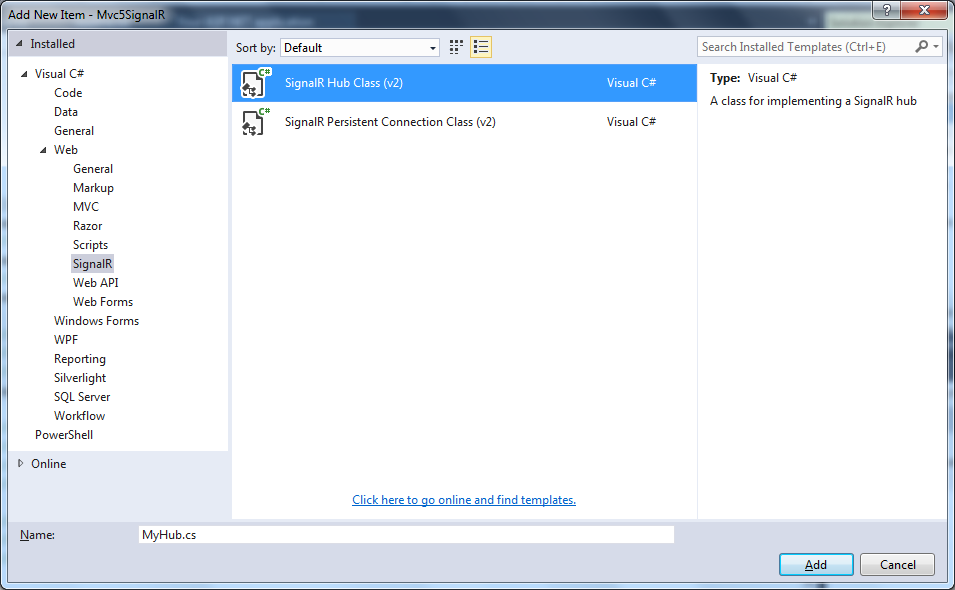
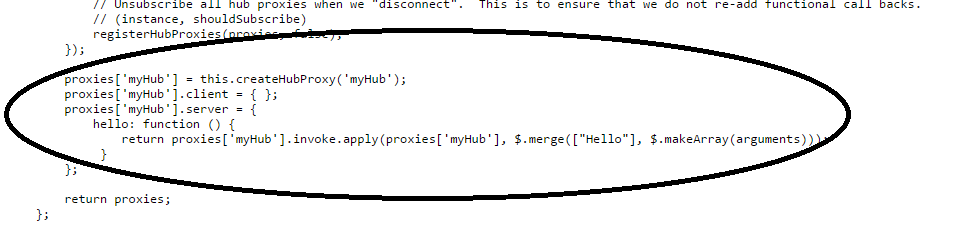
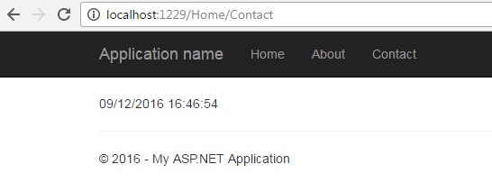
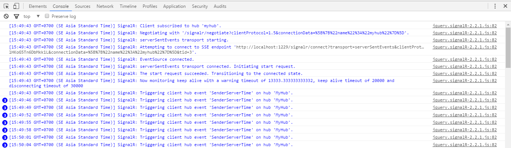
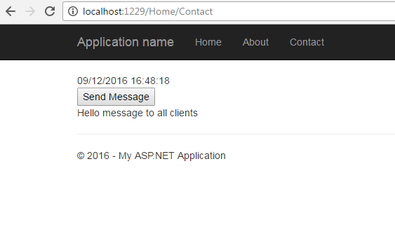

# MODULE 14 <br> HANDLING REQUESTS IN ASP.NET MVC 5 WEB APPLICATIONS

## LAB 14 - SIGNALR WITH ASP.NET MVC5

**Estimated time to complete this lab: 45 minutes**

SignalR is a web based real time bi-directional communication framework. By real time, we mean the clients get the messages being sent in real time as  and when the server has something to send without the client requesting for it. And bi-directional because both the client and server can send messages to each other. In the simplest terms, the way it works is the client is able to call methods on the server and the server likewise is able to call methods in the client.

In this lab we will implement real time bi-directional communication between client and server by creating a tunnel between client and server which is bi-directional in nature so that server can happily send messages to its attached clients whenever it wants to.

### Lab Objectives

After completing this lab, you will be able to:
- Configure and hnplement SignalR with ASP.NET MVC   5

### Lab Procedures

__A.	Configuring  and  Implementing	SignalR	with  ASP.NET MVC 5__

Follow	these	steps	to	implement	the	real	time	bi-directional communication between client and server:

1.	Create a new ASP.NET MVC5 web project. Select the __MVC__ template and set __Authentication__ to "__Individual User Accounts__". You are actually free to use any authentication you want but selecting "__Individual User Accounts__" gives us a __Startup__ class which otherwise you would have to write yourself.

2.	Install __Nuget__ package __Microsoft.AspNet.SignalR__. The easiest approach. however, is to use NuGet and the Package Manager Console (click __Tools &rArr; NuGet Package Manager &rArr; Package Manager Console__).

    

    And then type the following command:
    
    ```
    Install-Package Microsoft.AspNet.SignalR
    ```
    
    This nuget package contains both the server and client side dependencies needed to run SignalR.

3.	After installing the __Nuget__ package, it shows us __a readme.txt__ file which mentions that to enable __SignalR__ in our application, we have to do some __OWIN/Katana__ configuration.

    So   basically,   we  have   a   __Startup__   class  in   out   project   and a `Configuration(IAppBuilder app)` method. Now inside the `ConfigureAuth` class add this line of code to enable __SignalR__ as shown in the code snippet end.

    ``` cs
    public partial class Startup
    {
        public void ConfigureAuth(IAppBuilder app)
        {
            // Configure the db context, user manager and signin manager to use a single instance per request
            app.CreatePerOwinContext(ApplicationDbContext.Create);
            app.CreatePerOwinContext<ApplicationUserManager>(ApplicationUserManager.Create);
            app.CreatePerOwinContext<ApplicationSignInManager>(ApplicationSignInManager.Create);

            // Enable the application to use a cookie to store information for the signed in user
            // and to use a cookie to temporarily store information about a user logging in with a third party login provider
            // Configure the sign in cookie
            app.UseCookieAuthentication(new CookieAuthenticationOptions
            {
                AuthenticationType = DefaultAuthenticationTypes.ApplicationCookie,
                LoginPath = new PathString("/Account/Login"),
                Provider = new CookieAuthenticationProvider
                {
                    // Enables the application to validate the security stamp when the user logs in.
                    // This is a security feature which is used when you change a password or add an external login to your account.  
                    OnValidateIdentity = SecurityStampValidator.OnValidateIdentity<ApplicationUserManager, ApplicationUser>(
                        validateInterval: TimeSpan.FromMinutes(30),
                        regenerateIdentity: (manager, user) => user.GenerateUserIdentityAsync(manager))
                }
            });            
            app.UseExternalSignInCookie(DefaultAuthenticationTypes.ExternalCookie);
            // Enables signalR
            app.MapSignalR();
        }
    }
    ```

4.	In  our  project,  __Add__  a __New Item &rArr;	Visual C# &rArr; Web &rArr; SignalR__. We have 2 templates  here.  One SignalR  Hub Class (v2) tab hub class which we would select here. There is another template `SingalR Persistent Connection` Class which  we can use if we want to do something at a connection level (a bit lower level).

    

5. So this `MyHub` class derives from the SignalR `"Hub"` class which exposes a public method `Hello()` which the clients can call to using `WebSockets` etc.
    
    ``` cs
    public class MyHub : Hub
    {
        public void Hello()
        {
            Clients.All.hello();
        }
    }
    ```

6.	Inside the Hub's Hello method, we are doing `Clients.All.hello();` which means the for all clients that are connected, call the `hello()` method on the client(a Javascript method).

    Please note that "All" is a dynamic property of Clients and so we can call any method we want, e.g. in this case instead of `hello()` method we can call any other method say `helloworld()`.

    ```
    Clients.All.helloworld();
    ```

7.	Write some SignalR code which will broadcast the server time every 3 seconds to the clients, a simple example.

    For that, in the above `MyHub` class, lets write a constructor and create a long running task in an infinite loop and send the server time to all the connected clients by calling the client method (a JavaScript method on the client called from C# server side) after  a delay of every 3 seconds. We are using TPL for this to make it asynchronous.

    ``` cs
    public MyHub()
    {
        // Create a Long running task to do an infinite
        // loop which will keep sending the server time
        // to the clients every 3 seconds
        var taskTimer = Task.Factory.StartNew(async () =>
        {
            while (true)
            {
                string timeNow = DateTime.Now.ToString();
                //Sending the server time to all the
                // SendServerTime()
                Clients.All.SenderServerTime(timeNow);
                // Delaying by 3 seconds.
                await Task.Delay(3000); 
            }
        }, TaskCreationOptions.LongRunning
        );
    }
    ```

8.	Now that we have a hub defined and wrote the server code to send the server time to the clients, lets try writing some client side code. We'll need a view to display the server time. We'll use the Contact view from the default ASP.NET MVC5 template project and delete its contents to keep it clean.

    ``` html
    @section scripts{
        <script src="~/Scripts/jquery.signalR-2.1.1.js"></script>
        <script src="~/SignalR/hubs"></script>
        <script src="~/Scripts/Custom/timer.js"></script>
    }
    <span id="newTime"></span>
    ```

    In the view snippet above, we have referenced the __signalR jquery__ library __jquery.signalR-2.1.1.js__ and a custom javascript file  __timer.js__ which we'll use to write our own custom  code to define the connection to the hub and the client side methods.

    The	script	in	the	middle	`<script src="~/SignalR/hubs"></script>` is not really a script but an endpoint exposed by the hub for the clients to consume. Its a kind of proxy on the client similar to a WCF proxy for those who have used WCF. We also need the __jquery__ library but we haven't included it here as its already there in the **`_layout.cshtml`** view which this view inherits.

    And we have a span defined with an id so that we can use Jquery to write the server send time there in the span which we'll see later.

    Lets browse the URL  __http://localhost:29511/SignalR/hubs__ to have a look at the proxy contents.

    

9.	Here in the proxy code, we can see that, we have the myHub proxy which we defined as a hub in the server side.
    
    We also see the `hello()` function defined on the server side here. The last piece of code left to be written is the __timer.js__ Javscript code.

    ``` js
    (function () {
        // Defining a connection to the server hub.
        var myHub = $.connection.myHub;
        // Setting logging to true so that we can see whats happening in the browser console log. [OPTIONAL]
        $.connection.hub.logging = true;
        // Start the hub
        $.connection.hub.start();

        // This is the client method which is being called inside the MyHub constructor method every 3 seconds
        myHub.client.SendServerTime = function (serverTime) {
            // Set the received serverTime in the span to show in browser
            $("#newTime").text(serverTime);
        };
    }());
    ```

    In the Javascript code snippet above, we have written an anonymous self executing Javascript method (self executing means we don't have to call it explicitly) where we defined the connection to the hub, started the hub and also wrote the client side method which the server hub calls.
    
    We are using the connection property on the $ object. Yes $ sounds like JQuery and the signalR client side library is actually a jquery plugin which makes this possible. Using the connection property we can access to the server side hubs.
 
     

    Here we can see that the time keeps updating every 3 seconds. Try spinning up multiple browsers and see that the time gets updated for all the browsers. So its SignalR broadcasting the server time as a message to all connected clients. If you remember  that we had set logging to true in our client side javascript `$.connection.hub.logging = true;`.
    
    So if you open up the Console window of the browser (F12 key for most of the ones) we will see the communication as shown in the snapshot below. In this case, its using WebSockets for communication as we are uging the latest version of Chrome, but if you use an older browser, the communication may actually fall back to something else.

    
   
    The last piece of thing that we wanted to show is the client making a call to a server fimction defined in the Hub. This would show the true piece of bi-directional communication between the client and server.

    We'll try sending a message to all connected clients on a button click. So a button click method on the client will call a server hub method which in turn will call a client method to all its connected clients. So one client will essentially call the server method which will broadcast to all the clients.

    ``` cs
    public class MyHub : Hub
    {
        public void HelloServer()
        {
            Clients.All.hello("Hello message to all clients");
        }
    }
    ```
    
    So here we have a `HelloServer()` method defined in our hub which sends a message to all the clients. Lets add a button and another span to our view. Button to click and span to display the message.

    ``` html
    @section scripts{
        <script src="~/Scripts/jquery.signalR-2.1.1.js"></script>
        <script src="~/SignalR/hubs"></script>
        <script src="~/Scripts/Custom/timer.js"></script>
    }
    <span id="newTime"></span><br />
    <input type="button" id="btnClick" value="Send Message" /><br />
    <span id="message"></span>
    ```

Now lets change our timer.js file to include 2 more functions.

1.	Client method `hello()` which is called from server hub as shown below.

    ```
    Clients.All.hello("Hello message to all clients");
    ```

2.	Button	click	handler	which	calls	server	hub	method `helloServer()`.

    ``` js
    (function () {
        // Defining a connection to the server hub.
        var myHub = $.connection.myHub;
        // Setting logging to true so that we can see whats happening in the browser console log. [OPTIONAL]
        $.connection.hub.logging = true;
        // Start the hub
        $.connection.hub.start();
        // This is the client method which is being called inside the MyHub constructor method every 3 seconds
        myHub.client.SendServerTime = function (serverTime) {
            // Set the received serverTime in the span to show in browser
            $("#newTime").text(serverTime);
        };
        
        // Client method to broadcast the message
        myHub.client.hello = function (message) {
            $("#message").text(message);
        };

        //Button click jquery handler
        $("#btnClick").click(function () {
            // Call SignalR hub method
            myHub.server.helloServer();
        });
    }());
    ```
    
    With this code in place now if we open up 2 or more browser windows and click on the button on one browser, all the browsers will receive the message real time. We can easily tweak this code to actually make a chat room by sending a proper message written by one client instead of a hardcoded message sent by server. So this is a brief introduction  of the possibilities of SignalR.

    

