# MODULE 15 <br>DEPLOYING  ASP.NET MVC 5  <br> WEB  APPLICATIONS

## LAB 15- DEPLOYING ASP.NET MVC 5 WEB APPLICATIONS

__Estimated time to complete this lab: 45 minutes__

This lab explains how to host your MVC 5 web application in IIS Express and store the data and information in the database created in SQL Server 2008. Visual Studio uses the ASP.NET Development Server as a default and here we're using IIS Server to host a MVC 5 web application. For this lab we use the Visual Studio 2013 to develop an application using the MVC project template.

### Lab Objectives

After completing this lab, you will be able to:

- Create MVC 5 Application
- Publish the  Application
- Configure HS Server

### Lab Procedures

__A.	Creating MVC 5 Application__

Fo11ow these steps to create MVC 5 application:

1. Open __Visual Studio Professional 2015.__

    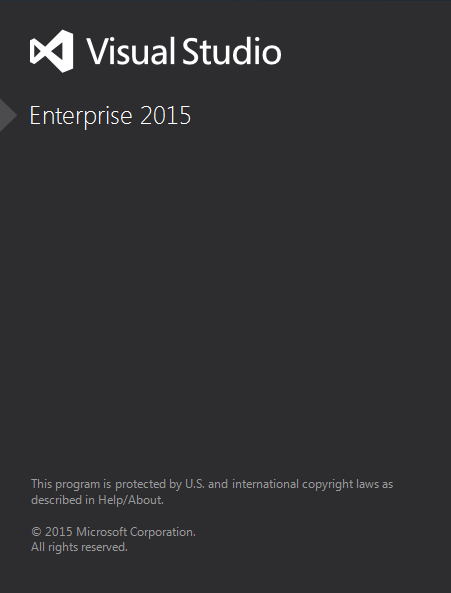

2.	Click on  __New  Project__ and  enter  __MvcIISDemo__ as the application name.

    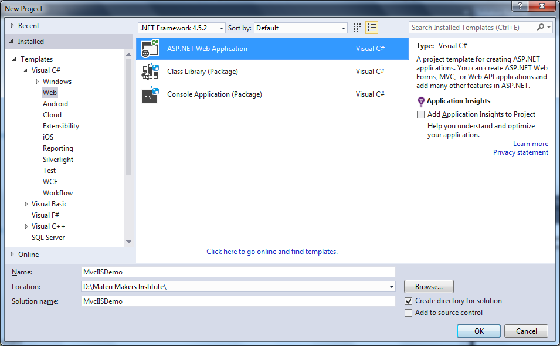

3.	Select MVC project template to create the project.

    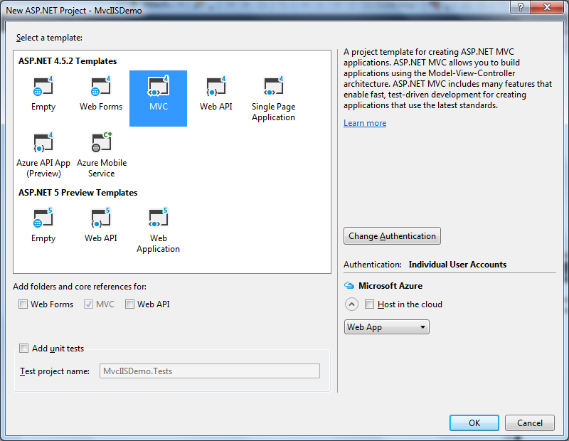
    
4.	In your Solution Explorer, open the Web.config file. As you can see, the corutection property is available on my file: 

    ```
    <add name="DefaultConnection" connectionString="Data Source=(LocalDb)\MSSQLLocalDB;AttachDbFilename=|DataDirectory|\aspnet-MvcIISDemo-20161210103157.mdf;Initial Catalog=aspnet-MvcIISDemo-20161210103157;Integrated Security=True" providerName="System.Data.SqlClient" />
    ```

    Now, change the code above as shown below:

    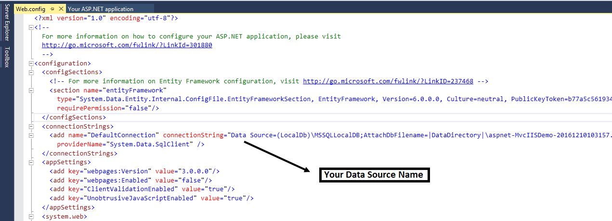

5. Debug your application  and click on  the  __Register  Link__  as shown  below:

    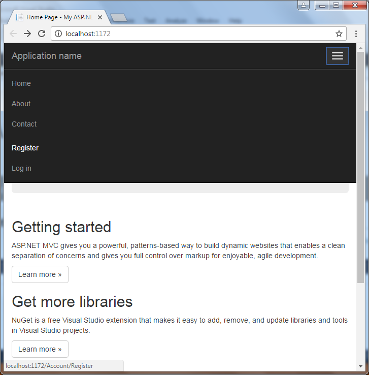
   
6.	Enter the details and click on the __Register__ button.

    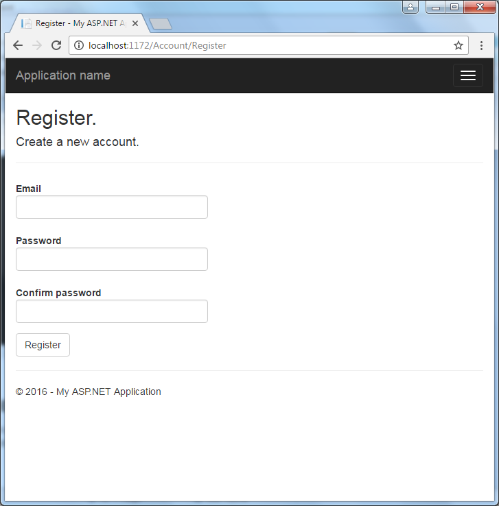
    
7.	You will see your __UserName__ in your next page window:

    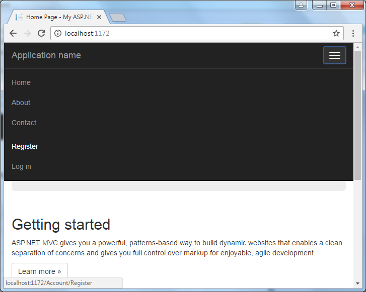
    
8.	Verify in SQL Server 2008. As you can see, we did not create a database nor any table in my SQL Server 2008. When we declared our connection string, it automatically created a database and table in SQL Server.

    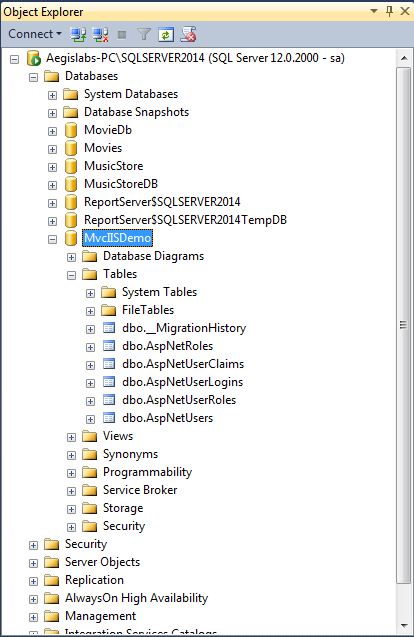
    
9.	Select your database and open the __Users__ Table. You can see the user information as shown below:

    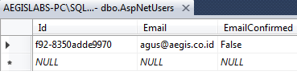
    
__B.	Publishing  the Application__

The next step is to host in IIS 8 (IIS Express). For that use the following procedure:

1. In  your  __Solution  Explorer__  select  your  project  and right-click to select Publish.

    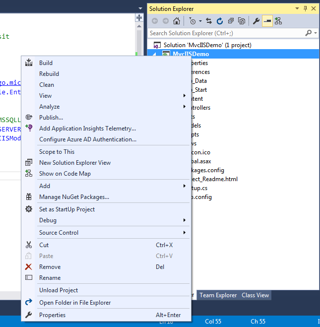
    
2.	Select __NewProfile__ and click __Next__ as shown below:

    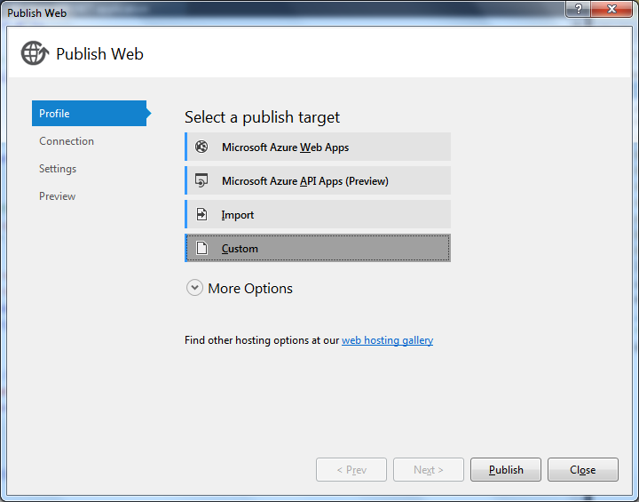
    
3. Enter __IISHostDemo__ as __Profile Name__ and click __OK__

    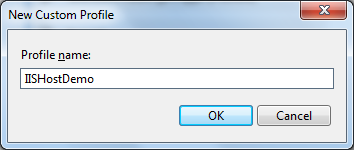

4.	Select __File System__ in __Publish method__ and select your preferred location in the __Target location__ and click  __Next__.

    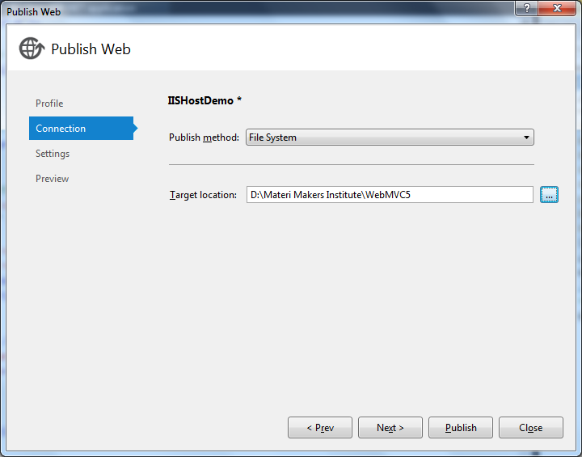
 
5.	Select  __Release__ in __Configuration__  in the next window and click __Next__.

     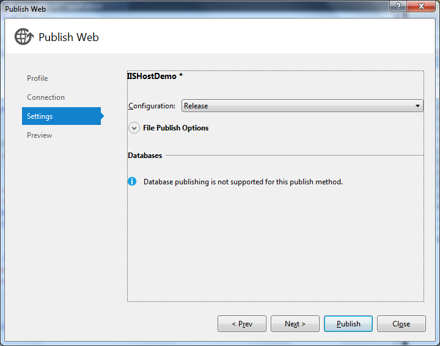

6. Click on __Publish__ in the next wizard

     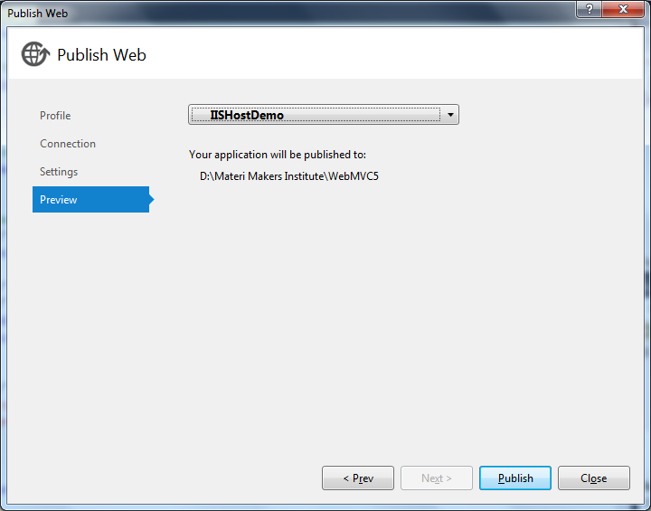

7. You will see that the application will publish successfully.

    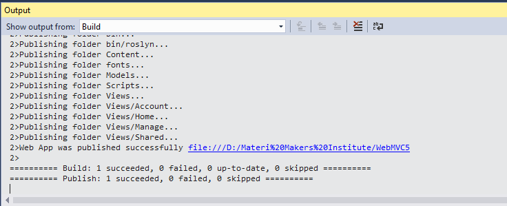
    
__C.	Configuring IIS Server__

Follow these steps to configure IIS Server using IIS Manager.

1.	Click __Windows7__ &rArr; type __IIS Manager [Enter]__.

2.	Select your __Profile__ in the __Default Site__.

    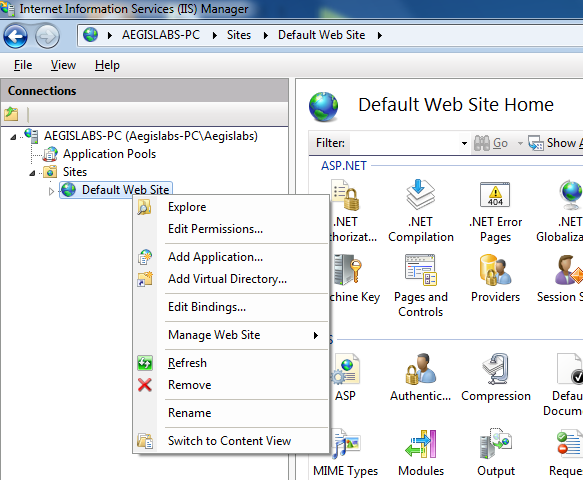

3. Just click __OK__ in the next __Add Application__ wizard

	 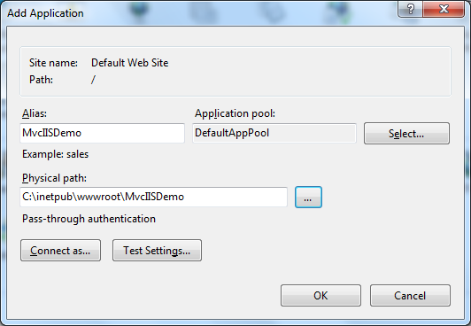

4. Ensure your __Default Site Status__ is __Started__ in __Application Pools__.

    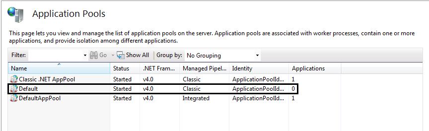
   
5.	Right-click your __Profile__ in the __Select Browse__ in __Manage Application__.

	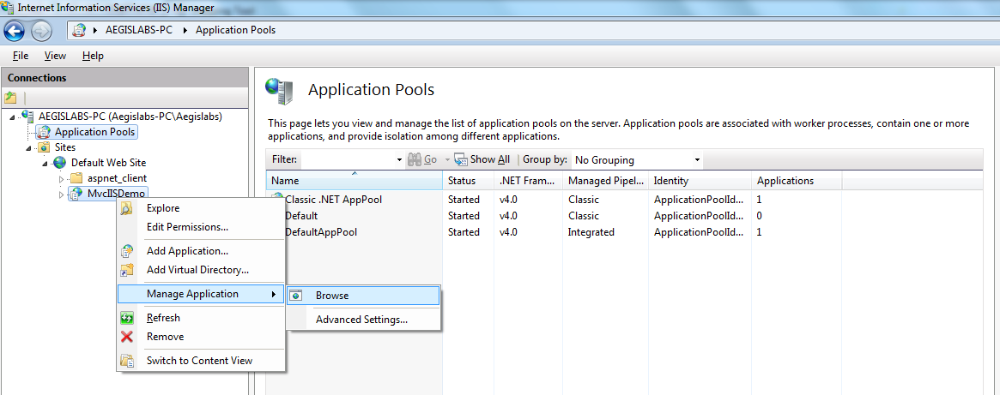	
    
6.	You will see an error in your browser.

	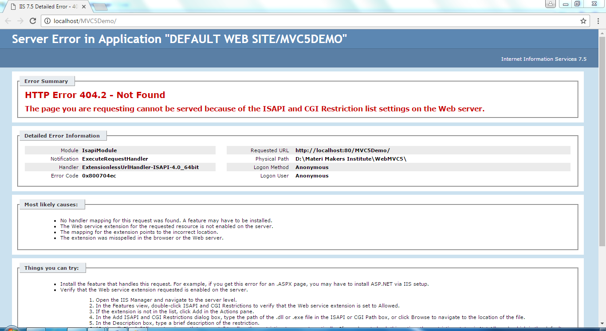

	Note: Please don't close the browser.

7.	Select __Advanced Settings__ of your site in the __Application Pool__ by right-clicking and selecting __Advanced Settings__.

	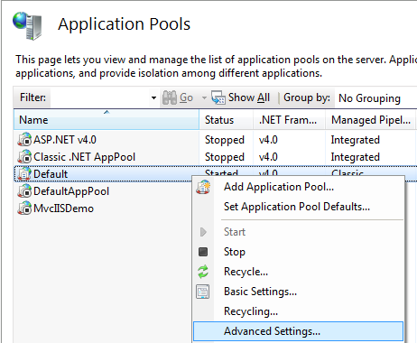

8.	Select __Integrated__ in the __Managed Pipeline Mode__.

	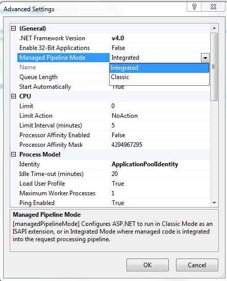
    
9. Reload your browser and  you wil1 see the __Home Page__.

	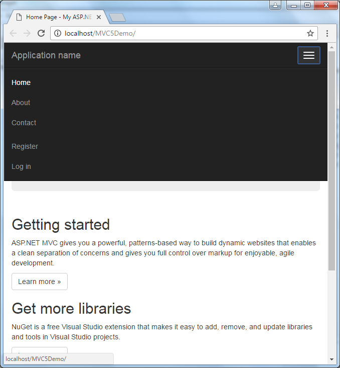
    
10. New click on __Register__ and enter the details.

	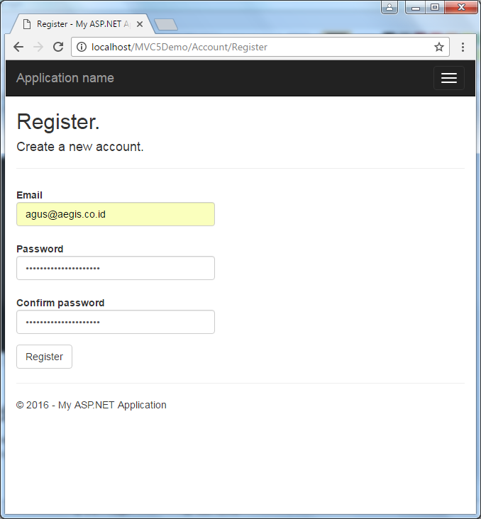

11. After registration you can login.

	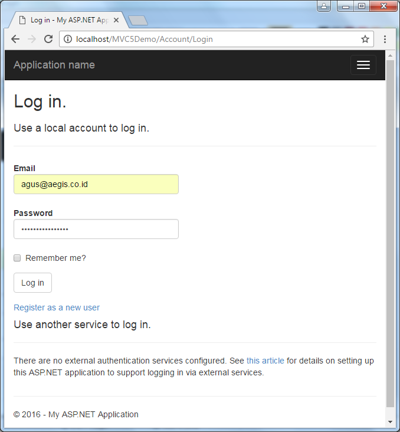
    
    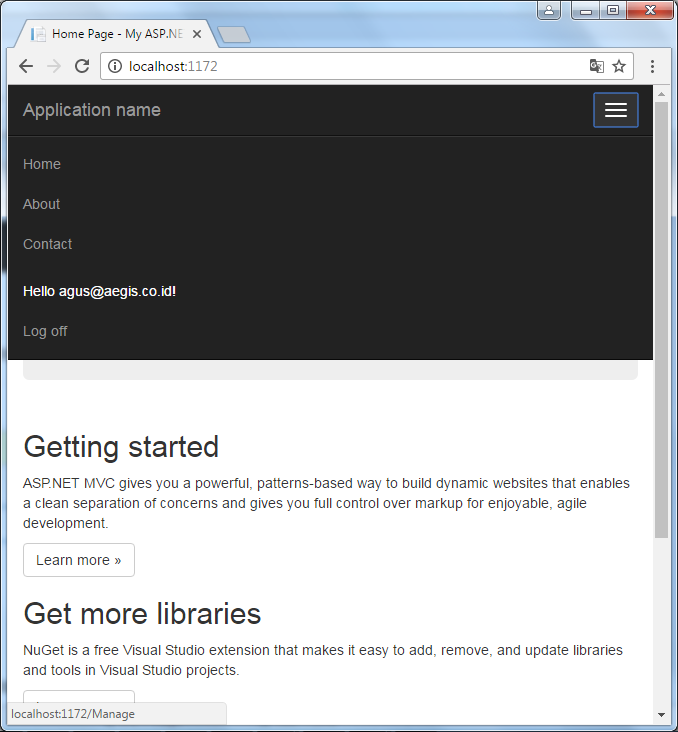

	So far, this lab will help you to learn to create an MVC 5 Application to store the data and information in SQL Server directly and you don't need to worry about creating the database manually. With this lab you can also learn to publish your article and browse your application from IIS Manager and the application will run on the IIS Server.