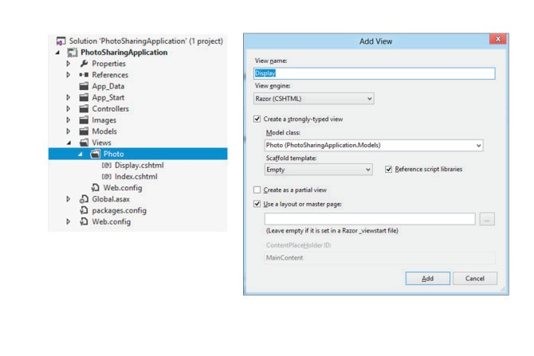
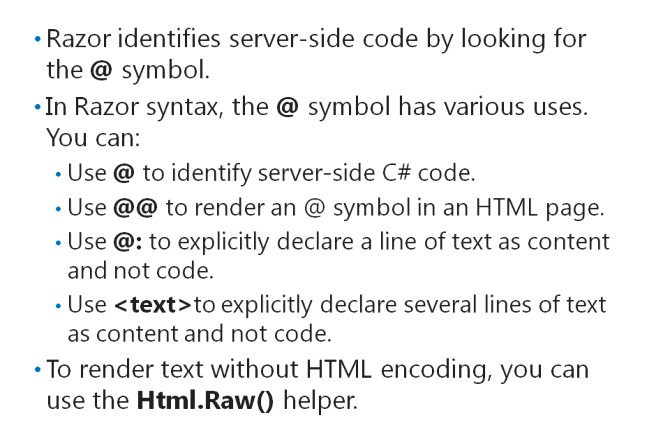
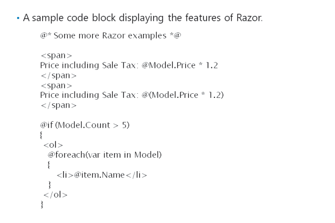
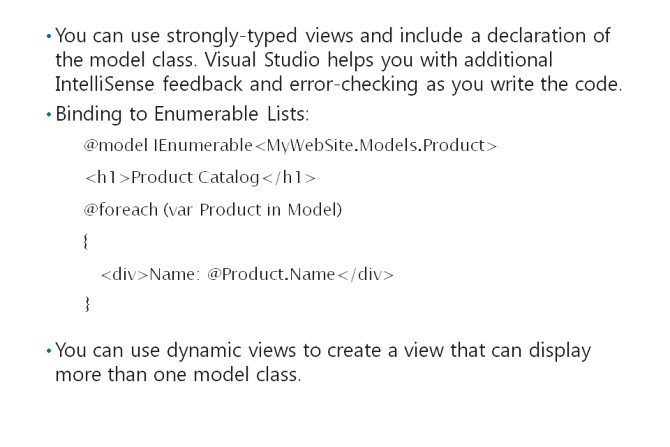
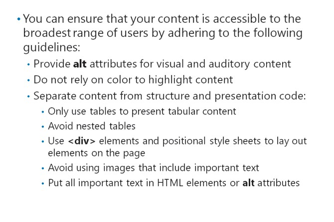
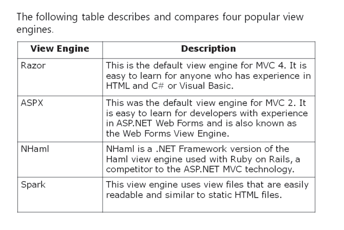
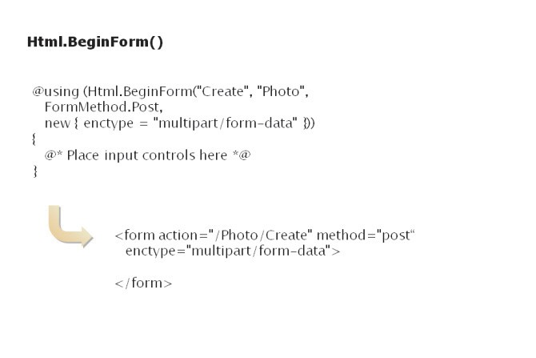
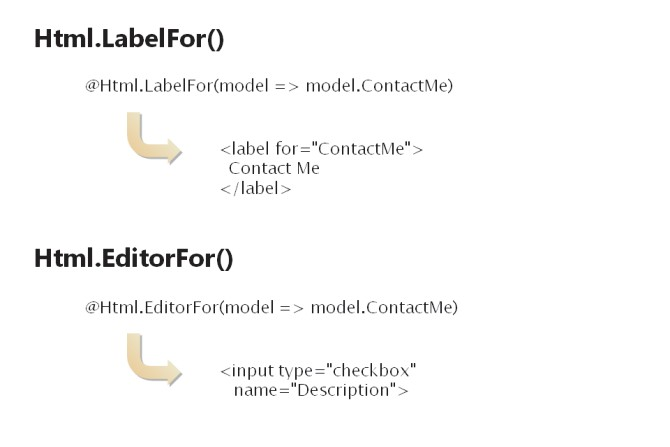
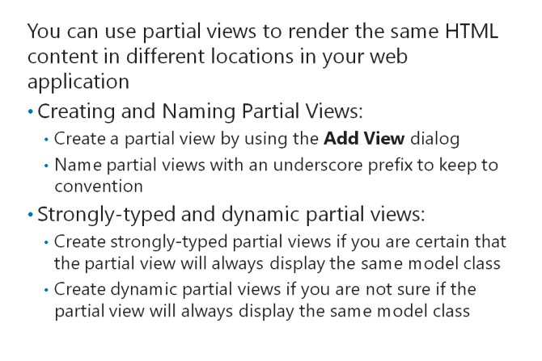
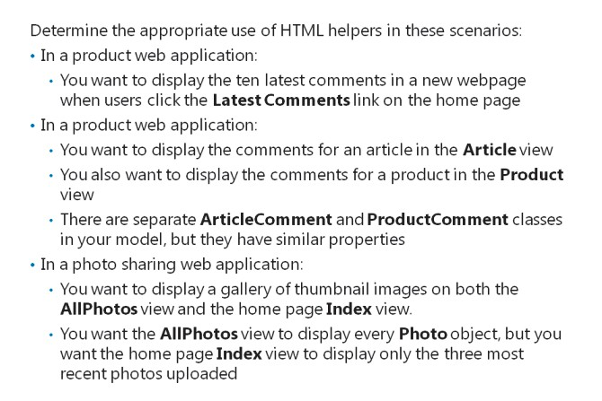

# Module 05 <br> Developing ASP.NET MVC 5 Views

#### Contents:

[Module Overview](#1)    
[**Lesson 1:** Creating Views with Razor Syntax](#2)    
[**Lesson 2:** Using HTML Helpers](#3)    
[**Lesson 3:** Re-using Code in Views](#4)    

## <a name="1"></a>Module Overview

Views are one of the three major components of the MVC programming model. You can construct the user interface for your web application by writing views. A view is a mixture of HTML markup and code that runs on the web server. You need to know how to write the HTML and code found in a view and use the various helper classes built into MVC. You also need to know how to write partial views, which render sections of HTML that can be re-used in many places in your web application. The knowledge of creating views will help you develop webpages that present dynamic content.

### Objectives

After completing this module, you will be able to:

- Create an MVC view and add Razor markup to it to display data to users.

- Use HTML helpers in a view to render controls, links, and other HTML elements.

- Re-use Razor markup in multiple locations throughout an application.

## Lesson 1 <br> **Creating Views with Razor Syntax**

When a user makes a request to an MVC web application, a controller responds. Often, the controller action instantiates a model object, for example, a **Product**. The controller might get the **Product** by querying the database, by creating a new **Product**, or by performing some other step. To display the **Product**, the controller creates a view and passes the **Product** to it. The view builds a webpage by inserting properties from the **Product**, and sometimes, from other sources, into HTML markup. MVC sends the completed webpage to the browser. To create views, you must understand how MVC interprets the code you place in views and how a completed HTML page is built. By default, the Razor view engine performs this interpretation, but you can also use other view engines. If you take time to understand Razor, you will find it to be an excellent and versatile view engine that gives a great degree of control over the rendered HTML. Other view engines have very different syntaxes, which you may prefer if you have worked with earlier versions of ASP.NET or other server-side web technologies, such as Ruby on Rails.

#### Lesson Objectives

After completing this lesson, you will be able to:

- Add views to an MVC 5 web application.

- Use the @ symbol in a Razor view to treat code as content.

- Describe the features of Razor syntax.

- Bind views to model classes to display data.

- Explain how to render HTML that is accessible to visitors with low vision.

- List a few alternative view engines to the Razor view engine.

### Adding Views



In an MVC application, there is usually one controller for every model class. For example, a model class named **Product** usually has a controller called **ProductController** that contains all the actions relevant to products. There may be some controllers that do not correspond to any model classes, such as the **HomeController**.

However, each controller can have multiple views. For example, you may want to create the following views for **Product** objects:

- _Details_. The details view can display a **Product**, its price, catalog number, and other details.

- _Create_. The create view can enable users to add a new **Product** in the catalog.

- _Edit_. The edit view can enable users to modify the properties of an existing **Product**.

- _Delete_. The delete view can enable users to remove a **Product** from the catalog.

- _Index_. The index view can display all the **Product** objects in the catalog.

By convention, an MVC web application creates all views within the top-level **Views** folder. Within this folder, there is a folder for each controller in the application. In the preceding example, the **Views** folder would contain a **Product** folder. This folder would contain the Details, Create, Edit, Delete, and Index views.

If you use the Razor view engine and the C# language, views are files with a .cshtml extension. If you use the Razor view engine and the Visual Basic language, views are files with a .vbhtml extension. Other view engines use different extensions.

#### **How to Create a View File**

You can add a view file in Visual Studio by performing the following steps:

1.In the **Solution Explorer** pane, select the folder where you want to create the view. For example, for a controller named **ProductController**, MVC expects view files to be located in the **Views/Product** folder.

2.Right-click the selected folder, point to **Add**, and then select **View**.

Alternatively, you can create a view file for a particular controller action by opening the controller code file, right-clicking the action, and then clicking **Add View**. If you create a view by using the controller code file, some properties in the **Add View** dialog box are filled in by default.

The following table describes the properties that you must complete in the **Add View** dialog box.

|Property |Description|
|-|-|
|View name |This is the name of the view. The view file name is this name with the appropriate extension added. The name you choose should match the name returned by the corresponding controller action. If the action controller does not specify the name of the view to use, MVC assumes the name of the view matches the name of the controller action.|
|View engine |By default, you can select the Razor or ASPX view engines in this list. Other engines may be available if you have installed them. |
|Create a strongly-typed view |When you select this check box, you bind the view to a specific model class, such as a Product class. When you use strongly-typed views, you get additional IntelliSense and error checking help in Visual Studio as you write code in the view.|
|Model class |If you create a strongly-typed view, you need to specify the model class to bind to the view. Visual Studio will use this class when it formulates IntelliSense prompts and checks for compile-time errors. |
|Scaffold template |A scaffold template is a basic view that Visual Studio can use to create the view. If you specify a model class for the view, Visual Studio can create simple templates for Create, Edit, Details, Delete, and List views. When you become more experienced in using views, you may prefer to build a view from the empty scaffold template, rather than use populated scaffold templates.|
|Reference script libraries |When you select this check box, links to common client-side script files are included in the view. These links include the jQuery JavaScript library. |
|Create as a partial view |A partial view is a section of Razor code that you can re-use in multiple views in your application. |
|Use a layout or master page |A layout or master page can be used to impose a standard layout and branding on many pages within the web application. |

**Note:** You will see other view engines later in this module.

**Question:** You are using the Razor view engine and Visual Basic to create views. You right-click the **Delete** action in the **CustomerController.vb** file. What is the name of the view file that Visual Studio will create by default?

### Differentiating Server Side Code from HTML



The Razor view engine interprets view files and runs any server-side code contained in the view files. To do this, Razor must distinguish server-side code from HTML content that should be sent to the browser unchanged.

The Razor view engine looks for the @ symbol to identify server-side code.

In the following code example, Razor runs the line with the @ symbol as C# code on the web server. This code example displays the value of the **Title** property of the model class.

**Using @ to Declare Server-Side Code**

``` Razor
<p>
  Razor will not interpret any character in this line as code, because there is no “at” symbol
</p> 
<p>    
  The photo title is:     
  @Model.Title 
</p>
```

A section of code marked with the @ symbol is referred to as a Razor code expression. In Razor syntax, you mark the start of a Razor code expression with the @ symbol, but unlike the ASPX view engine, Razor lacks an expression ending symbol. Instead, Razor infers the end of a code expression by using a fairly sophisticated parsing engine.

#### **Modifying the Interpretation of Code and Content**

Sometimes, you may need to modify the logic that Razor uses to interpret code expressions. For example, if you want to display an @ symbol in the browser, you use @@. Razor interprets this as an escape sequence and renders a single @ symbol. This technique is useful for rendering email addresses.

Razor has sophisticated logic to distinguish code from content and often the @ symbol is all that is required. However, occasionally, you may find that an error occurs because Razor misinterprets content as code. To fix such errors, you can use the @: delimiter, which explicitly declares a line as content and not code.

If you want to declare several lines as content, use the <text> tag instead of the @: delimiter. Razor removes the <text> and </text> tags before returning the content to the browser.

In the following code example, Razor interprets the @: delimiter to display plain text.

**Using the @: Delimiter**

``` Razor
@( 
  @: This text is in a code block but the delimiter declares it as content. 
)
```

#### **HTML Encoding**

For security reasons, when Razor runs any server-side code that returns a string, it encodes the string as HTML before rendering it to the browser. For example, you may have a **Comment** model class with the following properties:

- _Subject_. This property contains a subject for the comment as a simple string with no formatting information.

- _HtmlComment_. This property contains the comment text itself. More important, it includes the formatting information as HTML tags. For example, it might include `<i>` tags to italicize a word.

If you have used the normal **@Model.HtmlComment** syntax to return the formatted comment text, Razor encodes `<` as `&lt` and `>` as `&gt` in the HTML source. This results in the user seeing `<i>` on the webpage. This is not the behavior you intend because you want the users to see italicized text.

To render text without HTML encoding, use the **Html.Raw()** helper. For example, use **@Html.Raw(Model.HtmlComment)**.

**Note:** Razor encodes text as HTML for a specific security reasonto stop malicious users from injecting malicious code into your web application. If such attacks are successful, injected code may circumvent security restrictions in your web application and deny service to users, or it may access sensitive information. Therefore, you should only use the **Html.Raw()** helper when it is absolutely necessary. Also, if you must use the **Html.Raw()** helper, you must ensure that it does not operate on unchecked strings entered by users.

### Features of Razor Syntax



Razor includes many useful features that you can use to control the manner in which ASP.NET MVC renders your view as HTML. These features include the following:

**Razor Comments**

You may want to include comments in your Razor code to describe it to other developers in your team. This is an important technique that improves developer productivity by making it easier to understand code.

You can declare a Razor comment by using the **@*** delimiter, as shown in the following code example.

**A Razor Comment**

``` Razor
@* This text will not be rendered by the Razor view engine, because this is a comment. *@ 
```

#### **Implicit Code Expressions and Parentheses**

Razor uses implicit code expressions to determine parts of a line that are server-side code. Usually, implicit code expressions render the HTML you want, but occasionally, you might find that Razor interprets an expression as HTML when it should be run as server-side code.

For example, if the **Product.Price** property contains the value 2.00, the following code renders "Price Including Sales Tax: 2.00 * 1.2".

**An Implicit Code Expression**

``` Razor
<span>Price Including Sales Tax: @Model.Price * 1.2</span>
```

You can control and alter this behavior by using parentheses to enclose the expression for Razor to evaluate.

For example, if the **Product.Price** property contains the value 2.00, the following code renders "Price Including Sales Tax: 2.40".

**Using Parentheses to Explicitly Delimit Expressions**

``` Razor
<span>Price Including Sales Tax: @(Model.Price * 1.2)</span> 
```

#### **Razor Code Blocks, Loops, and Conditions**

If you want to write multiple lines of server-side code, you can do it without prefacing every line with the @ symbol by using a Razor code block.

**A Razor Code Block**

``` Razor
@ {    
  //Razor interprets all text within these curly braces as server-side code. 
}
```

Razor also includes code blocks that run conditional statements or loop through collections.

For example, Razor runs the following code only if the **Product.InStock** Boolean property returns **true**. 

**A Razor If Code Block**

``` Razor
@if (Model.InStock) {    
  Html.ActionLink("Buy This Product", "AddToCart")
} 
```

Razor loops are useful for creating index views, which display many objects of a particular model class. A product catalog page, which displays many products from the database, is a good example of an index view. To implement an index view, a controller action passes an enumerable collection of objects to the view.

You can loop through all the objects in an enumerable collection by using the **foreach** code block:

**A Razor Foreach Code Block**

``` Razor
@foreach (var item in Model) 
{    
  <div>@item.ProductName</div> 
}
```

**Question:** You want to describe a code block to developers in your view file. You do not want your description to be passed to the browser. What syntax should you use?

### Binding Views to Model Classes and Displaying Properties



Many Razor views are designed to display properties from a specific model class. If you bind such views to the class they display, you get extra help such as IntelliSense feedback as you write the Razor code. Other views may display properties from different model classes in different cases, or may not use a model class at all. These views cannot be bound to a model class and are called dynamic views. You must understand how to write Razor code for both these situations.

**Strongly-Typed Views**

In many cases, when you create a view, you know that the controller action will always pass an object of a specific model class. For example, if you are writing the **Display** view for the **Display** action in the **Product** controller, you know from the action code that the action will always pass a **Product** object to the view.

In such cases, you can create a strongly-typed view. A strongly-typed view is a view that includes a declaration of the model class. When you declare the model class in the view, Visual Studio helps you with additional IntelliSense feedback and error-checking as you write the code. This is possible because Visual Studio can check the properties that the model class includes. Troubleshooting run-time errors is also easy. You should create strongly-typed views whenever you can so that you benefit from this extra IntelliSense and error-checking. If you follow this as a best practice, you will make fewer coding errors. A strongly-typed view only works with an object of the model class in the declaration.

To create a strongly-typed view in Visual Studio, select **Create a strongly typed view** in the **Add View** dialog box, and then choose the model class to bind to the view.

You can choose the **Product** model class so that Visual Studio can bind the view to the class you specify, by adding the following line of code at the top of the view file.

**The Model Declaration**

``` Razor
@model MyWebSite.Models.Product
```

Later in the view file, you can access properties of the model object by using the **Model** helper. For example, you might access a product catalog number in this manner: **@Model.CatalogNumber**.

#### **Binding to an Enumerable List**

Some views display many instances of a model class. For example, a product catalog page displays many instances of the **Product** model class. In such cases, the controller action passes a list of model objects to the view, instead of a single model object. You can still create a strongly-typed view in this situation, but you must use a different model declaration. You usually loop through the items in the list by using a Razor **foreach** loop.

The following code example shows a multiple-item view with the model declaration and the loop that enumerates all the **Product** objects passed by the action.

**A View of a List of Objects**

``` Razor
@model IEnumerable<MyWebSite.Models.Product> 
<h1>Product Catalog</h1> 
@foreach (var Product in Model) 
{    
  <div>Name: @Product.Name</div>
}
```

#### **Using Dynamic Views**

Sometimes, you might want to create a view that can display more than one model class. For example, you might want to create a view that can display your own products and products from a different supplier, together. These model classes might be named **Product** and **ThirdPartyProduct**. Some properties can be similar while others differ. For example, both **Product** and **ThirdPartyProduct** might include the **Price** property while only the **ThirdPartyProduct** model class includes the **Supplier** property.

Furthermore, sometimes, the controller action does not pass any model class to the view. The most common example of such a classless view is the site home page.

In such cases, you can create a dynamic view. A dynamic view does not include the **@model** declaration at the top of the page. You can choose to add the **@model** declaration to change the view into a strongly-typed view, later.

When you create dynamic views, you receive less helpful IntelliSense feedback and error checking because Visual Studio cannot check the model class properties to verify the code. In such scenarios, you have to ensure that you access only the properties that exist. To access a property that may or may not exist, such as the **ThirdPartyProduct.Supplier** property in the preceding example, check the property for **null** before you use it.

**Question:** You want to write a view that displays ten objects of the **Photo**model class. What model declaration should you use?

### Rendering Accessible HTML



The Internet is for everyone, regardless of any disabilities an individual user may have. Furthermore, if users with disabilities cannot easily browse your website, they may visit your competitors websites and your company may lose business. You should therefore ensure that people with disabilitiessuch as those who have low vision or are hard-of-hearingcan use your web application, and that their web browsers can parse the HTML content that your site presents. Because MVC views are responsible for rendering HTML in an MVC web application, you render accessible HTML by writing views that follow accessibility guidelines. When you write views, keep the following challenges and best practices in mind.

Users have different requirements depending on their abilities and disabilities. For example, consider the following factors:

- Users with low vision may use a standard browser, but they may increase text size with a screen magnifier so that they can read the content.

- Profoundly blind users may use a browser with text-to-speech software or text-to-Braille hardware.

- Color-blind users may have difficulty if a color difference is used to highlight text.

- Deaf users may not be able to access audio content.

- Users with limited dexterity may find it difficult to click small targets.

- User with epilepsy may have seizures if presented with flashing content.

You can ensure that your content is accessible to the broadest range of users by adhering to the following guidelines:

- Do not rely on color differences to highlight text or other content. For example, links should be underlined or formatted in bold font to emphasize them to color-blind users.

- Always provide equivalent alternative content for visual and auditory content. For example, always complete the **alt** attribute for images. Use this attribute to describe the image so that text-to-speech software or text-to-Braille hardware can render meaningful words to the user.

- Use markup and style sheets to separate content from structure and presentation code. This helps text interpretation software to render content to users without being confused by structural and presentation code. For example, you should apply the following best practices to display content on your webpage:

  - Avoid using tables to display the content. You should use tables only to present tabulated content. Tables can be used to render graphics and branding on a webpage, but in an accessible site, use positional style sheets to display content. Text readers do not read style sheets.

  - Avoid using nested tables. In a nested table, a table cell contains another table. These are particularly confusing to text readers because they read each table cell in a sequential order. The user is likely to become disoriented and unable to determine which cell is being read and what it means.

  - Avoid using images that include important text. Text readers cannot render text from within an image file. Instead, use markup to render this text.

**Additional Reading:** The World Wide Web Consortium (W3C) has a project called the Web Accessibility Initiative (WAI) that promotes accessible web content. This project has published the Web Content Accessibility Guidelines (WCAG). These guidelines are accepted by the web publishing industry as definitive. To read the full guidelines, go to: [http://go.microsoft.com/fwlink/?LinkID=288955&clcid=0x409](http://go.microsoft.com/fwlink/?LinkID=288955&amp;clcid=0x409)

**Note:** In ASP.NET MVC, the developer has complete control over the HTML that the web server sends to the web browser. However, you must understand accessibility principles to write accessible MVC views. Ensure that your entire development team is familiar with the requirements of accessibility and the related best practices.

**Question:** You want to present your company logo at the uppermost part of the page. The logo is a .gif file that includes the name of the company in an unusual font. How can you ensure that the logo is accessible?

### Alternative View Engines



A view engine is a component of the MVC framework that is responsible for locating view files, running the server-side code they contain, and rendering HTML that the browser can display to the user. Many views work with the Razor view engine. Razor is the default view engine in MVC 5 and is a highly flexible and efficient view engine.

However, some developers may prefer to use a different view engine for the following reasons:

- _View Location Logic_. Razor assumes that all views are located in the **Views** top- level folder. Within this, Razor assumes that each controller has a separate folder. For example, views for the **ProductController**are located in the **Product**folder within **Views**. Razor also looks for some views in the **Shared** subfolder. These views can be used by more than one controller. If you do not like this view location logic, you can use an alternate view engine, or create a custom view engine.

- _View Syntax_. Each view engine uses a different syntax in view files. For example, in Razor, the **@** symbol delimits server-side code. By contrast, in the ASPX view engine, **\<% %\>** delimiters are used. This is familiar to developers who have worked with Web Forms. You may prefer one syntax over another for the following reasons:

  - _Experience_. The technologies that you or your team have previously worked with may make it easier for you to learn the syntax of a specific view engine.

  - _Readability_. Some view engines work with view files that are easily readable for anyone who knows HTML. Web designers, who do not know C# or other programming languages, may be able to learn readable syntaxes.

  - _Succinctness_. Some view engines work with view files that are terse and generate HTML with relatively small amounts of code.

#### **Common View Engines**

The following table describes and compares four popular view engines.

|View Engine |Description |Code Example |
|-|-|-|
|Razor |This is the default view engine for MVC 4. It is easy to learn for anyone who has experience in HTML and C# or Visual Basic. Visual Studio provides good IntelliSense feedback for Razor code and it is compatible with unit testing. |`@model IEnumerable<MyWebSite.Models.Product> <ul> @foreach (var p in Model) {    <li>Name: @p.Name</li> }`|
|ASPX |This was the default view engine for MVC 1 and 2. It is easy to learn for developers with experience in ASP.NET Web Forms and it is also known as the Web Forms View Engine. It includes good IntelliSense feedback. |`<%@ Control Inherits= "System.Web.Mvc.ViewPage<IEnumerable<Product>>" %> <ul> <% foreach(var p in model){%>     <li><%=p.Name%></li> <%}%> </ul>`|
|NHaml |NHaml is a .NET Framework version of the Haml view engine used with Ruby on Rails, a competitor to ASP.NET MVC. Developers who have developed websites with Ruby on Rails may prefer this view engine. Visual Studio does not provide IntelliSense feedback for this view engine. NHaml syntax is terse and efficient, but often less intelligible to inexperienced developers. |`@type=IEnumerable<Product> %ul   - foreach (var p in model)     %li= p.Name `|
|Spark |This view engine uses view files that are easily readable and similar to static HTML files. This design results in view files that are readable for anyone who knows HTML. You can obtain IntelliSense support for Spark in Visual Studio.|`<viewdata products="IEnumerable[[Product]]"/> <ul if="products.Any()">     <li each="var p in products">${p.Name}</li> </ul> `|

**Additional Reading:** For more information about alternative view engines, go to:

#### **Creating Custom View Engines**

You can also create your own view engine to implement custom logic for locating views or to implement custom syntax for view files. Custom view engines are rarely created because the existing view engines are powerful, flexible, and easy to learn. The default logic for finding view files is also simple and rarely needs modification. To create a custom view engine, you must take the following steps:

- _Create a View Class_. This class must implement the **IView**interface and have a **Render()** method. You need to write the custom logic in the **Render()** method for interpreting custom syntax. This code is likely to include regular expressions and other sophisticated string-parsing code.

- _Create a View Engine_. This class should inherit the **VirtualPathProviderViewEngine** class and include the **CreateView()** and **CreatePartialView()** methods. By inheriting from the **ViewPathProviderViewEngine** class, you can modify the **ViewLocationFormat** property to implement custom logic for locating views.

- _Register the Custom View Engine_. To register your custom view engine with MVC, call **ViewEngines.Engines.Add()** in the Global.asax file.

**Additional Reading:** For more information about creating custom view engines in ASP.NETMVCpage,see: [http://go.microsoft.com/fwlink/?LinkID=288958&clcid=0x409](http://go.microsoft.com/fwlink/?LinkID=288958&amp;clcid=0x409)

**Question:** Is there any HTML markup that the Razor view engine cannot render?

## Lesson 2 <br> **Using HTML Helpers**

The ASP.NET MVC 5 Framework includes many HTML helper functions that you can use in views. HTML helpers are C# methods that you can call to render values, labels, and input controls such as text boxes. Helpers include common logic that makes it easier for you to render HTML for MVC model class properties and other tasks. Some HTML helpers examine the definition of a property in a model class and then render appropriate HTML. Some HTML helpers call controller actions and others validate user input data. You can also create custom HTML helpers. You need to know the appropriate HTML helper to use in any scenario and how to pass the correct parameters to relevant HTML helpers.

### Lesson Objectives

After completing this lesson, you will be able to :

- Use the **Html.ActionLink** and **Url.Action** helpers to call a controller action.

- Use the **Html.DisplayNameFor** and **HtmlDisplayFor** helpers to display the value of a model class property.

- Use the **Html.LabelFor** and **HTML.EditorFor** helpers to render an editor control for a model class property.

- Use the **Html.BeginForm** helper to render a form for a controller action.

- Use HTML helpers to validate data typed by users.

- Use various HTML helpers to build a user interface for a web application.

### Using Action Helpers


HTML helpers are simple methods that in most cases return a string. This string is a small section of HTML that the view engine can insert into the view file to generate the completed webpage. You can write views that render any type of HTML content without using a single helper if you prefer not to use HTML helpers. However, HTML helpers make the task of managing HTML content easier by rendering common HTML strings for often- used scenarios.

The **Html.ActionLink()** and **Url.Action()** helpers enable you to render HTML that calls controller actions.

#### **The Html.ActionLink() Helper**

When the user makes a request to an MVC web application, the ASP.NET MVC 5 framework forwards the request to the correct controller and action, thereby passing the correct parameters. It is possible for users to make such requests by typing a URL into the Address bar of a web browser, but they rarely know the name of the controller, action, or parameters. Instead, they usually click a link. The **Html.ActionLink()** helper can be used to render links to actions for you. The helper returns an **\<a\>** element with the correct **href** parameter value when users click a link in a webpage.

In the following code example, the **Html.Actionlink()** helper renders an **\<a\>** element that calls the **Display** action in the **Photo** controller, and passes an integer for the photo ID.

**Using the Html.ActionLink() Helper**

``` Razor
@Html.ActionLink("Click here to view photo 1", "Display", new { id = 1 })
```

By default, the example renders the following HTML:

``` html
<a href="/photo/display/1">Click here to view photo 1</a>
```

Notice that you pass parameters to the helper by using an anonymous object. In this manner, you can pass multiple parameters.

**Note:** The **Html.ActionLink()** helper works with the routing engine to formulate the correct URL for the link. The helper will render the **href** value above, assuming it is called from a PhotoController view. There are several overloads of the ActionLink helper, however, if you wish to use it to call actions in other controllers.

#### **The Url.Action Helper**

The **Url.Action()** helper renders a URL by using the routing engine without rendering the enclosing **\<a\>** element.

You can use the **Url.Action()** helper to populate the **src** attribute of an **\** element or **\<script\>** element. This helper is useful whenever you want to formulate a URL to a controller action without rendering a hyperlink.

The following code example shows how to render an image by calling the **Url.Action** helper within the **src** attribute of an **img** element:

**Rendering an Image from an Action**

``` Razor

```

**Additional Reading:** For more information about the **Html.ActionLink()** and **Url.Action()** helpers, see: [http://go.microsoft.com/fwlink/?LinkID=288959&clcid=0x409](http://go.microsoft.com/fwlink/?LinkID=288959&amp;clcid=0x409)    
[http://go.microsoft.com/fwlink/?LinkID=288960&clcid=0x409](http://go.microsoft.com/fwlink/?LinkID=288960&amp;clcid=0x409)

**Question:** You want to render an HTML5 **\<audio\>** tag to play a sound file from an action. Would you use the **Html.ActionLink()** helper or the **Url.Action()** helper?

### Using Display Helpers


MVC includes several helpers that display properties from model classes. You can use these helpers to build views that display product details, comment details, user details, and so on. **Html.DisplayNameFor()** renders the name of a model class property. **Html.DisplayFor()** renders the value of a model class property. Both these helpers examine the definition of the property in the model class, including the data display annotations, to ensure that they render the most appropriate HTML.

#### **The Html.DisplayNameFor() Helper**

You use the **Html.DisplayNameFor()** helper to render the display name for a property from the model class. If your view is strongly-typed, Visual Studio checks whether the model class contains a property with the right name as you type the code. Otherwise, you must ensure that you use a property that exists or verify that it is not **null** before you use it. You specify the property of the model class to the **Html.DisplayNameFor()** HTML helper by using a lambda expression.

The following code example renders the display name of the **CreatedDate** property by using the

**Html.DisplayNameFor()** HTML helper .

**Using the Html.DisplayNameFor() Helper**

``` Razor
@Html.DisplayNameFor(model => model.CreatedDate) 
```

The text rendered by the **Html.DisplayNameFor()**helper depends on the model class. If you used a DisplayName annotation to give a more descriptive name to a property, then **Html.DisplayNameFor()** will use that DisplayName annotation value; otherwise, it will render the name of the property.

#### **TheHtml.DisplayFor() Helper**

The **Html.DisplayFor()** helper considers any display annotations that you specify in the model class, and then renders the value of the property.

In the following code example, the **Html.DisplayFor()** helper is used to render a date string.

**Using the Html.DisplayFor() Helper**

```
This was created on: @Html.DisplayFor(model => model.CreatedDate)
```

If you used the **DisplayFormat** annotation in the model class with DataFormatString set to "{0:dd/MM/yy}", then the **Html.DisplayFor()** helper ensures that the date is displayed in short date format.

**Question:** You want to ensure that a view displays This product was last changed onbefore the **ModifiedDate** property. This text is declared in the class with the **DisplayName** annotation. What code would you write in the view?

### The Begin Form Helper



To accept user input, you must provide a form on your webpage. A typical form consists of a set of labels and input controls. The labels indicate to the user the property for which they must provide a value. The input controls enable the user to enter a value. Input controls can be text boxes, check boxes, radio buttons, file selectors, drop- down lists, or other types of control. There is usually a submit button and cancel button on forms.

#### **Rendering HTML Forms**

To build a form in HTML, you must start with a **\<form\>** element in the HTML webpage. All labels and input controls must be within the **\<form\>** element. In an MVC view, you can use the **Html.BeginForm()** helper to render this element and set the controller action to which the form sends data.

You can also specify the HTTP method that the form uses to submit data. If the form uses the POST method, which is the default, the browser sends form values to the web server in the body of the form. If the form uses the GET method, the browser sends form values to the web server in the query string in the URL.

In the rendered HTML, the **\<form\>** element must be closed with a **\</form\>** tag. In Razor views, you can ensure that the form element is closed with an **@using** code block. Razor renders the **\</form\>** tag at the closing bracket of the code block.

The following code example shows how to render a form that sends data to the **Register** action in the **CustomerController**. The form uses the POST HTTP verb.

**Using the Html.BeginForm() Helper**

``` Razor
@using (Html.BeginForm("Register", "Customer", FormMethod.Post)) 
{    
  @* Place input controls here *@ 
}
```

### **Using Forms to Post Files**

In HTML, if you want to enable website users to upload files, you should use an HTML form with special properties. Specifically, the **\<form\>** element should include the **enctype** attribute set to the value **multipart/form-data** and the form must use the POST HTTP verb.

You can specify additional attributes for the **\<form\>** element by passing them in an **htmlAttributes** parameter as new objects. This is a good method to use to add the **enctype** attribute. If the form includes any uploaded files, you must set the **enctype** attribute to **multipart/form-data**.

The following code example shows how to render a file upload form that sends data to the **Create** action in the **ProductController**. The form uses the POST verb and sets the **enctype** attribute.

**Using the Html.BeginForm() Helper**

``` Razor
@using (Html.BeginForm("Create", "Photo", FormMethod.Post, new { enctype = "multipart/form-data" })) 
{    
  @* Place input controls here *@ 
}
```

**Question:** You have created a form with a file selector control that uses the GET method. You have set the **enctype** attribute to **multipart/form-data**, but when you try to access the file in the action method, an exception is thrown. What have you possibly done incorrectly?

### Using Editor Helpers



Within HTML forms, there are many HTML input controls that you can use to gather data from users. In Razor views, the **Html.LabelFor()** and **Html.EditorFor()** helpers make it easy to render the most appropriate input controls for the properties of a model class. To understand how these helpers render HTML, you must first understand the HTML input controls. Some common HTML controls are described in the following table.

|Control |Example |Description |
|-|-|-|
|Text box |`<input type="text" name="Title">`|A singleline text box in which the user can enter a string. The name attribute is used to identify the entered value in the query string or to send form data by using the POST method.|
|Multiline text box |`<textarea name="Description " rows="20" cols="80"> `|A multiline text box in which the user can enter longer strings. |
|Check box |`<input type="checkbox"     name="ContactMe"> Please send me new offer details `| A check box submits a Boolean value. |

**Additional Reading:** For more information about all HTML form elements, go to: [http://go.microsoft.com/fwlink/?LinkID=288961&clcid=0x409](http://go.microsoft.com/fwlink/?LinkID=288961&amp;clcid=0x409)

#### **The Html.LabelFor() Helper**

The **Html.LabelFor()** helper is similar to the **Html.DisplayNameFor()** helper because it renders the name of the property that you specify, taking into account the **DisplayName** annotation if it is specified in the model class. However, unlike the **Html.DisplayNameFor()** helper, the **Html.LabelFor()** helper renders a **<label>** element.

The following code example renders a label for the **CreatedDate** property.

**Using the Html.LabelFor() Helper**

``` Razor
@Html.LabelFor(model => model.CreatedDate) 
```

#### **The Html.EditorFor() Helper**

The **Html.EditorFor()** helper renders HTML **\<input\>** elements and other form controls for properties from an model class. This helper renders the most appropriate element for each property data type. For example, the **Html.EditorFor()** helper renders **\<input type="text"\>** for a string property. If the string property is annotated with **[DataType(DataType.MultilineText)]**, the **Html.EditorFor()** helper renders a **\<textarea\>** element instead. The following table describes the HTML that **Html.EditorFor()** renders for different model classes.

|Control |Model Class Property |HTML Rendered by EditorFor() |
|-|-|-|
|Text box |`public string Title { get; set; }` | `<input type="text" name="Title">` |
|Multi-line text box |`[DataType(DataType.MultilineText)] public string Description { get; set;} `|`<textarea name="Description"    rows="20" cols="80"> `|
|Check box |`[Display(Name = "Please send me new offer details")] public bool ContactMe { get; set; } `|`<input type="checkbox"     name="ContactMe">    Please send me new offer details.`|

If the action passes an existing model object to the view, the **Html.EditorFor()** helper also populates each control with the current values of each property.

The following code example renders a check box for the **ContactMe** property.

**Using the Html.EditorFor() Helper**

``` Razor
@Html.EditorFor(model => model.ContactMe) 
```

**Question:** You have a property in the **Product** model class named **ProductID**. You want to include this in the HTML page so that client-side script can use the **ProductID** value. However, you do not want the value to be displayed to users. In the model class, you have annotated the **ProductID** property with the **[HiddenInput(DisplayValue=false)]** attribute. How will the **Html.EditorFor()** helper render this property?

#### Using Validation Helpers

When you request information from users, you often want the data they enter in a certain format for further use in the web application. For example, you might want to ensure that users enter a value for the **LastName** property. You might also want to ensure that users enter a valid email address for the **EmailAddress** property. You can set these requirements by using validation data annotations in the model class. In controller actions, you can check the **ModelState.IsValid** property to verify if a user has entered valid data.

When users submit a form, if they have entered invalid data, most websites display validation messages. These messages are often highlighted in red, but other colors or formats can be used. Often, there is a validation summary at the top of the page such as Please enter valid information for the following fields: Last Name, Email Address. The form may display detailed validation messages next to each control in which the user entered invalid data, or highlight the problems in user supplied data with an asterisk.

When your MVC view displays a form, you can easily show validation messages by using the validation helpers. Validation helpers render HTML only when users have entered invalid data.

#### **The Html.ValidationSummary() Helper**

Use the **Html.ValidationSummary()**helper to render a summary of all the invalid data in the form. This helper is usually called at the top of the form. When the user submits invalid data, the validation messages are displayed for each invalid field in a bulleted list. You can control the validation messages in the model class by using this syntax in the annotation:

``` Razor
[Required(ErrorMessage="Please enter your last name")]
```

The following code example renders a summary of validation messages.

**Using the Html.ValidationSummary() Helper**

``` Razor
@Html. ValidationSummary()
```

#### **The Html.ValidationMessageFor() Helper**

Use the **Html.ValidationMessageFor()** helper to render validation messages next to each input in the form.

The following code example renders a validation message for the **LastName** property of the model class.

**Using the Html.ValidationMessageFor() Helper**

``` Razor
@Html.ValidationMessageFor(model => model.LastName)
```

## Lesson 3 <br> **Re-using Code in Views**

In a web application, you frequently render similar blocks of HTML content in different webpages. For example, in an e-commerce web application, you might want to display the most popular products on the home page, on the front page of the product catalog, at the top of the product search page, and perhaps in other locations. To render such HTML content in an MVC application, you may copy and paste code from one Razor view into others. However, to change the display of top products later in the project, you would then have to make identical changes in many locations. A better practice is to use a partial view. A partial view renders a section of HTML content that can be inserted into several other views at run time. Because the partial view is a single file that is re-used in several locations, when you implement a change in a single location, the changes are updated in other locations in the web application. Partial views increase the manageability of MVC web applications and facilitate a consistent presentation of content throughout a web application.

### Lesson Objectives

After completing this lesson, you will be able to:

- Describe how partial views enable you to re-use Razor code.

- Create partial views in an MVC 5 web application.

- Use partial views in an MVC 5 web application.

- Determine when to use partial views.

### Creating Partial Views



You can use partial views to render identical HTML or similar HTML in different locations in your web application. Consider a web application in which users can comment on articles. In the article view, you want to display the comments for that specific article at the end of the page. You want a similar display on the home page, but you want to display the most popular comments on any article. You can build a single comments partial view for this scenario as follows:

- First, create a partial view that displays a collection of comments in the required format.

- Next, create a controller action that retrieves the most popular comments, and then passes them to the partial view.

- Then, create another controller action that uses the article ID to find comments specific to that article. The controller action then passes this collection of comments to the partial view.

- Finally, call the appropriate actions from the home page and the article view.

Because the partial view renders a collection of comments, you can re-use it for various situations by passing different collections to it from controller actions.

#### **Creating and Naming Partial Views**

In Visual Studio, you can create a partial view by using the **Add View** dialog, in the same manner as creating any other view. Ensure that you select the **Create as a Partial View** check box. Because partial views render a small section of HTML rather than a complete webpage, Visual Studio does not add **\<head\>**, **\<body\>**, and other tags to the partial view. By convention, partial views are named prefixed with an underscore character, for example, **\_CommentsList.cshtml**. This convention is optional but is often helpful to distinguish partial views in Solution Explorer.

Partial views are often created inside the **/Views/Shared** folder in your site. Views in the **Shared** folder are accessible to many controllers, whereas views in the **/Views/Comment** folder are accessible only from the **CommentController**.

#### **Strongly-typed and dynamic partial views**

Similar to other views, you can create strongly-typed partial views if you are certain that the partial view will always display the same model class. Visual Studio can provide the most informative IntelliSense feedback and error-checking for strongly-typed partial views, when compared with other types of views. A strongly-typed view has the declaration of the **@model** directive at the top of the file. Alternatively, you can create a dynamic partial view if you are not certain that the partial view will always display the same model class. You can create dynamic partial views by omitting the **@model** directive declaration.

In the following example of a partial view, you can see the **@model** declaration that makes the partial view strongly-typed. You can also see that the partial view renders only an unordered list and not a complete HTML webpage as the following lines of code indicate.

**A Strongly-Typed Partial View**

``` Razor
@model IEnumerable<Adworks.Models.Comment> 
<ul>    
  @foreach (var item in Model) {       
    <li>          
      Subject: @Html.DisplayFor(modelItem => item.Subject)       
    </li>    
  } 
</ul>
```

**Question:** You want to create a partial view that displays a list of comments. The comments partial view will be called by actions in the **PhotoController** and the **HomeController**. In which folder should you create the partial view file?

### Using Partial Views


Besides knowing how to create partial views, you need to know how to use them within multiple other views in your site. You can re-use partial views by using the **Html.Partial()** and **Html.Action()** HTML helpers.

#### **The Html.Partial() Helper**

You can use the **Html.Partial()** helper to render a partial view within another view file. MVC inserts the HTML that the partial view renders into the parent view and returns the complete webpage to the browser. The first parameter is the name of the partial view file without its file extension. The second optional parameter is a model object for the partial view to render. This is the same model object that the parent view uses because other model objects are not available in this context.

The following lines of code call the **\_Comments.cshtml** partial view without passing a model object.

**Using the Html.Partial() Helper**

``` Razor
@Html.Partial("_Comments")
```

Remember that you can use the **ViewBag** and **ViewData** collections to pass data between the action method and the view. A parent view will share the same **ViewBag** or **ViewData** objects with the partial view. This is a good way to share data between the controller action, view, and partial view.

#### **The Html.Action() Helper**

You can pass a model object from the parent view to a partial view when you use **Html.Partial()**. However, the parent view can only pass the same model object available in the parent view. Sometimes, you may want to use a model object different from the parent view, often of a different model class, with the partial view. In such cases, you can use the **Html.Action()** helper. This calls an action method that returns the correct partial view. The action method can create an instance of any model class.

Consider an **Article** view that displays the text and title of an **Article** object. You want to display comments at the end of this view in a partial view. You can use the **Html.Action()**helper to call an action in the **Comments** controller that returns such a partial view. The partial view can work with a collection of **Comment** objects.

In the following example, the **Html.Action()** helper calls an action in the **CommentController** controller and passes the ID of the current article model object.

**Using the Html.Action() Helper**

``` Razor
@Html.Action("_CommentsForArticle", "Comment", new { ArticleID = Model.ID })
```

**Question:** You want to display user reviews of a product to each product page. You have created a **\_ReviewsForProduct** partial view. Would you use **Html.Partial()** or **Html.Action()** to render this view?

### Discussion: Partial ViewScenarios



Consider the following scenarios when creating a web application:

- You want to display the ten latest comments in the web application. When users click the **Latest Comments** link on the home page, they will see a new webpage with the comments displayed.

- You want to display the comments for an article on the **Article** view. You also want to display the comments for a product on the **Product** view. There are separate **ArticleComment** and **ProductComment** classes in your model, but they have similar properties.

- You have a photo sharing web application and you want to display a gallery of thumbnail images on both the **AllPhotos** view and the home page **Index** view. The **AllPhotos** view should show every **Photo** object, but the home page **Index** view should display only the three most recent photos uploaded.

For each scenario, discuss with the class:

- Whether you need to create a view or a partial view.

- Whether you need to create a strongly-typed view or a dynamic view.

- If you decide to create a partial view, whether you need to use the **Html.Partial()** or the **Html.Action()** HTML helper in the parent view.

