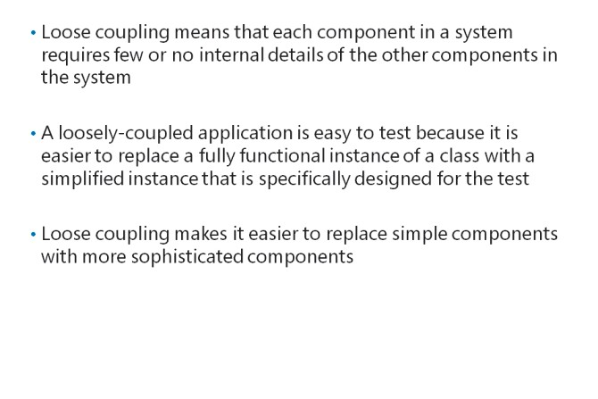
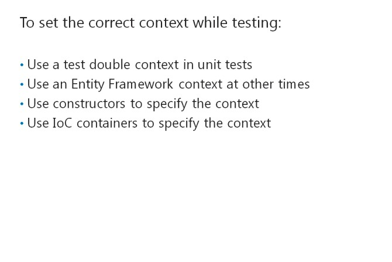

# Module 06 <br> Testing and Debugging ASP.NET MVC 5 Web Applications

#### Contents:

[Module Overview](#1)    
[**Lesson 1:** Unit Testing MVC Components](#2)    
[**Lesson 2:** Implementing an Exception Handling Strategy](#3)    

## <a name="1"></a>Module Overview

Software systems such as web applications are complex and require multiple components, often written by different developers, to work together. Incorrect assumptions, inaccurate understanding, coding errors, and many other sources can create bugs that result in exceptions or unexpected behavior. To improve the quality of your web application and create a satisfying user experience, you must identify bugs from any source and eliminate them. Traditionally, most testing has been performed at the end of a development project. However, it has recently become widely accepted that testing throughout the project life cycle improves quality and ensures that there are no bugs in production software. You need to understand how to run tests on small components of your web application to ensure that they function as expected before you assemble them into a complete web application. You also need to know how to use the tools available in Microsoft Visual Studio 2015 to debug and trace exceptions when they arise.

### Objectives

After completing this module, you will be able to:

- Run unit tests against the ModelViewController (MVC) components, such as model classes, and locate potential bugs.

- Build an MVC application that handles exceptions smoothly and robustly.

## <a name="2"></a>Lesson 1 <br> **Unit Testing MVC Components**

A unit test is a procedure that instantiates a component that you have written, calls one aspect of the functionalities of the component, and checks that the component responds correctly according to the design. In object-oriented programming, unit tests usually instantiate a class and call one of its methods. In an MVC web application, unit tests can instantiate model classes or controllers and call their methods and actions. As a web developer, you need to know how to create a testing project and add tests to the testing project. The tests check individual aspects of your code without relying on database servers, network connections, and other infrastructure. This is because unit tests focus on the code you write.

### Lesson Objectives

After completing this lesson, you will be able to:

- Describe the use of unit tests to improve the quality of code you write.

- List the principles of Test Driven Development (TDD).

- Describe how loosely-coupled components increase the testability and maintainability of your application.

- Write unit tests against model classes, controllers, and views in an MVC web application.

- Describe how Inversion of Control (IoC) containers can instantiate controllers and model classes.

- Run unit tests in Visual Studio 2015.

- Use a mocking tool to automate mock creation in unit tests.

### Why Perform UnitTests?


There are three types of tests you can use to identify bugs in your application:

- _Unit Tests:_ Unit tests check small aspects of functionality. For example, a unit test may verify the return type of a single method. By defining many unit tests for your project, you can ensure they cover all functional aspects of your web application.

- _Integration Tests:_ Integration tests check how two or more components work together. They can be used to check how two or more classes interact with each other. Integration tests can also be used to check how the entire web application, including the database and external web services, works to deliver content.

- _Acceptance Tests:_ Acceptance tests focus on a functional or technical requirement that must work for the stakeholders to accept the application. Similar to integration tests, acceptance tests usually test multiple components working together.

**Note:** Unit tests are important because they can be defined early in development. Integration and acceptance tests are usually run later, when several components are approaching completion.

**What Is a Unit Test?**

A unit test is a procedure that verifies a specific aspect of functionality. Multiple unit tests can be performed for a single class and even for a single method in a class. For example, you can write a test that checks that the **Validate** method always returns a Boolean value. You might write a second test that checks that when you send a string to the **Validate** method, the method returns a **true** value. You can assemble many unit tests into a single class called a test fixture. Often, a test fixture contains all the tests for a specific class. For example, **ProductTestsFixture** may include all tests that check methods in the **Product** class.

A single unit test usually consists of code that runs in three phases:

1. _Arrange_. In this phase, the test creates an instance of the class that it will test. It also assigns any required properties and creates any required objects to complete the test. Only properties and objects that are essential to the test are created.

2. _Act_. In this phase, the test runs the functionality that it must check. Usually, in the Act phase, the test calls a single procedure and stores the result in a variable.

3. _Assert_. In this phase, the test checks the result against the expected result. If the result matches what was expected, the test passes. Otherwise, the test fails.

**How Do Unit Test Help Diagnose Bugs?**

Because unit tests check a small and specific aspect of code, it is easy to diagnose the problem when the tests fail. Unit tests usually work with a single class and isolate the class from other classes wherever possible. If other classes are essential, the smallest number of classes are created in the Arrange phase. This approach enables you to fix issues rapidly because the number of potential sources of a bug is small.

Unit tests should check the code that you write and not any infrastructure that the production system will rely on. For example, unit tests should run without connecting to a real database or web service because network problems or service outages may cause a failure. Using this approach, you can distinguish bugs that arise from code, which must be fixed by altering code, from the bugs that arise from infrastructure failures, which must be fixed by changing hardware, reconfiguring web servers, reconfiguring connection strings, or making other configuration changes.

**Automated Unit Testing**

It is important to understand that unit tests, after they are defined, can be rerun quickly and easily throughout the rest of the project life cycle. In fact, Microsoft Visual Studio reruns tests automatically whenever you run a project with debugging. You can also manually initiate tests any time.

This is important because new code can cause bugs at any stage of the development process. As an example, consider a project that proceeds through three phases. A unit test defined for phase 1 helps highlight problems in phases 2 and 3 that might otherwise go unnoticed:

1. _Phase 1_. The **ProductController** class is defined and the **Test_Index_Action** unit test is written. The test checks that the **Index** action works with an integer parameter. When you call the **Index** action with an integer, the action returns a collection that includes the same number of **Product** objects. The test passes.

2. _Phase 2_. A developer modifies the **Index** action so that it returns a partial view. The developer renames the action **\_Index** to conform to the teams partial view naming convention. The test fails because the name has changed. The developer modifies the test so that it calls the renamed action and the test passes.

3. _Phase 3_. A developer modifies the **Index** action by writing a different Language Integrated Query (LINQ) to implement a new functional requirement. However, the developer makes a mistake in the LINQ syntax. The **Index** action now returns zero products regardless of the integer that is passed as a parameter. The test fails.

In Phase 2, the test failure arose because the action name had changed, not because of a mistake in the action code. The solution was to change the name of the action called in the test method, but this can remind developers to alter calls to renamed actions throughout the solution.

In Phase 3, the test failure arose because the developer misunderstood LINQ or made a typing error in the LINQ syntax. The unit test highlighted the error as soon as it arose. This helps the developer focus on a solution to resolve the test failure and ensure that new functionality does not cause failures in code written earlier in the project.

**Question**: Board members want you to ensure that your web application correctly calculates sales tax on every product in the catalog. Is this an example of a unit test, an integration test, or an acceptance test?

### Principles of Test Driven Development


You can use unit tests in any development methodology, including waterfall projects, iterative projects, and Agile projects to spot potential bugs and improve the quality of the final application. Any project can benefit from unit testing, regardless of the development methodology used in the project. However, a specific development methodology, called Test Driven Development (TDD), places unit testing at the center of working practices. TDD is often described as a separate development methodology. Some authors consider it to be a core principle of the Extreme Programming methodology.

#### **Write the Test, Pass the Test, Refactor**

In TDD, developers repeat the following short cycle to implement a functional requirement:

1. _Write the Test_. The developer starts by creating and coding the unit test. This step requires a full understanding of the functional requirement, which can be obtained from use cases or user stories. Because the developer has not written any code in the application, the test fails.

2. _Pass the Test_. The developer writes some quick and simple code in the application so that it passes the test. During the first iteration, this code is frequently inelegant and may include false assumptions such as hardcoded values.

3. _Refactor_. The developer cleans up the application code, removes duplicate code, removes hardcoded values, improves readability, and makes other technical improvements. The developer reruns the test to ensure that refactoring has not caused a failure.

The cycle is then repeated. In each iteration, the developer adds a small new element of the final functionality with a corresponding test.

It is important that the code in your tests is treated as production code. It should be well thought out and easy to read so that other developers can understand the test and quickly diagnose any test failures.

#### **Test Driven Development Principles**

TDD is different from traditional approaches to application development. To use TDD effectively, you must understand its fundamental principles:

- _Write tests before code_. In the TDD development cycle, the test is created in step one before any code in the application. This means the test must fail the first time it is run. You can understand the test as a specification for the functionality you are building. By writing the test first, you ensure that you begin with a thorough understanding of the problem you are trying to solve.

- _Move in small steps_. By breaking a large application down into small elements of functionality, you can improve developer productivity. You can do this by giving a developer a small problem to solve in each iteration. The developer can solve the simple problem quickly and understand all the possible circumstances in which their code runs.

- _Only write enough code to pass the test_. In each iteration, do not be tempted to add extra code that is not related to the test. For example, if you know that users will call an action with other parameters than the ones in the test, do not write code to handle these parameters. Instead, during the next iteration, write a second test for those parameters. Then write and refactor that code.

Developers can refer to tests as examples of how to use a class or method. This can increase developer productivity because developers can view the code that demonstrates the method or class.

**Note:** In the lab, you will use some TDD principals as you develop the solution. However, the lab does not conform to a strict reading of the TDD methods.

**Question:** You have written a controller for the **Comment** model class. You write a unit test that checks that the **Index** action returns a collection of **Comment** objects. Have you conformed to TDD principles?

### Writing Loosely Coupled MVC Components



A loosely coupled application is one in which each component requires few or no details of the other components of the system. In object-oriented programming, for example, two classes can be described as loosely-coupled if one class can call methods on the other class without any code that is specific to the other class. When system components are loosely-coupled in this manner, it is easy to replace a class with another implementation of the same functionality. Loosely coupled components are essential for thorough unit testing because classes that deal with real data, such as data from a database, can be easily be replaced with classes that deal with test data.

#### **Using Loose Coupling in Tests**

A loosely-coupled application is easy to test because you can make tests simpler by replacing a fully functional instance of a class with a simplified instance that is specifically designed for the test. Replacing classes in tests in this manner can only be done when components are loosely coupled. Replacement instances used for unit tests are known as test doubles or fakes. A test double or fake includes just enough code and properties to pass the relevant test and prove the functionality.

#### **Other Benefits of Loose Coupling**

Loose coupling has other benefits besides testing. Loose coupling makes it easier to replace simple components with more sophisticated onesfor example, in version one of an application you might write a class that calculates a simple arithmetical mean. In version two, you might replace this class with a new class that calculates a weighted mean based on a more complex algorithm. If the components are loosely coupled, you can perform this replacement without modifying any code outside of the averaging classes.

#### **Using Interfaces for Loose Coupling**

In object-oriented programming, an interface defines a set of properties and methods. Any class that implements that interface must implement all the properties and methods it defines as a minimum. This creates loose coupling because you need not specify a class in code. Instead, you can specify any implementation of a particular interface.

#### **Loose Coupling in an MVC Web Application**

To show how loose coupling can be used in an MVC web application, consider the following scenario:

You are writing an MVC web application that displays a product catalog and enables users to click a product to view the full details. On the product details page, users can view and add reviews of that product. You want to ensure during testing that the **Product.Reviews** property, which is a collection of **Review** objects, only includes reviews with the right **ProductID** value.

Recall that unit tests should not rely on infrastructure such as network connections or database servers, but only on test code. By contrast, in production, the application will obtain all product reviews from a database. To satisfy the needs of testing and production, you can build the following components:

- An **IProduct** interface. This includes a definition of the **Reviews** property, together with other properties and methods. This interface is known as a repository.

- A **Product** class. This is the implementation of the **IProduct** repository that the application uses in production. When the user calls the **Reviews** property, all the reviews for the current product are obtained from the database.

- A **TestProduct** class. This is the test double or fake implementation of the **IProduct** repository that the test uses. The test sets up a **TestProduct** object and fake reviews with different **ProductID** values. The test calls the **TestProduct.Reviews** property and checks that only the right reviews are returned.

Notice that, in the test, the **TestProduct** double uses in-memory data set up during the _Arrange_ phase. It does not query the database. Therefore, you can test your code without relying on the network connection to the database or the database server itself. This approach also ensures that the test runs quickly, which is important because slow tests discourage developers from running tests regularly.

**Question:** In a test, you create a fake collection of **BlogEntry** objects. Is this an example of an interface or a test double?

### Writing Unit Tests for MVC Components


The Microsoft ASP.NET MVC 5 programming model is easy to integrate with the principles of unit testing and TDD because of its separation of concerns into model, controllers, and views.

Models are simple to test because they are independent classes that you can instantiate and configure during the Arrange phase of a test.

Controllers are simple classes that you can test, but it is complex to test controllers with in- memory data, rather than using a database. To test controllers with in-memory data, you create a test double class, also known as a fake repository.

Objects of this class can be populated with test data in memory without querying a database. You need to understand how to write test doubles and how to write a typical test for MVC classes.

#### **Add and Configure a Test Project**

In Microsoft Visual Studio 2015, you can test an MVC web application project by adding a new project to the solution, based on the **Unit Test Project** template. You must add references to the test project so that test code can access classes in the MVC web application project. You will also need a reference to **System.Web.Mvc** and other namespaces from the Microsoft .NET Framework.

In a Visual Studio test project, test fixtures are classes marked with the **[TestClass]** annotation. Unit tests are methods marked with the **[TestMethod]** annotation. Unit tests usually return **void** but call a method of the **Assert** class, such as **Assert.AreEqual()** to check results in the test Assert phase.

**Note:** There are many other test frameworks available for MVC web applications and you can choose the one you prefer. Many of these frameworks can be added by using the NuGet package manager available in Visual Studio. If you use Visual Studio Express, you cannot use the Visual Studio **Unit Test Project** template, but you can add other testing frameworks by using NuGet.

#### **Test Model Classes and Business Logic**

In MVC, model classes do not depend on other components or infrastructure. You can easily instantiate them in-memory, arrange their property values, act on them by calling a method, and assert that the result was as expected. Sometimes, you create business logic in the model classes, in which case the _Act_ phase involves calling a method on the model class itself. If, by contrast, you have created a separate business logic layer, code in the _Act_phase must call a method on the business object class and pass a model class.

The code in this test creates an instance of the **Product** model class and sets its **Type** property. The test checks that in these circumstances, the **GetAccessories()** method returns a collection of **BikeAccessory** objects.

**Testing a Model Class**

``` cs
[TestMethod] 
public void Test_Product_Reviews() 
{    
  //Arrange phase    
  Product testProduct = new Product();    
  testProduct.Type = "CompleteBike";    
  //Act phase    
  var result = testProduct.GetAccessories();
  //Assert phase    
  Assert.AreEqual(typeof(IEnumerable(BikeAccessory)), result.GetType());
} 
```

#### **Create Repository Interfaces**

A repository is an interface that defines properties and methods that MVC can use to store data in a web application. It is common to create a single repository interface for your entire web application.

In the following code example, the **IWebStoreContext** interface is a repository that defines methods such as **Add()** and **Delete()**, and properties such as **Products**.

**A Repository Interface**

``` cs
public interface IWebStoreContext 
{    
  IQueryable<Product> Products { get; }    
  T Add<T>(T entity) where T : class;    
  Product FindProductById(int ID);    
  T Delete<T>(T entity) where T : class; 
}
```

#### **Implement and Use a Repository in the Application**

The repository interface defines methods for interacting with data but does not fix how that data will be set and stored. You must provide two implementations of the repository:

- An implementation of the repository for use in production and development. This implementation will use data from the database or some other storage mechanism.

- An implementation of the repository for use in tests. This implementation will use data from the memory set during the Arrange phase of each test.

The following code example shows how to implement the repository interface in your MVC project for use in production and development.

**Implementing a Repository in the MVC Project**

``` cs
public class WebStoreContext : DbContext, IWebStoreContext 
{    
  public DbSet<Product> Products { get; set; }    
  IQueryable<Product> IWebStoreContext.Products 
  { 
    get { return Photos; } 
  }    
  T IWebStoreContext.Add<T>(T entity)    
  {       
    return Set<T>().Add(entity);    
  }    
  Product IWebStoreContext.FindProductById(int ID)    
  {        
    return Set<Product>().Find(ID);    
  }    
  T IWebStoreContext.Delete<T>(T entity)    
  {        
    return Set<T>().Remove(entity);    
  } 
} 
```

Note that the **WebStoreContext** class still inherits from the Entity Framework **DbContext** class but also implements the **IWebStoreContext** interface that you just created. In fact, the interface methods such as **Add()**, **Delete()**, and **FindProductById()** just wrap methods from the **DbContext** class such as **Remove()**.

**Implement a Repository Test Double**

The second implementation of the repository interface is the implementation that you will use in unit tests. This implementation uses in-memory data and a keyed collection of objects to function just like an Entity Framework context, but avoids working with a database.

The following code example shows how to implement a repository class for tests.

**Implementing a Fake Repository**

``` cs
class FakeWebStoreContext: IWebStoreContext {
 //This object is a keyed collection we use to mock an     
 //entity framework context in memory    
 SetMap _map = new SetMap();
 public IQueryable < Product > Products {
  get {
   return _map.Get < Product > ().AsQueryable();
  }
  set {
   _map.Use < Product > (value);
  }
 }
 public T Add < T > (T entity) where T: class {
  _map.Get < T > ().Add(entity);
  return entity;
 }
 public Product FindProductById(int ID) {
  Product item = (from p in this.Products where p.ProductID == ID select p).First();
  return item;
 }
 public T Delete < T > (T entity) where T: class {
  _map.Get < T > ().Remove(entity);
  return entity;
 }
 class SetMap: KeyedCollection < Type, object > {
  public HashSet < T > Use < T > (IEnumerable < T > sourceData) {
   var set = new HashSet < T > (sourceData);
   if (Contains(typeof(T))) {
    Remove(typeof(T));
   }
   Add(set);
   return set;
  }
  public HashSet < T > Get < T > () {
   return (HashSet < T > ) this[typeof(T)];
  }
  protected override Type GetKeyForItem(object item) {
   return item.GetType().GetGenericArguments().Single();
  }
 }
}
```

#### **Using the Test Double to Test a Controller**

After you have implemented a test double class for the repository, you can use it to test a controller in a unit test. In the Arrange phase of the test, create a new object from the test double class and pass it to the controller constructor. The controller uses this object for its Entity Framework context during the test Act phase. This enables you to check results.

The following code example shows how to test a controller action by using a test double for the Entity Framework context.

**Using a Test Double to Test a Controller**

``` cs
 [TestMethod]
 public void Test_Index_Model_Type() {
  var context = new FakeWebStoreContext();
  context.Products = new [] {
   new Product(), new Product(), new Product()
  }.AsQueryable();
  var controller = new ProductController(context);
  var result = controller.Index() as ViewResult;
  Assert.AreEqual(typeof(List < Product > ), result.Model.GetType());
 }
```

Note that the test creates a new instance of the **FakeWebStoreContext** class and adds three **Product** objects to it. In this case, you can run the test without setting any properties on the **Product** objects. This context is passed to the **ProductController** constructor and the test proceeds to the Act and Assert phases.

**Question:** For what purpose would you use a fake repository when you write unit tests against an MVC controller?

### Specifying the Correct Context



When you use test doubles for unit testing MVC controllers, you must ensure that the controller uses the correct context in two different scenarios: unit tests, and at all other times. If you use the test double production code, for example, no data will be stored in the database. If you use the actual Entity Framework context for unit testing, all the tests will fail. The following table gives further details.

|Scenario |Context |
|-|-|
|In unit tests |In a unit test, you should test code without relying on underlying infrastructure such as databases. You can use a test double class that behaves like an Entity Framework context, but uses in-memory data. |
|At other times |When you are not unit testing the code, you use an actual Entity Framework context in your controller code, which interacts with a database. |

#### **Using Constructors to Specify a Repository**

You can specify the correct repository to use in a test by using controller constructors. During a unit test, call a controller constructor that takes an instance of the repository interface as a parameter. At other times, the MVC controller factory will call the controller constructor without any parameters.

The following code example shows the constructors in an MVC controller that you can use for production and unit testing.

**Using Constructors to Specify Repositories**

``` cs
public class ProductController: Controller {
 private IWebStoreContext context;
 //The parameterless version of the constructor is used by the MVC controller factory    
 public ProductController() {
   //Instantiate an actual Entity Framework context       
   context = new WebStoreContext();
  }
  //This constructor is used by unit tests. They pass a test double context    
 public ProductController(IWebStoreContext Context) {
   //Use the context passed to the constructor        
   context = Context;
  }
  //Add action methods here 
}
```

**Using Inversion of Control Containers**

You can also ensure that the correct repository class is used in each context by using an Inversion of Control (IoC) container. An IoC container is a framework that you can add to your application that instantiates classes. You must configure the IoC container so that it can identify the kind of object to create when the application expects a specific interface. For example, when code is used to create a new instance of the **IWebStoreContext** interface, the IoC container checks its configuration and finds that it should instantiate the **WebStoreContext** class, which is an Entity Framework context that implements the **IWebStoreContext** interface.

**Note:** IoC frameworks are also known as Dependency Injection (DI) frameworks because they inject classes that implement the correct interfaces into class constructors.

By using an IoC container, you avoid the need to create two constructors for controller classes. During tests, you can instantiate the test double and pass it to the controller constructor. At other times, the IoC container instantiates the actual Entity Framework context and passes it to the controller constructor.

**Note:** There are many IoC containers designed for use with ASP.NET MVC web applications. These replace certain components of the MVC framework to support IoC. For example, they replace the default controller factory with a factory that instantiates controllers with the right context class. Many IoC containers are available in the NuGet package library, such as NinJect and StructureMap.

**Question:** Which approach is more loosely-coupled: using constructors to specify the context, or using IoC containers to specify the context?

### Using Mocking Frameworks


When you write a unit test, you must, during the Arrange phase, create test data on which the test will run. By using a test double or mock object to supply test data, you can test your code in isolation from other classes and from the infrastructure elements such as databases and network connections on which the application will rely. You can create test doubles by manually coding their instantiation, setting their properties, and populating collections. Such test doubles are known as manual mock objects.

Alternatively, instead of creating mock objects manually with your own code, you can use a mocking framework to automate this work. A mocking framework automatically creates mock object by using the interfaces that you specify. In the case of IoC containers, there are many mocking frameworks that can be used in testing MVC web applications. You can find many mocking frameworks by using the NuGet package manager.

**Note:** Mocking frameworks for ASP.NET MVC 5 include Moq, RhinoMocks, and NSubstitute. All these frameworks are available in NuGet and there are alternatives. Choose the framework that best suits your testing needs.

#### **Why Use a Mocking Framework?**

There are many situations in which mocking frameworks can significantly ease unit testing. Even for simple tests, mocking frameworks reduce the amount of setup code that you have to develop. After you become familiar with the mocking framework that you choose, and have learned how to write arrangement code for it, you will begin to save time. In more complex situations, such as the following, mocking frameworks have great advantages:

- _Creating multiple mock objects of a single type_. You should try to keep each unit test as simple as possible, but inevitably, some tests require many mock objects to work with. For example, if you are testing a method that underlies paging functionality in your web application, you must create enough mock objects to populate multiple pages. Mocking frameworks can automate the creation of multiple mock objects of the same type.

- _Mocking objects with multiple interfaces_. In some tests, where there are several dependencies between classes of different types, you must create many mock objects of different classes. In such situations, it is tedious to manually code many mock objects. Mocking frameworks can help by automatically generating the objects from the interfaces that you specify.

In each unit test, you are interested in a small and specific area of functionality. Some properties and methods of an interface will be crucial to your test, while others will be irrelevant. A mocking framework enables you to specify irrelevant properties and methods in a given test. When the framework creates a mock object for your test, it creates stubs for the irrelevant properties and methods. A stub is a simple implementation with little code. In this way, the mocking framework frees you from having to implement all the requirements of the interface laboriously.

**Question:** What is the difference between an IoC container and a mocking framework?

## Lesson 2 <br> **Implementing an Exception Handling Strategy**

Unexpected events are likely to occur from time to time in any complex system, including MVC web applications. Occasionally, such unexpected run-time events cause an error. When this happens, ASP.NET or the .NET Framework generates an exception, which is an object that you can use to diagnose and resolve the error. The exception contains information that you can use to diagnose the problem.

Exceptions that are not handled in your code will cause the web application to halt and an error message to be displayed to the user. As a web developer, you need to know how to detect, handle, and raise exceptions, and identify the cause of the problem. Visual Studio provides a broad range of tools for debugging exceptions and improving the robustness of your code. You can also log exceptions to databases and other stores, and use the .NET Framework code contracts to reduce the frequency of exceptions.

### Lesson Objectives

After completing this lesson, you will be able to:

- Explain how to raise and catch exceptions.

- Explain how to configure exception handling by using Web.config.

- Explain how to trace exceptions by using the IntelliTrace tool.

- Describe how to log exceptions.

- Describe the health monitoring options for an MVC 5 web application.

### Raising and Catching Exceptions


An error is an unexpected run-time event that prevents an application from completing an operation. When a line of code causes an error, ASP.NET or the common language runtime creates an exception. This exception is an object of a class that inherits from the **System.Exception** base class. There are many exception classes.

Often the object class identifies what went wrong. For example, if there is an **ArgumentNullException**, it indicates that a **null** value was sent to a method that does not accept a **null** value as an argument.

#### **Unhandled Exceptions**

When an exception is not explicitly handled by an application, the application stops and the user sees an error message. In ASP.NET MVC applications, this error message is in the form of a webpage. You can override ASP.NET default error pages to display your own error information to users.

If an unhandled exception arises while you are debugging the application in Visual Studio, execution breaks on the line that generated the exception. You can use the Visual Studio debugging tools to investigate what went wrong, isolate the problem, and debug your code.

Sometimes, you may also want to raise your own exceptions as a form of communication between parts of your application. For example, consider an application that displays products on a website. In the repository, you implement a **FindProduct** method that returns the product with a name that matches the search string that is passed as an attribute. If the **FindProduct** method does not locate a product with the specified name, you may wish to raise an exception. This approach enables code in the controller, which calls the **FindProduct** method, to handle the event that no products are found. You can use the **throw** keyword to raise errors in C# code.

#### **Catching Errors with Try/Catch Blocks**

The most familiar way to catch an exception, which works in any .NET Framework code, is to use the **try/catch** block. Code in the **try** block is run. If any of that code generates an exception, the type of exception is checked against the type declared in the **catch** block. If the type matches, or is of a type derived from the type declared in the **catch** block, the code in the **catch** block runs. You can use the code in the **catch** block to obtain information about what went wrong and resolve the error condition.

The following code example catches any **ArgumentNullException** objects.

**A Simple Try/Catch Block**

``` cs
try 
{    
  Product product = FindProductFromComment(comment); 
} 
catch (ArgumentNullException ex) 
{    
  Console.WriteLine("The comment object was null. Error message: " + ex.Message); 
}
```

In MVC controllers, there are two methods to catch exceptionsthe **OnException** method and the **[HandleError]** annotation.

#### **Catching Controller Exceptions in OnException**

The **OnException** method is defined on the base **Controller** class, so you can override it in any MVC controller. When you override the **OnException** method in a custom controller, MVC runs the method whenever an exception arises and is not handled in a **try/catch** block. Using this approach, you can handle errors anywhere in your controller without adding many **try/catch** blocks throughout the code.

In the **OnException** method, you can catch specific types of exceptions by checking the **ExceptionContext.Exception** property. Your code must set the **context.Result** property to display a view to the user. If you do not set this property, the browser displays a blank webpage to the user.

In the following code example, the **OnException** method is used to catch **InvalidOperationException** objects.

**Using OnException to Catch Controller Errors**

``` cs
protected override void OnException(ExceptionContext context) {
 // Catch invalid operation exception    
 if (filterContext.Exception is InvalidOperationException) {
  var model = new HandleErrorInfo(context.Exception, controllerName, actionName);
  var result = new ViewResult {
   ViewName = "Error", ViewData = new ViewDataDictionary < HandleErrorInfo > (model),
    //Save pass the current Temp Data to the Error view, because it often contains             
    //diagnostic information             
    TempData = context.Controller.TempData
  };
  context.Result = result;
 }
}
```

#### **Catching Controller Exceptions with HandleError**

Using the **[HandleError]** annotation, you can use an attribute on individual action methods or on the controller class itself, in which case, the **[HandleError]** annotation catches errors in any action. When you use the **[HandleError]** annotation without properties, all exceptions are caught and sent to an MVC view called **Error.cshtml**. This default error view should be created in the **/View/Shared** folder.

You can use two properties to control the behavior of **[HandleError]**:

- _ExceptionType_. By default, the **[HandleError]** annotation catches all exceptions. If you set a more specific type with the **ExceptionType** property, only exceptions of that specific type will be caught.

- _View_. By default, the **[HandleError]** annotation forwards users to the **Error.cshtml** view. You can specify another view file by using the **View** property. By setting both the **ExceptionType** and **View** properties, you can divert exceptions of specific types to views designed specifically to display them.

In the code example, the first **[HandleError]** annotation forwards **NotImplementedException** errors to the **NotImplemented** view. All other errors are forwarded to the default error view.

**Using the HandleError Annotation**

``` cs
[HandleError(ExceptionType=typeof(NotImplementedException), View="NotImplemented")] 
[HandleError] 
public ActionResult Index() 
{    
  //Place action code here 
}
```

**Question:**You are using the **[HandleError]** annotation to catch exceptions in your web application. However, you realize that **[HandleError]** catches all exceptions, making it difficult for you to isolate a specific issue. What can you do to narrow down the exceptions that the **[HandleError]** annotation is catching?

### Configuring Exception Handling


ASP.NET applications display a default error page to users when an unhandled exception occurs in your MVC web application. There are two reasons why you may want to change the default error page:

- You want to display a branded and styled error page that has the same layout as other pages in the application and includes the company logo.

- You want to avoid drawing attention to the technology that powers the site. By letting malicious users know that your site runs ASP.NET MVC, you may encourage them to attack it by using methods that have worked in the past.

To configure a custom error page for your application, use the top-level Web.config file. The custom error page will be displayed when an exception in not handled by any **try/catch** block or **[HandleError]** attribute.

#### **Custom Error Modes**

To configure custom errors, add the **\<customErrors\>** element to the Web.config file. This element must be a child of the **\<system.web\>** element. Use the following attributes:

- **mode:** The mode attribute can be set to one of three values:

  - **Off:** Unhandled errors are displayed on the default ASP.NET error page.

  - **On:** Unhandled errors are displayed in the page you specify in the **defaultRedirect**attribute.

  - **RemoteOnly:** In this mode, unhandled errors are displayed differently for browsers on remote computers and browsers on the web server. In a production site, all browsers are remote and errors are displayed on the page that you specify in the **defaultRedirect** attribute. In development situations, the developer often browses to the site on the local computer. When an error occurs, the developer is directed to the default ASP.NET error page, which includes debugging information such as the stack trace. Use the **RemoteOnly** mode on development computers.

- **defaultRedirect:** This attribute sets the name of the view that will be used to display unhandled exceptions. When you create this view, place it in the **Views/Shared** folder.

The code in the following example enables custom errors and specifies that unhandled exceptions are forwarded to the **customError** view.

**Configuring Custom Errors**

``` XML
<system.web>        
  <customErrors mode="On" defaultRedirect="CustomError" /> 
</system.web>
```

#### **HTTP error pages**

Some Hypertext Transfer Protocol-level (HTTP) errors cannot be caught by custom MVC error views as specified in Web.config or the **[HandleError]** annotation. For such errors, you can use the **\<error\>** element in Web.config, as a child element of the **\<customErrors\>**element.

In the following example, the **\<error\>** element is used for specific HTML files to respond to HTTP 500 errors.

**Catching HTTP Error Codes**

``` XML
<customErrors mode="On" defaultRedirect="CustomError" >       
  <error statusCode="500" redirect="~/Error/Error500.html" /> 
</customErrors>
```

**Question:** You have switched off custom errors in the Web.config file. When you run your application without debugging, an exception is thrown in a **try/catch** block. What page displays the exception to the user?

### Using Visual Studio IntelliTrace in MVC


When something goes wrong in your web application, whether it happens during development or in production, you need information about the state of the application, to diagnose the problem. Sometimes, a small amount of information is sufficient. For example, you may be able to see from the URL query string that a link was formulated wrongly. Often, however, problems arise in more obscure places and you need as much information as possible to perform a diagnosis. IntelliTrace is a feature of Visual Studio that assists debugging by presenting as much information as possible. IntelliTrace was introduced with Microsoft Visual Studio 2010 Ultimate.

#### **The Traditional Debugging Workflow**

When developers debug malfunctioning code, they run the application in Visual Studio debugging mode. If an unhandled exception occurs, Visual Studio breaks execution and displays details such as the exception class and the exception message. You can use the Locals, Call Stack, and Error List windows to determine the values of variables and properties that may have caused the exception. All these pieces of information are presented as they were when the error occurred.

If a problem originated before the error occurred, you must halt debugging, set a break point, and then restart debugging. Again, Visual Studio halts execution, but this time, it is at the break point. You can use the same windows to gain information and step through code, line by line, to see how values change, and diagnose the error.

Two problems can occur in this workflow:

- If you set the break point too late, you will miss the origin of the error. You must set another break point and restart debugging.

- If you are stepping through many lines of code, you can miss the error by selecting Debug|StepInto or pressing the F11 shortcut too many times. This is easy to do when there are hundreds of lines of code to step through.

#### **Debugging With IntelliTrace**

IntelliTrace improves this workflow and addresses the two problems that arise during the traditional debugging workflow by recording a timeline of code execution. When you run an application in the debug mode, IntelliTrace records all the events that occur in the background. This can include exceptions, debugging events such as break points, and other events that you can configure.

As before, when the debugger encounters an unhandled exception or a break point, Visual Studio halts execution and displays the details of any exception. However, the developer can now see all the recorded events in the IntelliTrace pane. The current event appears at the end of the list and is named **Live Event.** You can see all the previous events in the list and can click them for more details. In this way, you can investigate what happened before the exception or the break point.

When you click an earlier event in the IntelliTrace pane, the Locals, Call Stack, and Error List windows display the state of the application at the moment of the earlier event. The line of code that corresponds to the selected event is highlighted in orange color. Because of this highlighting, two problems that arise during the traditional debugging workflow are eased, namely, missing the origin of error and stepping too far through the code. Because the relevant code is highlighted, if you miss the origin of the error or step too far through the code, you can get back to earlier events and investigate values.

To help you locate the correct event in the IntelliTrace window, you can filter by event category or execution thread, or use the search option.

#### **IntelliTrace Configuration Options**

To configure IntelliTrace, click **DEBUG**, click **IntelliTrace**, and then click **Open IntelliTrace Settings**. You can enable or disable IntelliTrace event recording and specify a location and maximum size for the IntelliTrace files.

Most of the configuration options concern the amount of data to record in IntelliTrace files. The default settings have a mimimal affect on performance, but if those are insufficient to diagnose a problem, you can choose to log more information to target the problem. This may compromise performance, but remember that IntelliTrace information is only recorded during debugging. Your settings will not degrade performance after the application is deployed to a web server. Under **General**, you can set IntelliTrace to record IntelliTrace events only, or both IntelliTrace events and call information, which includes all calls to methods and classes. You can configure what is included in IntelliTrace events by using the **IntelliTrace Events** list. For example, by default, ASP.NET events such as error pages, page post backs, and redirects are included for MVC applications.

#### **Saving and Opening IntelliTrace Files**

IntelliTrace automatically saves events in an IntelliTrace file when you enter debug mode. The file is automatically deleted when you close Visual Studio, to ensure that IntelliTrace files do not over-use disk space. Note that this means that the IntelliTrace pane includes events from the current debugging session and any previous debugging sessions run since you started Visual Studio. However, these files are temporary.

You can avoid losing an IntelliTrace file when you close Visual Studio by saving it for later analysis. To do this, click **DEBUG**, click **IntelliTrace**, and then click **Save IntelliTrace Session**. The file is saved with an .iTrace extension. If you double-click an .iTrace file, Visual Studio displays the threads, exceptions, modules, and other information that the file contains.

**Additional Reading:** For more information about IntelliTrace and how to use it, see

**Question:** You are looking at IntelliTrace events and suspect that the error originated in a class written by a colleague who works in another country. How can you help the colleague to see the events that you can see in IntelliTrace after you close Visual Studio?

### Logging Exceptions


Exceptions that you face during development can be investigated and debugged by using the Visual Studio debugging tools, including IntelliTrace. In an ideal situation, no exceptions would arise when your web application is complete and deployed for users over the Internet. However, in the real world, unforeseen circumstances arise resulting in exceptions. For example, database failures, network issues, and configuration errors in any part of the system can cause exceptions.

You have already seen how to present a branded and informative custom error page to users when exceptions occur. It is also appropriate to log the exceptions in a production web application, so the administrators and developers can assess the extent of the problem, remove the cause, and improve the robustness of the code.

#### **Writing Error Logging Code**

Before you write code to log exceptions in your web application, consider where exceptions should be recorded. Generally, web applications log exceptions to an Extensible Markup Language (XML) file. This approach can be efficient, especially if the text file is kept on a separate drive from the database of the web application and other critical, commonly accessed files. However, the file size of the XML files can grow large, making them difficult to analyze.

A common approach is to log errors to tables in a database. These tables can be a part of a single web application database, or you can place them in a dedicated database away from product catalogs, user profiles, and other information. By logging exceptions to a database, you create a list of exceptions that can be easily searched and analyzed. You can also build a webpage to present these logged exceptions to administrators so that they can access the details from a browser.

You should also consider sending email messages or other types of messages to administrators and developers when exceptions occur. This approach ensures that administrators and developers hear of an error very quickly. It does not require them to review the exceptions logged in the database. Frequently, error handling code in live applications both logs to a database and send email messages to administrators and developers.

#### **Where to Write Error Logging Code**

When you decide where to write code that logs errors, you should consider that errors might arise in almost any part of your application. You should choose an approach that enables you to write error logging code once that will run for any exception anywhere in your application.

For example, it is not appropriate to write error logging code in individual **try/catch** blocks. If you do this, you will have to create a **try/catch** block for every procedure in your application, and write duplicate logging code in the **catch** block.

A more effective approach is as follows:

- Create a custom base controller class for your web application. This class inherits from the **System.Web.Mvc.Controller** base class.

- In your custom base controller class, override the **OnException()** method. Place you error logging code in this method.

- When you create controllers, inherit from your custom base controller class, instead of **System.Web.Mvc.Controller**.

In this way, you can write error logging code only once in the overridden **OnExcpetion()** method. This catches exceptions from any of the inheriting controllers.

#### **Using Third-Party Logging Tools**

Because exception logging is a very common functional requirement for web applications, there are many third-party solutions that you can choose if you do not want to write your own logging code. Many of these are available within Visual Studio from the NuGet package manager.

Perhaps, the most commonly used and widely supported error logging package is Error Logging Modules and Handlers (ELMAH). ELMAH can be used with any ASP.NET web application and can log exceptions to XML files or a wide variety of databases, including Microsoft SQL Server, Oracle, Microsoft SQL Server Compact, MySQL, and others. In addition, ELMAH includes webpages that you can use to remotely view exception lists and details, and ELMAH can send alert email messages to the address that you configure.

**Question:** You want to ensure that developers can review exception details that arise during debugging. How should you approach error logging code?

### Health Monitoring


Since ASP.NET version 2.0, you can use health monitoring to record what happens in a web application. Health monitoring can record exceptions through error logging techniques. However, health monitoring can also record a wide range of other events such as application starts and stops, failed logon attempts, membership events, and user input validation errors. Some pieces of these information are difficult to access from any other source.

#### **Health Monitoring Features**

You can customize the category of events that health monitoring records. Each event is within one of the five following categories.

|Event Category |Description|
|-|-|
|Application Lifetime Events |Application lifetime events include application starts and stops. |
|Audit Events |Audit events include logons, logoffs, and logon failures. |
|Error Events |Error events incude .NET Framework exceptions and HTTP errors such as 404 errors. |
|Request Processing Events |Request processing events include events that occur as ASP.NET controllers, models, and views receive and respond to webpage requests. |
|Heartbeats |Heartbeats are periodic events that health monitoring can raise and record to confirm that the application is running. |

You can also customize the location where health monitoring stores event details by configuring health monitoring providers. You can choose from the following providers.

|_Health Monitoring Provider_ |Description|
|-|-|
|EventLogWebEventProvider |EventLogWebEventProvider sends events to the Windows Event Log. These events appear in the Windows log. |
|SqlWebEventProvider |SqlWebEventProvider sends events to a SQL Server database. |
|WmiWebEventProvider |WmiWebEventProvider sends events to Windows Management Infrastructure client. |
|SimpleMailWebEventProvider |SimpleMailWebEventProvider sends events in an email message sent to an address you specify. |
|TemplatedMailWebEventProvider |TemplatedMailWebEventProvider also sends events in an email message, but you can use a template email to format the information.|
|TraceWebEventProvider |TraceWebEventProvider sends events to the ASP.NET tracing system. |

#### **Configuring Health Monitoring**

You configure health monitoring by using the **\<healthMonitoring\>** element within the **\<system.web\>** element in Web.config. You can use elements within **\<healthMonitoring\>** to add and configure providers and define rules that govern how events of different types are recorded.

The following code example shows how to configure health monitoring to record application life cycle events to a SQL Server database.

**Configuring Health Monitoring**

``` XML
<system.web>    
  <connectionStrings>       
    <add name="HealthDB" connectionString="your connection string here" />    
  </connectionStrings>    
  <healthMonitoring enabled="true">       
    <providers>          
      <add name="sqlProvider" 
        type="System.Web.Management.SqlWebEventProvider" 
        connectionStringName="HealthDB" 
        buffer="false" 
        bufferMode="Notification" />       
    </providers>       
    <rules>          
      <add name="LifeCycle" 
        provider="sqlProvider" 
        eventName="Application Lifetime Events" />             
    </rules>    
  </healthMonitoring> 
</system.web> 
```

**Additional Reading:**

For full details of all the options that you can configure in Web.config for health monitoring, see [http://go.microsoft.com/fwlink/?LinkID=293685&clcid=0x409](http://go.microsoft.com/fwlink/?LinkID=293685&amp;clcid=0x409)

If you configure health monitoring to use the **SqlWebEventProvider**, ASP.NET will, by default, create a database file called, ASPNETDB.MDF, in the App_Data folder of the web application. You can alter this location by using the connection string in Web.config. However, health monitoring will only work if certain data tables are present in the database that you connect to. You can prepare the database with the correct tables by using the aspnet_regsql.exe tool. This tool is found in the %WINDOWS%\Microsoft.NET\Framework\versiondirectory.

The following command prepares a SQL Server database for health monitoring, authenticating as the current user.

```
aspnet_regsql.exe –E –S HealthDatabaseServer –d HealthDatabase –A w 
```

**Question:** After using your recently-developed web application, several users are facing failed logon attempts. As a result, to track these exceptions, you have decided to set up a monitoring system that will send an email message to a specified email address. Which health monitoring provider will you use to fix this?

