# MODULE 16  CREATE AND DEPLOY AZURE WEB APPS    USING VISUAL STUDIO

## LAB 01- CREATE AND DEPLOY AZURE WEB APPS USING VISUAL STUDIO

__Estimated time to complete this lab: 45 minutes__

This lab shows how to deploy an ASP.NET web application to a web app in Azure App Service by using Visual Studio 2015.

The tutorial assumes that you are an ASP.NET developer who has no previous experience with using Azure. When you're finished, you'll have a simple web application up and running in the cloud.

### Lab Objectives

After completing this lab, you will be able to:

- Create web app in Visual Studio
- Deploy web app to Azure App Service
- Configure Azure App Service

### Lab Procedures

__A.	Create a web application__

Follow these steps to create ASP.NET web app:

1. Open Visual Studio 2015.

2. Click  __File > New > Project__.

3. In the __New Project__ dialog box, click __Visual C# > Web > ASP.NET Web Application__.

4. Make sure that __.NET Framework 4.5.2__ is selected as the target framework.
myex

5. [Azure Application Insights](https://docs.microsoft.com/en-us/azure/application-insights/app-insights-overview) monitors your web app for availability, performance, and usage. The __Add Application Insights to Project__ check box is selected by default the first time you create a web project after installing Visual Studio. Clear the check box if it's selected but you don't want to try Application Insights.

6. Name the application __MakersAzure__, and then click __OK__.

    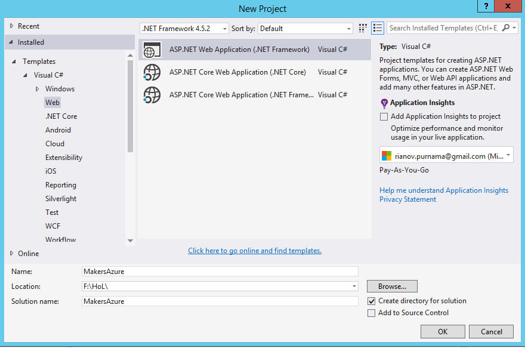

7. In the __New ASP.NET Project__ dialog box, select the __MVC__ template, and then click __Change Authentication__.

    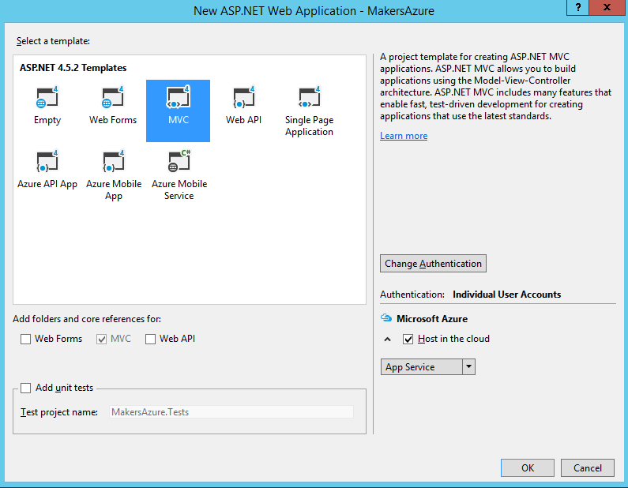

8.	In the __Change Authentication__ dialog box, click __No Authentication__, and then click __OK__.

    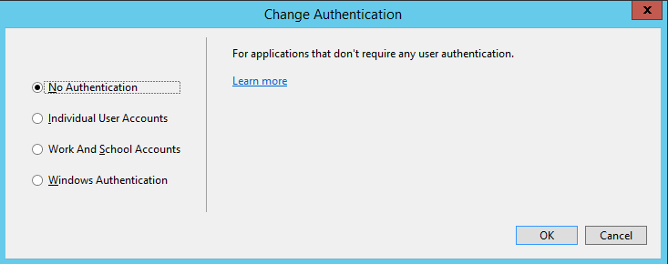
    
    For this getting-started tutorial you're deploying a simple app that doesn't do user log-in
    
9.	In the __Microsoft Azure__ section of the __New ASP.NET Project__ dialog box, make sure that __Host in the cloud__ is selected and that __App Service__ is selected in the drop-down list.

    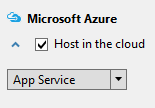

    These settings direct Visual Studio to create an Azure web app for your web project.

10. Click __OK__

__B.	Create the Azure resources__

Now you tell Visual Studio about the Azure resources that you want it to create.

1. In the __Create App Service__ dialog, click __Add an account__, and then sign in to Azure with the ID and password of the account that you use to manage your Azure subscription.

    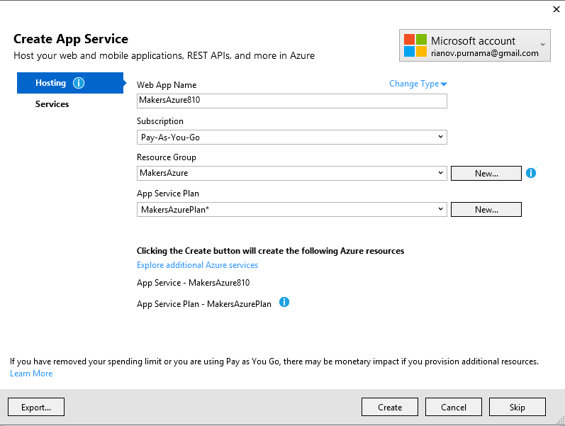

    If you already signed in earlier on the same computer, you might not see the __Add an account__ button. In that case, you can skip this step or you might need to reenter your credentials.

2. Enter a __Web App Name__ that is unique in the *azurewebsites.net* domain. For example, you can name it MakersAzure with numbers to the right to make it unique, such as MakersAzure810. If a default web name is created for you, it will be unique and you can use that.

    If someone else has already used the name that you enter, you see a red exclamation mark to the right instead of a green check mark, and you have to enter a different name.
    
    The URL for your application is this name plus *.azurewebsites.net*. For example, if the name is `MakersAzure810` , the URL is ` makersazure810.azurewebsites.net`.
    
    You can also use a custom domain with an Azure web app. For more information, see Configure a custom domain name in Azure App Service
    
3. Click the __New__ button next to the __Resource Group__ box, and then enter "MakersAzure" or another name if you prefer.

    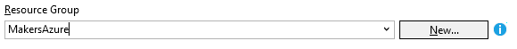
    
4. Click the __New__ button next to the __App Service Plan__ drop-down.

    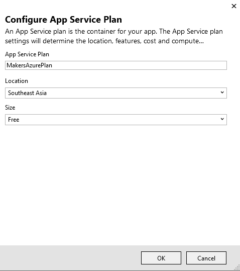

    The __Configure App Service Plan__ dialog appears.
    
    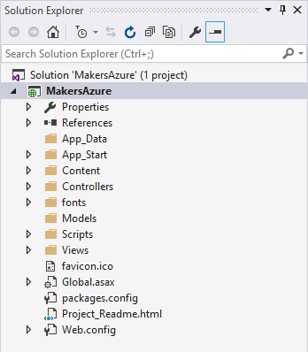
    
5. In the __Configure App Service Plan__ dialog, enter "MakersAzurePlan" or another name if you prefer.

6. In the __Location__ drop-down list, choose the location that is closest to you.

7. In the __Size__ drop-down, click __Free__.

8. In the __Configure App Service Plan__ dialog, click __OK__.

9. In the __Create App Service__ dialog box, click __Create__.

__C.	Inspect the Azure resources in Visual Studio__

In a short time, usually less than a minute, Visual Studio creates the web project and the web app.

The __Solution Explorer__ window shows the files and folders in the new project.
    
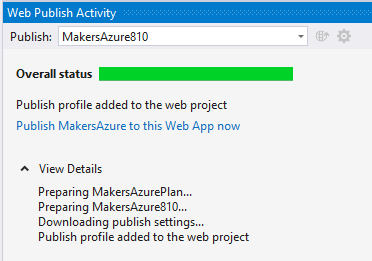

The __Azure App Service Activity__ window shows that the App Service resources have been created in Azure. You can click on the link here to start publishing your new project immediately. Later, however, the tutorial shows you how to publish your files anytime.

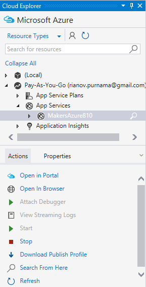
   
The __Cloud Explorer__ window lets you view and manage Azure resources, including the new web app that you just created.

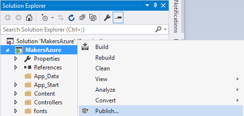

__D.	Deploy the web project to Azure__

In this section, you deploy the web project to the web app resource you created in Azure App Service.

1. In __Solution Explorer__, right-click the project, and choose __Publish__.

    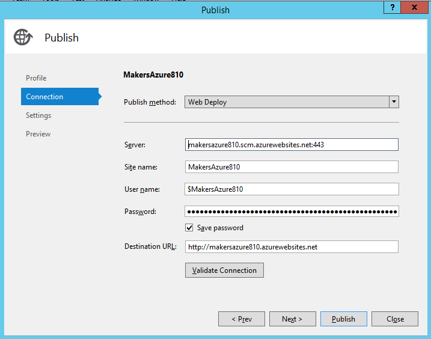

    In a few seconds, the __Publish Web__ wizard appears. The wizard opens to a publish profile that has settings for deploying the web project to the new web app.

2. On the __Connection__ tab of the __Publish Web__ wizard, click __Next__.

    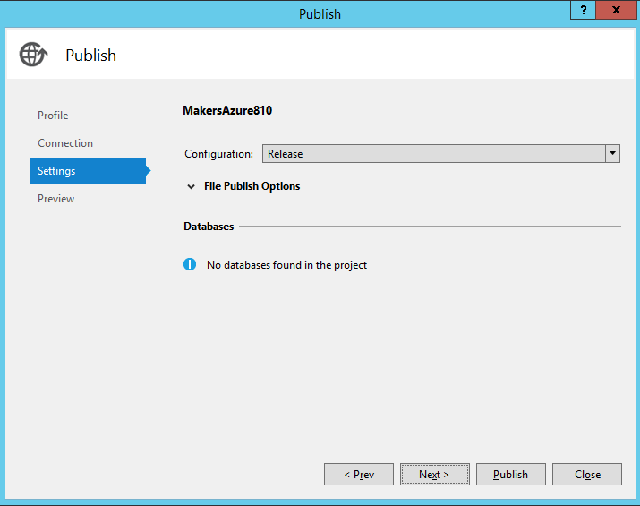

3. On the __Settings__ tab, click __Next__.

    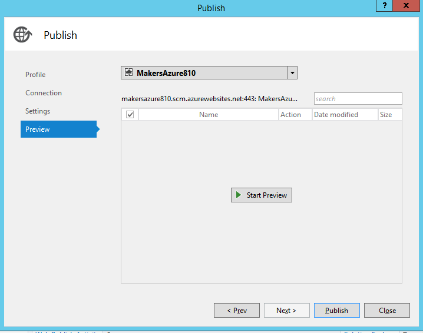

    The __Preview__ tab is next. Here you have an opportunity to see what files are going to be copied from your project to the API app. When you're deploying a project to an API app that you already deployed to earlier, only changed files are copied. If you want to see a list of what will be copied, you can click the __Start Preview__ button.

4. On the __Preview__ tab, click __Publish__.

    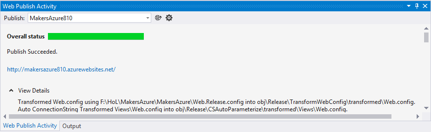

    When you click __Publish__, Visual Studio begins the process of copying the files to the Azure server. This may take a minute or two.

    The __Output__ and __Azure App Service Activity__ windows show what deployment actions were taken and report successful completion of the deployment.
    
    Upon successful deployment, the default browser automatically opens to the URL of the deployed web app, and the application that you created is now running in the cloud. The URL in the browser address bar shows that the web app is loaded from the Internet.

    
	
So far, this lab will help you to learn to create an web app in Azure App Service. With this lab you can also learn to deploy your web app and run on Azure.
