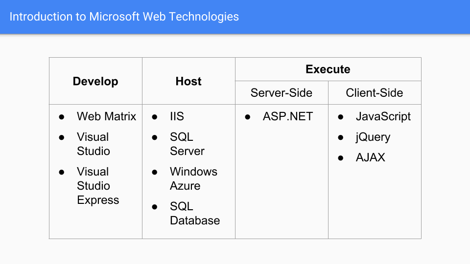
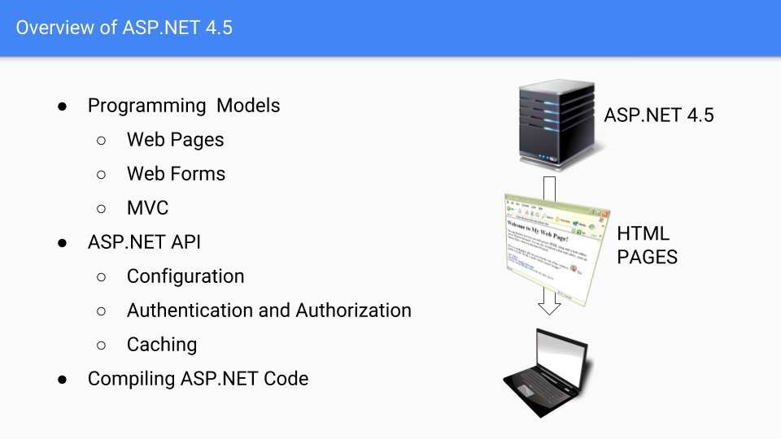

# Module 01   Exploring ASP.NET MVC 5

**Contents:**
- [Module Overview](#1)
- Lesson 1: Overview of Microsoft Web Technologies
- Lesson 2: Overview of ASP.NET 4.5
- Lesson 3: Introduction to ASP.NET MVC 5

## Module Overview

Microsoft ASP.NET MVC 5 and the other web technologies of the .NET Framework help you create and host dynamic, powerful, and extensible web applications. 

ASP.NET MVC 5 supports agile, test-driven development and the latest web standards such as HTML 5. To build robust web applications, you need to be familiar with the technologies and products in the Microsoft web stack. 

You also need to know how ASP.NET applications work with IIS, Visual Studio, SQL Server, Windows Azure, and Windows Azure SQL Database to deliver engaging webpages to site visitors. 

To choose a programming language that best suits a set of business requirements, you need to know how Model-View-Controller (MVC) applications differ from the other ASP.NET programming models: Web Pages and Web Forms.

The web application that you will design and develop in the labs throughout this course will help you develop web applications that fulfill business needs.

### Objectives

After completing this module, you will be able to:
- Describe the role of ASP.NET in the web technologies stack, and how to use ASP.NET to build web applications.
- Describe the three programming models available in ASP.NET: Web Pages, Web Forms, and MVC—and select an appropriate model for a given project.
- Distinguish between an MVC Model, an MVC Controller, and an MVC View.

## Lesson 1   Overview of Microsoft Web Technologies

Before you use ASP.NET MVC 5, you need to know where Microsoft ASP.NET 4.5 fits in the context of the entire Microsoft web technologies stack. 

You should know how ASP.NET 4.5 websites are hosted in Internet Information Server 8 (IIS) and Windows Azure, and how they run server-side code on web servers, and client-side code on web browsers, to help provide rich and compelling content.

### Lesson Objectives

After completing this lesson, you will be able to:
- Provide an overview of Microsoft web technologies.
- Provide an overview of ASP.NET 4.5.
- Provide an overview of client-side web technologies, including AJAX and JavaScript libraries.
- Describe the role of IIS in the Microsoft web technologies stack.
- Describe the role of Windows Azure in the Microsoft web technologies stack.

### Introduction to Microsoft Web Technologies

Microsoft provides a broad range of technologies that you can use to create rich web applications and publish them on intranets and over the Internet. 

Besides publishing web applications, you can use these technologies to develop and host websites, which run code both on the web server and on the user’s web browser.

#### Developer Tools

You can create simple websites with text and images by using a text editor, such as Notepad. However, most websites require complex actions to be performed on the server-side, such as database operations, email delivery, complex calculations, or graphics rendering. 

To create such complex, highly functional, and engaging websites quickly and easily, Microsoft provides the following tools:
- *WebMatrix 2*. You can use WebMatrix 2 to create static HTML pages and dynamic pages with ASP.NET, PHP, and Node.js. WebMatrix 2 is a free development tool that you can install by downloading and using the Microsoft Web Platform Installer (Web PI) from the Microsoft website. WebMatrix 2 enables you to develop custom websites based on popular web applications such as Orchard, Umbraco CMS, and WordPress. Using WebMatrix 2, you can create ASP.NET Web Pages applications, but not ASP.NET Web Forms or MVC applications.
- *Microsoft Visual Studio 2015*. You can use Visual Studio 2012, an Integrated Development Environment (IDE), to create custom applications based on Microsoft technologies, regardless of whether these applications run on the web, on desktops, on mobile devices, or by using Microsoft cloud services. Visual Studio 2012 has rich facilities for designing, coding, and debugging any ASP.NET web application, including MVC applications.
- *Microsoft Visual Studio Express 2015 for Web*. You can use Visual Studio Express 2012 for Web to create Web Forms or MVC web applications. This is a free tool that does not include all the features of Visual Studio 2015 editions. However, you can use it to create fully functional MVC websites.

#### Hosting Technologies

Regardless of the tool you use to build a web application, you must use a web server to host the web application. When users visit your site, the host server responds by rendering HTML and returning it to the user’s browser for display. The host server may query a database before it builds the HTML, and the host server may perform other actions such as sending emails or saving uploaded files. You need to test the functionality of such user actions on a web server. When you build a web application by using Visual Studio 2015, you can use Visual Studio Development Server, the built-in web server to run the application. However, Visual Studio Development Server cannot host deployed web applications. Therefore, when you finish building the web application and make it ready for users to access on an intranet or over the Internet, you must use a fully functional web server such as:
- *Microsoft Internet Information Server 8*. IIS is an advanced website hosting technology. You can install IIS servers on your local network or perimeter network, or employ IIS servers hosted by an Internet service provider (ISP). IIS can host any ASP.NET, PHP, or Node.js websites. You can scale up IIS to host large and busy websites by configuring server farms that contain multiple IIS servers, all serving the same content.
- *Windows Azure*. Windows Azure is a cloud platform that provides on-demand services to build, deploy, host, and manage web applications through Microsoft-managed data centers. When you use Windows Azure services, you need to pay only for the data that your website serves. Also, you need not worry about building a scalable infrastructure because Windows Azure automatically adds resources as your website grows.

**Note:** There are many other non-Microsoft technologies that you can use to host websites. The most popular, for example, is Apache. Apache is most frequently run on Linux servers and it is often paired with MySQL to manage databases and PHP as a server-based web framework. This configuration is often referred to as the Linux Apache MySQL PHP (LAMP) web stack.
**Note:** Windows Azure and IIS can host websites written in ASP.NET, PHP, or Node.js.
Apache web servers can be used to host a number of server-side web technologies, including PHP, Node.js, and Python, but Apache web servers cannot be used to host ASP.NET websites.

Most websites require a database to manage data such as product details, user information, and discussion topics. You can choose from the following Microsoft technologies to manage your data:
- *Microsoft SQL Server 2012*. SQL Server 2012 is a premium database server that you can use to host any database from the simplest to the most complex. SQL Server can scale up to support very large databases and very large numbers of users. You can build large SQL Server clusters to ensure the best availability and reliability. Many of the world’s largest organizations rely on SQL Server to host data.
- *Windows Azure SQL Database*. SQL Database is a cloud database platform and a part of Windows Azure. Using SQL Database, you can deploy your database and pay only for the data that you use. You need not worry about managing your database infrastructure because your database scales up automatically as your website grows.

Microsoft provides a broad range of technologies that you can use to create rich web applications and publish them on intranets and over the Internet. Besides publishing web applications, you can use these technologies to develop and host websites, which run code both on the web server and on the user's web browser.

#### Code Execution Technologies

The code that you write in a developer tool must run in one of two locations:
- *On the web server*. This code has full access to the power of the web server and any databases attached to it. It can access the database quickly, send email messages, and render webpages.
- *On the user’s web browser*. This code responds quickly to user actions, such as mouse clicks, but it is more limited in what it can accomplish without interacting with the web server.
You need to use different technologies to run server-side code and client-side code.

#### Server-Side Execution

Microsoft ASP.NET 4.5 is a server-side web environment that runs server-side .NET code that you write in Visual Studio 2015 or WebMatrix 2. The code accesses the database, renders HTML pages, and returns them to the web browser. The MVC programming model is a part of ASP.NET 4.5. Other server-side technologies include PHP and Node.js.

#### Client-Side Execution

Most web browsers can run code written in the JavaScript language. This code is sent to the browser as text within a rendered HTML page or in a separate .js file. Because JavaScript is local to the browser, it can respond very quickly to user actions such as clicking, pointing, or dragging.

Many JavaScript libraries are available to accelerate client code development. For example, the popular jQuery library makes it simple to access page elements and manipulate them by changing their style or content. When you use such libraries, you can write functions in a few lines that would otherwise require hundreds of lines of your own JavaScript code.

ASP.NET applications can also use the Asynchronous JavaScript and XML (AJAX) technology on the client computer. You can use AJAX to update a small section of an HTML page, instead of reloading the entire page from the server. Such partial page updates help make webpages more responsive and engaging.

**Question:** If you want to animate a page element, for example, by fading it in, would you write server-side or client-side code?

### Overview of ASP.NET 4.5

You can use ASP.NET 4.5 to develop database- driven, highly-functional, and scalable dynamic websites that use client-side and server-side code. You can create many kinds of website with ASP.NET 4.5, for example, web portals, online shopping sites, blogs, and wikis.

#### Programming  Models

When you use ASP.NET 4.5 to build an application, you are not restricted to a single style of programming; instead, you can choose from three different programming models. Each programming model has a typical structure in the
development environment and stores code in different places in the web hierarchy:
- Web Pages: When you build a site by using Web Pages, you can write code by using the C# or Visual Basic programming language. If you write C# code, these pages have a .cshtml file extension. If you write Visual Basic code, these pages have a .vbhtml file extension. ASP.NET runs the code in these pages on the server to render data from a database, respond to a form post, or perform other actions. This programming model is simple and easy to learn, and is suited for simple data-driven sites. ASP.NET 4.5 includes Web Pages version 2.0.
- Web Forms: When you build a site by using Web Forms, you employ a programming model with rich server-side controls and a page life cycle that is not unlike building desktop applications. Built-in controls include buttons, text boxes, and grid views for displaying tabulated data. You can also add third-party controls or build custom controls. To respond to user actions, you can attach event handlers containing code to the server-side controls. For example, to respond to a click on a button called firstButton, you could write code in the firstButton_Click() event handler.
- MVC: When you build a site by using ASP.NET MVC, you separate server-side code into three parts:
  - *Model*. An MVC model defines a set of classes that represent the object types that the web application manages. For example, the model for an ecommerce site might include a Product model class that defines properties such as Description, Catalog Number, Price, and others. Models often include data access logic that reads data from a database, and writes data to that database.
  - *Controllers*. An MVC controller is a class that handles user interaction, creates and modifies model classes, and selects appropriate views. For example, when a user requests full details about a particular product, the controller creates a new instance of the Product model class and passes it to the Details view, which displays it to the user.
  - *Views*. An MVC view is a component that builds the webpages that make up the web application’s user interface. Controllers often pass an instance of a model class to a view. The view displays properties of the model class. For example, if the controller passes a Product object, the view might display the name of the product, a picture, and the price.

This separation of model, view, and controller code ensures that MVC applications have a logical structure, even for the most complex sites. It also improves the testability of the application. Ultimately, ASP.NET MVC enables more control over the generated HTML than either Web Pages or Web Forms.

