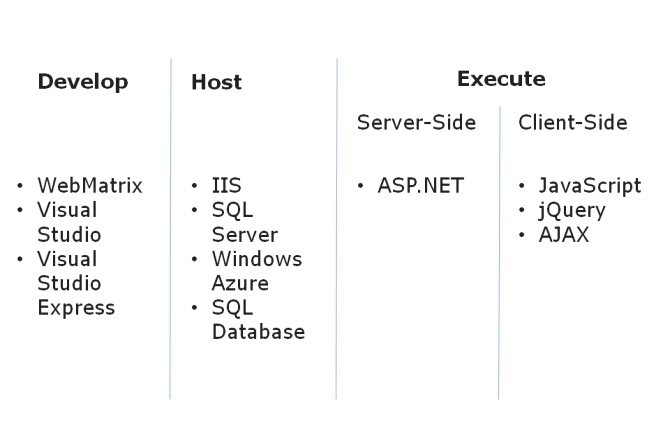
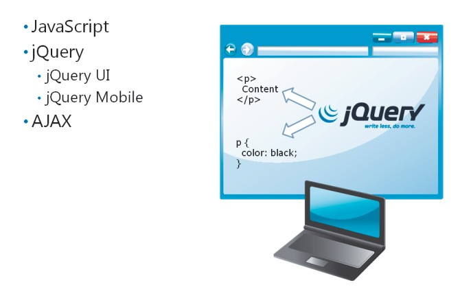
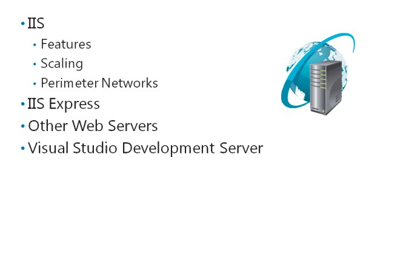
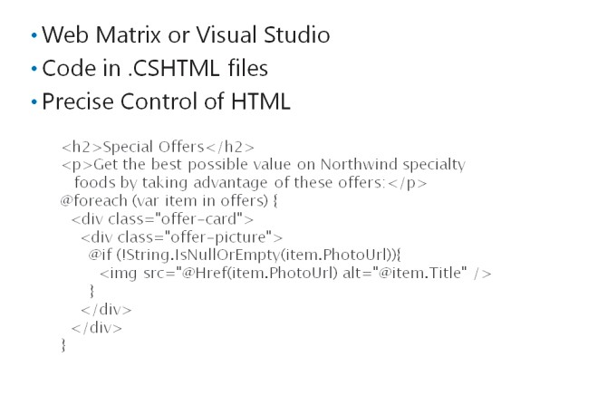
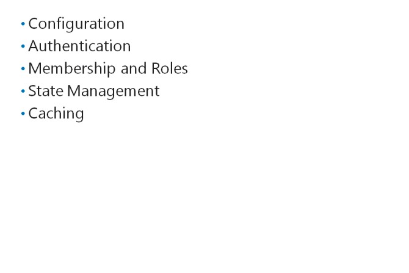

# Module 01 <br> Exploring ASP.NET MVC 5

###### Contents:
[Module Overview](#1)    
[**Lesson 1:** Overview of Microsoft Web Technologies](#2)    
[**Lesson 2:** Overview of ASP.NET 4.5](#3)    
[**Lesson 3:** Introduction to ASP.NET MVC 5](#4)    

## <a name="1"></a>Module Overview

Microsoft ASP.NET MVC 5 and the other web technologies of the .NET Framework help you create and host dynamic, powerful, and extensible web applications. ASP.NET MVC 5 supports agile, test-driven development and the latest web standards such as HTML 5. To build robust web applications, you need to be familiar with the technologies and products in the Microsoft web stack. You also need to know how ASP.NET applications work with IIS, Visual Studio, SQL Server, Windows Azure, and Windows Azure SQL Database to deliver engaging webpages to site visitors. To choose a programming language that best suits a set of business requirements, you need to know how Model-View-Controller (MVC) applications differ from the other ASP.NET programming models: Web Pages and Web Forms.

The web application that you will design and develop in the labs throughout this course will help you develop web applications that fulfill business needs.

### Objectives

After completing this module, you will be able to:
- Describe the role of ASP.NET in the web technologies stack, and how to use ASP.NET to build web applications.
- Describe the three programming models available in ASP.NET: Web Pages, Web Forms, and MVC—and select an appropriate model for a given project.
- Distinguish between an MVC Model, an MVC Controller, and an MVC View.

## <a name="2"></a>Lesson 1 <br> **Overview of Microsoft Web Technologies**

Before you use ASP.NET MVC 5, you need to know where Microsoft ASP.NET 4.5 fits in the context of the entire Microsoft web technologies stack. 

You should know how ASP.NET 4.5 websites are hosted in Internet Information Server 8 (IIS) and Windows Azure, and how they run server-side code on web servers, and client-side code on web browsers, to help provide rich and compelling content.

### Lesson Objectives

After completing this lesson, you will be able to:
- Provide an overview of Microsoft web technologies.
- Provide an overview of ASP.NET 4.5.
- Provide an overview of client-side web technologies, including AJAX and JavaScript libraries.
- Describe the role of IIS in the Microsoft web technologies stack.
- Describe the role of Windows Azure in the Microsoft web technologies stack.

### Introduction to Microsoft Web Technologies



Microsoft provides a broad range of technologies that you can use to create rich web applications and publish them on intranets and over the Internet. 

Besides publishing web applications, you can use these technologies to develop and host websites, which run code both on the web server and on the user’s web browser.

#### Developer Tools

You can create simple websites with text and images by using a text editor, such as Notepad. However, most websites require complex actions to be performed on the server-side, such as database operations, email delivery, complex calculations, or graphics rendering. 

To create such complex, highly functional, and engaging websites quickly and easily, Microsoft provides the following tools:
- *WebMatrix 2*. You can use WebMatrix 2 to create static HTML pages and dynamic pages with ASP.NET, PHP, and Node.js. WebMatrix 2 is a free development tool that you can install by downloading and using the Microsoft Web Platform Installer (Web PI) from the Microsoft website. WebMatrix 2 enables you to develop custom websites based on popular web applications such as Orchard, Umbraco CMS, and WordPress. Using WebMatrix 2, you can create ASP.NET Web Pages applications, but not ASP.NET Web Forms or MVC applications.
- *Microsoft Visual Studio 2015*. You can use Visual Studio 2012, an Integrated Development Environment (IDE), to create custom applications based on Microsoft technologies, regardless of whether these applications run on the web, on desktops, on mobile devices, or by using Microsoft cloud services. Visual Studio 2012 has rich facilities for designing, coding, and debugging any ASP.NET web application, including MVC applications.
- *Microsoft Visual Studio Express 2015 for Web*. You can use Visual Studio Express 2012 for Web to create Web Forms or MVC web applications. This is a free tool that does not include all the features of Visual Studio 2015 editions. However, you can use it to create fully functional MVC websites.

#### Hosting Technologies

Regardless of the tool you use to build a web application, you must use a web server to host the web application. When users visit your site, the host server responds by rendering HTML and returning it to the user’s browser for display. The host server may query a database before it builds the HTML, and the host server may perform other actions such as sending emails or saving uploaded files. You need to test the functionality of such user actions on a web server. When you build a web application by using Visual Studio 2015, you can use Visual Studio Development Server, the built-in web server to run the application. However, Visual Studio Development Server cannot host deployed web applications. Therefore, when you finish building the web application and make it ready for users to access on an intranet or over the Internet, you must use a fully functional web server such as:
- *Microsoft Internet Information Server 8*. IIS is an advanced website hosting technology. You can install IIS servers on your local network or perimeter network, or employ IIS servers hosted by an Internet service provider (ISP). IIS can host any ASP.NET, PHP, or Node.js websites. You can scale up IIS to host large and busy websites by configuring server farms that contain multiple IIS servers, all serving the same content.
- *Windows Azure*. Windows Azure is a cloud platform that provides on-demand services to build, deploy, host, and manage web applications through Microsoft-managed data centers. When you use Windows Azure services, you need to pay only for the data that your website serves. Also, you need not worry about building a scalable infrastructure because Windows Azure automatically adds resources as your website grows.

**Note:** There are many other non-Microsoft technologies that you can use to host websites. The most popular, for example, is Apache. Apache is most frequently run on Linux servers and it is often paired with MySQL to manage databases and PHP as a server-based web framework. This configuration is often referred to as the Linux Apache MySQL PHP (LAMP) web stack.
**Note:** Windows Azure and IIS can host websites written in ASP.NET, PHP, or Node.js.
Apache web servers can be used to host a number of server-side web technologies, including PHP, Node.js, and Python, but Apache web servers cannot be used to host ASP.NET websites.

Most websites require a database to manage data such as product details, user information, and discussion topics. You can choose from the following Microsoft technologies to manage your data:
- *Microsoft SQL Server 2012*. SQL Server 2012 is a premium database server that you can use to host any database from the simplest to the most complex. SQL Server can scale up to support very large databases and very large numbers of users. You can build large SQL Server clusters to ensure the best availability and reliability. Many of the world’s largest organizations rely on SQL Server to host data.
- *Windows Azure SQL Database*. SQL Database is a cloud database platform and a part of Windows Azure. Using SQL Database, you can deploy your database and pay only for the data that you use. You need not worry about managing your database infrastructure because your database scales up automatically as your website grows.

Microsoft provides a broad range of technologies that you can use to create rich web applications and publish them on intranets and over the Internet. Besides publishing web applications, you can use these technologies to develop and host websites, which run code both on the web server and on the user's web browser.

#### Code Execution Technologies

The code that you write in a developer tool must run in one of two locations:
- *On the web server*. This code has full access to the power of the web server and any databases attached to it. It can access the database quickly, send email messages, and render webpages.
- *On the user’s web browser*. This code responds quickly to user actions, such as mouse clicks, but it is more limited in what it can accomplish without interacting with the web server.
You need to use different technologies to run server-side code and client-side code.

#### Server-Side Execution

Microsoft ASP.NET 4.5 is a server-side web environment that runs server-side .NET code that you write in Visual Studio 2015 or WebMatrix 2. The code accesses the database, renders HTML pages, and returns them to the web browser. The MVC programming model is a part of ASP.NET 4.5. Other server-side technologies include PHP and Node.js.

#### Client-Side Execution

Most web browsers can run code written in the JavaScript language. This code is sent to the browser as text within a rendered HTML page or in a separate .js file. Because JavaScript is local to the browser, it can respond very quickly to user actions such as clicking, pointing, or dragging.

Many JavaScript libraries are available to accelerate client code development. For example, the popular jQuery library makes it simple to access page elements and manipulate them by changing their style or content. When you use such libraries, you can write functions in a few lines that would otherwise require hundreds of lines of your own JavaScript code.

ASP.NET applications can also use the Asynchronous JavaScript and XML (AJAX) technology on the client computer. You can use AJAX to update a small section of an HTML page, instead of reloading the entire page from the server. Such partial page updates help make webpages more responsive and engaging.

**Question:** If you want to animate a page element, for example, by fading it in, would you write server-side or client-side code?

### Overview of ASP.NET 4.5


You can use ASP.NET 4.5 to develop database- driven, highly-functional, and scalable dynamic websites that use client-side and server-side code. You can create many kinds of website with ASP.NET 4.5, for example, web portals, online shopping sites, blogs, and wikis.

#### Programming  Models

When you use ASP.NET 4.5 to build an application, you are not restricted to a single style of programming; instead, you can choose from three different programming models. Each programming model has a typical structure in the
development environment and stores code in different places in the web hierarchy:
- Web Pages: When you build a site by using Web Pages, you can write code by using the C# or Visual Basic programming language. If you write C# code, these pages have a .cshtml file extension. If you write Visual Basic code, these pages have a .vbhtml file extension. ASP.NET runs the code in these pages on the server to render data from a database, respond to a form post, or perform other actions. This programming model is simple and easy to learn, and is suited for simple data-driven sites. ASP.NET 4.5 includes Web Pages version 2.0.
- Web Forms: When you build a site by using Web Forms, you employ a programming model with rich server-side controls and a page life cycle that is not unlike building desktop applications. Built-in controls include buttons, text boxes, and grid views for displaying tabulated data. You can also add third-party controls or build custom controls. To respond to user actions, you can attach event handlers containing code to the server-side controls. For example, to respond to a click on a button called firstButton, you could write code in the firstButton_Click() event handler.
- MVC: When you build a site by using ASP.NET MVC, you separate server-side code into three parts:
  - *Model*. An MVC model defines a set of classes that represent the object types that the web application manages. For example, the model for an ecommerce site might include a Product model class that defines properties such as Description, Catalog Number, Price, and others. Models often include data access logic that reads data from a database, and writes data to that database.
  - *Controllers*. An MVC controller is a class that handles user interaction, creates and modifies model classes, and selects appropriate views. For example, when a user requests full details about a particular product, the controller creates a new instance of the Product model class and passes it to the Details view, which displays it to the user.
  - *Views*. An MVC view is a component that builds the webpages that make up the web application’s user interface. Controllers often pass an instance of a model class to a view. The view displays properties of the model class. For example, if the controller passes a Product object, the view might display the name of the product, a picture, and the price.

This separation of model, view, and controller code ensures that MVC applications have a logical structure, even for the most complex sites. It also improves the testability of the application. Ultimately, ASP.NET MVC enables more control over the generated HTML than either Web Pages or Web Forms.

**Additional Reading**: In Lesson 2, Understanding ASP.NET 4.5, you will see how to choose the most appropriate programming model for a given website project.

#### The ASP.NET API

Whichever programming model you choose, you have access to classes from the ASP.NET API. These classes are included in the .NET Framework in namespaces within the **System.Web** namespace and can be used to rapidly implement common website functionalities such as:
- *Configuration*. Using Web.config files, you can configure your web application, regardless of the programming model. Web.config files are XML files with specific tags and attributes that the ASP.NET 4.5 runtime accepts. For example, you can configure database connections and custom error pages in the Web.config file. In code, you can access the configuration through the **System.Web.Configuration**   namespace.
- *Authentication and Authorization*. Many websites require users to log on by entering a user name and password, or by providing extra information. You can use ASP.NET membership providers to authenticate and authorize users, and restrict access to content. You can also build pages that enable users to register a new account, reset a password, recover a lost password, or perform other account management tasks. Membership providers belong to the **System.Web.Security** namespace.
- *Caching*. ASP.NET may take some time to render a complex webpage that may require multiple database queries or calls to external web services. You can use caching to mitigate this delay. ASP.NET caches a rendered page in memory, so that it can return the same page to subsequent user requests without having to render it again from the start. In a similar manner, .NET Framework objects can also be cached. You can access cached pages by using the **System.Runtime.Caching** namespace and configure the caches in Web.config.

#### Compiling ASP.NET Code

Because ASP.NET server-side code uses the .NET Framework, you must write code in a .NET managed programming language such as C# or Visual Basic. Before running the code, it must be compiled into native code so that the server CPU can process it. This is a two-stage process:
1.	*Compilation to MSIL*. When you build a website in Visual Studio, the ASP.NET compiler creates .dll files with all the code compiled into Microsoft Intermediate Language (MSIL). This code is both independent of the language you used to write the application and the CPU architecture of the server.
2.	*Compilation to native code*. When a page is requested for the first time, the Common Language Runtime (CLR) compiles MSIL into native code for the server CPU.
This two-stage compilation process enables components written in different languages to work together and enables many errors to be detected at build time. Note, however, that pages may take extra time to render the first time they are requested after a server restart. To avoid this delay, you can pre-compile the website.

When you use the default compilation model, delays can arise when the first user requests a page. This is because ASP.NET must compile the page before serving it to the browser. To avoid such delays and to protect source code, use pre-compilation. When you pre-compile a site, all the ASP.NET files, including controllers, views, and models, are compiled into a single .dll file.

**Additional Reading:** For more information about ASP.NET compilation, see: http://go.microsoft.com/fwlink/?LinkID=293680&clcid=0x409

**Question:** Which of the three programming models do you think provides the most control over the HTML and JavaScript code that is sent to the browser?

### Client-Side Web Technologies



Originally, in ASP.NET, and similar technologies like PHP, all the code ran on the web server. This approach is often practical because the web server usually has immediate access to the database and more processor power and memory than a typical client computer. However, in such an approach, every user action requires a round trip between the client and the web server, and most actions require a complete reload of the page. This can take significant time. To respond quickly and provide better user experience, you can supplement server-side code with client-side code that runs in the web browser.

#### JavaScript

JavaScript is a simple scripting language that has syntax similar to C#, and it is supported by most web browsers. A scripting language is not compiled. Instead, a script engine interprets the code at run time so that the web browser can run the code.

**Note:** Besides JavaScript, Internet Explorer supports VBScript. There are other scripting languages also, but JavaScript is supported by virtually every web browser. This is not true of any other scripting language. Unless your target audience is very limited and you have control over the browser used by your users, you should use JavaScript because of its almost universal support.

You can include JavaScript code in your ASP.NET pages, irrespective of the programming model you choose. JavaScript is a powerful language, but can require many lines of code to achieve visual effects or call external services. Script libraries contain pre-built JavaScript functions that help implement common actions that you might want to perform on client-side code. You can use a script library, instead of building all your own JavaScript code from the start; using a script library helps reduce development time and effort.

Different browsers interpret JavaScript differently. When you develop an Internet site, you do not know what browsers site visitors use. Therefore, you must write JavaScript that works around browser compatibility.

#### jQuery

jQuery is one of the most popular JavaScript libraries. It provides elegant functions for interacting with the HTML elements on your page and with cascading style sheet (CSS) styles. For example, you can locate all the `<div>` elements on a webpage and change their background color by using a single line of code. To achieve the same result by using JavaScript only, you need to write several lines of code and a programming loop. Furthermore, the code you write may be different for different browsers. Using jQuery, it is easier to write code to respond to user actions and to create simple animations. jQuery also handles browser differences. You can use jQuery to call web services on remote computers and update the webpage with the results returned.

The jQuery project also includes two other JavaScript libraries that extend the base jQuery library:
- jQuery UI. This library includes a set of widgets that you can use to help build a user interface. There are date pickers, spinners, dialog boxes, autocomplete text boxes, and other widgets. You can also apply themes to your jQuery UI widgets to integrate their colors and styles with the website branding.
- jQuery Mobile. This library makes it easy to provide a user interface for mobile devices such as phones and tablets. It renders HTML by using progressive enhancement. For example, using jQuery Mobile, you can display rich, advanced controls on advanced mobile devices such as smartphones with large screens, whereas you can display a simpler UI with the same functionality for older mobile devices with smaller screens.

**Note:** There are many other JavaScript libraries such as Prototype, Enyo, Ext, and Dojo Toolkit. If you find any of these better suited to a particular task, or if you have experience in developing web applications by using them, you can include them in your ASP.NET pages, instead of jQuery.

#### AJAX

AJAX is a technology that enables browsers to communicate with web servers asynchronously by using the XmlHttpRequest object without completely refreshing the page. You can use AJAX in a page to update a portion of the page with new data, without reloading the entire page. For example, you can use AJAX to obtain the latest comments on a product, without refreshing the entire product page.
AJAX is an abbreviation of Asynchronous JavaScript and XML. AJAX is implemented entirely in JavaScript, and ASP.NET 4.5, by default, relies on the jQuery library to manage AJAX requests and responses. The code is run asynchronously, which means that the web browser does not freeze while it waits for an AJAX response from the server. Initially, developers used XML to format the data returned from the server. More recently, however, developers use JavaScript Object Notation (JSON) as an alternative format to XML.

**Question:** Can you think of any problems that might arise if you include the jQuery library with every page in your application?

### Internet Information Server 8.0



Every website must be hosted by a web server. A web server receives requests for web content from browsers, runs any server-side code, and returns webpages, images, and other content. HTTP is used for communication between the web browser and the web server.

Internet Information Server 8.0 is a web server that can scale up from a small website running on a single web server to a large website running on a multiple web server farms. Internet Information Server 8.0 is available with Windows Server 2012.

#### Internet Information Server 8.0 Features

Internet Information Server 8.0 is tightly integrated with ASP.NET 4.5, Visual Studio 2015, and Windows Server 2012. It includes the following features:
- *Deployment Protocols*. The advanced Web Deploy protocol, which is built into Visual Studio 2015, automatically manages the deployment of a website with all its dependencies. Alternatively, you can use File Transfer Protocol (FTP) to deploy content.
- *Centralized Web Farm Management*. When you run a large website, you can configure a load- balanced farm of many IIS servers to scale to large sizes. IIS management tools make it easy to deploy sites to all servers in the farm and manage sites after deployment.
- *High Performance Caches*. You can configure ASP.NET to make optimal use of the IIS caches to accelerate responses to user requests. When IIS serves a page or other content, it can cache it in memory so that subsequent identical requests can be served faster.
- *Authentication and Security*. IIS supports most common standards for authentication, including Smart Card authentication and Integrated Windows authentication. You can also use Secure Sockets Layer (SSL) to encrypt security-sensitive communications, such as logon pages and pages containing credit card numbers.
- *ASP.NET Support*. IIS is the only web server that fully supports ASP.NET.
- *Other Server-Side Technologies*. You can host websites developed in PHP and Node.js on IIS.

#### Scaling Up IIS

A single web server has limited scalability because it is limited by its processor speed, memory, disk speed, and other factors. Furthermore, single web servers are vulnerable to hardware failures and outages. For example, when a single web server is offline, your website is unavailable to users.

You can improve the scalability and resilience of your website by hosting it on a multiple server farm. In such server farms, many servers share the same server name. Therefore, all servers can respond to browser requests. A load balancing system such as Windows Network Load Balancing or a hardware-based system such as Riverbed Cascade, distributes requests evenly among the servers in the server farm. If a server fails, other servers are available to respond to requests, and thereby, the website availability is not interrupted. IIS servers are designed to work in such server farms and include advanced management tools for deploying sites and managing member servers.

#### Perimeter Networks

Web servers, including IIS, are often located on a perimeter network. A perimeter network has a network segment that is protected from the Internet through a firewall that validates and permits incoming HTTP requests. A second firewall, which permits requests only from the web server, separates the perimeter network from the internal organizational network. Supporting servers, such as database servers, are usually located on the internal organizational network.

In this configuration, Internet users can reach the IIS server to request pages and the IIS server can reach the database server to run queries. However, Internet users cannot access the database server or any other internal computer directly. This prevents malicious users from running attacks and ensures a high level of security.

#### IIS Express

Internet Information Server 8.0 Express does not provide all the features of Internet Information Server 8.0 on Windows Server 2012. For example, you cannot create load-balanced server farms by using Internet Information Server 8.0 Express. However, it has all the features necessary to host rich ASP.NET 4.5 websites and other websites on a single server. Internet Information Server 8.0 Express is included with Windows 8. You can also install it on Windows Server 2012, Windows Server 2008, Windows 7, and Windows Vista SP1 and later by downloading and using the Web Platform Installer (Web PI).

#### Other Web Servers

Apache is a popular non-Microsoft web server and there are other alternatives such as nginx. Apache can be installed on Windows Server or Windows client computers to host websites during development or for production deployments. However, Apache cannot host ASP.NET websites.

#### Visual Studio Development Server

Visual Studio 2015 includes a built-in web server, Visual Studio Development Server. When you open a website in debugging mode, Visual Studio Development Server starts and hosts your site. If you close the browser or stop debugging, Visual Studio Development Server automatically stops. Visual Studio Development Server cannot host sites for production and does not provide all the functionality available in Internet Information Server 8.0 Express. For example, you cannot configure SSL encryption in Visual Studio Development Server.

**Question:** If you wanted to host an ASP.NET site you had written for simple testing by a small team of developers, which of the preceding web servers would you use as a host?

### Windows Azure


Windows Azure is a part of Microsoft cloud services for hosting business-critical systems. When you run code on Windows Azure, the code runs on servers at Microsoft-managed data centers at locations around the globe. You have two main advantages when you use Windows Azure to host and deploy your web application:
- Flexible Scaling: As the needs of your web application and database grow, extra server resources are automatically allocated. You do not need to plan for server farms or load balancing systems
because these are built into Windows Azure.
- Flexible Pricing: With Windows Azure, you can choose a pay-as-you-go pricing model, which means that you only pay for the data that you use. This makes Windows Azure very cost-efficient for small websites. It also makes costs predictable for large websites.

You can use Windows Azure to host the following:
- *Websites.* You can host an entire website on Windows Azure. Windows Azure supports websites developed in ASP.NET, PHP, or Node.js. You can also deploy websites to Windows Azure directly from Visual Studio 2015 or WebMatrix 2.
- *Web services.* A web service does not include a user interface like a website. Instead, it consists of a set of methods that you can call, from other software. You can call web services from mobile devices, desktop applications, and from website code running on the client-side or the server- side.
- *Databases.* When you use Internet Information Server 8.0 to host a website, you can use SQL Server to store the website database. When you host a website in Windows Azure, you can use SQL Database, which is a cloud-based database service based on SQL Server, to host your database.
- *Virtual servers.* You can provision entire virtual servers in Windows Azure to run business-critical back office software or use the virtual servers as test environments. Virtual servers in Windows Azure can run Windows Server or Linux.
- *Mobile services.* If you develop apps for mobile devices such as phones and tablets, you can use Windows Azure to host services that underpin them. Such services can provide user preference storage, data storage and other functions.
- *Media services.* When you use Windows Azure to host media such as audio and video, it is automatically available to many types of devices such as computers, mobile phones, and tablets, and it is encoded in various formats, such as MP4 and Windows Media formats.

**Question:** How would site visitors know if your site is hosted in Windows Azure or IIS Server?

## <a name="2"></a>Lesson 2 <br> **Overview of ASP.NET 4.5**

ASP.NET 4.5 helps you create dynamic websites that use client-side and server-side code. In addition, with ASP.NET 4.5, you are not restricted to a single style of programming; instead, you can choose from three different programming models: Web Pages, Web Forms, and MVC. These programming models differ from each other, and they have their own advantages and disadvantages in different scenarios. ASP.NET also provides many features that you can use, regardless of the programming model you choose.

### Lesson Objectives

After completing this lesson, you will be able to:
- Describe the Web Pages programming model.
- Describe the Web Forms programming model.
- Describe the MVC programming model.
- Determine whether to build Web Pages, Web Forms, or MVC web applications, based on customer needs.
- Describe the features that can be used in all ASP.NET applications, regardless of the chosen programming model.

### Web Pages Applications



Web Pages is the simplest programming model you can choose to build a web application in ASP.NET. You can use Web Pages to create a website quickly and with little technical knowledge. There is a single file associated with each webpage that users can request. For each page, you write HTML, client-side code, and server-side code in the same .cshtml file. The @ symbol is used to distinguish server-side code from HTML and JavaScript. When users request the page, the ASP.NET runtime compiles and runs the server-side code to render HTML and returns that HTML to the web browser for display.

**Note:** If you want to write server-side code in Visual Basic, you use .vbhtml files, instead of
.cshtml files.

You can use either Visual Studio 2015 or WebMatrix 2 to create Web Pages applications. ASP.NET 4.5 includes version 2.0 of Web Pages.

The following code example shows HTML and C# code in part of a Web Pages file. The code displays data from the item object, which is an MVC model class.

**A Web Pages Code Example**

```
<h2>Special Offers</h2>
<p>Get the best possible value on Northwind specialty foods by taking advantage of these offers:</p>
@foreach (var item in offers) {
  <div class="offer-card">
    <div class="offer-picture">
      @if (!String.IsNullOrEmpty(item.PhotoUrl)){
        
      }
    </div>
  </div>
}
```

The Web Pages programming model has the following advantages:
- It is simple to learn.
- It provides precise control over the rendered HTML.
- It can be written in WebMatrix 2 or Visual Studio 2015. 
 
Using a Web Pages site has some disadvantages:
- It provides no control over URLs that appear in the Address bar.
- Large websites require a large numbers of pages, each of which must be coded individually.
- There is no separation of business logic, input logic, and the user interface.

**Question:** Why should web developers need to take control of the URLs that appear in the Address bar when a visitor browses a Web Pages site?

### Web Forms Applications


Web Forms is another programming model that you can choose in ASP.NET. WebMatrix 2 does not support Web Forms, so you must use Visual Studio 2015 to develop a Web Forms application. A Web Forms application is characterized by controls, which you can drag from the Visual Studio toolbox onto each webpage. This method of creating a user interface resembles the method used in desktop applications.

#### Web Forms Controls

ASP.NET provides a wide variety of highly- functional controls that you assemble on Web
Forms. After you add a control to a page, you can write code to respond to user events. For example, you can use code in a button click event to process a user’s input in a form. The controls provided include:
- Input controls, such as text boxes, option buttons, and check boxes.
- Display controls, such as image boxes, image maps, and ad rotators.
- Data display controls, such as grid views, form views, and charts.
- Validation controls, which check data entered by the user.
- Navigation controls, such as menus and tree views.

You can also create your own custom controls to encapsulate custom functionality.

#### Web Forms Code Files

In a Web Forms application, HTML and control markup is stored in files with an .aspx extension. Server- side C# code is usually written in an associated .cs file called a code-behind file. For example, a page called Default.aspx usually has a code-behind file called Default.aspx.cs.

Similarly, when you write custom controls, you store HTML and control markup in an .ascx file. A control called CustomControl.ascx has a code-behind file called  CustomControl.ascx.cs.

Web Forms applications can also contain class files that have the .cs extension.

**Note:** If you write server-side code in Visual Basic, code-behind files have a .vb extension, instead of a .cs extension.

#### Binding Controls to Data

In Web Forms applications, you can easily display data by binding controls to data sources. This technique removes the necessity to loop through data rows and build displays line-by-line. For example, to bind a grid view control to a SQL Server database table, you drag a SQL data source control onto the Web Form, and use a dialog to bind the grid view to the data source. When the page is requested, ASP.NET runs the query on the data source and merges the returned rows of data with the Web Forms page.

#### Advantages and Disadvantages of Web Forms

The Web Forms programming model has the following advantages:
- You can design your page visually by using server controls and Design View.
- You can use a broad range of highly functional controls that encapsulate a lot of functionality.
- You can display data without writing many lines of server-side code.
- The user interface in the .aspx file is separated from input and business logic in the code-behind files.

Using a Web Forms site has some disadvantages:
- The ASP.NET Web Forms page life cycle is an abstraction layer over HTTP and can behave in unexpected ways. You must have a complete understanding of this life cycle, to write code in the correct event handlers.
- You do not have precise control over markup generated by server-side controls.
- Controls can add large amounts of markup and state information to the rendered HTML page. This increases the time taken to load pages.

**Question:** Why should web developers be concerned about the markup and state information that ASP.NET Web Forms controls add to a rendered HTML page?

### MVC Applications


MVC is another programming model available in ASP.NET. MVC applications are characterized by a strong separation of business logic, data access code, and the user interface into Models, Controllers, and Views. ASP.NET 4.5 includes MVC version 4.0.

You cannot use WebMatrix to create MVC applications.

#### Models

Each website presents information about different kinds of objects to site visitors. For example, a publisher’s website may present information about books and authors. A book includes properties such as the title, a summary, and the number of pages. An author may have properties such as a first name, a last name, and a short biography. Each book is linked to one or more authors.

When you write an MVC website for a publisher, you would create a model with a class for books and a class for authors. These model classes would include the properties described and may include methods such as “buy this book” or “contact this author”. If books and authors are stored in a database, the model can include data access code that can read and change records.

Models are custom .NET classes and store code in .cs files.

#### Views

Each website must render HTML pages that a browser can display. This rendering is completed by Views. For example, in the publishing site, a View may retrieve data from the Book Model and render it on a webpage so that the user can see the full details. In MVC applications, Views create the user interface.
Views are markup pages that store both HTML and C# code in .cshtml files. This means that they are like Web Pages, but they include only user interface code. Other logic is separated into Models and Controllers.

#### Controllers

Each website must interact with users when they click buttons and links. Controllers respond to user actions, load data from a model, and pass it to a view, so that it will render a webpage. For example, in the publishing site, when the user double-clicks a book, he or she expects to see full details of that book. The Book Controller receives the user request, loads the book model with the right book ID, and passes it to the Book Details View, which renders a webpage that displays the book. Controllers implement input logic and tie Models to the right Views.

Controllers are .NET classes that inherit from the **System.Web.Mvc.Controller** class and store code in .cs files.

#### Advantages and Disadvantages of MVC

The MVC programming model has the following advantages:
- Views enable the developer to take precise control of the HTML that is rendered.
- You can use the Routing Engine to take precise control of URLs.
- Business logic, input logic, and user interface logic are separated into Models, Controllers, and Views.
- Unit testing techniques and Test Driven Development (TDD) are possible.

Using an MVC site has some disadvantages:
- MVC is potentially more complex to understand than Web Pages or Web Forms.
- MVC forces you to separate your concerns (models, views, and controllers). Some programmers may find this challenging.
- You cannot visually create a user interface by dragging controls onto a page.
- You must have a full understanding of HTML, CSS, and JavaScript to develop Views.

**Question:** When a user makes a request for a particular product in your product catalog, which component receives the request first: a model, a controller, or a view?

### Discussion: ASP.NET Application Scenarios


The following scenarios describe some requirements for websites. In each case, discuss which programming model you would choose to implement the required functionality.

#### Database Front-End

Your organization has its own customer relationship management system that stores data in a SQL Server database. Your team of developers wrote the user interface in Visual Studio 2015 as a desktop application. The directors now require that all computers should be able to access the application even when the desktop client
application is not installed. Because all computers have a browser, you have decided to write a web application in ASP.NET to enable this.

#### E-Commerce Site

You are a consultant for a large software organization. You have been asked to architect an e-commerce website that will enable customers to browse the entire catalog of software packages, download the packages, and purchase licenses. The company has a large team of developers who are familiar with .NET object-oriented programming. The company policy is to use Test Driven Development for all software.

#### Website for a Small Charitable Trust

Your friend works for a charitable organization and asks your advice about a website. Your friend does not have any budget to engage a consultant, but has created websites by using Microsoft FrontPage. Your friend wants to include a database of merchandise that site visitors can browse and purchase.

### Shared  ASP.NET Features



ASP.NET also includes a range of features that are available regardless of the programming model that you use. This means that if you are familiar with these features from working with Web Pages or Web Forms, your knowledge can be used in MVC applications also.

#### Configuration

When you configure an ASP.NET site, you can control how errors are handled, how the site connects to databases, how user input is validated, and many other settings. You can configure ASP.NET sites by creating and editing Web.config files. The Web.config file in the root folder of your site configures the entire site, but you can override this configuration at lower levels by creating Web.config files in sub-folders.

Web.config files are XML files with a set of elements and attributes that the ASP.NET runtime accepts.

**An Example Web.config File**

``` xml
<?xml version="1.0" encoding="utf-8"?>
<configuration>
  <appSettings>
    <add key="aspnet:UseTaskFriendlySynchronizationContext" value="true" />
    <add key="webpages:Version" value="2.0.0.0" />
    <add key="webpages:Enabled" value="false" />
    <add key="PreserveLoginUrl" value="true" />
    <add key="ClientValidationEnabled" value="true" />
    <add key="UnobtrusiveJavaScriptEnabled" value="true" />
  </appSettings>
  <connectionStrings>
    <add name="ApplicationServices" connectionString="Data Source=
.\SQLEXPRESS;Integrated Security=SSPI; AttachDBFilename=|DataDirectory|aspnetdb.mdf;User Instance=true"
providerName="System.Data.SqlClient"/>
  </connectionStrings>
  <system.web>
    <customErrors mode="RemoteOnly" defaultRedirect="~/Error.html" />
    <authentication mode="Forms">
      <forms loginUrl="~/Account/Login" timeout="2880">
      </forms>
    </authentication>
    <pages>
      <namespaces>
        <add namespace="System.Web.Helpers" />
        <add namespace="System.Web.Mvc" />
        <add namespace="System.Web.Mvc.Ajax" />
        <add namespace="System.Web.Mvc.Html" />
        <add namespace="System.Web.Routing" />
        <add namespace="System.Web.WebPages" />
        <add namespace="System.Web.Optimization"/>
      </namespaces>
    </pages>
  </system.web>
</configuration>
```

If you need to access configuration values at runtime in your server-side .NET code, you can use the **System.Web.Configuration** namespace.

#### Authentication

Many websites identify users through authentication. This is usually done by requesting and checking credentials such as a user name and password, although authentication can be done by using more sophisticated methods, such as using smart cards. Some sites require all users to authenticate before they can access any page, but it is common to enable anonymous access to some pages and require authentication only for sensitive or subscription content.

ASP.NET supports several mechanisms for authentication. For example, if you are using Internet Explorer on a Windows computer, ASP.NET may be able to use Integrated Windows authentication. In this mechanism, your Windows user account is used to identify you. When you build Internet sites, you cannot be sure that users have Windows, a compatible browser, or an accessible account, so Forms Authentication is often used. Forms Authentication is supported by many browsers and it can be configured to check credentials against a database, directory service, or other user account stores.

#### Membership and Roles

In many Internet sites, for example, Facebook and Twitter, users can create their own accounts and set credentials. In this manner, your site can support a large number of members without requiring a huge amount of administrative effort because administrators do not create accounts.

In ASP.NET, a membership provider is a component that implements user account management features. Several membership providers are supported by ASP.NET, such as the SQL Membership Provider, which uses a SQL database to store user accounts. You can also create a custom membership provider, inheriting from one of the default providers, if you have unique requirements.

When you have more than a few users, you may want to group them into roles with different levels of access. For example, you might create a “Gold Members” role containing user accounts with access to the best special offers. ASP.NET role providers enable you to create and populate roles with the minimum of custom code.

You can enable access to pages on your website for individual user accounts or for all members of a role. This process is known as authorization.

#### State Management

Web servers and web browsers communicate through HTTP. This is a stateless protocol in which each request is separate from requests before and after it. Any values from previous requests are not automatically remembered.

However, when you build a web application, you must frequently preserve values across multiple page requests. For example, if a user places a product in a shopping cart, and then clicks “Check Out”, this is a separate web request, but the server must preserve the contents of that shopping cart; otherwise, the shopping cart will be emptied and the customer will buy nothing. ASP.NET provides several locations where you can store such values or state information across multiple requests.

#### Caching

An ASP.NET page is built dynamically by the ASP.NET runtime on the web server. For example, in a Web Pages application, the runtime must execute the C# code in the page to render HTML to return it to the browser. That C# code may perform complex and time-consuming operations. It may run multiple queries against a database or call services on remote servers. You can mitigate these time delays by using ASP.NET caches.

For example, you can use the ASP.NET page cache to store the rendered version of a commonly requested page in the memory of the web server. The front page of your product catalog may be requested hundreds or thousands of times a day by many users. If you cache the page in memory the first time it is rendered, the web server can serve it to most users very rapidly, without querying the database server and building the page from scratch.

**Question:** Can you think of other facilities that all ASP.NET applications might need, regardless of the programming model they use?

## <a name="4"></a>Lesson 3 <br> **Introduction to ASP.NET MVC 5**

You need to know how models, views, and controllers work together to render HTML, and how the structure of MVC applications determines the display of information in a Visual Studio 2015 project. You can examine the new features of MVC 5, included in ASP.NET 4.5, to build rich and engaging applications.

### Lesson Objectives

After completing this lesson, you will be able to:
- Describe models, views, and controllers.
- Explore the main features of an ASP.NET MVC 5 web application in Visual Studio.
- Describe the new features of ASP.NET MVC 5.

### Models, Views, and  Controllers


Models represent data and the accompanying business logic, controllers interact with user requests and implement input logic, and views build the user interface. By examining how a user request is processed by ASP.NET MVC 5, you can understand how the data flows through models, views, and controllers before being sent back to the browser.

#### Models and Data

A model is a set of .NET class that represents objects handled by your website. For example, the model for an e-commerce application may
include a Product model class with properties such as Product ID, Part Number, Catalog Number, Name, Description, and Price. Like any .NET class, model classes can include a constructor, which is a procedure that runs when a new instance of that class is created. You can also include other procedures, if necessary. These procedures encapsulate the business logic. For example, you can write a **Publish** procedure that marks the Product as ready-to-sell.

Most websites store information in a database. In an MVC application, the model includes code that reads and writes database records. ASP.NET MVC works with many different data access frameworks. However, the most commonly used framework is the Entity Framework version 5.0.

#### Controllers and Actions

A controller is a .NET class that responds to web browser requests in an MVC application. There is usually one controller class for each model class. Controllers include actions, which are methods that run in response to a user request. For example, the **Product** Controller may include a **Purchase** action that runs when the user clicks the **Add To Cart** button in your web application.
Controllers inherit from the **System.Web.Mvc.Controller** base class. Actions usually return a **System.Web.Mvc.ActionResult** object.

#### Views and Razor

A view is, by default, a .cshtml or .vbhtml file that includes both HTML markup and programming code. A view engine interprets view files, runs the server-side code, and renders HTML to the web browser. Razor is the default view engine in ASP.NET MVC 5, but ASP.NET MVC 5 also supports the ASPX view engine. Additionally, you can install alternate view engines such as Spark and NHaml. The Razor view engine identifies server-side code by searching for the @ symbol, as the following code example demonstrates.

The following lines of code are part of an ASP.NET MVC 5 view and use the Razor syntax. The @ symbol delimits server-side code.

**Part of a Razor View**

``` html
<h2>Details</h2>
<fieldset>
  <legend>Comment</legend>
  <div class="display-label">
    @Html.DisplayNameFor(model => model.Subject)
  </div>
  <div class="display-field">
    @Html.DisplayFor(model => model.Subject)
  </div>
  <div class="display-label">
    @Html.DisplayNameFor(model => model.Body)
  </div>
  <div class="display-field">
    @Html.DisplayFor(model => model.Body)
  </div>
</fieldset>
```
Often, the view displays properties of a model class. In the preceding code example, the **Subject** property and **Body** property are incorporated into the page.

#### Request Life Cycle

The Request life cycle comprises a series of events that happen when a web request is processed. The following steps illustrate the process that MVC applications follow to respond to a typical user request. The request is for the details of a product with the ID “1”:
1.	The user requests the web address: http://www.adventureworks.com/product/display/1
2.	The MVC routing engine examines the request and determines that it should forward the request to the Product Controller and the Display action.
3.	The Display action in the Product Controller creates a new instance of the Product model class.
4.	The Product model class queries the database for information about the product with ID “1”.
5.	The Display action also creates a new instance of the Product Display View and passes the Product Model to it.
6.	The Razor view engine runs the server-side code in the Product Display View to render HTML. In this case, the server-side code inserts properties such as Title, Description, Catalog Number, and Price into the HTML.
7.	The completed HTML page is returned to the browser for display.

**Question:** If you wanted to write some code that renders data from your products catalog into an HTML table, would you place that code in a model, a view, a controller, or a JavaScript function?

### New Features of ASP.NET MVC 5


ASP.NET MVC 5 includes several new features, such as the ASP.NET Web API, mobile features, display modes, asynchronous controllers, **OAuth** and **OpenID** support, and bundling and minification.
- *ASP.NET Web API.* The ASP.NET Web API makes it easy to create a set of web services that can respond to browser requests by using simple HTTP verbs such as GET, POST, and DELETE. Using the Web API, you can build the back-end web services that a client-specific web
application can call. Building web applications by using client-specific HTML pages and the Web API is an alternative to using ASP.NET MVC.
- *Mobile features.* As smartphones and tablets become ubiquitous, you should ensure that your website displays well on all screen sizes, resolutions, color depths, and so on. ASP.NET MVC 5.0 includes several new features to make this easier. For example, the jQuery Mobile script library renders a rich user interface for smartphone browsers, but simpler controls for older models of phones. You can use the new Mobile Project Template that uses jQuery Mobile to create sites specifically for mobile devices. Alternatively, you can add mobile-specific views to your MVC project.
- *Display modes.* Display modes enable you to easily select a view based on the web browser that made the request. Display modes help render HTML for mobile devices and they can be used to display content on unusual desktop browsers. When you add a display mode for a particular browser, you override the views, template views, and partial views that are used to render HTML.
- *Asynchronous controllers.* Usually, a controller action renders synchronously. If the action takes a long time to run, the user has to wait because the action uses a single thread. With asynchronous actions, you can call a long-running method on a separate thread and wait for the results to be returned. This enables an action to complete and respond to the user before the results are returned.
- *Support for OAuth and OpenID standards.* Using the OAuth and OpenID standards to identify users connected to the web application over the Internet, you can call the services of a third- party site to check the credentials of a user. You can trust the identity verified by the external site, and then use it to authorize access to internal resources. Using these technologies, you can, for example, enable users to access internal resources by logging on with their Windows Live account.
- *Bundling and minification.* When a browser requests a webpage, the server often returns the page with a cascading style sheet and one or more JavaScript files. ASP.NET MVC 5.0 can bundle these separate files into a single file to increase the efficiency of the response. It can also minify these files, by removing white space, shortening variable names, and performing other actions that save space. This saves time on downloads and both server and client-side resources, and makes your web application faster.

**Question:** You want to encourage developers to re-use data from your website in mashups with Bing Maps. Which of the new features of MVC 5 would you use to make this possible?