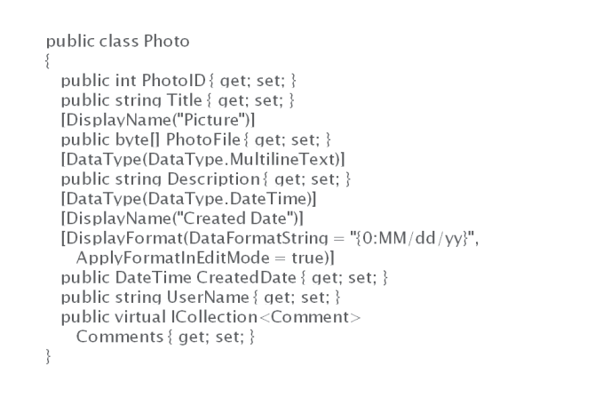
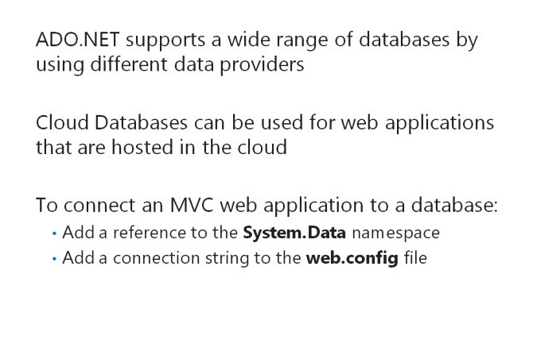
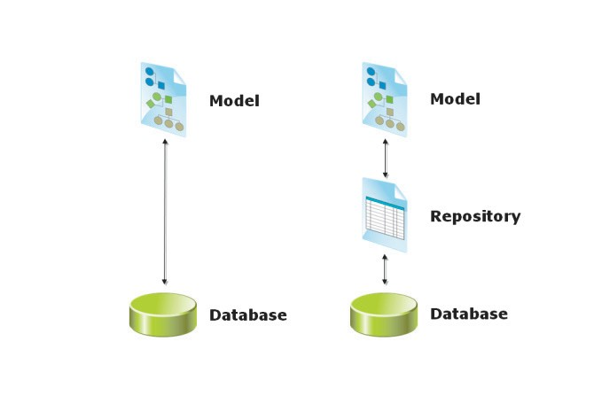

# Module 03 <br> Developing ASP.NET MVC 5 Models

#### Contents:
[Module Overview]()    
[**Lesson 1:** Creating MVC Models]()    
[**Lesson 2:** Working with Data]()    


## <a name="1"></a>Module Overview

Most web applications need to interact with various types of data or objects. An e-commerce application, for example, helps manage products, shopping carts, customers, and orders. A social networking application might help manage users, status updates, comments, photos, and videos. A blog is used to manage blog entries, comments, categories, and tags. When you write an MVC web application, you create an MVC model to _model_ the data for your web application. Within this model, you create a model class for each type of object. The model class describes the properties of each type of object and can include business logic that matches business processes. Therefore, the model is a fundamental building- block in an MVC application and a good place to start when you write code. Models interact with the information store that underlies your site, which is usually a database. Therefore, you need to understand data access techniques and technologies to write models. In this module, you will see how to create the code for models and access data by using Entity Framework and LINQ.

### Objectives

After completing this module, you will be able to:
- Add a model to an MVC application and write code in it to implement the business logic.
- Create a new SQL Azure database to store data for the web application.

## Lesson 1 <br> **Creating MVC Models**

An MVC model is a collection of .NET Framework classes. When you create a model class, you define the properties and methods that suit the kind of object the model class describes. You can describe these properties in code so that MVC can determine how to render them in a webpage and how to validate user input. You need to know how to create and describe models, and how to modify the manner in which MVC creates model class instances when it runs your web application.

### Lesson Objectives

After completing this lesson, you will be able to:
- Describe how to create MVC models and develop business logic.
- Use the display and edit data annotations to assign attributes to views and controllers.
- Validate user input with data annotations.
- Describe model binders.
- Describe model extensibility.
- Add a model to an MVC 5 web application.

### Developing Models


Every website presents information about various types of objects. In your web application, you need to define model classes for these objects. When you implement a functional requirement in your web application, you usually start by creating a model class. The model class will probably be revised when you create the controller and views for the model, and then later during the iterations that happen during the project. If you follow the Agile Development model or Extreme Programming, you begin with a simple understanding of the classperhaps its name and a few properties. Then, you discuss with users and add details to the planned model class with the complete set of properties and its relationships to other classes. When developing the model, you can refer to use cases or user stories to ensure that these model details are correct.

When you feel that you fully understand the requirements for a model, you can write model classes to implement the requirements. The following lines of code illustrate how to create an example model class named **Photo**.

**Example Model Class**

``` cs
public class Photo 
{    
  public int PhotoID { get; set; }    
  public string Title { get; set; }    
  public byte[] PhotoFile { get; set; }    
  public string Description { get; set; }   
  public DateTime CreatedDate { get; set; }    
  public string Owner { get; set; }
  public virtual ICollection<Comment> Comments { get; set; }
}
```

Notice that the model class does not inherit from any other class. Also, notice that you have created public properties for each property in the model and included the data type, such as integer or string in the declaration. You can create read-only properties by omitting the **set;** keyword.

The **Photo** class includes a property called **Comments**. This is declared as a collection of **Comment** objects and implements one side of the relationship between photos and comments.

The following lines of code illustrate how you can implement the **Comment** model class.

**Comment Model Class**

``` cs
public class Comment     
{         
  public int CommentID { get; set; }         
  public int PhotoID { get; set; }         
  public string UserName { get; set; }         
  public string Subject { get; set; }         
  public string Body { get; set; }         
  public virtual Photo Photo { get; set; }     
}
```

Notice that the **Comment** class includes a **PhotoID** property. This property stores the ID of the **Photo** that the user commented on, and it ties the comment to a single photo. Also, notice that the **Comment** class includes a **Photo** property, which returns the Photo object that the comment relates to. These properties implement the other side of the relationship between photos and comments. The instances of model classes are usually created in a controller action and passed to a view to display.

The following code example shows how a controller action can create a new photo object from the photo model class and pass it to the Display view.

**Instantiating a Photo in a Controller Action**

``` cs
Photo newPhoto = new Photo(); 
newPhoto.Title = "This is an Example Photo"; 
newPhoto.Owner = User.Identity.Name; 
newPhoto.CreatedDate = DateTime.Today; 
return View("DisplayView", newPhoto);
```

In the Display view, you can render the Title property of a photo by using the **Model** object in the Razor code that you write, as the following code shows.

**Rendering a Property from a Model Class**

``` html
<div id="photo-title">    
  @Model.Title 
</div>
```

### Using Display and Edit Data Annotations on Properties



The model classes usually specify three attributes for each property:

- The name of the property, for example, Title
- The data type of the property, for example, String
- The access levels of the property, for example, the **get** and **set** keywords to indicate read and write access

Additionally by using attributes, you can supply additional metadata to describe properties to ASP.NET MVC. The MVC runtime uses this metadata to determine how to render each property in views for displaying and editing. These attributes are called display and edit annotations.

For example, property names in C# cannot contain spaces. On a rendered webpage, you may often want to include spaces in a property label. For example, you might want to render a property called **CreatedDate** with the label Created Date. To provide MVC with this information, you can use the **DisplayName** annotation.

When you use MVC, you can indicate how you want a property to be named on a view by using the **DisplayName** annotation, as the following lines of code illustrate.

**Setting the DisplayName Annotation**

``` cs
[DisplayName("Created Date")] 
public CreatedDate { get; set; }
```

If you have a **DateTime** property, you can use display and edit data annotations to inform MVC what format you want the property displayed in.

In the following lines of code, the **CreatedDate**property is a **DateTime** and the **DisplayFormat** data annotation is used to indicate to MVC that only the day, month, and year values should be displayed.

**Setting the DataType and DisplayFormat**

``` cs
[DisplayName("Created Date")]  
[DataType(DataType.DateTime)] 
[DisplayFormat(DataFormatString = "{0:MM/dd/yy}", ApplyFormatInEditMode = true)] 
public DateTime CreatedDate { get; set; }
```

All the data annotations that are provided with ASP.NET MVC 5 are included in the **System.ComponentModel.DataAnnotations** namespace.

**Additional Reading:** To read more about all the data annotations provided with MVC 5, see [http://go.microsoft.com/fwlink/?LinkID=288949&clcid=0x409](http://go.microsoft.com/fwlink/?LinkID=288949&amp;clcid=0x409)

**Question:** In the code on the slide, how can you recognize the display and edit annotations and distinguish them from other code?

### ValidatingUserInput withData Annotations


You can use data annotations in MVC models to set validation criteria for user input. Input validation is the process by which MVC checks data provided by a user or a web request to ensure that it is in the right format. The following example shows a webpage form that collects some information from the user:

- _Name_. This is required input. The user must enter some data in this field.

- _Height_. This must be an integer between 0 and 400.

- _Email Address_. This is required input. The value entered must be a valid email address.

In the following example, when the user submits the form, you want MVC to create a new instance of the **Person** model and use it to store the data in the database. However, you want to ensure that the data is valid before it is stored.

To ensure that the data is valid, you can define the **Person** model class by using the following lines of code.

**Using Validation Data Annotations**
``` cs
public class Person  
{    
  public int PersonID { get; set; }    
  [Required]    
  public string Name { get; set; }    
  [Range(0, 400)]    
  public int Height { get; set; }    
  [Required]    
  [RegularExpression(".+\\@.+\\..+")]    
  public string EmailAddress { get; set; } 
}
```

The **Required**, **Range**, **StringLength**, and **RegularExpression** annotations implement input validation in MVC. If users do not enter data that satisfies the criteria specified for each property, the view displays a standard error message that prompts the user to enter the correct data. In the earlier example, you can see that the user must enter a **Name** and a **Height** between 0 and 400\. For the **EmailAddress** property, the user must enter a value that matches the regular expression. The regular expression in the example is a simple expression that requires an @ symbol and a dot.

To specify the error message that the user sees when data is not valid, you can use the **ErrorMessage** property on the validation data annotations, as the following code illustrates.

**Setting a Validation Error Message**

```cs
[Required(ErrorMessage="Please enter a name.")] 
public string Name { get; set; }
```

**Note:** You will see how to ensure that the validation error message is displayed in a view.

**Additional Reading:** For more examples of validation data annotations see [http://go.microsoft.com/fwlink/?LinkID=288950&clcid=0x409](http://go.microsoft.com/fwlink/?LinkID=288950&amp;clcid=0x409)

**Additional Reading:** For more information about the regular expressions that you can use to check user input, see [http://go.microsoft.com/fwlink/?LinkID=288951&clcid=0x409](http://go.microsoft.com/fwlink/?LinkID=288951&amp;clcid=0x409)

**Question**: You want to ensure that users enter a password that is longer than six characters. How should you do this by using a validation data annotation?

### What Are ModelBinders?


A model binder is a component of an ASP.NET MVC application that creates an instance of a model class, based on the data sent in the request from the web browser. ASP.NET MVC includes a default model binder that meets the needs of most web applications. However, you must know how the default model binder works with other components to use it properly. In addition, you may choose to create a custom model binder for advanced situations.

#### **What Does a Model Binder Do?**

A model binder ensures that the right data is sent to the parameters in a controller action method. This enables MVC to create instances of model classes that satisfy the users request. The default model binder, for example, examines both the definition of the controller action parameters and the request parameters to determine which request values to pass to which action parameter.

This model binding process can save developers a lot of time and avoid many unexpected run-time errors that arise from incorrect parameters. MVC includes a default model binder with sophisticated logic that passes parameters correctly in almost all cases without complex custom code.

#### **The Controller Action Invoker and the Default Model Binder**

To understand the default model binding process, consider the following request from a web browser: [http://www.adventureworks.com/product/display/45](http://www.adventureworks.com/product/display/45)

This request identifies three aspects:

- The model class that interests the user. The user has requested a product.

- The operation to perform on the model class. The user has requested that the product be displayed.

- The specific instance of the model class. The user has requested that the product with ID 45 be displayed.

The request is received by an object called the controller action invoker. The controller action invoker of the MVC runtime calls a controller action and passes the correct parameters to it. In the example, the action invoker calls the **Display** action in the **Product** controller and passes the ID "45" as a parameter to the action, so that the right product can be displayed.

The **ControllerActionInvoker** class is the default action invoker. This action invoker uses model binders to determine how parameters are passed to actions.

#### **How the Default Model Binder Passes Parameters**

In a default MVC application, there is only one model binder for the **ControllerActionInvoker** to use. This binder is an instance of the **DefaultModelBinder** class. The default model binder passes parameters by using the following logic:

1.The binder examines the definition of the action that it must pass parameters to. In the example, the binder determines that the action requires an integer parameter called **PhotoID**.

2.The binder searches for values in the request that can be passed as parameters. In the example, the binder searches for integers because the action requires an integer. The binder searches for values in the following locations, in order:

1. _Form Values_. If the user fills out a form and clicks a submit button, you can find parameters in the **Request.Form** collection.

2. _Route Values_. Depending on the routes that you have defined in your web application, the model binder may be able to identify parameters in the URL. In the example URL, 45is identified as a parameter by the default MVC route.

3. _Query Strings_. If the user request includes named parameters after a question mark, you can find these parameters in the **Request.QueryString**collection.

4. _Files_. If the user request includes uploaded files, these can be used as parameters.

Notice that if there are form values and route values in the request, form values take precedence. Query string values are only used if there are no form values and no route values available as parameters.

### Model Extensibility


The MVC architecture has been designed to provide extensibility so that developers can adapt the architecture to unusual or unique requirements. For example, the default action invoker, **ControllerActionInvoker**, can be replaced by your own action invoker if you want to implement your own invoking logic.

Two ways in which you can extend the MVC handling of MVC models are to create custom data annotations and custom model binders.

#### **Custom Validation Data Annotations**

You can use data annotations to indicate to MVC how to validate the data that a user enters in a form or passes in query strings. The four built-in validation attributes in MVC 5, **Required**, **Range**, **StringLength**, and **RegularExpression**, are very flexible. However, in some situations, such as the following examples, you may want to run some custom validation code:

- _Running a Data Store Check_. You want to check the data entered against data that has already been stored in the database or in another database store.

- _Comparing Values_. You want to compare two entered values with each other.

- _Mathematical Checks_. You want to calculate a value from the entered data and check that value is valid.

In such situations you can create a custom validation data annotation. To do this, you create a class that inherits from the **System.ComponentModel.DataAnnotations.ValidationAttribute** class.

The following lines of code illustrate how to create a custom validation data annotation.

**Creating Custom Validation Data Annotation**

``` cs
[AttributeUsage(AttributeTargets.Field)] 
public class LargerThanValidationAttribute : ValidationAttribute 
{    
  public int MinimumValue { get; set; }    
  //Constructor    
  public LargerThanValidationAttribute (int minimum)    
  {       
    MinimumValue = minimum;    
  }    
  //You must override the IsValid method to run your test    
  public override Boolean IsValid (Object value)    
  {       
    var valueToCompare = (int)value;       
    if (valueToCompare > MinimumValue)       
    {          
      return true;       
    }       
    else       
    {          
      return false;       
    }    
  } 
}
```

After you have created a custom validation data attribute, you can use it to annotate a property in your model, as the following lines of code illustrate.

**Using a Custom Validation Data Annotation**

``` cs
[LargerThanValidationAttribute(18)] 
public VoterAge { get; set; }
```

#### **Custom Model Binders**

The default controller action invoker receives requests and calls the right action on the right controller to fulfill the request. The default action invoker uses model binders to identify parameters in the request and pass all of them to the right parameters in the action. This mechanism ensures that query strings, route values, form values, and uploaded files are available for the action to work with.

The default model binder is sophisticated and flexible, but sometimes, you may want to customize its behavior to pass parameters in an unusual way. You can do this by creating a custom model binder and registering it with the MVC runtime.

The following lines of code show how to create a simple custom model binder to pass parameters from the form collection by implementing the **IModelBinder** interface.

**A Simple Custom Model Binder**

``` cs
public class CarModelBinder : IModelBinder {    
  public object BindModel (ControllerContext controllerContext, ModelBindingContext bindingContext)    
  {       //Get the color for the car from the request form       
  string color = controllerContext.HttpContext.Request.Form["color"];       
  //Get the brand for the car from the request form       
  string brand= controllerContext.HttpContext.Request.Form["brand"];       
  //Create a new instance of the car model       
  Car newCar = new Car();       
  newCar.color = color;       
  newCar.brand = brand;
  //return the car       
  return newCar;    
  } 
}
```

The code example assumes that you have a model class in your MVC application called, Car. It also assumes that any request for a Car object includes values for **color** and **brand** in the form collection. This situation can easily be handled by the default model binder. However, this example demonstrates how model binders can locate values from the context of the request and pass those values to the right properties in the model. You can add custom code to implement extra functionality.

**Additional Reading:** You can see more examples of custom model binders at the following locations:

- [http://go.microsoft.com/fwlink/?LinkID=288952&clcid=0x409](http://go.microsoft.com/fwlink/?LinkID=288952&amp;clcid=0x409)

- [http://go.microsoft.com/fwlink/?LinkID=288953&clcid=0x409](http://go.microsoft.com/fwlink/?LinkID=288953&amp;clcid=0x409)

**Question**: You want to ensure that when a user types a value into the Car Model Number box when adding a new car to the website, the text entered is not already used by another car in the database. Would you use a custom validation data annotation or a custom model binder for this?

## Lesson 2 <br> **Working with Data**

All web applications present information and almost all web applications require a data store for that information. By rendering webpages by using data from a data store, you can create a web application that changes continually in response to user input, administrative actions, and publishing events. The data store is usually a database, but other data stores are occasionally used. In MVC applications, you can create a model that implements data access logic and business logic. Alternatively, you can separate business logic, in model classes, from data access logic, in a repository. A repository is a class that a controller can call to read and write data from and to a data store. The .NET Framework includes the Entity Framework and LINQ technologies, which make data access code very quick to write and simple to understand. In addition, you will see how to build a database-driven website in MVC.

### Lesson Objectives

After completing this lesson, you will be able to:
- Connect an application to a database to access and store data.
- Describe the features of the Entity Framework.
- Use LINQ to write queries for selecting, filtering, and grouping data.
- Create separate model classes and corresponding repository classes by using Entity Framework code.
- Explain how to access data in models and repositories.

### Connectingto a Database



Most websites use a database to store dynamic data. By including this data in rendered HTML pages, you can create a dynamic web application with content that changes frequently. For example, you can provide administrative webpages that enable company employees to update the product catalog and publish news items. Products and items are stored in the database. As soon as they are stored, users can view and read them. The employees do not need to edit HTML or republish the website to make their changes visible.

Some websites may store data in other locations, such as a directory service, but databases are the most widely used data store.

#### **ADO.NET and Databases**

When you create .NET Framework applications, including MVC web applications, you can use the ADO.NET technology to access databases. ADO.NET classes are contained in the **System.Data** namespace. ADO.NET supports a wide range of databases by using different data providers. For example:

- _Microsoft SQL Server_. This is an industry-leading database server from Microsoft. ADO.NET includes the **SqlClient** provider for all SQL Server databases.

- _Microsoft SQL Server Express_. This is a free version of SQL Server that includes a wide range of database functionality and is very flexible. Some advanced capabilities, such as database clustering, are not possible with SQL Express. The **SqlClient** provider is used for SQL Express.

- _Microsoft SQL Server Compact_. This version of SQL is also free and uses .sdf files to store data on the hard disk. ADO.NET includes the **SqlServerCe** provider for SQL Compact databases.

- _Oracle Databases_. This is a widely-used database server. ADO.NET includes the **OracleClient** provider for all Oracle databases.

- _OLE DB_. This is a standard that many different databases adhere to. ADO.NET includes the **OleDb** provider for all OLE DB databases.

- _ODBC_. This is another older standard that many different databases adhere to. ADO.NET includes the **Odbc** provider for all ODBC databases. In general, you should use an OLE DB provider, if it is available, instead of an ODBC provider.

You can also use third-party ADO.NET providers to access other databases.

#### **Cloud Databases**

The database of a web application is usually located on the same server as the web application itself or on a dedicated database server at the same physical site. However, if you have a fast, reliable Internet connection, you can consider using a cloud database. Furthermore, if you have chosen to host a web application in the cloud, a cloud database is a logical storage solution. The Microsoft cloud database service is called SQL Database and is a part of Windows Azure.

Windows Azure SQL Database has the following advantages:

- Databases run in Microsoft data centers with the best connectivity and reliability.

- Microsoft guarantees up to 99% uptime.

- You do not need to build and maintain your own database servers or employ database administrators.

- You can scale up the databases very easily.

- You pay only for the data that you use and distribute.

You can use Windows Azure SQL Database with ADO.NET by using the **SqlClient** provider.

#### **Connecting an MVC Web Application to a Database**

To use ADO.NET and connect to a database, you need to add two items to your application:

- Add a reference to the **System.Data** namespace.

- Add a connection string to the **Web.config** file. This string specifies the provider, the location of the database, the security properties, and other properties depending on the provider.

The following markup shows how to add a connection string to **Web.config** to connect to a SQL Express database called, PhotoSharingDB, by using the credentials that the web application runs under.

**Connecting to SQL Express**

``` xml
<connectionStrings>    
  <add name="PhotoSharingDB"       
    connectionString="Data Source=.\SQLEXPRESS;Initial Catalog=PhotoSharingDB;" + "Integrated Security=SSPI"       
    providerName="System.Data.SqlClient"/> 
</connectionStrings>
```

The following connection string connects to a Windows Azure SQL database.

**Connecting to Windows Azure SQL Database**

``` xml
<connectionStrings>    
  <add name="PhotoSharingDB" 
    connectionString="Server=tcp:example.database.windows.net,1433;Database=PhotoSharingDB;" + "User ID=Admin@example;Password=Pa$$w0rd;Trusted_Connection=False;" + "Encrypt=True;Connection Timeout=30;PersistSecurityInfo=true"
    providerName="System.Data.SqlClient"/> 
</connectionStrings>
```
The **`<connectionStrings>`** tag must appear within the **`<configuration>`** tag, after the **`<configSections>`** tag.

**Additional Reading:** The MVC web application templates in Microsoft Visual Studio 2015 include ADO.NET references so you need not add them. However, you must add connection strings. Some of the templates, such as the Internet site template, include SQL Server Express membership databases with connection strings.

### The Entity Framework


Developers write code that works with classes and objects. By contrast, databases store data in tables with columns and rows. Database administrators create and analyze databases by running Transact-SQL queries. You can choose to build and run Transact-SQL queries in your ADO.NET code. However, ADO.NET includes the Entity Frameworkthis technology enables you to read and write data to and from a database by using classes and objects.

Entity Framework is an Object Relational Mapping (ORM) framework. An ORM framework maps the tables and columns found in a database to objects and their properties that you can call from .NET code.

#### **EntityFramework Workflows**

The way you use Entity Framework in your application depends on the manner in which you want to build your database. The three Entity Framework workflows available are database-first, model-first, and code-first:

- _Database First_. You can use the database-first workflow when you have a pre-existing database or if you prefer to create a new database by defining table, columns, views, and other database schema objects. In this workflow, Entity Framework examines the database and creates an XML file with an .edmx extension called the model file. The model file describes classes that you will be able to work with, in code. You can adjust the model by using a designer in Visual Studio and then writing code against the Entity Framework classes.

- _Model First_. You can use the model-first workflow when you do not yet have a database and you prefer to design your model by using an ORM modeling tool. In this workflow, you create the .edmx file in the Visual Studio designer and then write code against the model classes generated by the designer. When you run the application, Entity Framework creates the database tables and columns to support the model. In this workflow, Visual Studio can also create a connection string for you and insert it into Web.config, based on the database that you specify.

- _Code First_. You can use the code-first workflow if you prefer to create a model by writing .NET Framework classes. In this workflow, there is no model file. Instead, you create model classes in C# or Visual Basic. When you run the application, Entity Framework creates the database.

#### **Adding an Entity Framework Context**

When you use Entity Framework in the code-first workflow, you must ensure that the framework creates the right database and tables to store your model classes. To do this, create a class that inherits the Entity Framework **DbContext** class. You will use this class in controllers when you want to manipulate data in the database. Within this class, add a **DbSet<>** property for each database table you want Entity Framework to create in the new database.

The following code shows how to add an Entity Framework context to your model.

**An Entity Framework Context Class**

``` cs
public class PhotoSharingDB: DbContext {
 public DbSet < Photo > Photos {
  get;
  set;
 }
 public DbSet < Comment > Comments {
  get;
  set;
 }
}
```

In the earlier example, Entity Framework looks for a connection string with the name, **PhotoSharingDB**, to match the name of the **DbContext** class. Entity Framework creates the database at the location that the connection string provides, and creates two tables in the new database:

- **Photos:** This table will have columns that match the properties of the **Photo** model class.

- **Comments:** This table will have columns that match the properties of the **Comment** model class.

**Question:** You have a Microsoft Visio diagram, which a business analyst created that shows all the model classes for your web application and their relationships. You want to re-create this diagram in Visual Studio. Which Entity Framework workflow should you use?

### Using an Entity Framework Context


Now that you have defined the Entity Framework context and model classes, you can use them in MVC controllers to pass data to views for display.

The following code shows how to use the Entity Framework context in a controller to pass a single photo, or a collection of photos, to views.

**Using an Entity Framework Context in a** **Controller**

``` cs
public class PhotoController: Controller {
 //Creating a reference to the Entity Framework context class    
 private PhotoSharingDB db = new PhotoSharingDB();
 //This action gets all the photos in the database and passes them to the Index view    
 public ActionResult Index() {
   return View("Index", db.Photos.ToList());
  }
  //This action gets a photo with a particular ID and passes it to the Details view    
 public ActionResult Details(int id = 0) {
  Photo photo = db.Photos.Find(id);
  if (photo == null) {
   return HttpNotFound();
  }
  return View("Details", photo);
 }
}
```

#### **Using Initializers to Populate Databases**

If you are using the code-first or model-first workflow, Entity Framework creates the database the first time you run the application and access data. The database remains empty if you have created the database schema but not populated it with data rows.

You can use an initializer class to populate the database with sample data. This technique ensures that there is sample data to work with, during development.

The following lines of code show how to create an initializer class that adds two **Photo** objects to the Photos table in the database.

**An Example Entity Framework Initializer**

``` cs
public class PhotoSharingInitializer: DropCreateDatabaseAlways < PhotoSharingDB > { //Override the Seed method to populate the database    
 protected override void Seed(PhotoSharingDB context) { //Create a list of Photo objects       
  var photos = new List < Photo > {
   new Photo {
    Title = "My First Photo",
     Description = "This is part of the sample data",
     UserName = "Fred"
   },
   new Photo {
    Title = "My Second Photo",
     Description = "This is part of the sample data",
     UserName = "Sue"
   }
  }; //Add the list of photos to the database and save changes       
  photos.ForEach(s => context.Photos.Add(s));
  context.SaveChanges();
 }
}
```

After you have created an initializer, you need to ensure that it runs by adding a line of code to the

**Global.asax** file in the **Application_Start** method, as the following example illustrates.

**Running the Initializer in Global.asax**

``` cs
protected void Application_Start() { //Seed the database with sample data for development. This code should be removed for production.    
 Database.SetInitializer < PhotoSharingDB > (new PhotoSharingInitializer());
}
```

**Question:** You have created an Entity Framework context class in your model, added an initialize, and called **Database.SetInitializer()** from Global.asax. When you run the application, no database is created and no model objects displayed on the webpages. What have you forgotten to do?

### Using LINQ to Entities


Language Integrated Query (LINQ) is a set of extensions to Visual C# and Visual Basic that enable you to write complex query expressions. You can use these expressions to extract data from databases, enumerable objects, XML documents, and other data sources. The expressions are similar to Transact-SQL queries, but use C# or VB keywords so that you may get IntelliSense support and error checking in Visual Studio.

#### **What Is LINQ to Entities?**

LINQ to Entities is the version of LINQ that works with Entity Framework. LINQ to Entities enables you to write complex and sophisticated queries to locate specific data, join data from multiple objects, update data, and take other actions on objects from an Entity Framework context. If you are using Entity Framework, you can write LINQ queries wherever you require a specific instance of a model class, a set of objects, or for more complex application needs. You can write LINQ queries in query syntax, which resembles SQL syntax, or method syntax, in which operations such as selectare called as methods on objects.

#### **Example LINQ Queries**

In the following lines of code, you can see how to obtain a list of the most recent photos in the database. Both query syntax and method syntax examples are included.

**Using LINQ to Get Recent Photos**

``` cs
//This list will store the photos that are returned List<Photo> photos; 
//This is the Entity Framework context 
PhotoSharingDB context = new PhotoSharingDB();
if (number == 0) {
 //If a number of photos is not specified, we’ll get all the photos in the database    
 //This example is in method syntax.    
 photos = context.Photos.ToList();
} else {
 //The number specifies how many of the most recent photos the user requests    
 //Use a LINQ query with both query and method syntax to get these from the database    
 photos = (from p in context.Photos 
           orderby p.CreatedDate descending 
           select p).Take(number).ToList();
}
```

**Additional Reading:** To read many more example LINQ queries, see [http://go.microsoft.com/fwlink/?LinkID=288954&clcid=0x409](http://go.microsoft.com/fwlink/?LinkID=288954&amp;clcid=0x409)

### Data Access in Models and Repositories



In MVC applications, you can place the data access code in the model, along with the business logic. However, many software architects prefer to separate these two types of code because they serve different purposes:

- _Business Logic_. This code defines the objects that the web application manages, their properties, and their relationships with each other.

- _Data Access Logic_. This code defines the operations necessary to persist data to a database. This includes operations to create new records, read records, update records, and delete records in database tables. A single object in the business logic layer may take data from multiple database tables. This abstraction is handled by the data access logic.

MVC does not require you to separate business and data access logic, and you can create MVC model classes that implement both layers. This is often done in small or simple web applications with small development teams. In these scenarios, Entity Framework classes are used directly in the model classes.

In more complex situations, you need to place the business logic in MVC model classes and place the data access logic in dedicated classes called repositories. When you take this approach, model classes are independent of the database structure and do not include code that depends on database table names, column names, or view names. This approach makes it easier to redesign the database or move to a different data store or data access technology, without the need to re-code your entire application. Using this approach, you employ the Entity Framework in your repository classes, but not in your model classes.

#### **How to Separate Model Classes and Repositories**

If you do choose to separate business logic and data access logic, you must take the following steps for each model class:

1. Define an interface for the repository class. This interface declares the methods that the repository class uses to read and write data from and to the database.

2. Create and write code for the repository class. This class must implement all the data access methods declared in the interface.

3. Remove all data access code from the model class.

4. Modify the controller class to use the repository class. Instead, create an instance of the repository class and call its methods to create the model.

#### **A Simple Example Model Class and Repository Class**

To illustrate how to separate model classes and repository classes, the following examples implement a comment on a photo.

The Comment model class helps users to comment on a photo, as the following lines of code illustrate.

**The Comment Model Class**

``` cs
public class Comment {
 public int CommentID {
  get;
  set;
 }
 public int PhotoID {
  get;
  set;
 }
 public string CommentText {
  get;
  set;
 }
 public virtual Photo Photo {
  get;
  set;
 }
}
```

This interface for a comment repository class defines just one method to get the comments for a given photo, as the following lines of code illustrate.

**The ICommentRepository Interface**

``` cs
public interface ICommentRepository {    
  ICollection<Comment> GetComments (int PhotoID); 
}
```

The CommentRepository class implements the **GetComments** method as the following lines of code illustrate.

**The CommentRepository Class**

``` cs
public class CommentRepository : ICommentRepository {    
  public ICollection<Comment> GetComments(int PhotoID)    {       
    //Implement entity framework calls here.    
  } 
} 
```

The**CommentsController**class uses the repository class, instead of calling Entity Framework methods, as the following lines of code illustrate.

**The CommentsController Class**

``` cs
public class CommentsController : Controller  {    
  ICommentRepository commentRepository = new CommentRepository;    public ActionResult DisplayCommentsForPhoto (int PhotoID)    {       
    //Use the repository to get the comments       
    ICollection<Comments> comments = commentRepository.GetComments(PhotoID);       
    return View("DisplayComments", comments);    
  }
}
```

**Note:** By using the **ICommentRepository** interface, the code makes it easy to replace **CommentRespository** with another implementation if you need to. However, the **CommentController** code still creates a **CommentRespository** object. You have to modify the object to make the replacement.

In an even better architecture, you can replace **CommentRepository** with a different implementation of **ICommentRepository** without any changes to the **CommentController** class. This is an extremely flexible and adaptable approach and is called a loosely coupled architecture.

Loosely coupled architectures are also essential for unit testing.