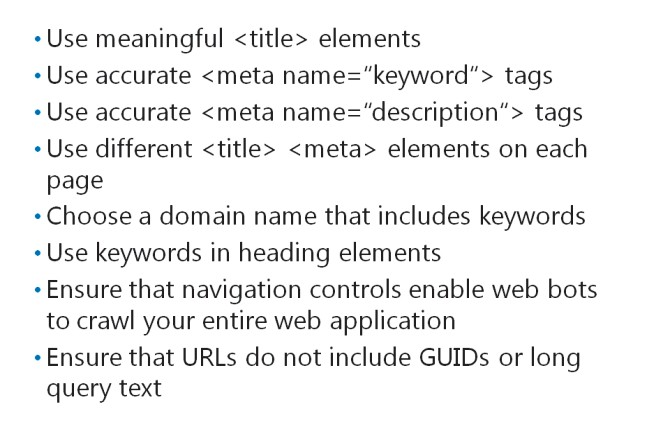
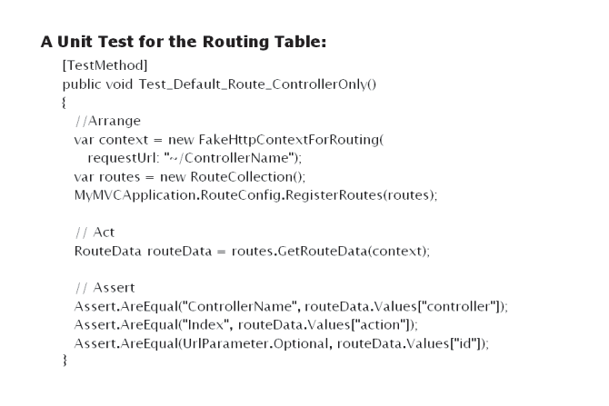
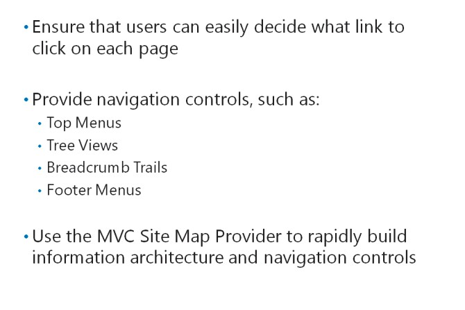
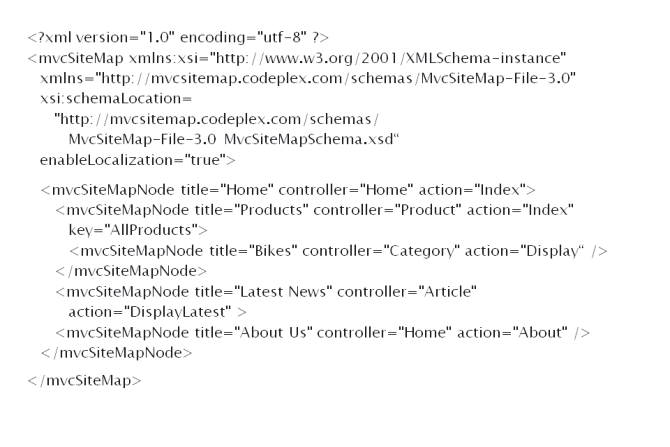

# Module 07 <br> Structuring ASP.NET MVC 5 Web Applications

#### Contents:

[Module Overview](#1)    
[**Lesson 1:** Analyzing Information Architecture](#2)    
[**Lesson 2:** Configuring Routes](#3)    
[**Lesson 3:** Creating a Navigation Structure](#4)

## <a name="1"></a>Module Overview

An MVC web application can grow large and complex and the application can contain many types of information that relate to each other in complicated ways. A key challenge for such web applications is to ensure that users can easily locate the information that interests them. Although a search tool is helpful, you should design your web application in such a way that users can navigate to the page they need through a short sequence of links. At each level, users must know what link to click next. The URLs that users see in the Address bar must be readable and understandable. You need to understand how to present the model classes you have designed in a way that is logical to the user. You also need to ensure that Internet search engines can crawl and analyze your web application structure, so that your application content appears close to the top of the search engine results. You can achieve these goals by learning about ASP.NET routing and navigation.

### Objectives

After completing this module, you will be able to:

- Plan suitable information architecture for a given set of functional requirements.

- Add routes to the ASP.NET routing engine and ensure that URLs are user-friendly throughout an MVC web application.

- Add navigation controls to an application to enable users to locate data rapidly.

## Lesson 1 <br> **Analyzing Information Architecture**

When you analyze use cases and user stories to plan a model for your web application, you must determine the kinds of objects that your web application will manage. For example, if your web application provides technical documentation for a product, you can plan model classes such as installation guides, user guides, frequently asked questions (FAQs), FAQ answers, categories, comments, and other model classes. The model imposes a logical structure of objects on the web application.

However, you must also consider how users expect information to be structured. Users may expect a hierarchical structure, in which FAQs, FAQ answers, and comments are presented under the product they relate to. When you create a complex MVC web application, you need to know how to present model classes in a logical manner, so that your web application is user-friendly.

### Lesson Objectives

After completing this lesson, you will be able to:

- Describe information architecture.

- Describe search engine optimization and its importance for web developers.

## What Is Information Architecture?


When the information your web application manages is complex and multi-faceted, it is easy to present objects in a confusing way. Unless you think carefully about the way users expect information to be structured and how they expect to navigate to useful content, you may unintentionally create an unusable web application. During development, when you work with a limited amount of data, this confusion may not become apparent. Then, when real-world data is added to your database at production deployment time, it becomes clear that the web application is confusing. You can avoid this eventuality by planning the information architecture.

Information architecture is a logical structure for the objects your web application manages. You should design such architecture in a way that users can find content quickly without understanding any technical aspects of your web application. For example, users should be able to locate a technical answer about their product without understanding the database structure or the classes that constitute the model.

#### **Example Scenario: A Technical Documentation Website**

To understand the need for information architecture, consider a web application that presents technical information about a companys products for customers and engineers. In this example, the company manufactures domestic heating furnaces, which are installed in homes by qualified heating engineers. The web application is intended to enable customers to locate instructions, hints, and tips. This web application is also intended to enable engineers to obtain the technical documentation on installing and servicing furnaces.

The development team has identified the following simple user stories:

- Customers have a certain problem with their boilers. They want to find a specific FAQ answer that solves the problem. They know the boiler product name and the fuel, but not the product number. They visit the web application and navigate to the boiler name. They click the FAQ for their boiler name and locate the answer that they need.

- Engineers need the latest installation manual for a boiler. They know the boiler product number, product name, and fuel type. They visit the site and navigate to the boiler name. They click the Manuals link and locate the installation manual.

- Engineers have web applications, which they want to link to a specific boiler name. You want to ensure that the URL is simple and readable for customers and engineers.

You have already planned the following model classes:

- _Furnace_. Each furnace object is a product manufactured and sold by the company.

- _Category_. Categories organize the furnaces by type. For example, you can have categories such as oil-fired, gas-fired, and solid fuel.

- _FAQ_. Each FAQ relates to a single furnace. Each furnace can have many questions. The class includes both Question and Answer properties.

- _Installation Manual_. Each furnace has a single installation manual in the form of a PDF document.

- _User Manual_. Each furnace has a single user manual in the form of a PDF document.

#### **Planning a Logical Hierarchy**

You can see from the user stories that FAQ and manuals are both accessed by navigating to the relevant product first. You can also see that the company has different products, and both customers and engineers know the fuel type for a particular furnace. Therefore, you can organize furnaces in categories by fuel type. The following list shows a logical hierarchy of objects, which helps both the customers and engineers find the information they need by clicking through each level:

- Category

  - Furnace

  - FAQ

  - User Manual

  - Installation Manual

#### **Presenting a Hierarchy in Navigation Controls**

The information architecture you design should be presented on webpages in the form of navigation controls. Common approaches to such controls include:

- _Site Menus_. Most websites have a main menu that presents the main areas of content. For simple web applications, the main menu may include a small number of static links. For larger web applications, when users click a site menu link, a submenu appears.

- _Tree Views_. A tree view is a menu that shows several levels of information hierarchy. Usually, users can expand or collapse objects at each level, to locate the content they require. Tree views are useful for presenting complex hierarchies in navigable structures.

- _Breadcrumb Trails_. A breadcrumb trail is a navigation control that shows the user where they are in the web application. Usually a breadcrumb trail shows the current pages and all the parent pages in the hierarchy, with the home page as the top level. Breadcrumb trails enable you to understand how a page fits in with the information architecture shown in menus and tree views.

The types of navigation controls you build in your web application depend on how you expect users to find information.

#### **Presenting a Hierarchy in URLs**

You can increase the usability of your web application by reflecting the information architecture in the URLs, which the users see in the Address bar of the web browser. In many web applications, URLs often include long and inscrutable information such as Globally Unique Identifiers (GUIDs) and long query strings with many parameters. Such URLs prevent users from manually formulating the address to an item, and these URLs are difficult to link to a page on your web application. Instead, URLs can be plain and comprehensible, to help users browse through your content.

In MVC web applications, the default configuration is simple, but it is based on controllers, actions, and parameters. The following are some example URLs that follow this default pattern:

- This URL links to the Furnace controller and the Details action, and it displays the furnace with the ID 23.

- This URL links to the FAQQuestion controller and the Details action, and it displays the FAQ with the ID 234.

- This URL links to the InstallationManual controller and the Details action, and it displays the manual with the ID 3654.

As you can see, the web application user is required to understand how controllers, actions, and action parameters work, to formulate URLs themselves. Instead, users can use URLs that are easier to understand, such as the following, because they reflect the information hierarchy:

- This URL links to a Furnace by specifying the fuel category and the product name. Customers and engineers can understand these values.

- This URL links to an FAQ by specifying the furnace name the question relates to.

- This URL links to the Installation Manual by specifying the furnace name the manual relates to.

As you can see, these URLs are easy for customers and engineers to understand, because the URLs are based on a logical hierarchy and the information that the users already have. You can control the URLs that your ASP.NET web application uses, by configuring the ASP.NET routing engine.

**Question:** Why may it be difficult for users to understand URLs based on controllers, actions, and parameters?

### What Is Search Engine Optimization?



Most users find web applications by using search engines. Users tend to visit the links that appear at the top of search engine results more frequently than those lower down and those on the second page of results. For this reason, website administrators and developers try to ensure their web application appears high in search engine results, by using a process known as Search Engine Optimization (SEO). SEO ensures that more people visit your web application.

Search engines examine the content of your web application, by crawling it with a program called a web bot. If you understand the priorities that web bots and search engine indexes use to order search results, you can create a web application that conforms to those priorities and thereby appears high in search engine results.

**SEO Best Practices**

Various search engines have different web bots with different algorithms to prioritize results. The complete details of these algorithms are not usually published. However, if you adopt the following best practices, your site has a good chance of appearing high in search results:

- Ensure that each webpage in your web application has a meaningful \<title\> element in the \<head\> section of the HTML.

- Ensure that you include a \<meta name="keywords"\> tag in the \<head\> element of each page. The content attribute of this element should include keywords that describe the content of the page accurately.

- Ensure that you include a \<meta name="description"\> tag in the \<head\> element of each page. The content attribute of this element should include a sentence that describes the content of the page accurately.

- Ensure that the \<title\> element and the \<meta\> elements are different for each page in your web application.

- Choose a domain name that includes one or more of your most important keywords.

- Ensure that keywords appear in the \<h1\>, \<h2\>, or \<h3\> elements of your webpage.

- Ensure that navigation controls enable web bots to crawl your entire web application. For example, you may have content in your site that users can only find with the search tool, not by clicking through links. As web bots cannot use search tools, this content will not be indexed.

- Ensure that URLs do not include GUIDs or long query text.

#### **SEO and Web Application Structure**

Information architecture is a subject that is closely related to SEO. This is because both information architecture and SEO are relevant to the structure, hierarchy, and accessibility of the objects in your web application. Users click links on menus to navigate to the pages that interest them. Web bots use the same links to navigate the web application and crawl its content. Users prefer URLs without GUIDs and long query text because they are meaningful. Web bots often ignore links with GUIDs and long query text in them. In addition, when keywords appear in URLs, web bots prioritize a webpage in search results.

As an ASP.NET MVC developer, you must understand SEO principles and use them whenever you write code, to ensure that you do not damage the search engine positioning of your web application. Views are critical to SEO because they render \<meta\> tags, and \<title\> elements. Routes and the configuration of the routing engine are also critical, because, by using routes, you can control the URLs that your web application generates.

**Question:** A developer creates a partial view that contains \<meta\> tags and \<title\> tags. The developer uses this partial view on every page in the web application. Do these actions conform to SEO best practices?

## Lesson 2 <br> **Configuring Routes**

ASP.NET enables developers to control the URLs that a web application uses, to link the URLs and the content by configuring routes. A route is an object that parses a requested URL, and it determines the controller and action to which the request must be forwarded. Such routes are called incoming routes. HTML helpers also use routes when they formulate links to controllers and actions. Such routes are called outgoing routes. You need to know how to write code that adds a new route to your application. You also need to know how the routing engine interprets a route so that requests go to the appropriatecontrollers, and users see meaningful URLs.

### Lesson Objectives

After completing this module, you will be able to:

- Describe the features of the ASP.NET routing engine.

- Describe the benefits of adding routes to an ASP.NET MVC web application.

- Explain how to add and configure routes.

- Explain how to use routes to pass parameters.

- Add routes to manage URL formulation.

### The ASP.NET Routing Engine


Routing governs the way URLs are formulated and how they correspond to controllers and actions.

Routing does not operate on the protocol, server, domain, or port number of a URL, but only on the directories and file name in the relative URL. For example, in the URL, http://www.advworks.com/photo/display/1, routing operates on the relative path /photo/display/1.

In ASP.NET, routes are used for two purposes:

- To parse the URLs requested by browsers. This analysis ensures that requests are forwarded to the right controllers and actions. These are called incoming URLs.

- To formulate URLs in webpage links and other elements. When you use helpers such as **Html.ActionLink()** and **Url.Action()** in MVC views, the helpers construct URLs according to the routes in the routing table. These are called outgoing URLs.

When you create an MVC web application in Visual Studio by using a project template, the application has a default route. You must understand this default route before you consider adding extra routes to manipulate URLs in the application.

**Note:** You can use routes and the routing engine to govern relative URLs in any ASP.NET 4.5 application and not just in those that use the MVC programming model.

#### **The Default Route**

The default route is simple but logical and works well in many web applications. The default route examines the first three segments of the URL. Each segment is delimited by a forward slash:

- The first segment is interpreted as the name of the controller. The routing engine forwards the request to this controller. If a first segment is not specified, the default route forwards the request to a controller called **Home**.

- The second segment is interpreted as the name of the action. The routing engine forwards the request to this action. If a second segment is not specified, the default route forwards the request to a controller called **Index**.

- The third segment is interpreted as an ID value, which is passed to the action as a parameter. The parameter is optional, so if a third segment is not specified, no default value is passed to the action.

You can see that when the user requests the URL, [http://www.advworks.com/photo/display/1](http://www.advworks.com/photo/display/1), the default route passes the ID parameter **1** to the **Display** action of the **Photo** controller.

The following code shows how the default route is implemented in new ASP.NET MVC 5 applications.

**The Default Route**

``` cs
routes.MapRoute(    
  name: "Default",    
  url: "{controller}/{action}/{id}",    
  defaults: new {        
    controller = "Home",        
    action = "Index",        
    id = UrlParameter.Optional     
  } 
);
```

#### **Custom Routes**

Developers add their own custom routes to a web application for two main reasons:

- _To make URLs easier for site visitors to understand._ A URL such as [http://www.advworks.com/photo/display/1](http://www.advworks.com/photo/display/1) is logical to the visitor, but it requires some knowledge to formulate such URLs. In this case, to type the right URL in the Address bar of the web browser, the user must know some information. This information includes the controller name,**Photo**, the action name, **Display**, and the **ID** of the photo of interest. If you use Globally Unique Identifiers (GUIDs) in the database, the **ID** segment of the URL can be long and difficult to remember. Ideally, you should consider what users know and create routes that accept that information. In this example, users may know the title of a photo that they had seen earlier in your application. You should create a route that can interpret a URL such as and forward the URL to an appropriate action to display the right photo. Although users usually click links to make requests, friendly URLs like these make a site easier to use and link to from other sites.

- _To improve search engine rankings._ Search engines do not prioritize webpages that have GUIDs or long query text in the URL. Some web bots do not even crawl such links. In addition, some search engines boost a pages ranking when one or more of its keywords appear in the URL. User-friendly URLs are therefore a critical tool in SEO.

#### **Controller Factories and Routes**

MVC uses controller factories that help create an instance of a controller class to handle a request. MVC uses action invokers to call the right action and pass parameters to that action method. Both controller factories and action invokers refer to the routing table to complete their tasks. The following are steps that MVC conducts when a request is received from a web browser:

1. An **MvcHandler** object creates a controller factory. The controller factory is the object that instantiates a controller to respond to the request.

2. The controller factory consults the routing table to determine the right **Controller** class to use.

3. The controller factory creates a **Controller** object, and the **MvcHandler** calls the **Execute** method in that controller.

4. The**ControllerActionInvoker** examines the request URL and consults the routing table to determine the action in the **Controller** object to call.

5. The **ControllerActionInvoker** uses a model binder to determine the values that should be passed to the action as parameters. The model binder consults the routing table to determine if any segments of the URL should be passed as parameters. The model binder can also pass parameters from a posted form, from the URL query text, or from uploaded files.

6. The **ControllerActionInvoker** runs the action. Often, the action creates a new instance of a model class, perhaps by querying the database with the parameters that the invoker passed to it. This model object is passed to a view, to display results to the user.

As you can see, you can use routes to manage the behavior of controller factories, action invokers, and model binders, because all these objects refer to the routing table. MVC is highly extensible; therefore, developers can create custom implementations of controller factories, action invokers, and model binders. However, by using routes, you can usually implement the URL functionality that you need with the default implementations of these classes. You should ensure that routes cannot implement your required functionality before you plan to customize controller factories, action invokers, or model binders.

**Question:** A user wants to edit a comment that the user created in your MVC application. You have not created any custom routes. What URL do you think the user must request, to see the edit view with the right comment?

### Adding and Configuring Routes


Every MVC web application has a **RouteTable** object in which routes are stored, in the **Routes** properties. You can add routes to the **Routes** property by calling the **MapRoute()** method.

In the Visual Studio project templates for MVC 5, a dedicated **RouteConfig.cs** code file exists in the **App\_Start** folder. This file includes the **RouteConfig.RegisterRoutes()** static method where the default route is added to the **RouteTable** object. You can add custom routes in this method. The **Global.asax.cs** file includes a call to **RouteConfig.RegisterRoutes()** in the **Application_Start()** method, which means that routes are added to the routing table whenever the MVC application starts.

#### **Properties of a Route**

Before you can add a route, you must understand the properties of a route. This is to ensure that these properties match the URL segments correctly and pass requests and parameters to the right location. The properties of a route include the following:

- _Name_. This string property assigns a name to a route. It is not involved in matching or request forwarding.

- _URL_. This string property is a URL pattern that is compared to a request, to determine if the route should be used. You can use segment variables to match a part of the URL. You can specify a segment variable by using braces. For example, if you specify the URL, "photo/{title}", the route matches any request where the relative URL starts with the string, "photo/", and includes one more segment. The segment variable is titleand can be used elsewhere in the route.

- _Constraints_. Sometimes you must place extra constraints on the route to ensure that it matches only with the appropriate requests. For example, if you want relative URLs in the form, "photo/34", to specify a photo with the ID "34", you must use a URL property like "photo/{id}". However, observe that this URL pattern also matches the relative URL, "photo/create", because it has one extra segment. For IDs, you must constrain the URL to match only segments comprising digits. You can do this by adding a constraint to the route. The **Constraints** property enables you to specify a regular expression for each segment variable. The route will match a request only if all the segment variables match the regular expressions that you specify.

- _Defaults_. This string property can assign default values to the segment variables in the URL pattern. Default values are used for segment variables when the request does not specify them.

#### **The Default Route Code**

The default route specifies the **Name**, **URL**, and **Defaults** properties to obtain controller and action names, and ID values, from the requested relative URL. By examining these properties, you can understand how to construct your own routes.

The following code shows the default route in the Visual Studio MVC project templates.

**The Default Route in RouteConfig.cs**

``` cs
routes.MapRoute(    
  name: "Default",    
  url: "{controller}/{action}/{id}",    
  defaults: new { 
    controller = "Home", 
    action = "Index", 
    id = UrlParameter.Optional 
  } 
);
```

Observe that the URL pattern specifies three segments: {controller}, {action}, and {id}. This means that a relative URL in the form, "photo/display/23", will be sent to the **Display** action of the **PhotoController** class. The third segment will be passed as a parameter to the action method. Therefore, if the **Display** action accepts a parameter named **id**, the value, **23**, will be passed by MVC.

In the **defaults** property, the {id} segment is marked as optional. This means that the route still matches a relative URL, even if no third segment is specified. For example, the route matches the relative URL, "photo/create", and passes the URL to the **Create** action of the **PhotoController** class.

The **defaults** property specifies a default value of "Index" for the {action} segment. This means that the route still matches a relative URL, even if no second segment is specified. For example, the route matches the relative URL, "photo", and passes the URL to the **Index** action of the **PhotoController** class.

Finally, the **defaults** property specifies a default value of "Home" for the {controller} segment. This means that the route still matches a relative URL, even if no segments are specified, that is, if there is no relative URL. For example, the absolute URL, "[http://www.advworks.com/](http://www.advworks.com/)", matches this route, and the URL is passed to the **Index**action of the **HomeController** class.

As you can see, with the default route in place, developers build the web applications home page by creating a controller named, **HomeController**, with an action named, **Index**. This action usually returns a view called, **Index**, from the **Views/Home** folder.

#### **Creating Custom Routes**

You can add custom routes by calling the **routes.MapHttpRoute()** method, just like the default route.

In the following code example, a constraint is used to ensure that only digits match the {id} segment variable.

**A Custom Route**

``` cs
routes.MapRoute(    
  name: "PhotoRoute",    
  url: "photo/{id}",    
  defaults: new { 
    controller = "Photo", 
    action = "Details" 
  },    
  constraints: new { id = "[0-9]+" } 
);
```

Observe that the URL pattern in the route matches any relative URL that starts with "photo/" and has one or more segments. However, in the constraints property, the route specifies a regular expression for the {id} segment variable. This regular expression matches only if the segment is composed of digits that range from 1 through 9. If the user requests the relative URL, "photo/234", then this route matches, and the routing engine forwards the request to the **Details** action of the **PhotoController** class. If the user requests the relative URL, "photo/create", then this route does not match and a subsequent route must be used to forward the request.

#### **Precedence of Routes**

Routes are evaluated by the routing engine in the order with which they are added to the **RouteTable.Routes** collection. If a route matches, the routing engine uses it and does not evaluate any later route in the collection. If a route does not match, the routing engine ignores it and evaluates the next route in the collection. For this reason, you must add routes to the **RouteTable.Routes** collection in the appropriate order. You can add the most specific routes first, such as routes that have no segment variables and no default values. Routes with constraints should be added before routes without constraints.

The route named "Default" matches any request, including those with no relative URL. This default route should be the last that you add to the **RouteTable.Routes** collection. If the routing engine evaluates this route, the route is always used. Any routes added after the "Default" route are never used.

**Question:** A developer has removed all code from the **Application_Start()** method in **Global.asax.cs**. When the developer runs the application, he or she receives 404 errors for any request, regardless of the relative URL. Why does this occur?

### Using Routes to PassParameters


The routing engine separates the relative URL in a request into one or more segments. Each forward slash delimits one segment from the next. If you want one of the segments to specify the controller name, you can use the {controller} segment variable. The controller factory always interprets this variable as the controller to instantiate.

Alternatively, to fix a route to a single controller, you can specify a value for the **controller** variable in the **defaults** property. In a similar manner, if you want one of the segments to specify the action method, you can use the {action} segment variable. The action invoker always interprets this variable as the action to call. Alternatively, to fix a route to a single action, you can specify a value for the **action** variable in the **defaults** property.

Segment variables or default values with other names have no special meaning to MVC and are passed to actions. You can access the values of these variables by using one of two methods: the **RouteData.Values** collection or by using model binding to pass values to action parameters.

#### **The RouteData.Values Collection**

In the action method, you can access the values of any segment variable by using the **RouteData.Values** collection. Consider the following example:

- In **RouteConfig.cs**, you have defined a route with the URL pattern "{controller}/{action}/{title}".

- The user requests the relative URL, "photo/edit/my%20photo".

The **RouteData.Values** collection contains the following values, which you can use in the action method:

- **RouteData.Value["controller"]**: This value has the value, "photo".

- **RouteData.Value["action"]**: This value has the value, "edit".

- **RouteData.Value["title"]**: This value has the value, "my%20photo".

#### **Using Model Binding to Obtain Parameters**

Consider the following action method.

``` cs
public void ActionMethod Display (int PhotoID) 
{    
  return View(PhotoID); 
}
```

The default MVC action invoker is a class named, **ControllerActionInvoker**. This invoker uses a class named, **DefaultModelBinder**, to pass the appropriate parameters to actions. This model binder uses the following logic to pass parameters:

1. The binder examines the definition of the action to which it must pass parameters. In the example, the binder determines that the action requires an integer parameter called, **PhotoID**.

2. The binder searches for values in the request, which can be passed as parameters by name. In the example, the binder searches for integers because the action requires integers. The binder searches for values in the following locations in sequential order:
   
   1. _Form Values_. If the user fills out a form and clicks the Submit button, the binder can find parameters in the **Request.Form** collection.

   2. _Route Values_. If the matched route includes the segment variable {photoid}, the binder can find the value for the **PhotoID** parameter in the **RouteData.Values** collection. This match is case- insensitive.

   3. _Query Strings_. If the user request includes named parameters after a question mark, the binder can find these parameters in the **Request.QueryString** collection.

   4. _Files:_ If the user request includes uploaded files, these files can be used as parameters in an action. File parameters in actions must use the **HttpPostedFileBase**type.

Therefore, you can use the default model binder to pass parameters to action strings. If the name of an action method parameter matches the name of a route segment variable, the model binder passes the parameter automatically.

#### **Optional Parameters**

Sometimes, you want requests to match a route, regardless of whether parameter values are supplied. For example, you might want to enable users to specify a color for a product.

In the following example, the route added includes an optional color parameter.

**A Route with an Optional Parameter**

``` cs
routes.MapRoute(    
  name: "ProductRoute",    
  url: "product/{id}/{color}",    
  defaults: new { color = UrlParameter.Optional } 
); 
```

The default values specify that {color} is optional. If the relative URL has three segments, the route matches, and the third segment is passed to the **RouteData.Values["color"]** value. If the relative URL has only two segments, the route matches, because the {color} is optional. In this case, the **RouteData.Values["color"]** value does not exist. If the relative URL has only one segment, the route does not match.

**Question:** A developer has replaced the default model binder with a custom model binder. Now, several action methods are throwing exceptions on lines that use action parameters. How can you fix this bug?

### Unit Tests andRoutes



Unit tests are small, isolated methods that check a specific aspect of your code. As your project grows in complexity, you can rerun all unit tests to ensure that the verified functionality remains in a working state. If your team uses Test Driven Development (TDD), you can define tests to specify a functional requirement and then write code that passes your test. Such approaches significantly increase the quality of your code, by highlighting bugs as soon as they arise.

You can use unit tests to ensure that routes in your MVC web application behave as designed. If you do such tests, you can prevent many 404 HTTP errors and internal server errors from reaching web application users. Users generally have a low tolerance for such errors, and if errors arise too often, they will browse to the websites of your competitors.

#### **Creating a HTTP Context Test Double**

In a webpage request, ASP.NET stores details of the request in an HTTP Context object. These details include the URL that was requested, details of the browser, and other information. To write a unit test for routes, you must simulate the HTTP Context object by creating a test double class.

The following code shows how to create a fake HTTP context object to use as a test double.

**An HTTP Context Test Double**

``` cs
public class FakeHttpContextForRouting: HttpContextBase {
  FakeHttpRequestForRouting _request;
  FakeHttpResponseForRouting _response;
  //The constructor enables you to specify a request URL and an Application path in the test         
  public FakeHttpContextForRouting(string appPath = "/", string requestUrl = "~/") {
    //Create new fake request and response objects             
    _request = new FakeHttpRequestForRouting(appPath, requestUrl);
    _response = new FakeHttpResponseForRouting();
   }
   //This property returns the fake request         
  public override HttpRequestBase Request {
   get {
    return _request;
   }
  }
  //This property returns the fake response         
  public override HttpResponseBase Response {
   get {
    return _response;
   }
  }
 }
 //This is the fake request class     
public class FakeHttpRequestForRouting: HttpRequestBase {
  string _appPath;
  string _requestUrl;
  public FakeHttpRequestForRouting(string appPath, string requestUrl) {
   _appPath = appPath;
   _requestUrl = requestUrl;
  }
  public override string ApplicationPath {
   get {
    return _appPath;
   }
  }
  public override string AppRelativeCurrentExecutionFilePath {
   get {
    return _requestUrl;
   }
  }
  public override string PathInfo {
   get {
    return "";
   }
  }
  public override NameValueCollection ServerVariables {
   get {
    return new NameValueCollection();
   }
  }
 } //This is the fake response class     
 public class FakeHttpResponseForRouting : HttpResponseBase {
  public override string ApplyAppPathModifier(string virtualPath) { 
   return virtualPath;         
  }     
}
```

#### **Writing Routing Tests**

After creating an HTTP context test double, you can write unit tests for each route in the routing table. These unit tests adopt the following general phases:

- _Arrange_. In the Arrange phase of the test, you can create a new HTTP context from your test double class. You can set the request URL for this object to be the URL you want to test. You can then create a new route collection and call the **RouteConfig.RegisterRoutes()** method in your web application.

- _Act_. In the Act phase, you can test the routes by calling the **GetRouteData()** method of the route collection. You can then pass the fake HTTP context to this method.

- _Assert_. In the Assert phase, you can use the **RouteData.Values** collection to check that the controller, action and other values are assigned correctly.

In the following example unit test, the default route is checked. The request URL has only a single segment and the test asserts that this segment is passed as the controller name.

**A Routing Unit Test**

``` cs
 [TestMethod] 
 public void Test_Default_Route_ControllerOnly() {
  //This test checks the default route when only the controller is specified             
  //Arrange             
  var context = new FakeHttpContextForRouting(requestUrl: "~/ControllerName");
  var routes = new RouteCollection();
  MyMVCApplication.RouteConfig.RegisterRoutes(routes);
  // Act             
  RouteData routeData = routes.GetRouteData(context);
  // Assert             
  Assert.AreEqual("ControllerName", routeData.Values["controller"]);
  Assert.AreEqual("Index", routeData.Values["action"]);
  Assert.AreEqual(UrlParameter.Optional, routeData.Values["id"]);
 }
```

**Question:** You are writing a unit test to check your web applications routing table. You want to ensure that the request is passed to an action method called, Edit. What line of code would you use in the Assert phase of the test to check this fact?

## Lesson 3 <br> **Creating aNavigation Structure**

A navigation structure is a logical hierarchy of webpages, which enables users to browse to the information that interests them. In simple web applications, the design of the navigation structure is also usually simple. As your web application grows, it becomes difficult to present menus and navigation controls that show the users clearly what their next click should be, at every step. You need to understand how to build menus, which help users understand where they are in your site and where to go next. You can do this by building menus and breadcrumb controls.

### Lesson Objectives

After completing this lesson, you will be able to:

- Describe the importance of well-designed navigation.

- Build clear menus in a web application.

- Add breadcrumb controls to a web application.

- Build site navigation in a web application.

### The Importance of Well-Designed Navigation



The information architecture you design for your web application is a logical hierarchy of objects. This hierarchy should be clear and understandable to the audience of your web application. If your web application is designed for people with specialist knowledge, you can implement information architecture that requires specialist knowledge. For example, in an engineering web application, you could base your information architecture on specialist technologies and solutions that engineers understand. However, such information architecture would not be helpful to the general public.

After designing the information architecture, you must present it in your web application. You can add routes to ensure that URLs reflect your information architecture. Similarly, you must add navigation controls to present the information architecture in the body of each webpage. The navigation controls you build are the primary means by which users browse your web application and locate content. You should ensure two things with these navigation controls:

- _An obvious next step_. You should ensure that users can easily decide what link to click, on each page. To achieve this aim, you can consider use cases. For each use case, you can list what the user knows when they arrive at your web application. The user should be able to choose the right link without any specialist or technical knowledge. For example, avoid basing your links on any kind of technical jargon, unless you know that your audience understands it.

- _A clear context_. In a simple web application with only one or two levels in the information architecture, users can easily keep track of where they are. In larger web applications with many levels, you must provide navigation controls, which show users where they are and how to navigate back up the hierarchy. Tree views and breadcrumb controls perform this function well.

**Best Practice:** Base your navigation controls on the information hierarchy, rather than on the model and model classes, database tables, or other technical structures in your web application. Users will probably not understand the model classes, controllers, views, and data storage mechanisms that underlie your web application.

#### **Common Types of Navigation Controls**

Remember that most web application visitors have browsed thousands of Internet applications before they visit your home page. Visitors are usually familiar with common types of menus used on many web applications, and you can make use of this knowledge by using the same types of menus in your web application. Common menu types include the following:

- _Top menus_. Often placed at the top of the page or immediately beneath the application branding, top menus link to the main areas of your web application. In some applications, each item in the top menu has a submenu with links to lower level items and pages.

- _Tree views_. A tree view is a hierarchical menu that can display many items in multiple levels in your web application. By default, a tree view often displays only one or two levels of the information architecture. Users can expand lower levels to find the content they need. Tree views enable users to explore multiple levels on a single page. Tree views can also show clearly the position of the current page, in the hierarchy.

- _Breadcrumb trails_. Often presented as a horizontal sequence of links across the top of a webpage, a breadcrumb trail shows the current page and its parents in all the higher levels of the hierarchy. Breadcrumb trails show the current position of the user, in the context of the web application and enable users to navigate to higher, less specific pages.

- _Footer menus_. The page footer is often not visible when a user arrives on a page. The user must scroll to the end of the page to see the footer. The footer is often used as a location for important, but not business-critical, links. For example, links to copyright and other legal information, links to parent companies, and links to site maps are often placed in the footer menu.

#### **The MVC Site Map Provider**

In ASP.NET, one way to rapidly build information architecture and navigation controls to present that architecture is to use a site map provider. A site map provider is an ASP.NET component that stores the logical hierarchy of your web application. Navigation controls such as top menus, tree views, and breadcrumb trails can take their links from this single hierarchy.

The MVC Site Map Provider is a provider designed to work with MVC controllers and actions. It presents the information architecture that you can configure in a simple XML file. This hierarchy is completely independent of the model, controllers, and actions in your applications, although you can build links to them. The provider also includes HTML helpers, which you can use in views to render menus, tree views, and breadcrumb trails.

**Note:** The MVC Site Map Provider is a component by Maarten Balliauw that is not included in MVC web applications, by default. You can find it in the NuGet package manager by searching for MvcSiteMapProvider.

**Question:** Analysis of web logs has shown that visitors to your web application can navigate to low-level pages in your information architecture, quickly and easily. However, they subsequently find other pages by returning to the home page and navigating the entire hierarchy again from the top, or else they use the search tool. How can you enable users to navigate to higher levels without starting from the home page again?

### Configuring the MVC Site Map Provider



After installing the MVC Site Map Provider from the NuGet package manager, you must configure the provider and set up the logical hierarchy it should present, before you can render any menus.

#### **Configuring the MVC Site Map Provider in Web.Config**

You should configure the MVC Site Map Provider, by adding elements to the Web.config file in the root folder of your MVC web application. When you install the site map provider, the NuGet package adds a **\<siteMap\>** element to the **\<system.web\>** section of this file.

The following code example shows how to configure the site map provider.

**The \<siteMap\> Element in Web.config**

``` XML
<siteMap defaultProvider="MvcSiteMapProvider" enabled="true">    
  <providers>       
  <clear />       
  <add name="MvcSiteMapProvider"           
    type="MvcSiteMapProvider.DefaultSiteMapProvider, MvcSiteMapProvider" 
    siteMapFile="~/Mvc.Sitemap"           
    securityTrimmingEnabled="false"           
    cacheDuration="5"           
    enableLocalization="false"           
    scanAssembliesForSiteMapNodes="false"           
    includeAssembliesForScan=""           
    excludeAssembliesForScan=""           
    attributesToIgnore=""           
    nodeKeyGenerator="MvcSiteMapProvider.DefaultNodeKeyGenerator, MvcSiteMapProvider"           
    controllerTypeResolver="MvcSiteMapProvider.DefaultControllerTypeResolver, MvcSiteMapProvider"           
    actionMethodParameterResolver="MvcSiteMapProvider.DefaultActionMethodParameterResolver,MvcSiteMapProvider"           
    aclModule="MvcSiteMapProvider.DefaultAclModule, MvcSiteMapProvider"
    siteMapNodeUrlResolver="MvcSiteMapProvider.DefaultSiteMapNodeUrlResolver,MvcSiteMapProvider"           siteMapNodeVisibilityProvider="MvcSiteMapProvider.DefaultSiteMapNodeVisibilityProvider, MvcSiteMapProvider"           siteMapProviderEventHandler="MvcSiteMapProvider.DefaultSiteMapProviderEventHandler, MvcSiteMapProvider" />
  </providers>
</siteMap> 
```

Note that you can configure the name of the XML file where the site map is stored, enable security trimming, and configure caching.

**Additional Reading:** For complete details of the configuration values you can use with the MVC Site Map Provider, together with other documentation, go to [http://go.microsoft.com/fwlink/?LinkID=288963&clcid=0x409](http://go.microsoft.com/fwlink/?LinkID=288963&amp;clcid=0x409)

#### **Creating the Site Map File**

The MVC Site Map Provider is the only site map provider that enables you to specify a controller and action for every item in the site map. You do this by completing a site map file. By default, the site map file is named Mvc.sitemap and is stored in the highest level of your web application. The hierarchy consists of nested **\<mvcSiteMapNode\>**elements. This is the hierarchy that the helpers will display in navigation controls.

The following example shows simple information architecture as described in an MVC site map provider site map file.

**An MVC Site Map File**

``` XML
<?xml version="1.0" encoding="utf-8" ?> 
<mvcSiteMap xmlns:xsi="http://www.w3.org/2001/XMLSchema-instance"    
  xmlns="http://mvcsitemap.codeplex.com/schemas/MvcSiteMap-File-3.0"    
  xsi:schemaLocation="http://mvcsitemap.codeplex.com/schemas/MvcSiteMap-File-3.0 MvcSiteMapSchema.xsd"    
  enableLocalization="true">    
  <mvcSiteMapNode title="Home" controller="Home" action="Index">
    <mvcSiteMapNode title="Products" controller="Product" action="Index" key="AllProducts">
      <mvcSiteMapNode title="Bikes" controller="Category" action="Display">
      </mvcSiteMapNode>
    </mvcSiteMapNode>
    <mvcSiteMapNode title="Latest News" controller="Article" action="DisplayLatest" />       
    <mvcSiteMapNode title="About Us" controller="Home" action="About" />     
  </mvcSiteMapNode> 
</mvcSiteMap
```

**Question:** You use the MVC Site Map Provider. Your boss notices that an incorrect link appears in the highest menu and the tree view on every page in your web application. Your boss asks you to fix every page in the web application. What steps should you take?

### Adding Menu Controls


After configuring the site map provider and creating a site map file, you can add menus, tree views, and other navigation controls to your views. The MVC site map provider includes some HTML helpers to make this easy.

The following example code shows how to render a main menu in an MVC view, by using the **HTML.MvcSiteMap()** helper.

**Rendering a Menu Control**

``` Razor
@Html.MvcSiteMap().Menu(false, false, true) 
```

In this example, the first parameter specifies that the menu does not start from the current node. The menu starts from the top-level node, which is usually the home page of the web application. The second parameter specifies that the starting node does not display as a child node at the same level as second- level nodes. The third parameter specifies that the starting node displays in the menu.

You can also use the **Html.MvcSiteMap()** helper to render a breadcrumb control, as displayed in the following code.

**Rendering a Breadcrumb Trail**

``` Razor
@Html.MvcSiteMap().SiteMapPath()
```

The **Html.MvcSiteMap()** helper also includes functions that you can use to render node titles and complete site maps.

**Additional Reading:**

For complete reference documentation that details the **Html.MvcSiteMap()** helper and its functions, go to [http://go.microsoft.com/fwlink/?LinkID=288964&clcid=0x409](http://go.microsoft.com/fwlink/?LinkID=288964&amp;clcid=0x409)

**Question**: What are some of the benefits of using the **Html.MvcSiteMap()** helper?

